<iframe src="//player.bilibili.com/player.html?aid=390191459&bvid=BV1id4y1b7zj&cid=893112311&p=1" scrolling="no" border="0" frameborder="no" framespacing="0" allowfullscreen="true"> </iframe>

🎉身为一名次高级全烂开发工程师的自我修养,拿来主义的践行者🎉

```mermaid
gantt
  title 博客整理进度
  dateFormat X
  axisFormat %s
  section vuepress
  vuepress        : done,0,100
  section Linux
  Linux-基本使用    : done,0,100
  Linux-系统管理    : crit,0,10
  Linux-shell编程   : crit,0,20
  section se-基础
  se-反射           :  done,0, 100

  section se-设计模式
  设计模式-动态代理   : done,0, 100
  设计模式-UML类图   : done,0,100
  设计模式-模板方法   : active,0,50


  section spring-cloud
  cloud-版本关系    : done,0, 100
  section spring
  手撕源码          : crit,0, 1
  section 面试整理
  面试开篇          : active,0, 1
  section web-project
  魔术卡片          : done,0,100
```

::: tip 待整理博客
大文件上传问题
https://www.cnblogs.com/liyhbk/p/16810243.html

异常
https://blog.csdn.net/freyaalisa/article/details/78253346

gateway+security
https://blog.csdn.net/andybegin/article/details/115723671
::: 
