🎉身为一名次高级全烂开发工程师的自我修养,拿来主义的践行者🎉

```mermaid
gantt
    title 内容整理进度
    dateFormat X
    axisFormat %s
    section vuepress
    完成   : 0, 100
    section Linux基本使用
    完成   : 0, 100
    section Linux系统管理
    10%   : 0, 10
    section Linux shell编程
    10%   : 0, 10
    section spring
    10%   : 0, 10
    section se基础-反射
    90%   : 0, 90
    section se-设计模式-动态代理
    计划开始   : 0, 0
    section 面试整理
    1%    : 0, 1
    section cloud-版本关系
    完成   : 0, 100
```

::: tip 待整理博客
大文件上传问题
https://www.cnblogs.com/liyhbk/p/16810243.html

异常
https://blog.csdn.net/freyaalisa/article/details/78253346

gateway+security
https://blog.csdn.net/andybegin/article/details/115723671
::: 
