 # iframe介绍

1、什么是iframe
----------------------------------------

1.  iframe是HTML元素，用于在网页中内嵌另一个网页。
2.  iframe默认有一个宽高，存在边界。
3.  iframe是一个行内块级元素，可以通过display修改。
4.  所有浏览器都支持 iframe 标签。不过版本支持情况不同。
5.  可以把需要的文本放置在 <iframe 和 </iframe 之间，这样就可以应对无法理解 iframe 的浏览器。
6.  在 HTML 4.1 Strict DTD 和 XHTML 1.0 Strict DTD 中，不支持 iframe 元素。
7.  iframe标签支持 HTML 中的全局属性：  
    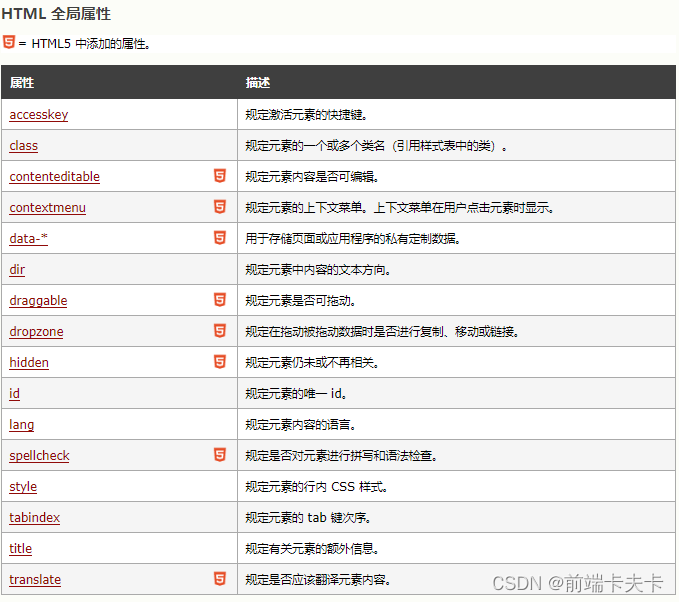
    
    iframe标签支持 HTML 中的事件属性：如Window 事件属性、Form 事件、Keyboard 事件、Mouse 事件、Media 事件等  
    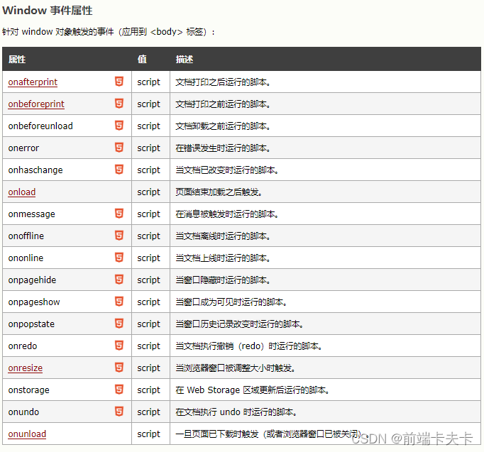  
    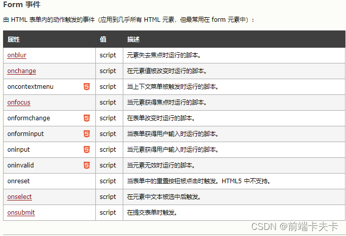  
    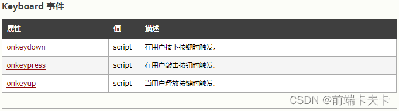  
    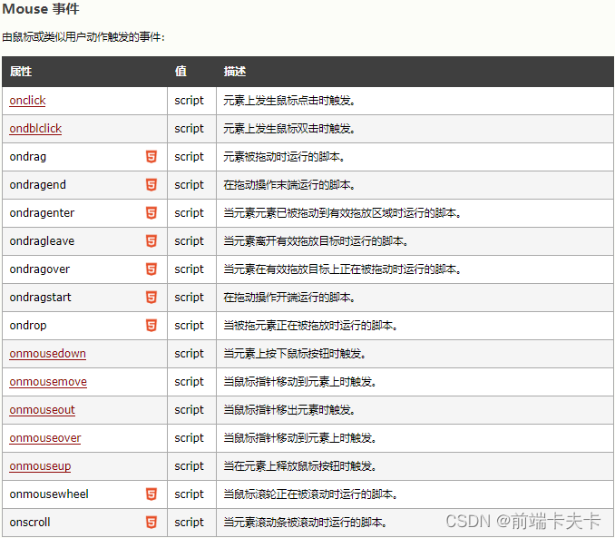  
    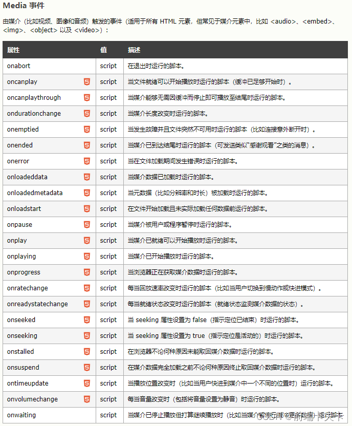

2、iframe的元素属性
------------------------------------------

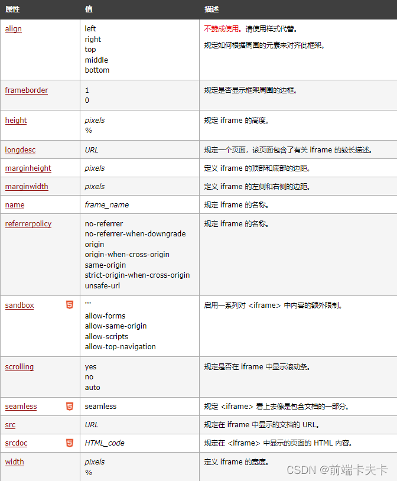  
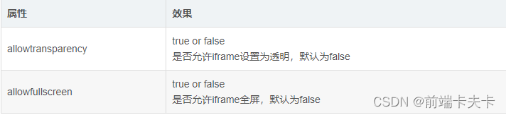

iframe常用的元素属性：

1.  **src：指定内联网页的地址**。
2.  width、height：控制iframe的宽高。
3.  frameborder：iframe默认有个边界，可以设置frameborder为0清除边界。
4.  name：框架的名称。
5.  scrolling：是否可滚动。yes、no、auto。  
    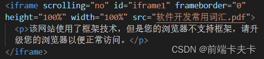

3、iframe操作
---------------------------------------

1.  每个iframe里各自维护自己的全局window对象。
2.  只有同域才能进行iframe之间的改写，跨域时，只能进行简单的路由跳转。
3.  在父级使用window.frames\[name\]可以获取子iframe的window对象，相应的可以获取document对象，从而对子iframe进行dom操作。
4.  在子iframe想要操作父元素的iframe，直接使用子元素的window.parent来获取父级元素的window对象，从而获取document来操作dom。

4、iframe 对象及属性
-------------------------------------------

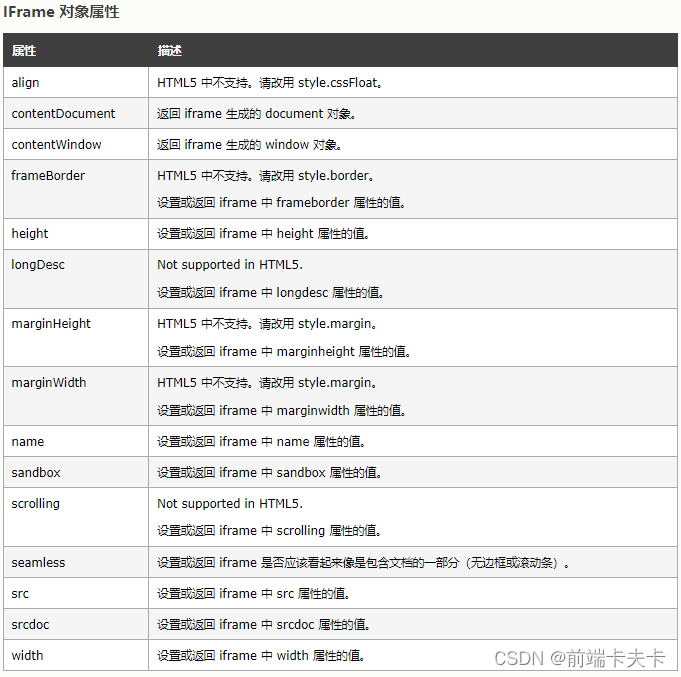

1.  IFrame 对象代表 HTML iframe 元素。
    
2.  可使用 getElementById() 来访问 iframe 元素。如：  
    var iframe = document.getElementById(“iframe”);  
    var **iwindow** = **iframe.contentWindow**;  
    var idoc = iwindow.document;等价于**iframe.contentDocument**;  
    （1）、获取iframe的**iframe对象**：console.log(“iframe”, iframe);  
    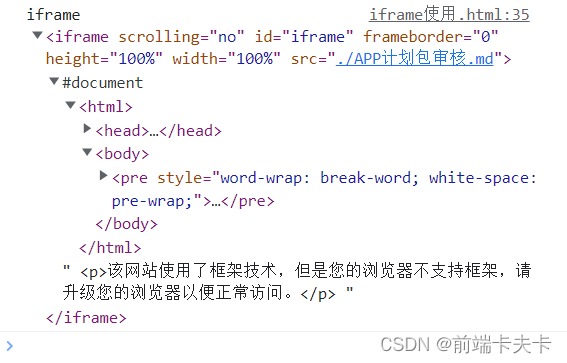  
    （2）、获取iframe的**window对象**：console.log(“window”, iwindow)；  
    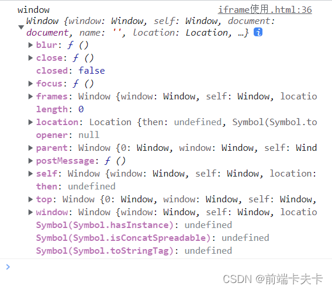
    
    （3）、获取iframe的**document**：console.log(“document”, idoc);  
    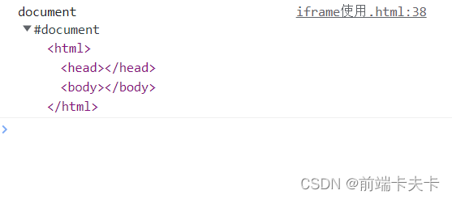  
    （4）、获取iframe的**html**：console.log(“html”, idoc.documentElement);  
    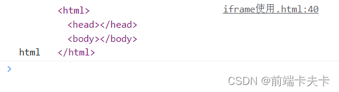
    
    （5）、获取**head**：console.log(“head”, idoc.head);  
    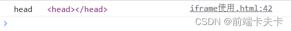
    
    （6）、获取body：console.log(“body”, idoc.body);  
    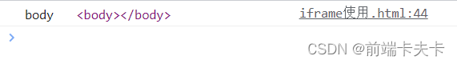
    
3.  在父级使用**window.frames\[name\]结合iframe的Name属性**可以获取子iframe的window对象,相应的可以获取document对象，从而对子iframe进行dom操作（更便捷）。如：  
    var iframes = window.frames;  
    var iframe = window.frames\[‘myFrame’\] // **返回的就是window对象**
    
    （1）、console.log(“iframes”, iframes);  
    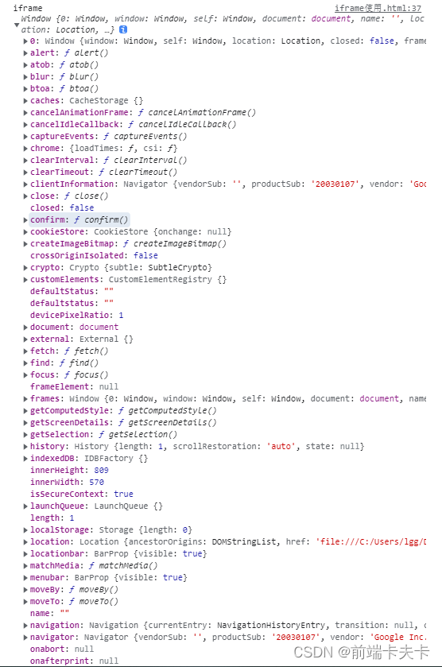  
    （2）、console.log(“iframe”, iframe)，与下面相同。  
    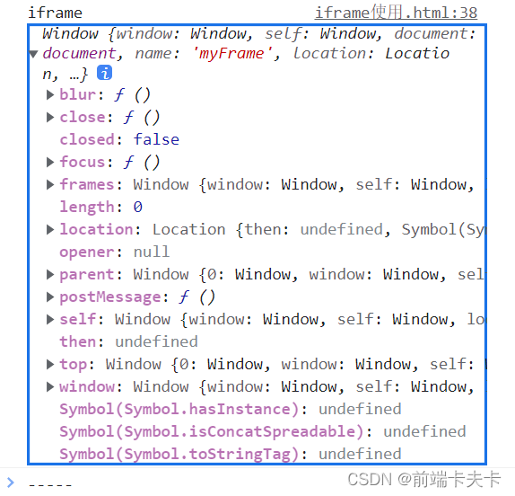
    
    （3）、获取iframe的**window对象**：console.log(“iframe”, iframe.window);  
    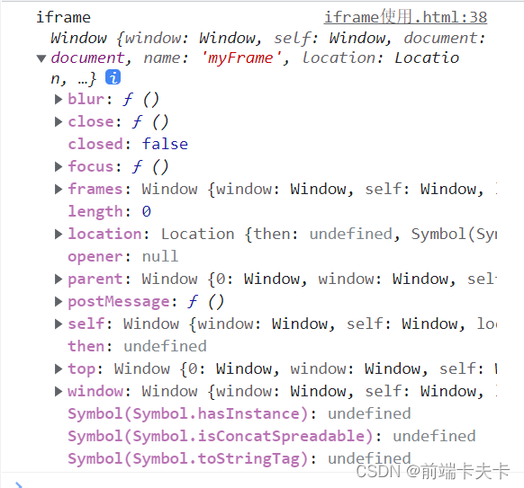
    
    （4）、获取iframe的**document**：console.log(“document”, iframe.document)  
    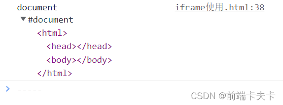
    
4.  在iframe中获取父级内容。  
    在同域下，父页面可以获取子iframe的内容，那么子iframe同样也能操作父页面内容。在iframe中，可以通过在window上挂载的几个API进行获取：  
    （1）、window.parent //获取上一级的window对象，如果还是iframe则是该iframe的window对象  
    （2）、window.top //获取最顶级容器的window对象，即，就是你打开页面的文档  
    （3）、window.self //返回自身window的引用。可以理解 window===window.self(脑残)
    

5、创建iframe元素
-----------------------------------------

可使用 document.createElement() 方法来创建iframe元素：var x = document.createElement(“IFRAME”);  
比如，iframe长轮询：

```js
var iframeCon = docuemnt.querySelector('#container'),
text; //传递的信息
var iframe = document.createElement('iframe'),
iframe.id = "frame",
iframe.style = "display:none;",
iframe.name="polling",
iframe.src="target.html";
iframeCon.appendChild(iframe);
iframe.onload= function(){
var iloc = iframe.contentWindow.location,
idoc = iframe.contentDocument;
setTimeout(function(){
text = idoc.getElementsByTagName('body')[0].textContent;
console.log(text);
iloc.reload(); //刷新页面,再次获取信息，并且会触发onload函数
},2000);
}
```

6、iframe之间的通信
------------------------------------------

### 6.1、什么是主域名，什么是子域名(拓展)

*   主域名又称一级域名或者顶级域名，由域名主体 . 域名后缀组成，整个域名通常只有1个点号。 百度的主域名是baidu.com。
*   子域名一般会根据站点不同性质在主域名前面加上不同的前缀构成，通常比主域名多一个点或两个点。只要在主域名前面加上前缀的都是该主域名的子域名，子域名又能分为二级子域名、三级子域名、还有多级子域名。
*   例如：百度的二级域名（子域名）www.baidu.com 如1.www.baidu.com和2.www.baidu.com这样的三级域名也同样可以成为www.baidu.com和baidu.com的子域名。
*   拓展：子域名爆破就是指探测某个域名下的所有子域名。

### 6.2、iframe之间的通信

*   iframe就是一个隔离沙盒，相当于我们在一个页面内可以操控很多个标签页一样。
*   浏览器判断你跨没跨域，主要根据两个点：一个是你网页的协议(protocol)，另一个就是你的host是否相同（window.location.protocol、window.location.host）。

1、主域相同而子域不同，可以使用iframe进行解决document.domain = ‘’，指定相同的主域。比如在http://www.example.com/a.html和http://sub.example.com/b.html两个文件中都加上document.domain = “example.com”；  
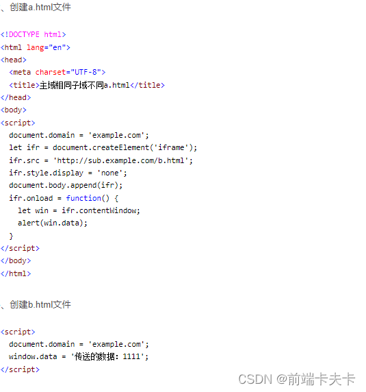

2、当我们要向指定iframe发送信息时，首先要获取该iframe自己的window对象，然后使用该window对象的postMessage发送消息。

*   window.postMessage(message, targetOrigin, \[transfer\])  
    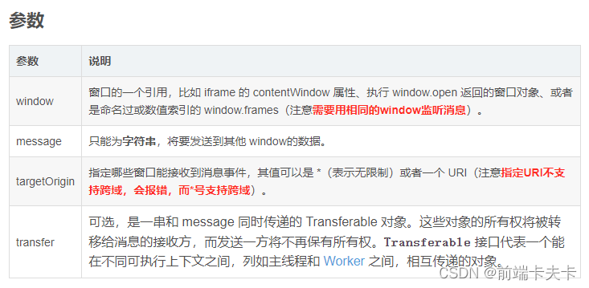

1.  **事件默认参数**：  
    （1）、e.source – 消息源，消息的发送窗口/iframe。  
    （2）、e.origin – 消息源的 URI(可能包含协议、域名和端口)，用来验证数据源。  
    （3）、e.data – 发送过来的数据。
    
2.  **使用注意点**：  
    （1）、监听时使用window.addEventListener(“message”,(e)=>{}, false)，必须保证监听的window和发送消息的window相同。  
    （2）、需要**确定先监听了message事件，再发送的消息**。  
    （3）、targetOrigin指定了URI的话，必须是相同的域和端口号，不然会报跨域错误。  
    （4）、targetOrigin使用\*号的话，支持跨域，我们可以通过监听消息的默认参数e.origin来判断是否接收到了正确的消息。  
    （5）、当我们明确知道origin是谁时，不要使用星号，当要接受信息时，先判断origin是否是我们要接受的源，再做后续的操作。  
    （6）、获取子元素的document时要确保子元素所有dom元素已经挂载完毕，因此在原生的写法时，必须写在window的onload事件中。
    
3.  **iframe通信示例**：  
    （1）、 窗口1:
    

```html
<!DOCTYPE html>
<html lang="en">
 
<head>
    <meta charset="UTF-8">
    <meta http-equiv="X-UA-Compatible" content="IE=edge">
    <meta name="viewport" content="width=device-width, initial-scale=1.0">
    <title>Document</title>
</head>
<body>
    <div>窗口1</div>
    <iframe src="http://127.0.0.1:5501/2.html" frameborder="1" id='123' name="abc"></iframe>
    <script>
        window.onload = function () {
            setTimeout(() => {
                window.top.postMessage('handsome', '*')
            }, 0)
        }
    </script>
</body>
</html>

```
（2）、窗口2

```html
<!DOCTYPE html>
<html lang="en">
<head>
    <meta charset="UTF-8">
    <meta name="viewport" content="width=device-width, initial-scale=1.0">
    <title>Document</title>
</head>
<body>
    <div>窗口2</div>
    <script>
        top.addEventListener('message',(e)=>{console.log(e)},false)
    </script>
</body>
</html>

```
（3）、运行结果：

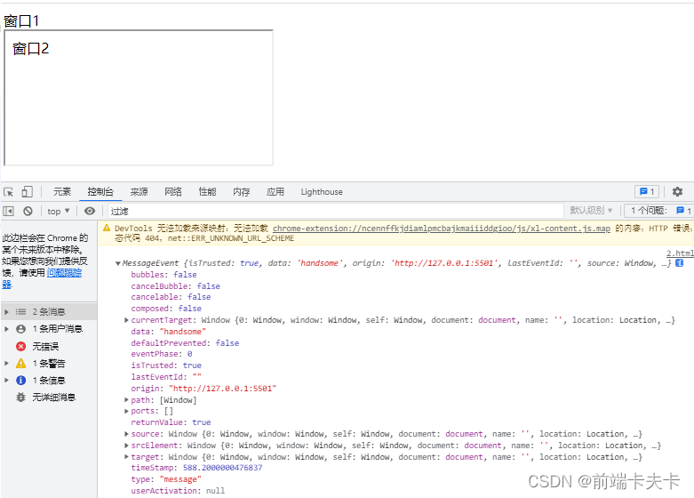

### URL传参案例1

可以在iframe的src属性中使用查询参数（也称为URL参数）将数据传递到嵌入的页面。例如，假设iframe嵌入的页面URL是 `index.com/page.html`，那么可以使用如下的URL来传递数据：

```html
<iframe src="index.com/page.html?param1=value1&param2=value2"></iframe>
```

在嵌入的页面中，可以使用JavaScript获取查询参数并使用它们：

```js
var params = new URLSearchParams(window.location.search);
var param1 = params.get('param1');
var param2 = params.get('param2');
```

 或者写一个函数获取对应的值

```js
//从url获取参数
export const getQuery = (name: string, url?: string) => {
  const params = new URLSearchParams(url || window.location.search);
  const value = params.get(name);
  if (value) {
    return value;
  }
  return getQueryString(name, url);
};

export const getQueryString = (name: string, url?: string) => {
  const reg = new RegExp('(^|&|/?)' + name + '=([^&]*)(&|$)', 'i');
  const r = encodeURI(url || window.location.search || window.location.href || window.location.hash)
    .substr(1)
    .match(reg);
  if (r != null) return unescape(r[2]);
  return null;
};
```

### 父子传参案例1

#### 子传父

子：发送

```js
// 发送消息给接收方窗口
window.parent.postMessage("Hello, parent!", "http://parent.com");
```

父：接收

```js
// 监听message事件，接收消息
window.addEventListener("message", receiveMessage, false);

function receiveMessage(event) {
  // 判断消息来源是否是指定的发送方窗口
  if (event.origin === "http://child.com") {
    // 处理接收到的消息
    console.log(event.data);
  }
}
```

#### 父传子

父：发送

```js
const iframe = document.getElementById('my-iframe');
const iframeWindow = iframe.contentWindow;

const message = { type: 'GREETINGS', data: 'Hello, child!' };
const targetOrigin = 'http://child.com'; // 指定接收方的源
iframeWindow.postMessage(message, targetOrigin);
```

子：接收

```js
window.addEventListener('message', receiveMessage, false);

function receiveMessage(event) {
  if (event.origin === 'http://parent.com') { // 验证消息来源
    console.log(event.data); // 处理接收到的消息
  }
}
```

7、其他
---------------------------------

### 7.1、iframe自适应

1. iframe默认会自带滚动条，不会全屏。所以要想自适应的话首先去掉滚动条即在iframe标签上添加 scrolling=“no”。

   ```js
   <iframe scrolling="no" src="./aaa" id="iframe"></iframe>

2. 设置iframe的高为body的高。

   ```js
    var iwindow = iframe.contentWindow;
    var idoc = iwindow.document;
    iframe.height = idoc.body.offsetHeight;

3. 还可以添加其它的装饰属性。  
   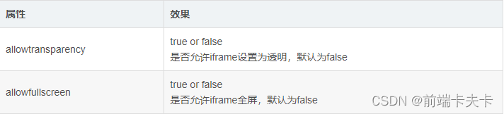

4. 示例：

   ```js
   // 可以直接写在内联里面，也可以在css里面定义，不过对于广告iframe来说，样式写在属性中，是最好的。
    <iframe id="frame" name="frame" width="160" height="600" frameborder="0" src="target.html" marginwidth="0" marginheight="0" vspace="0" hspace="0" allowtransparency="true" scrolling="no" allowfullscreen="true"></iframe>
   ```

### 7.2、防嵌套网页

*   iframe的使用会出现出现安全性，一共两个方面：一个是你的网页被别人iframe，另一个是你iframe别人的网页。
*   最出名的clickhacking就是使用iframe来 拦截click事件。因为iframe享有着click的最优先权，当有人在伪造的主页中进行点击的话，如果点在iframe上，则会默认是在操作iframe的页面。 所以，钓鱼网站就是使用这个技术，通过诱导用户进行点击。

#### 7.2.1、浏览器端

* **前端可以使用window.top来防止你的网页被iframe**。

* **限定你的网页不能嵌套在任意网页内。如果想要引用同域的框架的话，可以判断域名**。```

  ```js
  if(window != window.top){
    window.top.location.href = correctURL;
  }
  // 判断域名
  if(top.location.host != window.location.host) {
    top.location.href = window.location.href;
  }
  // 如果你网页不同域名的话，上述就会报错。可以使用try...catch...进行错误捕获。如果发生错误，则说明不同域，表示你的页面被盗用了。可能有些浏览器这样写是不会报错，所以需要降级处理再进行跳转即可。
  try{
    top.location.hostname; //检测是否出错
    //如果没有出错，则降级处理
    if (top.location.hostname != window.location.hostname) {
      top.location.href =window.location.href;
    }
  }
  catch(e){
    top.location.href = window.location.href;
  }
  ```

#### 7.2.2、服务器端

1.  **X-Frame-Options**
    
    *   X-Frame-Options是一个相应头，主要是描述服务器的网页资源的iframe权限。目前的支持度是IE8+。有3个选项：
        1.  X-Frame-Options: DENY。拒绝任何iframe的嵌套请求。
        2.  X-Frame-Options: SAMEORIGIN。只允许同源请求。例如网页为 lgg.com/123.html，則 lgg.com 底下的所有网页可以嵌入此网页，但是 lgg.com 以外的网页不能嵌入
        3.  X-Frame-Options: ALLOW-FROM。只允许指定网页的iframe请求，不过兼容性较差Chrome不支持
    *   X-Frame-Options其实就是将前端js对iframe的把控交给服务器来进行处理。
    
    ```js
    // 等价于X-Frame-Options: DENY
    if(window != window.top){
      window.top.location.href = window.location.href;
    }
    // 等价于X-Frame-Options: SAMEORIGIN
    if(top.location.hostname != window.location.hostname) {
      top.location.href =window.location.href;
    }
    ```
    *   该属性是对页面的iframe进行一个主要限制。另外还有一个Content Security Policy，同样也可以对iframe进行限制，而且，他应该是以后网页安全防护的主流。
2.  **sandbox**
    
    *   sandbox是h5的一个新属性（IE10+支持），就是用来给指定iframe设置一个沙盒模型限制iframe的更多权限。
    *   启用方式：添加sandbox属性。
    
    ```js
    <iframe sandbox src="..."></iframe>
    ```
    
    *   会对iframe页面进行一系列的限制：
        1.  script脚本不能执行。
        2.  不能发送ajax请求。
        3.  不能使用本地存储，即localStorage,cookie等。
        4.  不能创建新的弹窗和window。
        5.  不能发送表单。
        6.  不能加载额外插件比如flash等。
    *   可以在sandbox里面进行一些设置：
    
    ```js
    <iframe sandbox="allow-forms allow-same-origin allow-scripts" src="..."></iframe>
    ```
    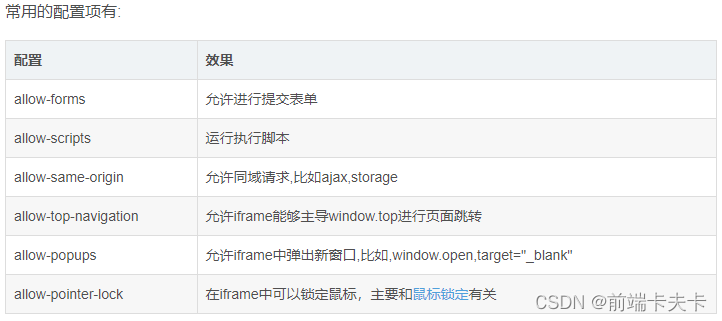

### 7.3、iframe使用场景

1.  PDF文档预览。
2.  插入广告等。

 

  

本文转自 [http://t.csdnimg.cn/h3v6K](http://t.csdnimg.cn/h3v6K)，如有侵权，请联系删除。