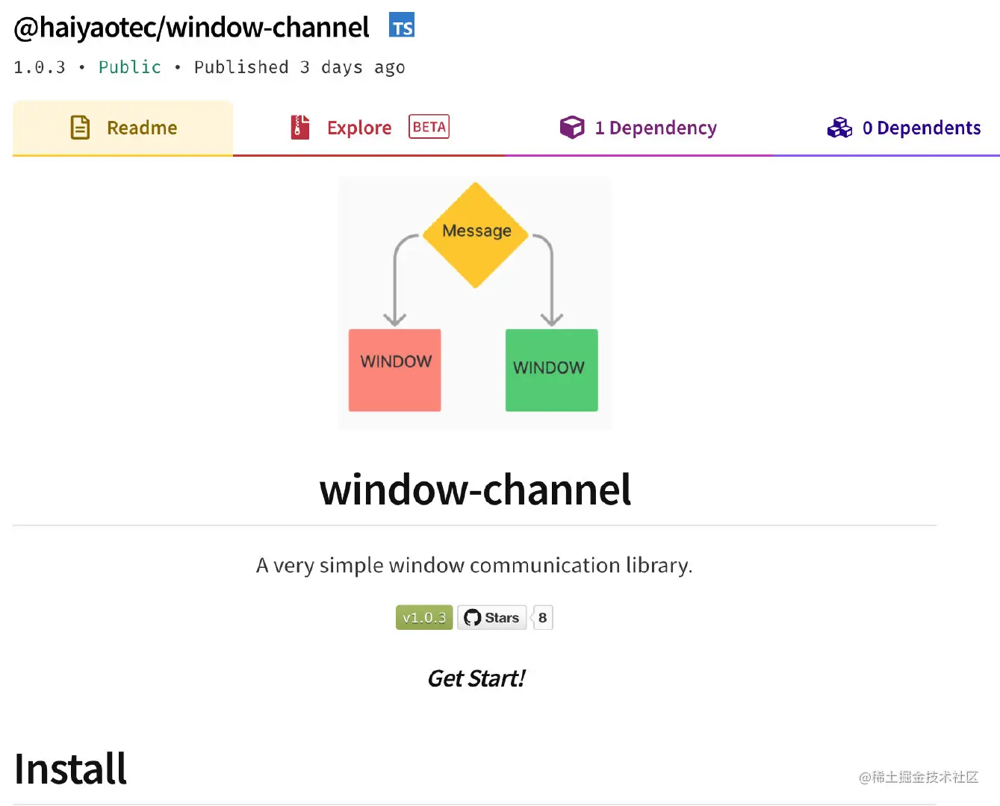

# iframe通信

**1.如何在Iframe页面间进行通信**

**2.了解Window.postMessage API**

**3.完成一个Iframe通信小demo**

开源Iframe通信框架
------------

这是我将公司内源的Iframe通信框架开源了，方便大家使用 仓库地址：[github.com/HaiyaoTec/w…](https://link.juejin.cn/?target=https%3A%2F%2Fgithub.com%2FHaiyaoTec%2Fwindow-channel "https://github.com/HaiyaoTec/window-channel") 如果对你有帮助 请给个小star🌟鼓励一下



为什么要进行Iframe通信❓
---------------

*   我们有时候需要将两个单独的项目结合到一起，这个时候就需要Iframe进行一些简单的数据通信
*   比如，聊天室内嵌入Web应用
*   又比如，类似微前端那种架构，也需要进行项目间通信，虽然微前端不是这样做的，但是形式差不多，我们都需要解决如何在两个独立的项目间进行通讯

如何进行Iframe通信？
-------------

*   利用浏览器提供的强大API,`window.postMessage`就可以做到这点!

Window.postMessage 详解
---------------------

> _**\*window.postMessage()\***_ 方法可以安全地实现跨源通信。通常，对于两个不同页面的脚本，只有当执行它们的页面位于具有相同的协议（通常为https），端口号（443为https的默认值），以及主机 (两个页面的模数 [`Document.domain`](https://link.juejin.cn/?target=https%3A%2F%2Fdeveloper.mozilla.org%2Fzh-CN%2Fdocs%2FWeb%2FAPI%2FDocument%2Fdomain "https://developer.mozilla.org/zh-CN/docs/Web/API/Document/domain")设置为相同的值) 时，这两个脚本才能相互通信。_**\*window.postMessage()\***_ 方法提供了一种受控机制来规避此限制，只要正确的使用，这种方法就很安全。

从广义上讲，一个窗口可以获得对另一个窗口的引用（比如 `targetWindow = window.opener`），然后在窗口上调用 `targetWindow.postMessage()` 方法分发一个 [`MessageEvent`](https://link.juejin.cn/?target=https%3A%2F%2Fdeveloper.mozilla.org%2Fzh-CN%2Fdocs%2FWeb%2FAPI%2FMessageEvent "https://developer.mozilla.org/zh-CN/docs/Web/API/MessageEvent") 消息。接收消息的窗口可以根据需要自由[处理此事件 (en-US)](https://link.juejin.cn/?target=https%3A%2F%2Fdeveloper.mozilla.org%2Fen-US%2Fdocs%2FWeb%2FEvents "https://developer.mozilla.org/en-US/docs/Web/Events")。传递给 window.postMessage() 的参数（比如 message ）将[通过消息事件对象暴露给接收消息的窗口](https://link.juejin.cn/?target=https%3A%2F%2Fdeveloper.mozilla.org%2Fzh-CN%2Fdocs%2FWeb%2FAPI%2FWindow%2FpostMessage%23The_dispatched_event "https://developer.mozilla.org/zh-CN/docs/Web/API/Window/postMessage#The_dispatched_event")。

### 语法

```js
otherWindow.postMessage(message, targetOrigin, [transfer]);
```

`otherWindow`

其他窗口的一个引用，比如iframe的contentWindow属性、执行[window.open](https://link.juejin.cn/?target=https%3A%2F%2Fdeveloper.mozilla.org%2Fen-US%2Fdocs%2FWeb%2FAPI%2FWindow%2Fopen "https://developer.mozilla.org/en-US/docs/Web/API/Window/open")返回的窗口对象、或者是命名过或数值索引的[window.frames](https://link.juejin.cn/?target=https%3A%2F%2Fdeveloper.mozilla.org%2Fen-US%2Fdocs%2FWeb%2FAPI%2FWindow%2Fframes "https://developer.mozilla.org/en-US/docs/Web/API/Window/frames")。

`message`

将要发送到其他 window的数据。它将会被[结构化克隆算法](https://link.juejin.cn/?target=https%3A%2F%2Fdeveloper.mozilla.org%2Fen-US%2Fdocs%2FDOM%2FThe_structured_clone_algorithm "https://developer.mozilla.org/en-US/docs/DOM/The_structured_clone_algorithm")序列化。这意味着你可以不受什么限制的将数据对象安全的传送给目标窗口而无需自己序列化。\[[1](https://link.juejin.cn/?target=https%3A%2F%2Fdeveloper.mozilla.org%2Fen-US%2Fdocs%2F "https://developer.mozilla.org/en-US/docs/")\]

`targetOrigin`

通过窗口的origin属性来指定哪些窗口能接收到消息事件，其值可以是字符串"\*"（表示无限制）或者一个URI。在发送消息的时候，如果目标窗口的协议、主机地址或端口这三者的任意一项不匹配targetOrigin提供的值，那么消息就不会被发送；只有三者完全匹配，消息才会被发送。这个机制用来控制消息可以发送到哪些窗口；例如，当用postMessage传送密码时，这个参数就显得尤为重要，必须保证它的值与这条包含密码的信息的预期接受者的origin属性完全一致，来防止密码被恶意的第三方截获。**如果你明确的知道消息应该发送到哪个窗口，那么请始终提供一个有确切值的targetOrigin，而不是\*。不提供确切的目标将导致数据泄露到任何对数据感兴趣的恶意站点。**

`transfer` 可选

是一串和message 同时传递的 [`Transferable`](https://link.juejin.cn/?target=https%3A%2F%2Fdeveloper.mozilla.org%2Fzh-CN%2Fdocs%2FWeb%2FAPI%2FTransferable "https://developer.mozilla.org/zh-CN/docs/Web/API/Transferable") 对象. 这些对象的所有权将被转移给消息的接收方，而发送一方将不再保有所有权。

白话概括一下：

*   otherWindow就是你想要哪个页面的接受消息，你就用哪个页面的window来发送消息
*   message就是你想发送的数据
*   targetOrigin通常来讲就是otherWindow所在的源，协议+域名+端口需要一致，才能接受到消息
*   transfer一般忽略

Demo
----

先来解释一下：

*   A->B 发送消息
    
*   popup是你当前window窗口重新弹窗的另一个window窗口
    
*   你想要对popup发送消息
    
*   event.source 表示是哪个窗口发来的消息（Window）
    

`A`

```js
/*
 * A窗口的域名是<http://example.com:8080>，以下是A窗口的script标签下的代码：
 */
var popup = window.open(...popup details...);

// 如果弹出框没有被阻止且加载完成
// 这行语句没有发送信息出去，即使假设当前页面没有改变location（因为targetOrigin设置不对）
popup.postMessage("The user is 'bob' and the password is 'secret'",
                  "https://secure.example.net");

// 假设当前页面没有改变location，这条语句会成功添加message到发送队列中去（targetOrigin设置对了）
popup.postMessage("hello there!", "http://example.org");

function receiveMessage(event){
  // 我们能相信信息的发送者吗?  (也许这个发送者和我们最初打开的不是同一个页面).
  if (event.origin !== "http://example.org")
    return;

  // event.source 是我们通过window.open打开的弹出页面 popup
  // event.data 是 popup发送给当前页面的消息 "hi there yourself!  the secret response is: rheeeeet!"
}
window.addEventListener("message", receiveMessage, false);
```

`B`

```js
/*
 * 弹出页 popup 域名是<http://example.org>，以下是script标签中的代码:
 */
//当A页面postMessage被调用后，这个function被addEventListener调用
function receiveMessage(event){
  // 我们能信任信息来源吗？
  if (event.origin !== "http://example.com:8080")
    return;
  // event.source 就当前弹出页的来源页面
  // event.data 是 "hello there!"

  // 假设你已经验证了所受到信息的origin (任何时候你都应该这样做), 一个很方便的方式就是把event.source
  // 作为回信的对象，并且把event.origin作为targetOrigin
  event.source.postMessage("hi there yourself!  the secret response " +
                           "is: rheeeeet!",
                           event.origin);
}

window.addEventListener("message", receiveMessage, false);
```

[**注意**](https://link.juejin.cn/?target=https%3A%2F%2Fdeveloper.mozilla.org%2Fzh-CN%2Fdocs%2FWeb%2FAPI%2FWindow%2FpostMessage%23notes "https://developer.mozilla.org/zh-CN/docs/Web/API/Window/postMessage#notes")

> 如果不检查origin和source容易导致跨站脚本攻击

任何窗口可以在任何其他窗口访问此方法，在任何时间，无论文档在窗口中的位置，向其发送消息。 因此，用于接收消息的任何事件监听器**必须**首先使用origin和source属性来检查消息的发送者的身份。 **这不能低估：无法检查origin和source属性会导致跨站点脚本攻击。**

与任何异步调度的脚本（超时，用户生成的事件）一样，postMessage的调用者不可能检测到侦听由postMessage发送的事件的事件处理程序何时抛出异常。

分派事件的origin属性的值不受调用窗口中document.domain的当前值的影响。

仅对于IDN主机名，origin属性的值不是始终为Unicode或punycode; 在使用此属性时，如果您期望来自IDN网站的消息，则最大程度地兼容性检查IDN和punycode值。 这个值最终将始终是IDN，但现在你应该同时处理IDN和punycode表单。

当发送窗口包含 `javascript:` 或 `data:` URL时，origin属性的值是加载URL的脚本的


本文转自 [https://juejin.cn/post/7077695826599870471](https://juejin.cn/post/7077695826599870471)，如有侵权，请联系删除。