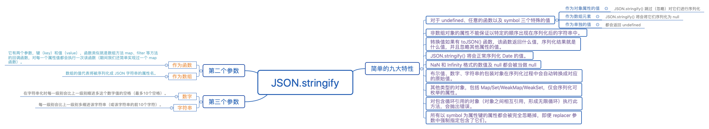

https://github.com/NieZhuZhu/Blog/issues/1




## 通过需求学习

首先我们在开发的过程当中遇到这样一个处理数据的需求

```js
const todayILearn = {
  _id: 1,
  content: '今天学习 JSON.stringify()，我很开心！',
  created_at: 'Mon Nov 25 2019 14:03:55 GMT+0800 (中国标准时间)',
  updated_at: 'Mon Nov 25 2019 16:03:55 GMT+0800 (中国标准时间)'
}
```

我们需要将上面这个对象处理成下面这个对象

```js
const todayILearn = {
  id: 1,
  content: '今天学习 JSON.stringify()，我很开心！',
  createdAt: 'Mon Nov 25 2019 14:03:55 GMT+0800 (中国标准时间)',
  updatedAt: 'Mon Nov 25 2019 16:03:55 GMT+0800 (中国标准时间)'
}
```


也就是在不改变属性的值的前提下，将对象属性修改一下。 把`_id   ` 改成 `id`，把 `updated_at` 改成 `updatedAt`，把 `created_at` 改成 `createdAt`。我们现在通过这个小小的需求来见识一下 `JSON.stringify()` 的强大吧。

首先要解决这个问题我们有很多的解决方式，我们先提供两种不优雅的解决方案：

- **方案一：一次遍历+多声明一个变量**

```js
// 多一个变量存储
const todayILearnTemp = {};
for (const [key, value] of Object.entries(todayILearn)) {
  if (key === "_id") todayILearnTemp["id"] = value;
  else if (key === "created_at") todayILearnTemp["createdAt"] = value;
  else if (key === "updatedAt") todayILearnTemp["updatedAt"] = value;
  else todayILearnTemp[key] = value;
}
console.log(todayILearnTemp);
// 结果：
// { id: 1,
//  content: '今天学习 JSON.stringify()，我很开心！',
//  createdAt: 'Mon Nov 25 2019 14:03:55 GMT+0800 (中国标准时间)',
//  updated_at: 'Mon Nov 25 2019 16:03:55 GMT+0800 (中国标准时间)' 
// }
```

方案一完全没有问题可以实现。但是多声明了一个变量又加上一层循环并且还有很多的 `if` `else` 语句，怎么都显得不太优雅。

- **方案二：暴力 `delete` 属性和增加属性**

```js
// 极致的暴力美学
todayILearn.id = todayILearn._id;
todayILearn.createdAt = todayILearn.created_at;
todayILearn.updatedAt = todayILearn.updated_at;
delete todayILearn._id;
delete todayILearn.created_at;
delete todayILearn.updated_at;
console.log(todayILearn);
// 	太暴力😢
//{ 
//  content: '今天学习 JSON.stringify()，我很开心！',
//  id: 1,
//  createdAt: 'Mon Nov 25 2019 14:03:55 GMT+0800 (中国标准时间)',
//  updatedAt: 'Mon Nov 25 2019 16:03:55 GMT+0800 (中国标准时间)' 
//}
```

直接 delete 暴力解决太粗鲁了，而且有一个缺点，属性的顺序变了。

- **方案三：序列化+ `replace` 美学典范**

```js
const mapObj = {
  _id: "id",
  created_at: "createdAt",
  updated_at: "updatedAt"
};
JSON.parse(
  JSON.stringify(todayILearn).replace(
    /_id|created_at|updated_at/gi,
    matched => mapObj[matched])
    )
// { 
// id: 1,
//  content: '今天学习 JSON.stringify()，我很开心！',
//  createdAt: 'Mon Nov 25 2019 14:03:55 GMT+0800 (中国标准时间)',
//  updatedAt: 'Mon Nov 25 2019 16:03:55 GMT+0800 (中国标准时间)' 
// }
```


瞬间感觉非常优雅和舒服，有木有！如果你这样写，你导师给你 review 代码的时候，你导师肯定会夸赞你的😁。

接下来，正片开始，我们今天将系统的学习或者说是复习一遍 `JSON.stringify` 的基础知识，让我们在日常开发中更加的游刃有余。

## 九大特性

### 特性1

**对于 `undefined`、任意的函数以及 `symbol` 三个特殊的值分别作为对象属性的值、数组元素、单独的值时 `JSON.stringify() `将返回不同的结果。**

首先，我们来复习一下知识点，看一道非常简单的面试题目：请问下面代码会输出什么？

```js
const data = {
  a: "aaa",
  b: undefined,
  c: Symbol("dd"),
  fn: function() {
    return true;
  }
};
JSON.stringify(data); // 输出：？

// "{"a":"aaa"}"
```

很简单这道题目面试官主要考察的知识点是：

- `undefined`、任意的函数以及 `symbol` 作为对象属性值时 `JSON.stringify()` 跳过（忽略）对它们进行序列化

**面试官追问**：假设 `undefined`、任意的函数以及 `symbol` 值作为数组元素会是怎样呢？

```js
JSON.stringify(["aaa", undefined, function aa() {
    return true
  }, Symbol('dd')])  // 输出：？

// "["aaa",null,null,null]"
```


知识点是：

- `undefined`、任意的函数以及 `symbol` 作为数组元素值时，`JSON.stringify()` 将会将它们序列化为 `null`

我们再发挥动下脑筋，如果单独序列化这些值会是什么样的结果呢？

```js
JSON.stringify(function a (){console.log('a')})
// undefined
JSON.stringify(undefined)
// undefined
JSON.stringify(Symbol('dd'))
// undefined
```


单独转换的结果就是：

- `undefined`、任意的函数以及 `symbol` 被 `JSON.stringify()` 作为单独的值进行序列化时都会返回 `undefined`

###  特性1总结

- `undefined`、任意的函数以及 `symbol` 作为对象属性值时 `JSON.stringify()` 对跳过（忽略）它们进行序列化
- `undefined`、任意的函数以及 `symbol` 作为数组元素值时，`JSON.stringify()` 将会将它们序列化为 `null`
- `undefined`、任意的函数以及 `symbol` 被 `JSON.stringify()` 作为单独的值进行序列化时，都会返回 `undefined`

### 特性2

也是在使用过程中必须要非常注意的一个点：

- 非数组对象的属性不能保证以特定的顺序出现在序列化后的字符串中。

```js
const data = {
  a: "aaa",
  b: undefined,
  c: Symbol("dd"),
  fn: function() {
    return true;
  },
  d: "ddd"
};
JSON.stringify(data); // 输出：？
// "{"a":"aaa","d":"ddd"}"

JSON.stringify(["aaa", undefined, function aa() {
    return true
  }, Symbol('dd'),"eee"])  // 输出：？

// "["aaa",null,null,null,"eee"]"
```

正如我们在第一特性所说，`JSON.stringify()` 序列化时会忽略一些特殊的值，所以不能保证序列化后的字符串还是以特定的顺序出现（数组除外）。

### 特性3

- 转换值如果有 `toJSON()` 函数，该函数返回什么值，序列化结果就是什么值，并且忽略其他属性的值。

```js
JSON.stringify({
    say: "hello JSON.stringify",
    toJSON: function() {
      return "today i learn";
    }
  })
// "today i learn"
```

### 特性4

- `JSON.stringify()` 将会正常序列化 `Date` 的值。

```js
JSON.stringify({ now: new Date() });
// "{"now":"2019-12-08T07:42:11.973Z"}"
```

实际上 `Date` 对象自己部署了 `toJSON()` 方法（同Date.toISOString()），因此 `Date` 对象会被当做字符串处理。

### 特性5

- `NaN` 和 `Infinity` 格式的数值及 `null` 都会被当做 `null`。

直接上代码：

```js
JSON.stringify(NaN)
// "null"
JSON.stringify(null)
// "null"
JSON.stringify(Infinity)
// "null"
```

### 特性6

关于基本类型的序列化：

- 布尔值、数字、字符串的包装对象在序列化过程中会自动转换成对应的原始值。

```js
JSON.stringify([new Number(1), new String("false"), new Boolean(false)]);
// "[1,"false",false]"
```

### 特性7

关于对象属性的是否可枚举：

- 其他类型的对象，包括 Map/Set/WeakMap/WeakSet，仅会序列化可枚举的属性。

```js
// 不可枚举的属性默认会被忽略：
JSON.stringify( 
    Object.create(
        null, 
        { 
            x: { value: 'json', enumerable: false }, 
            y: { value: 'stringify', enumerable: true } 
        }
    )
);
// "{"y","stringify"}"
```

### 特性8

我们都知道实现深拷贝最简单粗暴的方式就是序列化：`JSON.parse(JSON.stringify())`，这个方式实现深拷贝会因为序列化的诸多特性导致诸多的坑点：比如现在我们要说的循环引用问题。

```js
// 对包含循环引用的对象（对象之间相互引用，形成无限循环）执行此方法，会抛出错误。 
const obj = {
  name: "loopObj"
};
const loopObj = {
  obj
};
// 对象之间形成循环引用，形成闭环
obj.loopObj = loopObj;
function deepClone(obj) {
  return JSON.parse(JSON.stringify(obj));
}
deepClone(obj)
/**
 VM44:9 Uncaught TypeError: Converting circular structure to JSON
    --> starting at object with constructor 'Object'
    |     property 'loopObj' -> object with constructor 'Object'
    --- property 'obj' closes the circle
    at JSON.stringify (<anonymous>)
    at deepClone (<anonymous>:9:26)
    at <anonymous>:11:13
 */
```

- 对包含循环引用的对象（对象之间相互引用，形成无限循环）执行此方法，会抛出错误。

这也就是为什么用序列化去实现深拷贝时，遇到循环引用的对象会抛出错误的原因。

### 特性9

最后，关于 `symbol` 属性还有一点要说的就是：

- 所有以 `symbol` 为属性键的属性都会被完全忽略掉，即便 `replacer` 参数中强制指定包含了它们。

```js
JSON.stringify({ [Symbol.for("json")]: "stringify" }, function(k, v) {
    if (typeof k === "symbol") {
      return v;
    }
  })

// undefined
```

关于 `replacer` 是什么呢，它是 `JSON.stringify()` 的第二个参数，我们比较少的会用到，所以很多时候我们会忘记 `JSON.stringify()` 第二个、第三个参数，场景不多，但是用的好的话会非常的方便，关于 `JSON.stringify()` 第九大特性的例子中对 `replacer` 参数不明白的同学先别急，其实很简单，我们马上就会在下面的学习中弄懂。

## 第二个参数和第三个参数

## 强大的第二个参数 `replacer`

`replacer` 参数有两种形式，可以是一个函数或者一个数组。作为函数时，它有两个参数，键（key）和值（value），函数类似就是数组方法 `map`、`filter` 等方法的回调函数，对每一个属性值都会执行一次该函数。如果 `replacer` 是一个数组，数组的值代表将被序列化成 JSON 字符串的属性名。

### `replacer` 作为函数时

第二个参数`replacer` 非常强大， `replacer` 作为函数时，我们可以打破九大特性的大多数特性，我们直接来看代码吧。

```
const data = {
  a: "aaa",
  b: undefined,
  c: Symbol("dd"),
  fn: function() {
    return true;
  }
};
// 不用 replacer 参数时
JSON.stringify(data); 

// "{"a":"aaa"}"
// 使用 replacer 参数作为函数时
JSON.stringify(data, (key, value) => {
  switch (true) {
    case typeof value === "undefined":
      return "undefined";
    case typeof value === "symbol":
      return value.toString();
    case typeof value === "function":
      return value.toString();
    default:
      break;
  }
  return value;
})
// "{"a":"aaa","b":"undefined","c":"Symbol(dd)","fn":"function() {\n    return true;\n  }"}"
```


虽然使用 toString() 方法有点耍流氓的意思但是不得不说第二个参数很强大。

#### 传入 `replacer` 函数的第一个参数

**需要注意的是，replacer 被传入的函数时，第一个参数不是对象的第一个键值对，而是空字符串作为 key 值，value 值是整个对象的键值对：**

```
const data = {
  a: 2,
  b: 3,
  c: 4,
  d: 5
};
JSON.stringify(data, (key, value) => {
  console.log(value);
  return value;
})
// 第一个被传入 replacer 函数的是 {"":{a: 2, b: 3, c: 4, d: 5}}
// {a: 2, b: 3, c: 4, d: 5}   
// 2
// 3
// 4
// 5
```


#### 实现 `map` 函数

我们还可以用它来手写实现一个对象的类似 map 的函数。

```
// 实现一个 map 函数
const data = {
  a: 2,
  b: 3,
  c: 4,
  d: 5
};
const objMap = (obj, fn) => {
  if (typeof fn !== "function") {
    throw new TypeError(`${fn} is not a function !`);
  }
  return JSON.parse(JSON.stringify(obj, fn));
};
objMap(data, (key, value) => {
  if (value % 2 === 0) {
    return value / 2;
  }
  return value;
});
// {a: 1, b: 3, c: 2, d: 5}
```


### `replacer` 作为数组时

`replacer` 作为数组时，结果非常简单，数组的值就代表了将被序列化成 JSON 字符串的属性名。

```
const jsonObj = {
  name: "JSON.stringify",
  params: "obj,replacer,space"
};

// 只保留 params 属性的值
JSON.stringify(jsonObj, ["params"]);
// "{"params":"obj,replacer,space"}" 
```

## 有意思却没啥用的第三个参数 `space`

`space` 参数用来控制结果字符串里面的间距。首先看一个例子就是到这东西到底是干啥用的：

```js
const tiedan = {
  name: "弹铁蛋同学",
  describe: "今天在学 JSON.stringify()",
  emotion: "like shit"
};
JSON.stringify(tiedan, null, "🐷");
// 接下来是输出结果
// "{
// 🐷"name": "弹铁蛋同学",
// 🐷"describe": "今天在学 JSON.stringify()",
// 🐷"emotion": "like shit"
// }"
JSON.stringify(tiedan, null, 2);
// "{
//   "name": "弹铁蛋同学",
//   "describe": "今天在学 JSON.stringify()",
//   "emotion": "like shit"
// }"
```

上面代码一眼就能看出第三个参数的作用了，花里胡哨的，其实这个参数还是比较鸡肋的，除了好看没啥特别的用处。我们用 `\t`、 `\n` 等缩进能让输出更加格式化，更适于观看。

- 如果是一个数字, 则在字符串化时每一级别会比上一级别缩进多这个数字值的空格（最多10个空格）；
- 如果是一个字符串，则每一级别会比上一级别多缩进该字符串（或该字符串的前10个字符）。

## 总结

###  九大特性：

**一、对于 `undefined`、任意的函数以及 `symbol` 三个特殊的值分别作为对象属性的值、数组元素、单独的值时的不同返回结果。**

- `undefined`、任意的函数以及 `symbol` 作为对象属性值时 `JSON.stringify()` 对跳过（忽略）它们进行序列化
- `undefined`、任意的函数以及 `symbol` 作为数组元素值时，`JSON.stringify()` 将会将它们序列化为 `null`
- `undefined`、任意的函数以及 `symbol` 被 `JSON.stringify()` 作为单独的值进行序列化时都会返回 `undefined`

二、**非数组对象的属性不能保证以特定的顺序出现在序列化后的字符串中。**

三、**转换值如果有 `toJSON()` 函数，该函数返回什么值，序列化结果就是什么值，并且忽略其他属性的值。**

四、**`JSON.stringify()` 将会正常序列化 `Date` 的值。**

五、**`NaN` 和 `Infinity` 格式的数值及 `null` 都会被当做 `null`。**

六、**布尔值、数字、字符串的包装对象在序列化过程中会自动转换成对应的原始值。**

七、**其他类型的对象，包括 Map/Set/WeakMap/WeakSet，仅会序列化可枚举的属性。**

八、**对包含循环引用的对象（对象之间相互引用，形成无限循环）执行此方法，会抛出错误。**

九、**所有以 `symbol` 为属性键的属性都会被完全忽略掉，即便 `replacer` 参数中强制指定包含了它们。**

### 第二个参数和第三个参数

#### 第二个参数：

- 作为函数时，它有两个参数，键（key）和值（value），函数类似就是数组方法 `map`、`filter` 等方法的回调函数，对每一个属性值都会执行一次该函数（期间我们还简单实现过一个 `map` 函数）。
- 如果 `replacer` 是一个数组，数组的值代表将被序列化成 JSON 字符串的属性名。

#### 第三个参数：

- 如果是一个数字, 则在字符串化时每一级别会比上一级别缩进多这个数字值的空格（最多10个空格）。
- 如果是一个字符串，则每一级别会比上一级别多缩进该字符串（或该字符串的前10个字符）。

#### 注意：

第一个例子的方案三，有小伙伴提示说这个方案会有风险，确实是这样的(**可能会把对象的值给替换掉**)。大家慎用吧，大部分情况下这样使用是 ok 的。小伙伴们提供的第四种方案还是很不错的：

```js
const todayILearn = {
  _id: 1,
  content: '今天学习 JSON.stringify()，我很开心！',
  created_at: 'Mon Nov 25 2019 14:03:55 GMT+0800 (中国标准时间)',
  updated_at: 'Mon Nov 25 2019 16:03:55 GMT+0800 (中国标准时间)'
}
const mapObj = {
  _id: "id",
  created_at: "createdAt",
  updated_at: "updatedAt"
};
Object.fromEntries(Object.entries(todayILearn).map(([k, v]) => [mapObj[k]||k, v]))
// { 
// id: 1,
//  content: '今天学习 JSON.stringify()，我很开心！',
//  createdAt: 'Mon Nov 25 2019 14:03:55 GMT+0800 (中国标准时间)',
//  updatedAt: 'Mon Nov 25 2019 16:03:55 GMT+0800 (中国标准时间)' 
// }
```

[面试官连环追问：数组拍平（扁平化） flat 方法实现](https://github.com/NieZhuZhu/Blog/issues/2)

