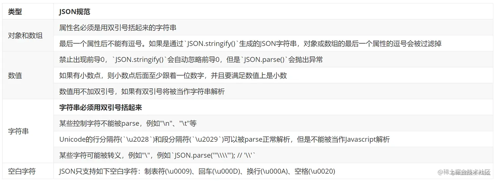
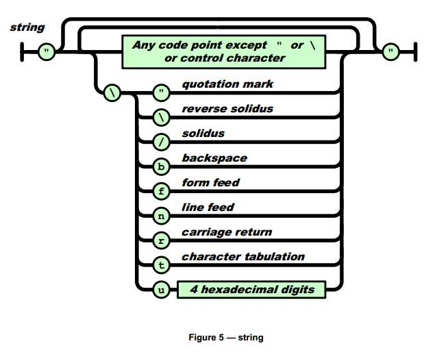

## JSON.parse 语法

```js
JSON.parse(text[, reviver])
```

- text：要被解析成的字符串。
  如果传入数字则会转换成十进制数字输出。
  传入BigInt类型会忽略符号，将有效数字转为十进制。
  如果传入布尔值则直接输出。
  如果传入null则输出null。
  不支持其他类型的值，否则报错。
- reviver： 可选，转换器, 可以用来修改解析生成的原始值。
  返回值： JavaScript对象/值, 对应给定JSON文本的对象/值。

## **JSON规范**

JSON是一种语法，用来序列化对象、数组、数值、字符串、布尔值和null，它是基于JavaScript语法，但是又与之不同。也就是说Javascript不是JSON，JSON也不是Javascript，两者不可等同。为了便于梳理JSON规范的具体细则，见下表：

注：JSON字符串未说明，默认使用单引号



```js
JSON.parse(''); // SyntaxError，待解析的字符串不能为空
JSON.parse('{"x": 1}'); // {x: 1}, 属性必须用双引号括起来
JSON.parse('{"x": 1,}'); // SyntaxError,最后一个属性不能有逗号
JSON.parse('[1,2,]'); // SyntaxError,最后一个属性不能有逗号
JSON.parse('001'); // SyntaxError, 数字禁止有前导0
JSON.parse('11a'); // SyntaxError,不符合数值格式
JSON.parse('1.'); // SyntaxError，如果有小数点，则小数点后至少有一位数字
JSON.parse('"\n"'); // SyntaxError,控制字符不能被解析
JSON.parse(null); // null
JSON.parse(undefined); // SyntaxError
JSON.parse(NaN); // SyntaxError
JSON.parse(Infinity); // SyntaxError
```

## 异常处理方法

使用JSON.parse()是很可能遇到抛出异常的，js遇到异常，则会停止执行后面的代码，导致页面显示不正常。一般来说处理异常有两种方式：

- 判断是否符合JSON规范。JSON规范还是有点多的，每个都判断不是很现实，一般判断是否为undefined以及字符串是否为空就能解决大多数不符合JSON规范的情况
- 使用try/catch，将可能会产生异常的JSON.parse()使用try/catch代码块包裹，并在catch中处理异常情况。


我们看看 JSON 的字符串解析规则：



## reviver 参数

reviver函数，用于转换处理解析到的JavaScript值，处理完后返回最终的结果。

转换过程：

- 解析的值本身和它可能包含的所有属性，按照一定遍历顺序分别调用reviver函数，属性名和值作为参数两个参数 key 和 value 传入。
  遍历顺序：按照层级，从内往外遍历，最终到达最顶层，则是解析值本身。
- reviver返回undefined，则删除该对象，如果返回了其他值，则该值会成为当前属性的新值。
- 当遍历到最顶层时，因为没有属性了，参数key是空字符串''，参数value则是当前解析值。

对于reviver函数的两个参数 key 和 value，不同的数据类型：

- 基本值类型数据（string、number、boolean）和null，以及空对象{}和空数组[]：
  则key是空字符串，value是对应解析值；
  因为已经是最顶层，并没有别的属性。
- Object对象：
  则key和value都存在，与属性名和值各自对应；
  最顶层会返回一个参数key为空的值。
- 数组：
  key对应数组索引，value对应元素值；
  最顶层会返回一个参数key为空的值。

基本类型的转换：

```js
JSON.parse('5', function (key, value) {
  console.log(`key:${key}, value:${value}`)
})
// key:, value:5
JSON.parse('null', function (key, value) {
  console.log(`key:${key}, value:${value}`)
})
// key:, value:null
JSON.parse('{}', function (key, value) {
  console.log(`key:${key}, value:`, value)
})
// key:, value:{}
```

Object对象和数组：

```js
JSON.parse('[1, 2]', function (key, value) {
  console.log(`key:${key}, value:`, value)
})
// key:0, value: 1
// key:1, value: 2
// key:, value: (2) [empty × 2]

JSON.parse('{ "user": "张三", "info": { "age": 25, "sex": 1 } }', function (key, value) {
  console.log(`key:${key}, value::`, value)
})
// key:user, value:: 张三
// key:age, value:: 25
// key:sex, value:: 1
// key:info, value:: {}
// key:, value:: {}

```

数据处理：

```js
JSON.parse('[1, 2]', function (key, value) {
  if(key === '') {
    return value
  }
  return value + 3
})
// [4, 5]
```


## JSON.parse 特性

在解析JSON字符串的时候，需要注意到JSON格式的一些规范，不然就容易报错。
JSON数据对值的类型和格式，都有严格的规定，具体的规则如下：

该方法使用字符串类型JSON格式数据。
该方法也支持数字、布尔值和null三个类型的值，转换出对应的字面值。
BigInt数值将忽略符号，将有效数字转为十进制。
不支持其他类型。

```js
JSON.parse('"中国"')
// '中国'
JSON.parse(null) // null
JSON.parse(111.) // 111
JSON.parse(0x12) // 18
JSON.parse(22n) // 22
JSON.parse(true) // true
JSON.parse([])
// Uncaught SyntaxError: Unexpected end of JSON input
```

字符串必须使用双引号，不能使用单引号。

```js
JSON.parse('"String"')
// 'String'
JSON.parse('\'String\'')
// Uncaught SyntaxError: Unexpected token ' in JSON at position 0
```

只支持十进制的字符串，但小数点后必须跟上数字，其他进制、还有包括BigInt的字符串都不支持。
```js
JSON.parse('111') // 111
JSON.parse('0x12')
// Uncaught SyntaxError: Unexpected token x in JSON at position 1
JSON.parse('111.232') // 111.232
JSON.parse('111.')
// Uncaught SyntaxError: Unexpected end of JSON input
JSON.parse('12n')
// Uncaught SyntaxError: Unexpected non-whitespace character after JSON at position 2
```

不能使用undefined、Symbol，数字也不支持NaN、Infinity和-Infinity，都会报错。

```js
JSON.parse(undefined)
// Uncaught SyntaxError: Unexpected token u in JSON at position 0
JSON.parse(Symbol())
// Uncaught TypeError: Cannot convert a Symbol value to a string
JSON.parse(Infinity)
// Uncaught SyntaxError: "Infinity" is not valid JSON
```

复合类型，只能是：[] 和 {} 这样的字面量。
不能使用对象构造函数，因为会当作执行语句，不支持。
不能使用Object和Array，也不能是函数、RegExp对象、Date对象、Error对象等。

```js
JSON.parse('[]')
// []
JSON.parse('Object()')
// Uncaught SyntaxError: Unexpected token O in JSON at position 0
```

对象的属性名必须使用双引号。

```js
JSON.parse('{"key": 1 }')
// {key: 1}
JSON.parse('{key: 1 }')
// Uncaught SyntaxError: Unexpected token k in JSON at position 1
```

数组或对象最后一个成员的后面，不能加逗号。

```js

JSON.parse('[1, 2, 3, 4, ]')
// VM2771:1 Uncaught SyntaxError: Unexpected token ] in JSON at position 13
JSON.parse('{"key" : 1, }')
// VM2779:1 Uncaught SyntaxError: Unexpected token } in JSON at position 12
```

支持unicode转义。

```js
JSON.parse('{"\u0066":333}')
// {f: 333}
```

部分控制字符、转义字符不支持，如’\n’、'\t’等。

```js
JSON.parse('"\n"')
// Uncaught SyntaxError: Unexpected token
JSON.parse('\n')
// Uncaught SyntaxError: Unexpected end of JSON input
```

解析的其他方法
将JSON字符串转成Javascript对象值，还可以使用其他方法，但是非安全代码。

```js
const str = '{"name":"json","age":18}'
const json = JSON.parse(str)
const json = eval("(" + str + ")")
const json = (new Function("return " + str))()
```

