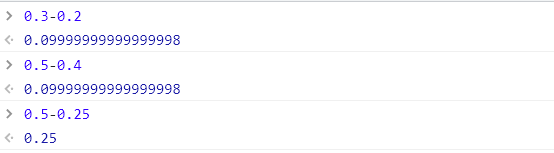
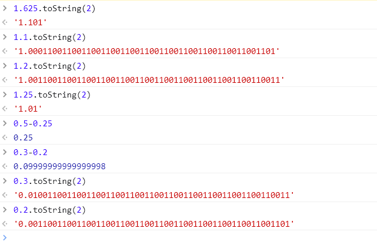
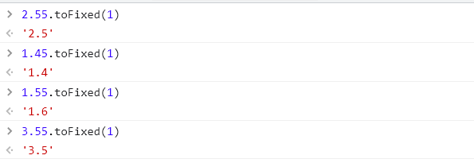
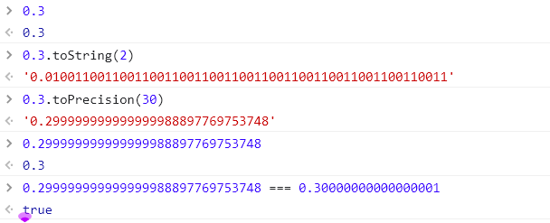
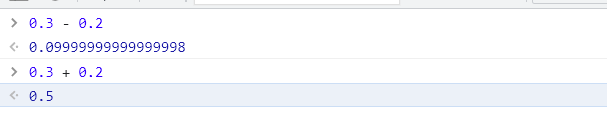
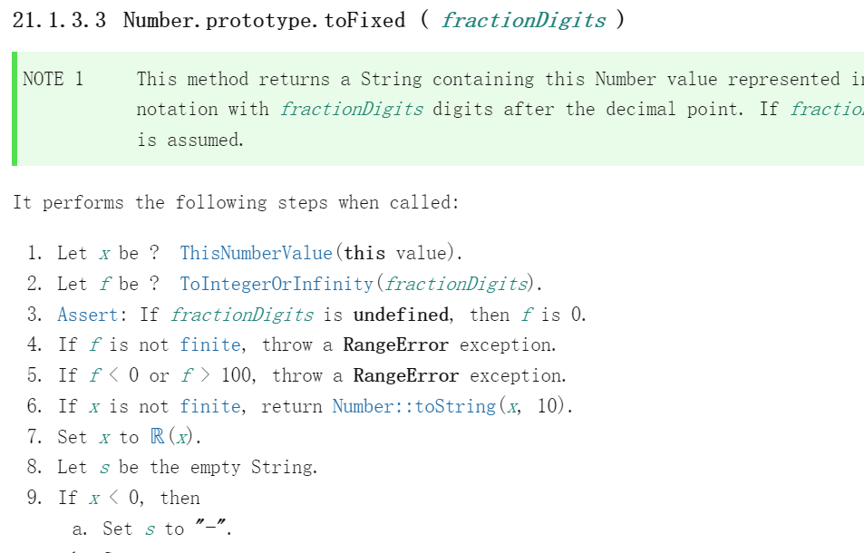
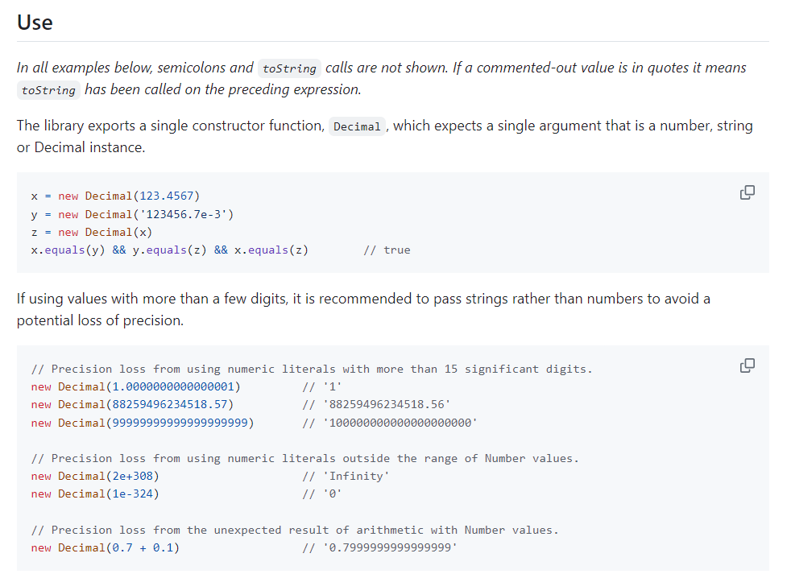

# 精确问题

## 小数运算不精确

在做小数运算的时候发现有时精确，有时不精确。



所有计算机语言都一样

```
如果以十进制方式推断小数运算规则是这样的
如果运算规则一致，小数就表示成这样：明显不是
计算机希望运算规则保持一致。那么十进制小数转二进制必定会不丢失精度

3	--> 11
3.3	--> 11.11
3.3 + 3.3 --> 11.11 + 11.11
6.6		  --> 111.10  ==> 7.1
```

十进制

$314 = 3 \times 10^2 + 1 \times 10^1 + 4 \times 10^0$

$3.14 = 3 \times 10^0 + 1 \times 10^{-1} + 4 \times 10^{-2}$

二进制

$101 = 1 \times 2^2 + 0 \times 2^1 +  1 \times 2^0 = 5$

$1.101 = 1 \times 2^0 + 1 \times 2^{-1} + 0 \times 2^{-2} + 1 \times 2^{-3} = 1.625$

 



写成有限位格式的二进制小数转十进制末尾一定是5


## toFix

toFix引发的思考



小数不精确有三点

- 存储
- 运算
- 显示





以上现象：

- 数据在存储浮点数时本身就不精确
- 为何显示是精确的，可以任务是一个近似处理。
  好比两个非常相近的浮点值会被认为是同一个数据一样
- 同理可以认为两个不精确的数据相加如果得到一个误差很小的值时会被近似处理

[ES262官方文档](https://ecma-international.org/publications-and-standards/standards/ecma-262/)




## Decimal.js

https://github.com/MikeMcl/decimal.js

