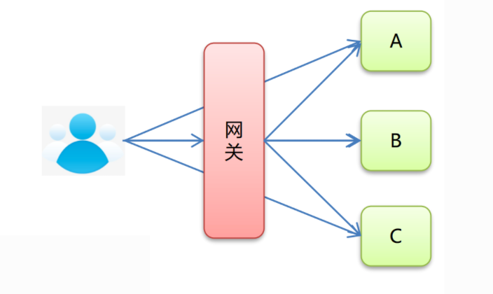

# 概述--介绍

- 网关旨在为微服务提供一种简单有效的统一的API路由管理方式
- 在微服务中，不同的微服务可以有不同的网络地址，各个微服务之间通过相互调用完成用户请求，客户端可能通过调用N个微服务的接口完成一个用户请求
  - 存在的问题：
    - 多次调用不同的服务，增加客户端的复杂性
    - 认证复杂，每个服务都要进行认证
    - http请求不同服务次数增加，性能不高
- 网关：系统的入口，封装了应用程序的内部结构，为客户端提供统一服务，一些与业务本身功能无关的公共逻辑可以在这里实现，
  如：认证、鉴权、监控、缓存、负载均衡、流量管控、路由转发等
- 在目前的网关解决方案中有：nginx+lua、netfix zuul、spring cloud gateway 等

