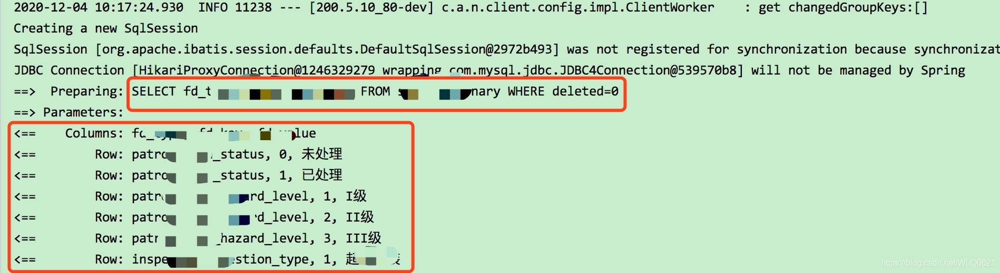
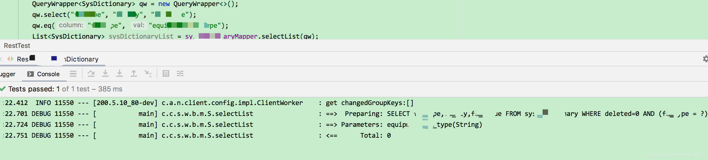

 # mybatis-plus日志

### 方法一：

```yml
mybatis-plus:
  configuration:
        log-impl: org.apache.ibatis.logging.stdout.StdOutImpl #开启sql日志

或者：

mybatis-plus:
  configuration:
    log-impl: org.apache.ibatis.logging.nologging.NoLoggingImpl #关闭sql日志
```

### 方法二：

```yml
logging:
  level:
    com.app.mapper: debug

```

### 方法三：

引入官方插件

```xml
        <!-- https://mvnrepository.com/artifact/p6spy/p6spy -->
        <dependency>
            <groupId>p6spy</groupId>
            <artifactId>p6spy</artifactId>
            <version>3.9.1</version>
        </dependency>

```

yml配置

```yml
spring:
  datasource:
    driver-class-name: com.p6spy.engine.spy.P6SpyDriver
    url: jdbc:p6spy:h2:mem:test
    ...

```

spy.properties配置

```properties
#3.2.1以上使用
modulelist=com.baomidou.mybatisplus.extension.p6spy.MybatisPlusLogFactory,com.p6spy.engine.outage.P6OutageFactory
#3.2.1以下使用或者不配置
#modulelist=com.p6spy.engine.logging.P6LogFactory,com.p6spy.engine.outage.P6OutageFactory
# 自定义日志打印
logMessageFormat=com.baomidou.mybatisplus.extension.p6spy.P6SpyLogger
#日志输出到控制台
appender=com.baomidou.mybatisplus.extension.p6spy.StdoutLogger
# 使用日志系统记录 sql
#appender=com.p6spy.engine.spy.appender.Slf4JLogger
# 设置 p6spy driver 代理
deregisterdrivers=true
# 取消JDBC URL前缀
useprefix=true
# 配置记录 Log 例外,可去掉的结果集有error,info,batch,debug,statement,commit,rollback,result,resultset.
excludecategories=info,debug,result,commit,resultset
# 日期格式
dateformat=yyyy-MM-dd HH:mm:ss
# 实际驱动可多个
#driverlist=org.h2.Driver
# 是否开启慢SQL记录
outagedetection=true
# 慢SQL记录标准 2 秒
outagedetectioninterval=2

```

### mybatis-plus其他配置：

```yml
#  mybatis 的
mybatis:
  config-location: classpath:mybatis.cfg.xml    #  mybatis主配置文件所在路径
  type-aliases-package: com.demo.drools.entity  #  定义所有操作类的别名所在包
  mapper-locations: classpath:mapper/*.xml      #  所有的mapper映射文件
  configuration:
    # 开启驼峰uName自动映射到u_name
    map-underscore-to-camel-case: true
    log-impl: org.apache.ibatis.logging.stdout.StdOutImpl
  　　

# mybatis-plus相关配置
mybatis-plus:
  type‐aliases‐package: cn.itcast.mp.pojo  #  定义所有操作类的别名所在包
  # xml扫描，多个目录用逗号或者分号分隔（告诉 Mapper 所对应的 XML 文件位置）
  mapper-locations: classpath:mapper/*.xml
  # 以下配置均有默认值,可以不设置
  global-config:
    banner: false #是否 mybatis-plus 在控制台输出的logo
    db-config:
      #主键类型 AUTO:"数据库ID自增" INPUT:"用户输入ID",ID_WORKER:"全局唯一ID (数字类型唯一ID)", UUID:"全局唯一ID UUID";
      id-type: auto
      #字段策略 IGNORED:"忽略判断"  NOT_NULL:"非 NULL 判断")  NOT_EMPTY:"非空判断"
      field-strategy: NOT_EMPTY
      #数据库类型
      db-type: MYSQL
      logic-delete-field: deleted # 全局逻辑删除的实体字段名(since 3.3.0,配置后可以忽略不配置步骤2)
      logic-delete-value: 1 # 逻辑已删除值(默认为 1)
      logic-not-delete-value: 0 # 逻辑未删除值(默认为 0)
  configuration:
    # 是否开启自动驼峰命名规则映射:从数据库列名到Java属性驼峰命名的类似映射
    map-underscore-to-camel-case: true
    # 如果查询结果中包含空值的列，则 MyBatis 在映射的时候，不会映射这个字段
    call-setters-on-nulls: true
    # 这个配置会将执行的sql打印出来，在开发或测试的时候可以用
    log-impl: org.apache.ibatis.logging.stdout.StdOutImpl
```

### mybatis-plus修改日志只打印SQL语句不打印查询结果

项目中使用了[mybatis](https://so.csdn.net/so/search?q=mybatis&spm=1001.2101.3001.7020 "mybatis")\-plus baomidou，如果遇到了日志输出时 既打印SQL语句又打印查询出来的结果，如下：



如果想只打印[SQL语句](https://so.csdn.net/so/search?q=SQL%E8%AF%AD%E5%8F%A5&spm=1001.2101.3001.7020 "SQL语句")、不打印查询结果，解决方案如下：

增加log4j日志的配置。

```yml
logging:
  level:
   com.xxx.xxx.biz.mapper: debug

```

去掉mybatis-plus configuration log-impl控制台输出的配置。

```yml
mybatis-plus:
  configuration:
    log-impl: org.apache.ibatis.logging.stdout.StdOutImpl

```

修改后再执行DB操的输出结果：



就是[log4j](https://so.csdn.net/so/search?q=log4j&spm=1001.2101.3001.7020 "log4j")的形式输出，而不是控制台打印了，并且只输出SQL语句，如果debug调高级别，SQL语句也可以不输出。 

  

本文转自 [https://blog.csdn.net/qq\_41995919/article/details/124994808](https://blog.csdn.net/qq_41995919/article/details/124994808)，如有侵权，请联系删除。