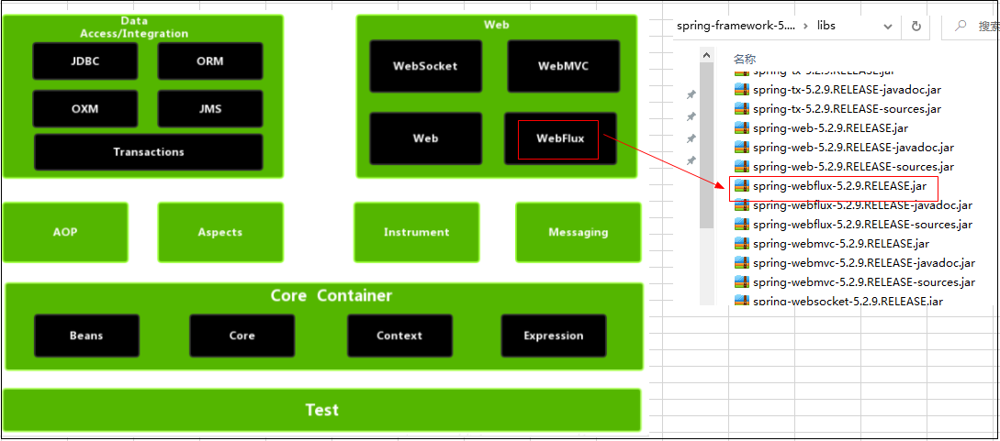
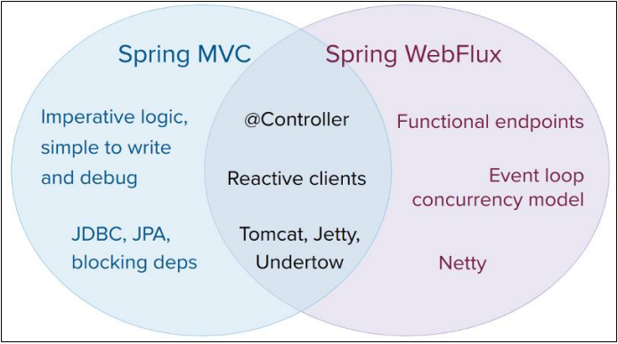
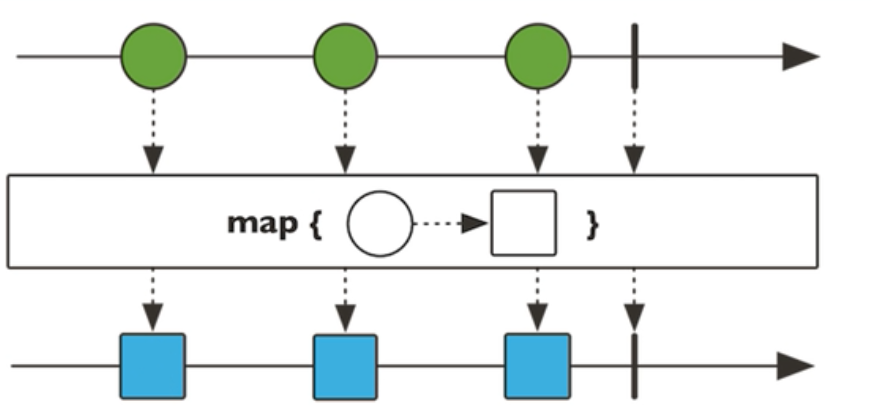
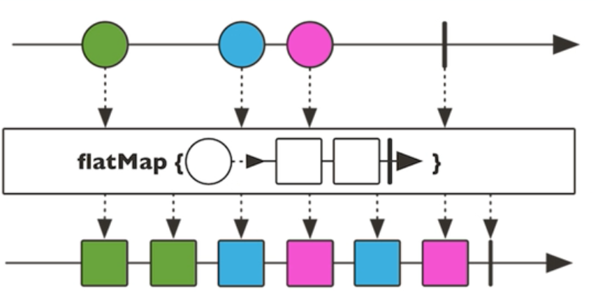
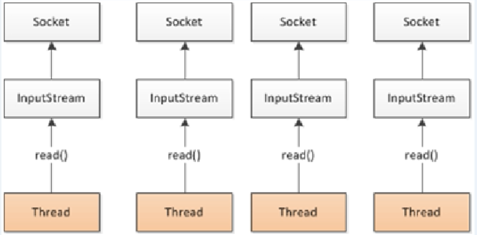
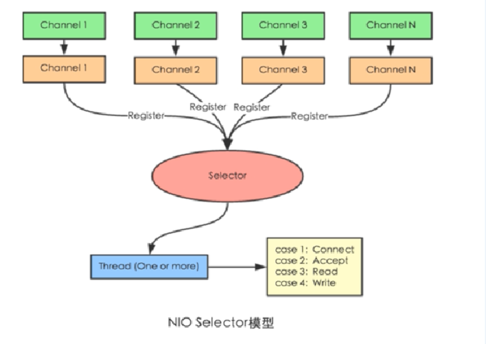
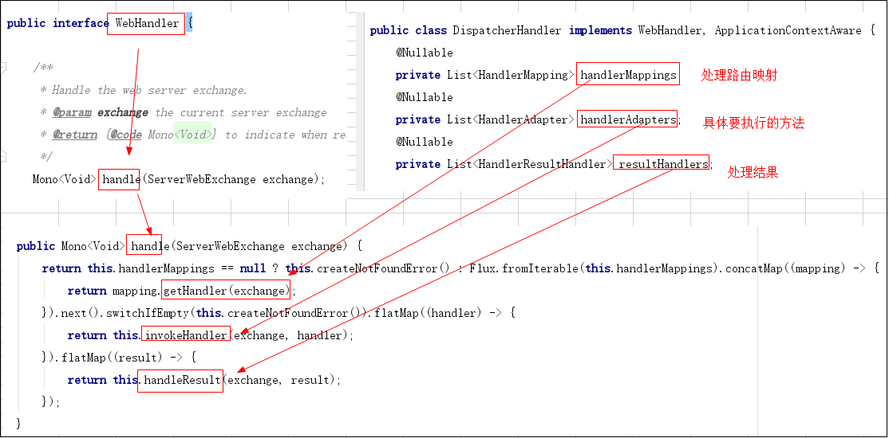

# Spring--3.1.webflux

## Spring5 框架新功能（Webflux）

https://blog.csdn.net/qq_42263280/article/details/130289820

https://docs.spring.io/spring-framework/docs/5.2.25.RELEASE/spring-framework-reference/web-reactive.html#spring-webflux


传统的基于Servlet的[Web框架](https://so.csdn.net/so/search?q=Web框架&spm=1001.2101.3001.7020)，如Spring MVC,在本质上都是阻塞和多线程的，每个连接都会使用一个线程。在请求处理的时候，会在线程池中拉取一个工作者( worker )线程来对请求进行处理。同时，请求线程是阻塞的，直到工作者线程提示它已经完成为止。

首先webflux不是spring mvc的替代方案！webflux强调的是异步非阻塞，spring mvc强调的是同步阻塞，如果方案大部分偏向于非同步，则spring webflux才是首选。另外，如果依赖了大量阻塞式持久化 API 和网络 API，建议使⽤ Spring MVC。

WebFlux：spring webflux是一个异步非阻塞式的web框架，它能够充分利用多核cpu的硬件资源去处理大量的并发请求。

WebMVC：springMvc构建在servlet api之上,因此需要Servlet容器(比如Tomcat)才能执行。使用的是同步阻塞式IO模型，每一个请求对应一个线程去处理。


## SpringWebflux 介绍

这两个web框架都镜像了它们的源模块（spring-webmvc和spring-webflux）的名称，并在spring框架中并排共存。每个模块都是可选的。应用程序可以使用一个或另一个模块，在某些情况下，也可以同时使用这两个模块 — 例如具有反应式WebClient的Spring MVC控制器。更多详细资料可参考WebFlux文档https://docs.spring.io/spring-framework/reference/


（1）webFlux是 Spring5 添加的新模块，用于 web 的开发，功能和 SpringMVC 类似的，Webflux 使用 当前一种比较流程响应式编程出现的框架。

在spring5的jar包中和架构图中我们都可以看见



（2）使用传统 web 框架，比如 SpringMVC，这些基于 Servlet 容器，Webflux 是一种异步非阻塞的框架，异步非阻塞的框架在 Servlet3.X以后才支持，核心是基于 Reactor 的API 实现的。

（3）异步与同步，阻塞与非阻塞的理解
		这里做一个简单的通俗的解释：

1. 异步和同步针对调用者，调用者发送请求，如果等着对方回应之后才去做其他事情就是同步，如果发送请求之后不等着对方回应就去做其他事情就是异步
2. 阻塞和非阻塞针对被调用者，被调用者接受到请求之后，做完请求任务之后才给出反馈就是阻塞，接受到请求之后马上给出反馈然后再去做事情就是非阻塞

​		如果想深入理解并实践应用异步同步阻塞非阻塞等技术，可能会涉及到网络编程、socket、BIO、NIO、AIO、Netty等技术，大家可以学习之前讲的《网络编程系列课程》

（4）Webflux 特点：

```
特性一、 异步非阻塞
SpringMVC是同步阻塞的IO模型，资源浪费相对来说比较严重，当我们在处理一个比较耗时的任务时，
例如：上传一个比较大的文件，首先，服务器的线程一直在等待接收文件，在这期间它就像个傻子一样等在那儿（放学别走），什么都干不了，好不容易等到文件来了并且接收完毕，
我们又要将文件写入磁盘，在这写入的过程中，这根线程又要等到文件写完才能去干其它的事情。这一前一后的等待，浪费了大量的资源。
而Spring WebFlux就是来解决这个问题的，
Spring WebFlux可以做到异步非阻塞。还是上面那上传文件的例子，
Spring WebFlux是这样做的：线程发现文件还没准备好，就先去做其它事情，当文件准备好之后，通知这根线程来处理，
当接收完毕写入磁盘的时候（根据具体情况选择是否做异步非阻塞），写入完毕后通知这根线程再来处理（异步非阻塞情况下）。
这个设计相对于SpringMVC而言，可以大大节省系统资源。

特性二、 响应式(reactive)函数编程
Spring5 框架基于 java8，Webflux 使用 Java8 函数式编程方式实现路由请求，如果你觉得java8的lambda写起来很爽，那么，你会再次喜欢上Spring WebFlux，
因为它支持函数式编程，得益于对于reactive-stream的支持（通过reactor框架来实现的）。

特性三、 不再拘束于Servlet容器
以前，我们的应用都运行于Servlet容器之中，例如我们大家最为熟悉的Tomcat, Jetty...等等。
而现在Spring WebFlux不仅能运行于传统的Servlet容器中（前提是容器要支持Servlet3.1，因为非阻塞IO是使用了Servlet3.1的特性），还能运行在支持NIO的Netty和Undertow中。
```

（5）Webflux与SpringMVC的区别

　区别一： 两个框架都可以使用注解方式，都可以运行在 Tomcat 等容器中
	区别二： SpringMVC 采用命令式编程，Webflux 采用异步响应式编程



（6）总结（面试的时候很重要）

特点

1. webflux是一个异步非阻塞的Web框架,它能够充分利用多核CPU的硬件资源去处理大量的并发请求
2. *内部使用的是响应式编程，以Reactor库为基础，基于异步和事件驱动，可以让我们在不扩充硬件资源的前提下，提升系统的吞吐量和伸缩性。*
3. **不能使接口的响应时间缩短，它仅仅能够提升吞吐量和伸缩性。**


应用场景

1. 特别适合在IO密集型的服务中，比如微服务网关。
2. *IO 密集型包括：磁盘IO密集型, 网络IO密集型，*
   **微服务网关就属于网络 IO 密集型，使用异步非阻塞式编程模型，能够显著地提升网关对下游服务转发的吞吐量。**

选WebFlux还是Spring MVC

1. WebFlux不是 Spring MVC的替代方案！虽然 WebFlux 也可以被运行在 Servlet 容器上（需是 Servlet 3.1+ 以上的容器），但是 WebFlux 主要还是应用在异步非阻塞编程模型，而 Spring MVC 是同步阻塞的，如果你目前在 Spring MVC 框架中大量使用非同步方案，那么，WebFlux 才是你想要的，否则，使用 Spring MVC 才是你的首选。
2. 在微服务架构中，Spring MVC 和 WebFlux 可以混合使用，比如已经提到的，对于那些 IO 密集型服务(如网关)，我们就可以使用 WebFlux 来实现。


## 响应式编程（Java 8实现）

响应式编程是一种面向数据流和变化传播的编程范式。这意味着可以在编程语言中很方便地表达静态或动态的数据流，而相关的计算模型会自动将变化的值通过数据流进行传播。电子表格程序就是响应式编程的一个例子。

java8及其之前版本

提供的观察者模式两个类 Observer 和 Observable

```java
package com.zs.webflux.observe;

import java.util.Observable;

/**
 * Create by 张邵
 * 2024/1/15 14:32
 */
public class ObserverDemo extends Observable {
    public static void main(String[] args) {
        ObserverDemo observer = new ObserverDemo();
        //添加观察者
        observer.addObserver((o,arg)->{
            System.out.println("通知数据变化---1");
        });
        observer.addObserver((o,arg)->{
            System.out.println("通知数据变化---2");
        });
        observer.addObserver((o,arg)->{
            System.out.println("通知数据变化---3");
        });
        // 数据变化
        observer.setChanged();
        // 通知
        observer.notifyObservers();
        System.out.println("代码执行完成.....4");
    }
}
```


## 响应式编程（Java 9实现）

```java
package com.zs.webflux.observe;

import java.util.concurrent.Flow;

/**
 * Create by 张邵
 * 2024/1/15 14:48
 */
public class Main {
    public static void main(String[] args) {
        Flow.Publisher<String> publisher = subscriber -> {
            subscriber.onNext("1");
            subscriber.onNext("2");
            subscriber.onError(new RuntimeException("出错"));
        };

        publisher.subscribe(new Flow.Subscriber<>() {
            @Override
            public void onSubscribe(Flow.Subscription subscription) {
                subscription.cancel();
            }

            @Override
            public void onNext(String item) {
                System.out.println("接收到数据：" + item);
            }

            @Override
            public void onError(Throwable throwable) {
                System.out.println("发生错误：" + throwable.getMessage());
            }

            @Override
            public void onComplete() {
                System.out.println("处理完毕");
            }
        });
    }
}
```

## 响应式编程（Reactor 实现）

（1）响应式编程操作中，Reactor是满足 Reactive 规范框架

（2）Reactor有两个核心类，Mono 和 Flux，这两个类实现接口 Publisher，提供丰富操作符。

- Flux：实现发布者，返回N个元素

- Mono：实现发布者，返回 0 或 1 个元素

（3）Flux 和 Mono 都是数据流的发布者，使用Flux 和 Mono都可以发出三种数据信号：

- 元素值
- 错误信号
- 完成信号

错误信号和完成信号都代表终止信号
终止信号：用于告诉订阅者数据流结束了
错误信号：终止数据流同时吧错误信息传递给订阅者

（4）三种信号特点：

- 错误信号 和 完成信号 都是终止信号，不能共存。
- 如果没有发送任何元素值，而是直接发送错误 或者 完成信号，表示是空数据流。
- 如果没有错误信号，没有完成信号，表示是无限数据流。

（5）调用

- 调用 `just` 或者 其他方法 只是声明数据流，数据流并没有发出，
- 只有进行订阅之后才会触发数据流，不订阅什么都不会发生的。


（6）操作符

- map 元素映射为新元素




- flatMap 元素映射为流

  把每个元素转换流，吧转换之后的多个流合并成大的流




代码演示

引入依赖

```xml
<dependency>
        <groupId>org.springframework.boot</groupId>
        <artifactId>spring-boot-starter-webflux</artifactId>
</dependency>
```


```java
   /**
     * 简单使用
     */
    @Test
    public void test01() {
        // just方法直接声明
        // 2.1.Flux 对象实现发布者，返回 N 个元素 (实际开发中我们可以放入产品列表数据)
        Flux.just("张三", "李四", "王五", "赵六").subscribe(System.out::println);
        System.out.println("====================================================");
        // 2.2.Mono 实现发布者，返回 0 或者 1 个元素 （实际开发中我们可以放入根据id查询的单条数据）
        Mono.just("张无忌").subscribe(System.out::println);

        //其他方法
        Integer[] array = {1, 2, 3, 4, 5};
        Flux.just(array);

        List<Integer> list = Arrays.asList(array);
        Flux.fromIterable(list);

        Stream<Integer> stream = list.stream();
        Flux.fromStream(stream);
    }
```

## SpringWebflux 执行流程和核心 API

SpringFlux基于 Reactor，默认使用容器是 Netty，Netty是高性能的 NIO 框架，异步非阻塞的框架。

（1）Netty

BIO



NIO



（2）SpringWebFlux执行过程和 SpringMVC相似

SpringWebFlux中的核心控制器`DispatchHandler`，实现接口`WebHandler`


SpringWebflux 里面 DispatcherHandler，负责请求的处理

1. HandlerMapping：请求查询到处理的方法

2. HandlerAdapter：真正负责请求处理

3. HandlerResultHandler：响应结果处理




## SpringWebflux（基于注解编程模型）

用法与springmvc几乎是一样的，只是service的实现类有点不一样，这里以Product模型案例讲解

备注
SpringMVC 方式实现，同步阻塞的方式，基于 SpringMVC+Servlet+Tomcat
SpringWebflux 方式实现，异步非阻塞 方式，基于 SpringWebflux+Reactor+Netty

步骤一：编写User模型

```java
package com.zs.webflux.entity;

public class User {
    private String name;
    private String gender;
    private Integer age;

    public User() {
    }

    public User(String name, String gender, Integer age) {
        this.name = name;
        this.gender = gender;
        this.age = age;
    }

    public String getName() {
        return name;
    }

    public void setName(String name) {
        this.name = name;
    }

    public String getGender() {
        return gender;
    }

    public void setGender(String gender) {
        this.gender = gender;
    }

    public Integer getAge() {
        return age;
    }

    public void setAge(Integer age) {
        this.age = age;
    }

    @Override
    public String toString() {
        return "User{" +
                "name='" + name + '\'' +
                ", gender='" + gender + '\'' +
                ", age=" + age +
                '}';
    }
}

```

步骤二：编写IUserService接口

```java
package com.zs.webflux.service;

import com.zs.webflux.entity.User;
import reactor.core.publisher.Flux;
import reactor.core.publisher.Mono;

/**
 * Create by 张邵
 * 2024/1/15 17:11
 */
public interface IUserService {
    //根据 id 查询用户
    Mono<User> getUserById(int id);

    //查询所有用户
    Flux<User> getAllUser();

    //添加用户
    Mono<Void> saveUserInfo(Mono<User> user);

}
```

```java
package com.zs.webflux.service;

import com.zs.webflux.entity.User;
import org.springframework.stereotype.Service;
import reactor.core.publisher.Flux;
import reactor.core.publisher.Mono;

import java.util.HashMap;
import java.util.Map;

/**
 * Create by 张邵
 * 2024/1/15 17:15
 */
@Service
public class UserServiceImpl implements IUserService{

    //创建 map 集合存储数据
    public Map<Integer, User> users = new HashMap<>();

    public UserServiceImpl() {
        this.users.put(1,new User("张三","男",25));
        this.users.put(2,new User("李四","男",30));
        this.users.put(3,new User("石榴","女",18));
    }

    @Override
    public Mono<User> getUserById(int id) {
        return Mono.justOrEmpty(this.users.get(id));
    }

    @Override
    public Flux<User> getAllUser() {
        return Flux.fromIterable(this.users.values());
    }

    @Override
    public Mono<Void> saveUserInfo(Mono<User> userMono) {
        return userMono.doOnNext(user->{
            //向map集合中存入数据
            int id = users.size() + 1;
            users.put(id,user);
        }).thenEmpty(Mono.empty());
    }
}
```

步骤三：Controller的编写

```java
package com.zs.webflux.controller;

import com.zs.webflux.entity.User;
import com.zs.webflux.service.IUserService;
import com.zs.webflux.service.UserServiceImpl;
import org.springframework.beans.factory.annotation.Autowired;
import org.springframework.web.bind.annotation.*;
import reactor.core.publisher.Flux;
import reactor.core.publisher.Mono;

/**
 * Create by 张邵
 * 2024/1/15 17:24
 */
@RestController
public class UserController {

    @Autowired
    private IUserService userService;

    //id查询
    @GetMapping("/user/{id}")
    public Mono<User> getUserById(@PathVariable int id) {
        return userService.getUserById(id);
    }

    //查询所有
    @GetMapping("/user")
    public Flux<User> getUsers() {
        return userService.getAllUser();
    }

    //添加用户
    @PostMapping("/saveuser")
    public Mono<Void> saveUser(@RequestBody User user) {
        Mono<User> userMono = Mono.just(user);
        return userService.saveUserInfo(userMono);
    }
}
```

## SpringWebflux（基于函数式编程模型）

1. 在使用函数式编程模型操作时候，需要自己初始化服务器

2. 基于函数式编程模型时候，有两个核心接口：
   RouterFunction（实现路由功能，请求转发给对应的 handler）
   HandlerFunction（处理请求生成响应的函数）。

3. 核心任务定义两个函数式接口的实现并且启动需要的服务器。

4. SpringWebflux 请求和响应不再是ServletRequest和ServletResponse ，而是
   ServerRequest 和 ServerResponse

在基于注解实现的情况下具体实现步骤如下

步骤一：编写Handle处理器

```java
package com.zs.webflux.handler;

import com.zs.webflux.entity.User;
import com.zs.webflux.service.IUserService;
import com.zs.webflux.service.UserServiceImpl;
import org.springframework.http.MediaType;
import org.springframework.web.reactive.function.server.ServerRequest;
import org.springframework.web.reactive.function.server.ServerResponse;
import reactor.core.publisher.Flux;
import reactor.core.publisher.Mono;

import static org.springframework.web.reactive.function.BodyInserters.fromObject;

/**
 * Create by 张邵
 * 2024/1/15 18:05
 */
public class UserHandler {
    private IUserService userService;

    public UserHandler() {
        this.userService = new UserServiceImpl();
    }

    //根据 id 查询
    public Mono<ServerResponse> getUserById(ServerRequest request) {
        //获取 id 值
        int ProductId = Integer.valueOf(request.pathVariable("id"));
        //空值处理
        Mono<ServerResponse> notFound = ServerResponse.notFound().build();
        //调用 service 方法得到数据
        Mono<User> userMono = this.userService.getUserById(ProductId);
        //把 ProductMono 进行转换返回
        //使用 Reactor 操作符 flatMap
        return
                userMono
                        .flatMap(person ->
                                ServerResponse.ok().contentType(MediaType.APPLICATION_JSON)
                                        .body(fromObject(person)))
                        .switchIfEmpty(notFound);
    }

    //查询所有
    public Mono<ServerResponse> getAllUser(ServerRequest serverRequest) {
        //调用 service 得到结果
        Flux<User> users = this.userService.getAllUser();
        return
                ServerResponse.ok().contentType(MediaType.APPLICATION_JSON).body(users, User.class);
    }

    //添加
    public Mono<ServerResponse> saveUser(ServerRequest request) {
        //得到 Product 对象
        Mono<User> UserMono = request.bodyToMono(User.class);
        return
                ServerResponse.ok().build(this.userService.saveUserInfo(UserMono));
    }
}
```

步骤一：FluxServer编写

```java
package com.zs.webflux.server;

import com.zs.webflux.handler.UserHandler;
import org.springframework.http.server.reactive.HttpHandler;
import org.springframework.http.server.reactive.ReactorHttpHandlerAdapter;
import org.springframework.web.reactive.function.server.RouterFunction;
import org.springframework.web.reactive.function.server.RouterFunctions;
import org.springframework.web.reactive.function.server.ServerResponse;
import reactor.netty.http.server.HttpServer;

import static org.springframework.http.MediaType.APPLICATION_JSON;
import static org.springframework.web.reactive.function.server.RequestPredicates.*;

/**
 * Create by 张邵
 * 2024/1/15 18:15
 */
public class FluxServer {
    //1 创建 Router 路由
    public RouterFunction<ServerResponse> routingFunction() {
        //创建 hanler 对象
        UserHandler handler = new UserHandler();
        //设置路由
        return RouterFunctions.route(
                        GET("/user/{id}").and(accept(APPLICATION_JSON)), handler::getUserById)
                .andRoute(GET("/user").and(accept(APPLICATION_JSON)), handler::getAllUser)
                .andRoute(POST("/saveuser").and(accept(APPLICATION_JSON)), handler::saveUser);
    }

    //2 创建服务器完成适配
    public void createReactorServer() {
        //路由和 handler 适配
        RouterFunction<ServerResponse> route = routingFunction();
        HttpHandler httpHandler = RouterFunctions.toHttpHandler(route);
        ReactorHttpHandlerAdapter adapter = new
                ReactorHttpHandlerAdapter(httpHandler);
        //创建服务器
        HttpServer httpServer = HttpServer.create();
        httpServer
                .port(8095)
                .handle(adapter).bindNow();
    }

    //最终调用
    public static void main(String[] args) throws Exception {
        FluxServer server = new FluxServer();
        server.createReactorServer();
        System.out.println("enter to exit");
        System.in.read();
    }
}
```

## 使用flux客户端的方式

```java
package com.zs.webflux.server;

import com.zs.webflux.entity.User;
import org.springframework.http.MediaType;
import org.springframework.web.reactive.function.client.WebClient;
import reactor.core.publisher.Flux;

/**
 * Create by 张邵
 * 2024/1/15 18:40
 */
public class FluxClient {
    public static void main(String[] args) {
        //调用服务器地址
        WebClient webClient = WebClient.create("http://localhost:8095");
        //根据 id 查询
        String id = "1";
        User userResult = webClient.get().uri("/user/{id}", id)
                .accept(MediaType.APPLICATION_JSON).retrieve().bodyToMono(User.class)
                .block();
        System.out.println("查询结果：" + userResult);
        //查询所有
        Flux<User> results = webClient.get().uri("/user")
                .accept(MediaType.APPLICATION_JSON).retrieve().bodyToFlux(User.class);
        results.map(user -> user)
                .buffer().doOnNext(System.out::println).blockFirst();
    }
}
```

