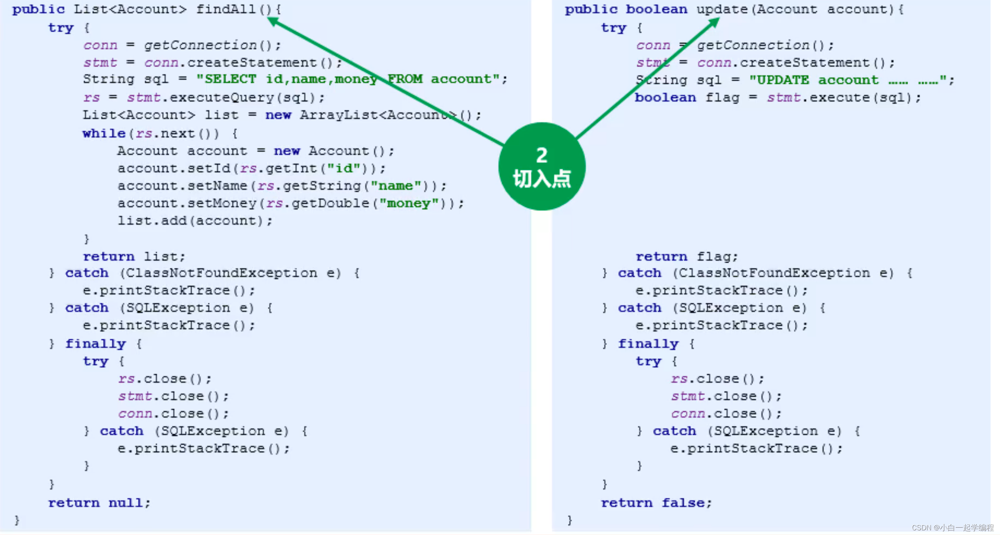

# AOP
[toc]

# AOP

## 参考视频
https://www.bilibili.com/video/BV1yq4y1N78E?spm_id_from=333.337.search-card.all.click
## AOP 简介
### AOP概念

> AOP是一种编程范式，主要关注共性功能


### AOP优势

- 提高代码的可重用性
- 业务代码编码更简洁
- 业务代码维护更高效
- 业务功能扩展更便捷


## AOP入门案例
### AOP 核心概念

> 连接点：指所有方法


> 切入点：拥有共性功能的方法




> 通知：共性功能


> 切面：切入点，和共性功能的，描述关系


> 通知类型：共性功能所处的位置


> 其他概念


### 入门案例(注解 + xml)

pom.xml
```xml
<dependency>
    <groupId>org.springframework</groupId>
    <artifactId>spring-context</artifactId>
    <version>5.1.9.RELEASE</version>
</dependency>
<dependency>
    <groupId>org.aspectj</groupId>
    <artifactId>aspectjweaver</artifactId>
    <version>1.9.4</version>
</dependency>


<dependency>
    <groupId>junit</groupId>
    <artifactId>junit</artifactId>
    <version>4.12</version>
    <scope>test</scope>
</dependency>
<dependency>
    <groupId>org.springframework</groupId>
    <artifactId>spring-test</artifactId>
    <version>5.1.9.RELEASE</version>
</dependency>
```


dao、service

```java
package com.zs.dao;

public interface AopDao {
    void save();
}
```
```java
package com.zs.dao.impl;

import com.zs.dao.AopDao;
import org.springframework.stereotype.Repository;


@Repository
public class AopDaoImpl implements AopDao {
    @Override
    public void save() {
        //共性功能
        //System.out.println("共性功能");
        System.out.println("save dao ...");
    }
}
```
```java
package com.zs.service;

public interface AopService {
    void save();
}
```
```java
package com.zs.service.impl;

import com.zs.dao.AopDao;
import com.zs.service.AopService;
import org.springframework.beans.factory.annotation.Autowired;
import org.springframework.stereotype.Service;


@Service
public class AopServiceImpl implements AopService {

    @Autowired
    private AopDao aopDao;

    @Override
    public void save() {
        System.out.println("aop service ... ");
        aopDao.save();
    }
}
```


通知类

```java
package com.zs.aop;

@Component
public class AOPAdvice {

	
    public void function(){
        System.out.println("共性功能");
    }

}

```


applicationContext.xml

```xml
<?xml version="1.0" encoding="UTF-8"?>
<beans xmlns="http://www.springframework.org/schema/beans"
       xmlns:xsi="http://www.w3.org/2001/XMLSchema-instance"
       xmlns:context="http://www.springframework.org/schema/context"
       xmlns:aop="http://www.springframework.org/schema/aop"
       xsi:schemaLocation="http://www.springframework.org/schema/beans
        https://www.springframework.org/schema/beans/spring-beans.xsd
        http://www.springframework.org/schema/context
        https://www.springframework.org/schema/context/spring-context.xsd
        http://www.springframework.org/schema/aop
        https://www.springframework.org/schema/aop/spring-aop.xsd">

    <!--加载类路径下所有properties配置文件-->
<!--    <context:property-placeholder location="classpath:*.properties"/>-->


<!--    <import resource="applicationContext-book.xml"/>-->
<!--    <import resource="applicationContext-user.xml.bak"/>-->
<!--    <import resource="applicationContext-druid.xml.bak"/>-->
<!--    <import resource="applicationContext-mybatis.xml.bak"/>-->
    <import resource="applicationContext-aop.xml"/>
</beans>

```


applicationContext-aop.xml

```xml
<?xml version="1.0" encoding="UTF-8"?>
<beans xmlns="http://www.springframework.org/schema/beans"
       xmlns:xsi="http://www.w3.org/2001/XMLSchema-instance"
       xmlns:context="http://www.springframework.org/schema/context"
       xmlns:aop="http://www.springframework.org/schema/aop"
       xsi:schemaLocation="http://www.springframework.org/schema/beans
        https://www.springframework.org/schema/beans/spring-beans.xsd
        http://www.springframework.org/schema/context
        https://www.springframework.org/schema/context/spring-context.xsd
        http://www.springframework.org/schema/aop
        https://www.springframework.org/schema/aop/spring-aop.xsd">
    
    <!--该处为排除配置，请忽略-->
    <context:component-scan base-package="com.zs">
        <context:exclude-filter type="custom" expression="config.filter.AopTestTypeFilter"/>
    </context:component-scan>


    <aop:config>
        <!--切入点表达式：定义切入点-->
        <aop:pointcut id="pt" expression="execution(* *..*(..))"/>
        <!--通知-->
        <aop:aspect ref="AOPAdvice">
            <!--切面：切入点，通知之间的位置信息-->
            <aop:before method="function" pointcut-ref="pt"/>
        </aop:aspect>
    </aop:config>
</beans>

```


## AOP配置（XML）（重点）
### 基本配置

### 切入点表达式
切入点：描述的是某个方法
切入点表达式是一个快速匹配方法描述的通配格式，类似于正则表达式
关键字（访问修饰符 返回值 报名.类名.方法名(参数) 异常名）
- 关键字： 描述表达式的匹配模式

范例：
`execution(public User com.itheima.service.UserService.findById(int))`

#### 关键字
execution:匹配执行指定方法
args:匹配带有指定参数类型的方法
within: 
this:
target:
@within
@target
@args
@annotation
bean
reference pointcut

#### 切入点通配符
- \* :任意符 
- .. : 连续任意符
- \+ : 专用于匹配子类类型
#### 逻辑运算符
&& 、||、 ！
#### 切入点配置的三种方式


#### 切入点配置经验
严格遵循规范命名
先为方法配置局部切入点
再抽取类中公共切入点
最后抽取全局切入点
代码走查过程中检测切入点是否存在越界性包含，非包含性进驻
设定AOP执行检测程序，在单元测试中监控通知被执行次数与预计次数是否匹配
设定完毕的切入点如果发生调整务必进行回归测试
（适用于xml格式）

#### 通知类型
> 前置通知：原始方法执行前，如果通知中抛出异常，阻止原始方法运行
> 	- 应用： 数据校验
>
> 后置通知：原始方法执行后，无论方法是否出现异常，都将执行通知
> - 应用： 现场处理
>
> 返回后通知：原始方法执行后，原始方法抛出异常，无法执行
> - 应用： 返回值相关数据处理
>
> 抛出异常后通知：原始方法抛出异常后执行，如果原始方法没有抛出异常，无法执行
> - 应用： 对原始方法中出现的异常信息进行处理
>
> 环绕通知：在原始方法执行前后均有对应执行，还可以阻止原始方法的执行

```xml
    <aop:config>
        <!--切入点表达式：定义切入点-->
        <aop:pointcut id="pt" expression="execution(* *..*(..))"/>
        <!--通知-->
        <aop:aspect ref="AOPAdvice">
            <!--切面：切入点，通知之间的位置信息-->
            <aop:before method="before" pointcut-ref="pt"/>
            <aop:after method="after" pointcut-ref="pt"/>
            <aop:after-returning method="afterReturning" pointcut-ref="pt"/>
            <aop:after-throwing method="afterThrowing" pointcut-ref="pt"/>
            <aop:around method="around" pointcut-ref="pt"/>
        </aop:aspect>
    </aop:config>
```


```java
package com.zs.aop;


import org.aspectj.lang.ProceedingJoinPoint;
import org.springframework.context.annotation.ComponentScan;
import org.springframework.stereotype.Component;

@Component
public class AOPAdvice {
    public void function(){
        System.out.println("共性功能");
    }


    public void before(){
        System.out.println("before");
    }

    public void after(){
        System.out.println("after");
    }

    public void afterReturning(){
        System.out.println("afterReturning");
    }

    public void afterThrowing(){
        System.out.println("afterThrowing");
    }

    public Object around(ProceedingJoinPoint pjp) throws Throwable {
        System.out.println("around");
        Object proceed = pjp.proceed();
        System.out.println("around");
        return proceed;
    }
}

```
### 通知中获取参数


### 通知中获取返回值
after-returning

around


### 通知中获取异常对象
afterThrowing

around


## AOP配置（注解）（重点）


### 通知顺序
同一通知类中，相同通知类型以方法名排序为准
不同通知类中，以类名排序为准
使用@Order注解通过变更bean的加载顺序改变通知的加载顺序

企业开发经验
- 通知方法名由3部分组成，分别前缀、顺序编码、功能描述
- 前缀为固定字符串，例如baidu、itheima等，无实际意义
- 顺序编码为6位以内的整数，通常3位
- 功能描述，为方法对应的实际通知功能，例如exception、strLenCheck


## 综合案例 （重点）
```java
package com.zs.aop;


import org.aspectj.lang.ProceedingJoinPoint;
import org.aspectj.lang.Signature;
import org.aspectj.lang.annotation.Around;
import org.aspectj.lang.annotation.Aspect;
import org.aspectj.lang.annotation.Pointcut;
import org.springframework.stereotype.Component;

@Component
@Aspect
public class RunTimeMonitorAdvice {

    @Pointcut("execution(* com.zs.service.AccountService.find*(..))")
    public void pt(){}

    @Around("pt()")
    public Object runtimeAround(ProceedingJoinPoint pjp) throws Throwable {
        Signature signature = pjp.getSignature();
        String className = signature.getDeclaringTypeName();
        String methodName = signature.getName();
        long startTime = System.currentTimeMillis();
        for (int i = 0; i < 10000; i++) {
            pjp.proceed(pjp.getArgs());
        }
        long endTime = System.currentTimeMillis();
        System.out.println(className + ":" + methodName  + " 10000 run: " + (endTime - startTime) + "ms");
        return null;
    }
}
```

## AOP底层原理 （重点）
### 装饰者模式


```java
public interface DecoratorService {
    void save();
}


```
```java

package com.zs.service.impl;

import com.zs.domain.Account;
import com.zs.mapper.AccountDao;
import com.zs.service.AccountService;
import com.zs.service.DecoratorService;
import org.springframework.beans.factory.annotation.Autowired;
import org.springframework.stereotype.Service;

import java.util.List;


@Service("decoratorService")
public class DecoratorServiceImpl implements DecoratorService {

    @Override
    public void save() {
        System.out.println("水泥墙");
    }
}

```
```java
package com.zs.base.decorator;

import com.zs.service.DecoratorService;
import org.springframework.beans.factory.annotation.Autowired;
import org.springframework.stereotype.Component;

@Component("decoratorServiceDecorator")
public class DecoratorServiceImplDecorator implements DecoratorService {
    @Autowired
    private DecoratorService decoratorService;

    public DecoratorServiceImplDecorator(DecoratorService decoratorService) {
        this.decoratorService = decoratorService;
    }

    @Override
    public void save() {
        decoratorService.save();
        System.out.println("刮大白");
    }
}
```
```java
package com.zs.service;


import com.zs.base.decorator.DecoratorServiceImplDecorator;
import com.zs.domain.Account;
import config.SpringConfig;
import org.junit.Test;
import org.junit.runner.RunWith;
import org.springframework.beans.factory.annotation.Autowired;
import org.springframework.test.context.ContextConfiguration;
import org.springframework.test.context.junit4.SpringJUnit4ClassRunner;

import java.util.List;

//设定spring专用的类加载器
@RunWith(SpringJUnit4ClassRunner.class)
//设定加载的spring上下文对应的配置类
@ContextConfiguration(classes = SpringConfig.class)
public class DecoratorServiceTest {

    @Autowired
    private DecoratorService decoratorService;

    @Autowired
    private DecoratorService decoratorServiceDecorator;

    @Test
    public void test(){
//        DecoratorServiceImplDecorator dsid = new DecoratorServiceImplDecorator(decoratorService);
//        dsid.save();

        decoratorServiceDecorator.save();
    }
}

```
### JDK Proxy
JDKProxy 是针对对象做代理，要求原始对象具有接口实现，并对接口方法进行增强

```java
package com.zs.base.proxy;

import com.zs.service.DecoratorService;

import java.lang.reflect.InvocationHandler;
import java.lang.reflect.Method;
import java.lang.reflect.Proxy;

public class DecoratorServiceJDKProxy {

    public static DecoratorService createDecoratorServiceJDKProxy(DecoratorService decoratorService){
        ClassLoader cl = decoratorService.getClass().getClassLoader();
        Class[] classes = decoratorService.getClass().getInterfaces();
        InvocationHandler ih = new InvocationHandler() {
            @Override
            public Object invoke(Object proxy, Method method, Object[] args) throws Throwable {
                Object invoke = method.invoke(decoratorService, args);
                System.out.println("刷大白");

                return invoke;
            }
        };
        DecoratorService service = (DecoratorService) Proxy.newProxyInstance(cl,classes,ih);
        return service;
    }


}
```

### CGLIBProxy

> CGLIB,Code生成类库
> 不限定是否具有接口，可以对任意操作进行增强
> 无需原始被代理对象，动态创建出新的代理对象

```java
package com.zs.base.cglib;

import com.zs.service.DecoratorService;
import org.springframework.cglib.proxy.Enhancer;
import org.springframework.cglib.proxy.MethodInterceptor;
import org.springframework.cglib.proxy.MethodProxy;

import java.lang.reflect.Method;

public class DecoratorServiceImplCglibProxy {

    public static DecoratorService createDecoratorServiceCglibProxy(Class clazz){
        //创建Enhancer对象（可以理解为内存中动态创建一个类的字节码）
        Enhancer enhancer = new Enhancer();
        //设置Enhancer对象的父类是指定类型
        enhancer.setSuperclass(clazz);
        //设置回调方法
        enhancer.setCallback(new MethodInterceptor() {
            @Override
            public Object intercept(Object o, Method method, Object[] args, MethodProxy methodProxy) throws Throwable {
                /*
                    o ： 代理类对象，
                    method：原始类方法
                    methodProxy: 代理类方法
                    args：方法参数
                 */
                //调用原始方法
                Object ret = methodProxy.invokeSuper(o, args);
                if (method.getName().equals("save")){
                    System.out.println("刮大白");
                }
                return ret;
            }
        });
        //使用Enhancer对象创建对应的对象
        return (DecoratorService) enhancer.create();
    }

}

```
```java
package com.zs.base.cglib;

import com.zs.service.DecoratorService;
import com.zs.service.impl.DecoratorServiceImpl;

public class app {
    public static void main(String[] args) {
        DecoratorService decoratorService = DecoratorServiceImplCglibProxy.createDecoratorServiceCglibProxy(DecoratorServiceImpl.class);
        decoratorService.save();
    }
}

```

spring 切换代理类型
> 注解： 
> `@EnableAspectJAutoProxy(proxyTargetClass = true)`
> XML注解支持：
> `<aop:aspectj-autoproxy proxy-target-class="false" />`
> XML配置
> `<aop: config proxy-target-class="false"></aop:config>`


 

以下是测试代码的日志

\==== 没有异常的情况

环绕通知前....

before

invoke

环绕通知后....

after

afterReturning

\==== 有异常的情况

环绕通知前....

before

invoke

after

afterThrowable出现异常:msg=/ by zero

\==== 总结

after一定走。是在finally里

afterReturning 在抛异常时不出现，在after之后。说明在finally外面

before 在环绕通知后执行  
 

_**错误版**_

```
// 这个是错的。因为执行这个，抛了异常之后会走afterReturning。而实际没有走。
try{

    Around();
    Before();
    invoke();

}catch(Exception e){

    AfterThrowable();

}finally{

    After();

}
AfterReturning();
```

抛异常之后并没有走AfterReturning。因此该方法在 catch 前面执行。在finally后执行。最终版如下

_**最终版**_ 

```
// 最终版
try{

    try {

        Around();
        Before();
        invoke();

    } finally {

        After();

    }

    AfterReturning();

} catch (Exception e){

    AfterThrowable();

}
```