# IOC
## IoC简介

（1）控制反转，把对象创建和对象之间的调用过程，交给spring进行管理

（2）使用IOC目的：降低耦合度

（3）入门案例IoC实现

xml解析、工厂模式、反射


### 引例
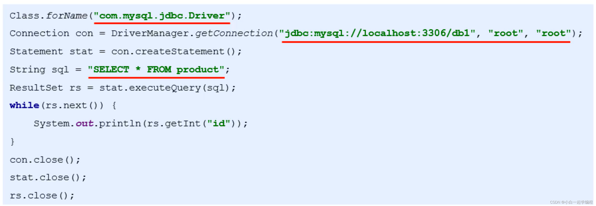
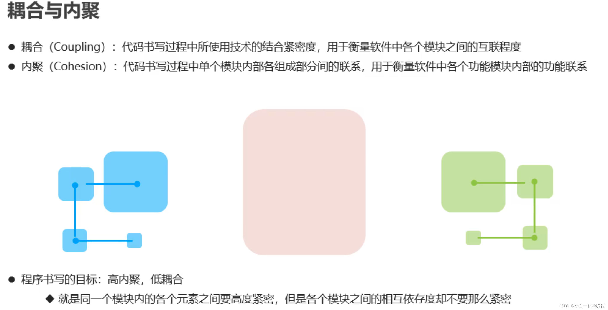
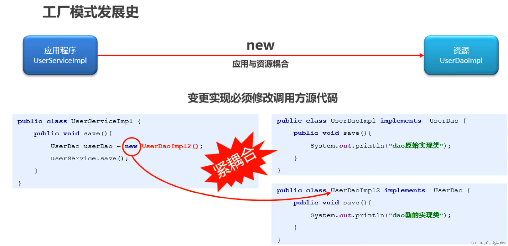

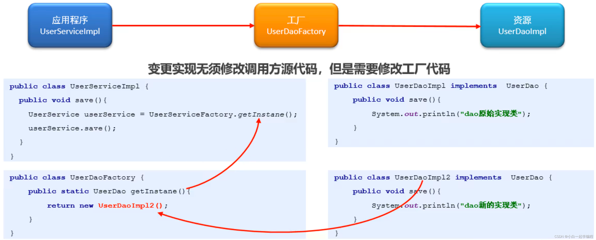
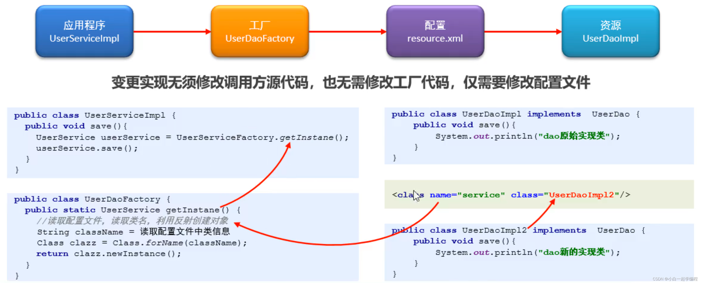


### IoC概念

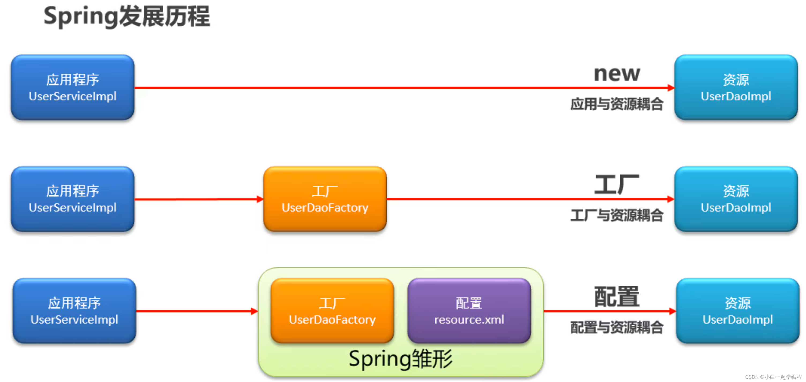
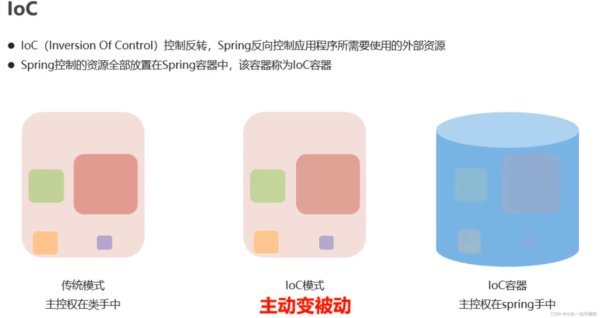

## 入门案例
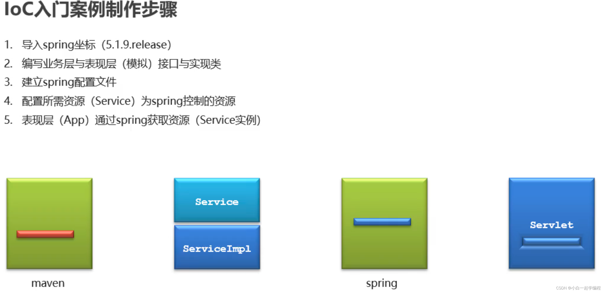
1. pom.xml
```xml
    <dependencies>
        <dependency>
            <groupId>org.springframework</groupId>
            <artifactId>spring-context</artifactId>
            <version>5.1.9.RELEASE</version>
        </dependency>
    </dependencies>
```
2.  UserService &  UserServiceImpl
```java
package com.zs.service;

public interface UserService {
    void save();
}

```
```java
package com.zs.service.impl;

import com.zs.service.UserService;

public class UserServiceImpl  implements UserService {
    @Override
    public void save() {
        System.out.println("hello spring!!");
    }
}
```

3. 建立spring配置文件
```java
<?xml version="1.0" encoding="UTF-8"?>
<beans xmlns="http://www.springframework.org/schema/beans"
       xmlns:xsi="http://www.w3.org/2001/XMLSchema-instance"
       xsi:schemaLocation="http://www.springframework.org/schema/beans
        https://www.springframework.org/schema/beans/spring-beans.xsd">
    <!-- 1.创建spring控制的资源-->
    <bean id="userService" class="com.zs.service.impl.UserServiceImpl"/>
</beans>
```
4. 启动类
```java
package com.zs;

import com.zs.service.UserService;
import org.springframework.context.ApplicationContext;
import org.springframework.context.support.ClassPathXmlApplicationContext;

public class UserApp {
    public static void main(String[] args) {
        //加载配置文件
        ApplicationContext ctx = new ClassPathXmlApplicationContext("applicationContext.xml");
        //获取资源
        UserService userService = (UserService) ctx.getBean("userService");

        userService.save();
    }
}

```

## IoC配置（XML格式）
### bean--id,name,class

基本属性（id,name,class） 无参构造创建bean

作用： 定义spring中的资源，受此标签定义的资源将受到spring控制
```xml
<bean id="beanId" name="beanName1,beanNaem2" class="ClassName"/>
```
- id:		bean的名称，通过id值获取bean
- class:	bean的类型
- name:	bean的名称，可以通过name值获取bean，用于多人配合时给bean起别名

<font color="red">采用的就是默认构造函数创建bean对象，此时如果类中没有默认构造函数，则对象无法创建</font>

### bean--scope
作用：定义bean的作用范围
```xml
<bean scope="singleton"/>
```
默认就是单例的，单例时对象是在spring容器加载时创建，非单例时在对象创建时创建
- singleton: 设定创建出的对象保存在spring容器中，是一个单例的对象
- prototype: 设定创建出的对象保存在spring容器中，是一个非单例的对象
- request、session、applicaiton、websocket:设定创建出的对象放置在web容器对应的位置
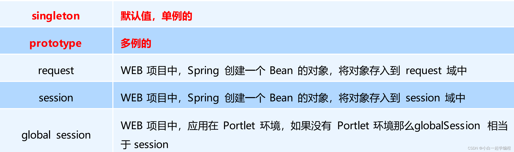

### bean--init-method,destroy-method

bean生命周期（init-method,destroy-method）

作用：定义bean对象在初始化或销毁时完成的工作
```xml
<bean init-method="init" destroy-method="destroy"/>
```
bean对应的类中对应的具体方法名 `init() `,`destroy()`
单例模式：只创建一次,init()做一次，`ClassPathXmlApplicationContext`的`close()`方法关闭时调用`destroy()`
非单例：创建一次，调一次，销毁方法不受spring管
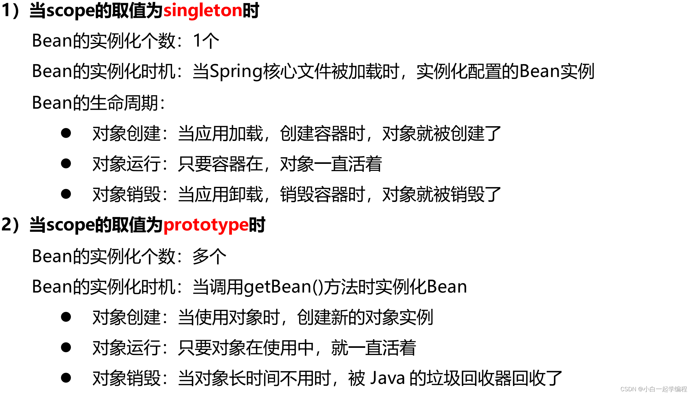


### bean--factory-bean
作用：定义bean对象创建方式，使用静态工厂的形式创建bean，兼容早期遗留系统的升级工作
```xml
<!--静态工厂创建bean-->
<bean id="userService4" class="com.zs.service.UserServiceFactory" factory-method="getService"  />
```
```java
public class UserServiceFactory {
    public static UserService getService(){
        return new UserServiceImpl();
    }
}
```

### bean--factory-bean,factory-method
作用：定义bean对象创建方式，使用实例工厂的形式创建bean，兼容早期遗留系统的升级工作
```xml
<!--实例工厂对应的bean-->
<bean id="factoryBean" class="com.zs.service.UserServiceFactory2"/>
<!--实例工厂创建bean，依赖工厂对象对应的bean-->
<bean id="userService5" factory-bean="factoryBean" factory-method="getService" />
```
```java
public class UserServiceFactory {
    public UserService getService(){
        return new UserServiceImpl();
    }
}
```
### DI
DI依赖注入，应用程序运行依赖的资源由Spring为其提供，资源进入应用程序的方式称为注入
DI其实就是IoC容器，只是站在应用程序的角度的称呼
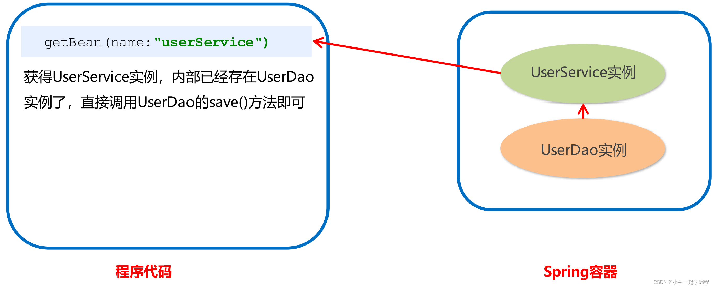

### DI--set注入（主流）
```java
public class UserServiceImpl  implements UserService {
	
	//要注入的属性
    private UserDao userDao;
    private int num;
    private Integer age;
    private String name;

	//提供set方法
    public void setUserDao(UserDao userDao) {
        this.userDao = userDao;
    }

    public void setNum(int num) {
        this.num = num;
    }

    public void setAge(Integer age) {
        this.age = age;
    }

    public void setName(String name) {
        this.name = name;
    }


    @Override
    public void save() {
        System.out.println("hello spring!!");
        userDao.save();
        System.out.println(num + " " + age + " " + name);
    }
}
```
```xml
<?xml version="1.0" encoding="UTF-8"?>
<beans xmlns="http://www.springframework.org/schema/beans"
       xmlns:xsi="http://www.w3.org/2001/XMLSchema-instance"
       xsi:schemaLocation="http://www.springframework.org/schema/beans
        https://www.springframework.org/schema/beans/spring-beans.xsd">
    <!-- 1.创建spring控制的资源-->
    <bean id="userService" class="com.zs.service.impl.UserServiceImpl">
        <!--注入引用类型变量通过property属性注入
            name 注入的变量名，ref 注入的bean对象
        -->
        <property name="userDao" ref="userDao"/>
        <property name="num" value="10"/>
        <property name="age" value="10"/>
        <property name="name" value="zs"/>
    </bean>
    <!--要注入的资源-->
    <bean id="userDao" class="com.zs.dao.impl.UserDaoImpl"/>
</beans>
```


### DI--构造注入（了解）
```java
public class UserServiceImpl  implements UserService {

    private UserDao userDao;
    private int num;
    private Integer age;
    private String name;

    public UserServiceImpl() {
    }

	//提供构造器
    public UserServiceImpl(UserDao userDao, int num, Integer age, String name) {
        this.userDao = userDao;
        this.num = num;
        this.age = age;
        this.name = name;
    }
```

```xml
    <!-- 1.创建spring控制的资源-->
    <bean id="userService" class="com.zs.service.impl.UserServiceImpl">
        <constructor-arg name="userDao" ref="userDao"/>
        <constructor-arg name="num" value="10"/>
        <constructor-arg name="age" value="10"/>
        <constructor-arg name="name" value="zs"/>
    </bean>
    <!--要注入的资源-->
    <bean id="userDao" class="com.zs.dao.impl.UserDaoImpl"/>
```
### DI--集合注入（array,list,set,map,props）
```java
public class BookDaoImpl implements BookDao {

    private ArrayList al;
    private Properties properties;
    private int[] arr;
    private HashSet hs;
    private HashMap hm;

    public void setAl(ArrayList al) {
        this.al = al;
    }

    public void setProperties(Properties properties) {
        this.properties = properties;
    }

    public void setArr(int[] arr) {
        this.arr = arr;
    }

    public void setHs(HashSet hs) {
        this.hs = hs;
    }

    public void setHm(HashMap hm) {
        this.hm = hm;
    }

    @Override
    public void save() {
        System.out.println("book dao running..");
        System.out.println("ArrayList" + al);
        System.out.println("Properties: " + properties);
        for (int i = 0; i < arr.length; i++) {
            System.out.println(arr[i]);
        }
        System.out.println("HashSet: " + hs);
        System.out.println("HashMap: " + hm);
    }
}

```

```xml
    <!-- 1.创建spring控制的资源-->
    <bean id="userService" class="com.zs.service.impl.UserServiceImpl">
        <property name="userDao" ref="userDao"/>
        <property name="bookDao" ref="bookDao"/>
    </bean>
    <!--要注入的资源-->
    <bean id="userDao" class="com.zs.dao.impl.UserDaoImpl"/>
    <bean id="bookDao" class="com.zs.dao.impl.BookDaoImpl">
        <!--arrayList-->
        <property name="al">
            <list>
                <value type="java.lang.String">12</value>
                <value type="java.lang.String">zs</value>
            </list>
        </property>
        <property name="properties">
            <props>
                <prop key="name">zs</prop>
                <prop key="value">666</prop>
            </props>
        </property>
        <property name="arr">
            <array>
                <value>12</value>
                <value>13</value>
            </array>
        </property>
        <property name="hs">
            <set>
                <value type="java.lang.String">age</value>
                <value type="java.lang.String">name</value>
            </set>
        </property>
        <property name="hm">
            <map>
                <entry key="age" value-type="java.lang.String" value="18"/>
                <entry key="name" value="zs"/>
            </map>
        </property>
    </bean>

```

### properties文件
```java
public class UserDaoImpl implements UserDao {

    private String username;
    private String password;

    public void setUsername(String username) {
        this.username = username;
    }

    public void setPassword(String password) {
        this.password = password;
    }

    @Override
    public void save() {
        System.out.println(username + "\t" + password);
    }
}

```
```xml
<?xml version="1.0" encoding="UTF-8"?>
<beans xmlns="http://www.springframework.org/schema/beans"
       xmlns:xsi="http://www.w3.org/2001/XMLSchema-instance"
       xmlns:context="http://www.springframework.org/schema/context"
       xsi:schemaLocation="http://www.springframework.org/schema/beans
        https://www.springframework.org/schema/beans/spring-beans.xsd
        http://www.springframework.org/schema/context
        https://www.springframework.org/schema/context/spring-context.xsd">

    <!--加载类路径下所有properties配置文件-->
    <context:property-placeholder location="classpath:*.properties"/>

    <!-- 1.创建spring控制的资源-->
    <bean id="userService" class="com.zs.service.impl.UserServiceImpl">
        <property name="userDao" ref="userDao"/>
        <property name="bookDao" ref="bookDao"/>
    </bean>
    <!--要注入的资源-->
    <bean id="userDao" class="com.zs.dao.impl.UserDaoImpl">
        <property name="username" value="${username}"/>
        <property name="password" value="${password}"/>
    </bean>
```

```properties
username=zs666
password=123adfasdf
```


### 团队开发
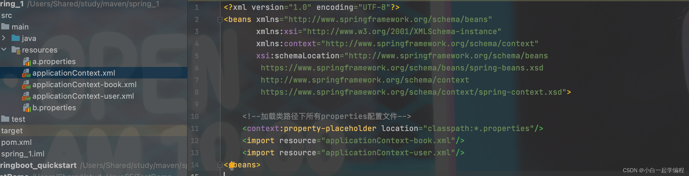
applicationContext.xml
```xml
<?xml version="1.0" encoding="UTF-8"?>
<beans xmlns="http://www.springframework.org/schema/beans"
       xmlns:xsi="http://www.w3.org/2001/XMLSchema-instance"
       xmlns:context="http://www.springframework.org/schema/context"
       xsi:schemaLocation="http://www.springframework.org/schema/beans
        https://www.springframework.org/schema/beans/spring-beans.xsd
        http://www.springframework.org/schema/context
        https://www.springframework.org/schema/context/spring-context.xsd">

    <!--加载类路径下所有properties配置文件-->
    <context:property-placeholder location="classpath:*.properties"/>
    <import resource="applicationContext-book.xml"/>
    <import resource="applicationContext-user.xml"/>
</beans>

```
applicationContext-book.xml

```xml
<?xml version="1.0" encoding="UTF-8"?>
<beans xmlns="http://www.springframework.org/schema/beans"
       xmlns:xsi="http://www.w3.org/2001/XMLSchema-instance"
       xmlns:context="http://www.springframework.org/schema/context"
       xsi:schemaLocation="http://www.springframework.org/schema/beans
        https://www.springframework.org/schema/beans/spring-beans.xsd
        http://www.springframework.org/schema/context
        https://www.springframework.org/schema/context/spring-context.xsd">


    <bean id="bookDao" class="com.zs.dao.impl.BookDaoImpl">
        <!--arrayList-->
        <property name="al">
            <list>
                <value type="java.lang.String">12</value>
                <value type="java.lang.String">zs</value>
            </list>
        </property>
        <property name="properties">
            <props>
                <prop key="name">zs</prop>
                <prop key="value">666</prop>
            </props>
        </property>
        <property name="arr">
            <array>
                <value>12</value>
                <value>13</value>
            </array>
        </property>
        <property name="hs">
            <set>
                <value type="java.lang.String">age</value>
                <value type="java.lang.String">name</value>
            </set>
        </property>
        <property name="hm">
            <map>
                <entry key="age" value-type="java.lang.String" value="18"/>
                <entry key="name" value="zs"/>
            </map>
        </property>
    </bean>


</beans>

```
applicationContext-user.xml
```xml
<?xml version="1.0" encoding="UTF-8"?>
<beans xmlns="http://www.springframework.org/schema/beans"
       xmlns:xsi="http://www.w3.org/2001/XMLSchema-instance"
       xmlns:context="http://www.springframework.org/schema/context"
       xsi:schemaLocation="http://www.springframework.org/schema/beans
        https://www.springframework.org/schema/beans/spring-beans.xsd
        http://www.springframework.org/schema/context
        https://www.springframework.org/schema/context/spring-context.xsd">

    <!--加载类路径下所有properties配置文件-->
    <context:property-placeholder location="classpath:*.properties"/>

    <!-- 1.创建spring控制的资源-->
    <bean id="userService" class="com.zs.service.impl.UserServiceImpl">
        <property name="userDao" ref="userDao"/>
        <property name="bookDao" ref="bookDao"/>
    </bean>
    <!--要注入的资源-->
    <bean id="userDao" class="com.zs.dao.impl.UserDaoImpl">
        <property name="username" value="${username}"/>
        <property name="password" value="${password}"/>
    </bean>
</beans>

```

### ApplicationContext
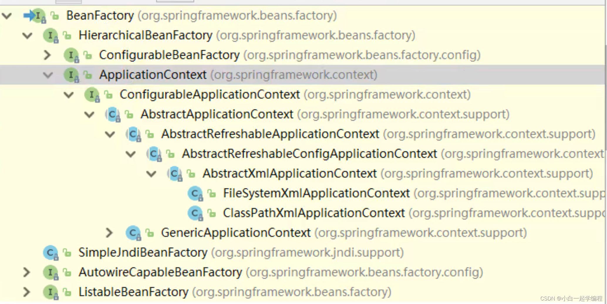

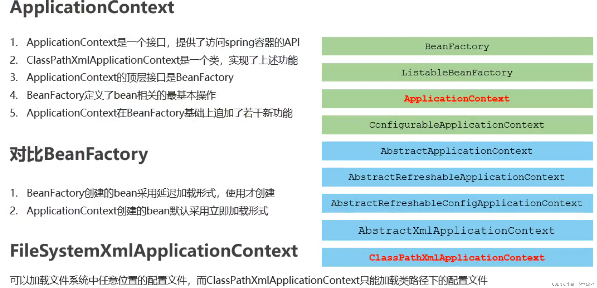
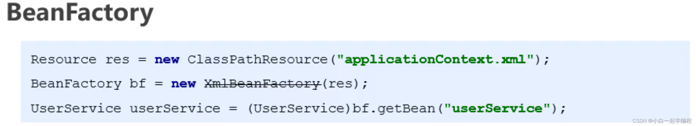


### 第三方资源配置
#### 数据源
##### 数据源的作用
- 数据源（连接池）是提高程序性能出现的
- 实现实例化数据源，初始化部分连接资源
- 使用连接时从数据源中获取
- 使用完毕后将连接资源归还给数据源

常见的数据源（连接池）：DBCP、C3P0、Druid、BoneCP

##### 数据源的开发步骤
- 导入数据源的坐标和数据库驱动坐标
- 创建数据源对象
- 设置数据源的基本连接数据
- 使用数据源获取连接资源和归还连接资源

##### java方式连接
```xml
		<!--数据源测试-->
		<dependency>
			<groupId>mysql</groupId>
			<artifactId>mysql-connector-java</artifactId>
			<version>5.1.47</version>
		</dependency>
		<dependency>
			<groupId>c3p0</groupId>
			<artifactId>c3p0</artifactId>
			<version>0.9.1.2</version>
		</dependency>
		<dependency>
			<groupId>com.alibaba</groupId>
			<artifactId>druid</artifactId>
			<version>1.1.21</version>
		</dependency>
		<dependency>
			<groupId>junit</groupId>
			<artifactId>junit</artifactId>
			<version>4.12</version>
			<scope>test</scope>
		</dependency>
```
```java
package com.zs.test;


import com.alibaba.druid.pool.DruidDataSource;
import com.mchange.v2.c3p0.ComboPooledDataSource;
import org.junit.Test;

import java.beans.PropertyVetoException;
import java.sql.Connection;
import java.sql.SQLException;
import java.util.ResourceBundle;

public class TestDatasource {

	@Test
	//手动创建c3p0数据源
	public void test01() throws Exception {
		ResourceBundle jdbc = ResourceBundle.getBundle("jdbc");
		String driver = jdbc.getString("jdbc.driver");
		String url = jdbc.getString("jdbc.url");
		String username = jdbc.getString("jdbc.username");
		String password = jdbc.getString("jdbc.password");


		ComboPooledDataSource comboPooledDataSource = new ComboPooledDataSource();
		comboPooledDataSource.setDriverClass(driver);
		comboPooledDataSource.setJdbcUrl(url);
		comboPooledDataSource.setUser(username);
		comboPooledDataSource.setPassword(password);

		Connection connection = comboPooledDataSource.getConnection();
		System.out.println(connection);
		connection.close();
	}

	@Test
	//手动创建c3p0数据源
	public void test02() throws SQLException {
		ResourceBundle jdbc = ResourceBundle.getBundle("jdbc");
		String driver = jdbc.getString("jdbc.driver");
		String url = jdbc.getString("jdbc.url");
		String username = jdbc.getString("jdbc.username");
		String password = jdbc.getString("jdbc.password");

		DruidDataSource dataSource = new DruidDataSource();
		dataSource.setDriverClassName(driver);
		dataSource.setUrl(url);
		dataSource.setUsername(username);
		dataSource.setPassword(password);

		Connection connection = dataSource.getConnection();
		System.out.println(connection);
		connection.close();
	}

}

```
##### spring 产生Druid数据源
测试
```java
        DruidDataSource druidDataSource = new DruidDataSource();
        System.out.println(druidDataSource);
```


```xml

    <!--加载类路径下所有properties配置文件-->
    <context:property-placeholder location="classpath:*.properties"/>
 	
     	<!--配置数据源-->
    <bean id="dataSource" class="com.alibaba.druid.pool.DruidDataSource">
        <property name="driverClassName" value="${jdbc.driver}"/>
        <property name="url" value="${jdbc.url}"/>
        <property name="username" value="${jdbc.username}"/>
        <property name="password" value="${jdbc.password}"/>
    </bean>
```
jdbc.properties
```js
jdbc.driver=com.mysql.jdbc.Driver
jdbc.url=jdbc:mysql://localhost:3306/testdb
jdbc.username=iplat62
jdbc.password=iplat62
```
```xml
<?xml version="1.0" encoding="UTF-8"?>
<project xmlns="http://maven.apache.org/POM/4.0.0"
         xmlns:xsi="http://www.w3.org/2001/XMLSchema-instance"
         xsi:schemaLocation="http://maven.apache.org/POM/4.0.0 http://maven.apache.org/xsd/maven-4.0.0.xsd">
    <modelVersion>4.0.0</modelVersion>

    <groupId>org.example</groupId>
    <artifactId>spring_1</artifactId>
    <version>1.0-SNAPSHOT</version>

    <properties>
        <maven.compiler.source>8</maven.compiler.source>
        <maven.compiler.target>8</maven.compiler.target>
    </properties>

    <dependencies>

        <dependency>
            <groupId>org.springframework</groupId>
            <artifactId>spring-context</artifactId>
            <version>5.1.9.RELEASE</version>
        </dependency>
        <dependency>
            <groupId>com.alibaba</groupId>
            <artifactId>druid</artifactId>
            <version>1.1.21</version>
        </dependency>
    </dependencies>

    <repositories>
        <repository>
            <id>aliyun-maven</id>
            <name>aliyun maven</name>
            <url>http://maven.aliyun.com/nexus/content/groups/public/</url>
        </repository>
    </repositories>
    <pluginRepositories>
        <pluginRepository>
            <id>aliyun-maven</id>
            <name>aliyun maven</name>
            <url>http://maven.aliyun.com/nexus/content/groups/public/</url>
        </pluginRepository>
    </pluginRepositories>

</project>

```

## 综合案例

### 基础准备
#### 坐标
```xml
<?xml version="1.0" encoding="UTF-8"?>
<project xmlns="http://maven.apache.org/POM/4.0.0"
         xmlns:xsi="http://www.w3.org/2001/XMLSchema-instance"
         xsi:schemaLocation="http://maven.apache.org/POM/4.0.0 http://maven.apache.org/xsd/maven-4.0.0.xsd">
    <modelVersion>4.0.0</modelVersion>

    <groupId>org.example</groupId>
    <artifactId>spring_1</artifactId>
    <version>1.0-SNAPSHOT</version>

    <properties>
        <maven.compiler.source>8</maven.compiler.source>
        <maven.compiler.target>8</maven.compiler.target>
    </properties>

    <dependencies>
		<!--####################################-->
		<!--spring坐标-->
        <dependency>
            <groupId>org.springframework</groupId>
            <artifactId>spring-context</artifactId>
            <version>5.1.9.RELEASE</version>
        </dependency>
        <!--spring连数据库坐标-->
        <dependency>
            <groupId>org.springframework</groupId>
            <artifactId>spring-jdbc</artifactId>
            <version>5.1.9.RELEASE</version>
        </dependency>
		<!--####################################-->
        <!--druid数据源坐标-->
        <dependency>
            <groupId>com.alibaba</groupId>
            <artifactId>druid</artifactId>
            <version>1.1.21</version>
        </dependency>
		<!--####################################-->
        <!--mybatis坐标-->
        <dependency>
            <groupId>org.mybatis</groupId>
            <artifactId>mybatis</artifactId>
            <version>3.5.3</version>
        </dependency>
        <!--spring整合mybatis的坐标-->
        <dependency>
            <groupId>org.mybatis</groupId>
            <artifactId>mybatis-spring</artifactId>
            <version>1.3.0</version>
        </dependency>
		<!--####################################-->
		<!--mysql驱动坐标-->
        <dependency>
            <groupId>mysql</groupId>
            <artifactId>mysql-connector-java</artifactId>
            <version>5.1.47</version>
        </dependency>


    </dependencies>

    <repositories>
        <repository>
            <id>aliyun-maven</id>
            <name>aliyun maven</name>
            <url>http://maven.aliyun.com/nexus/content/groups/public/</url>
        </repository>
    </repositories>
    <pluginRepositories>
        <pluginRepository>
            <id>aliyun-maven</id>
            <name>aliyun maven</name>
            <url>http://maven.aliyun.com/nexus/content/groups/public/</url>
        </pluginRepository>
    </pluginRepositories>

</project>

```
#### 业务类接口
##### 数据表
```sql
create table account(
	id int primary key auto_increment,
	name varchar(40),
	money float
)character set utf8 collate utf8_general_ci;

insert into account(name,money) values('aaa',1000);
insert into account(name,money) values('bbb',1000);
insert into account(name,money) values('ccc',1000);
```

##### 业务类，接口
AccountDao
```java
package com.zs.dao;

import com.zs.domain.Account;

import java.util.List;

public interface AccountDao {
    void save(Account account);

    void delete(Integer id);

    void update(Account account);

    List<Account> findAll();

    Account findById(Integer id);
}
```

AccountService
```java
package com.zs.service;

import com.zs.domain.Account;

import java.util.List;

public interface AccountService {

    void save(Account account);

    void delete(Integer id);

    void update(Account account);

    List<Account> findAll();

    Account findById(Integer id);
}
```

AccountServiceImpl
```java
package com.zs.service.impl;

import com.zs.dao.AccountDao;
import com.zs.domain.Account;
import com.zs.service.AccountService;

import java.util.List;

public class AccountServiceImpl implements AccountService {

    //使用Spring注入dao
    private AccountDao accountDao;
	//提供set方法
    public void setAccountDao(AccountDao accountDao) {
        this.accountDao = accountDao;
    }

    @Override
    public void save(Account account) {
        accountDao.save(account);
    }

    @Override
    public void delete(Integer id) {
        accountDao.delete(id);
    }

    @Override
    public void update(Account account) {
        accountDao.update(account);
    }

    @Override
    public List<Account> findAll() {
        return accountDao.findAll();
    }

    @Override
    public Account findById(Integer id) {
        return accountDao.findById(id);
    }
}

```

#### 基础配置文件
jdbc.properties
```js
jdbc.driver=com.mysql.jdbc.Driver
jdbc.url=jdbc:mysql://localhost:3306/testdb
jdbc.username=iplat62
jdbc.password=iplat62
```
SqlMapConfig.xml.bak :该文件被spring替换成bean
```xml
<?xml version="1.0" encoding="UTF-8" ?>
<!DOCTYPE configuration
        PUBLIC "-//mybatis.org//DTD Config 3.0//EN"
        "http://mybatis.org/dtd/mybatis-3-config.dtd">
<configuration>
	<!--读取配置文件，spring读取-->
    <properties resource="jdbc.properties"></properties>
    <!--配置别名，spring的bean中配置-->
    <typeAliases>
        <package name="com.zs.domain"/>
    </typeAliases>
    <!--配置数据源：spring中配置数据源-->
    <environments default="mysql">
        <environment id="mysql">
            <transactionManager type="JDBC"/>
            <dataSource type="POOLED">
                <property name="driver" value="${jdbc.driver}"/>
                <property name="url" value="${jdbc.url}"/>
                <property name="username" value="${jdbc.username}"/>
                <property name="password" value="${jdbc.password}"/>
            </dataSource>
        </environment>
    </environments>
    <!--配置映射文件：spring单端配置成bean配置-->
    <mappers>
        <package name="com.zs.dao"/>
    </mappers>
</configuration>

```

AccountDao.xml
```xml
<?xml version="1.0" encoding="UTF-8" ?>
<!DOCTYPE mapper
        PUBLIC "-//mybatis.org//DTD Mapper 3.0//EN"
        "http://mybatis.org/dtd/mybatis-3-mapper.dtd">
<mapper namespace="com.zs.dao.AccountDao">
    <!--配置根据ID查询-->
    <select id = "findById" resultType="account" parameterType="int">
        select * from account where id = #{id}
    </select>
    <!--配置查询所有-->
    <select id="findAll" resultType="account">
        select * from account
    </select>

    <!--配置根据ID查询-->
    <insert id="save" parameterType="account">
        insert into account(name,money) values(#{name},#{money})
    </insert>
    <!--配置根据ID查询-->
    <delete id="delete" parameterType="int">
        delete from account where id = #{id}
    </delete>

    <!--配置根据ID查询-->
    <update id="update" parameterType="account">
        update account set name = #{name},money=#{money} where id=#{id}
    </update>


</mapper>

```

applicationContext.xml
```xml
<?xml version="1.0" encoding="UTF-8"?>
<beans xmlns="http://www.springframework.org/schema/beans"
       xmlns:xsi="http://www.w3.org/2001/XMLSchema-instance"
       xmlns:context="http://www.springframework.org/schema/context"
       xsi:schemaLocation="http://www.springframework.org/schema/beans
        https://www.springframework.org/schema/beans/spring-beans.xsd
        http://www.springframework.org/schema/context
        https://www.springframework.org/schema/context/spring-context.xsd">

    <!--加载类路径下所有properties配置文件-->
    <context:property-placeholder location="classpath:*.properties"/>
 	
 	<!--配置数据源-->
    <bean id="dataSource" class="com.alibaba.druid.pool.DruidDataSource">
        <property name="driverClassName" value="${jdbc.driver}"/>
        <property name="url" value="${jdbc.url}"/>
        <property name="username" value="${jdbc.username}"/>
        <property name="password" value="${jdbc.password}"/>
    </bean>
   
    <!--配置service作为spring的bean,注入dao-->
    <bean id="accountService" class="com.zs.service.impl.AccountServiceImpl">
        <property name="accountDao" ref="accountDao"/>
    </bean>


    <!--mybatis核心配置文件,控制连接的对象，不写IDSpring可以根据类型获取-->
    <bean class="org.mybatis.spring.SqlSessionFactoryBean">
        <!--数据源-->
        <property name="dataSource" ref="dataSource"/>
        <property name="typeAliasesPackage" value="com.zs.domain"/>
    </bean>

    <!--映射配置扫描配置独立出来-->
    <bean class="org.mybatis.spring.mapper.MapperScannerConfigurer">
        <property name="basePackage" value="com.zs.dao"/>
    </bean>
</beans>


```

#### 测试类
```java
package com.zs;

import com.alibaba.druid.pool.DruidDataSource;
import com.zs.domain.Account;
import com.zs.service.AccountService;
import com.zs.service.UserService;
import org.springframework.context.ApplicationContext;
import org.springframework.context.support.ClassPathXmlApplicationContext;

import java.util.List;

public class UserApp {
    public static void main(String[] args) {
        //加载配置文件
        ApplicationContext ctx = new ClassPathXmlApplicationContext("applicationContext.xml");
        AccountService accountService = (AccountService) ctx.getBean("accountService");
        Account byId = accountService.findById(1);
        List<Account> all = accountService.findAll();
        System.out.println(byId);
        all.forEach(System.out::println);
    }
}

```

### 常见问题
`Exception in thread "main" org.apache.ibatis.binding.BindingException: Invalid bound statement (not found): com.zs.dao.AccountDao.findById`
文件位置应该放到对应包下，对应包名需要注意是否只建立了一个包（下图是正确位置的截图）
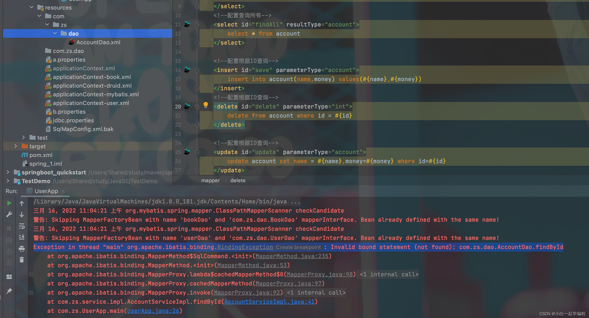