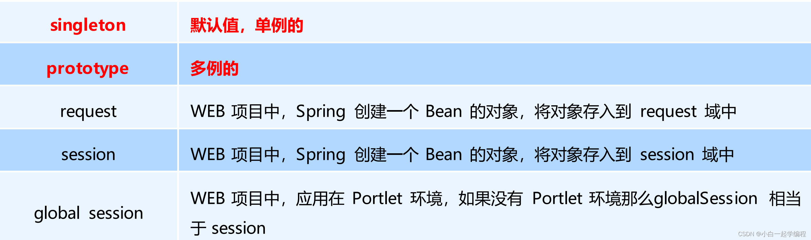

# spring--1.1.xml_bean的配置


## bean的基础配置


## bean的别名配置


## bean的范围配置


> spring-webmvc环境中




## bean的延迟加载


## bean的初始化和销毁方法配置


单例模式：只创建一次,init()做一次，`ClassPathXmlApplicationContext`的`close()`方法关闭时调用`destroy()`
非单例：创建一次，调一次，销毁方法不受spring管


`afterPropertiesSet`在属性设置之后执行

## bean的实例化配置


### 有参构造实例化


### 工厂实例化


### 静态工厂

作用：定义bean对象创建方式，使用静态工厂的形式创建bean，兼容早期遗留系统的升级工作

```xml
<!--静态工厂创建bean-->
<bean id="userService4" class="com.zs.service.UserServiceFactory" factory-method="getService"  />
```

```java
package com.zs.spring.service;

import com.zs.spring.service.impl.UserServiceImpl;

/**
 * 静态工厂
 */
public class UserServiceFactory {
    public static UserService getService(){
        return new UserServiceImpl();
    }

    public static UserService getService(String name,int age){
        return new UserServiceImpl();
    }
}

```

### 实例工厂

作用：定义bean对象创建方式，使用实例工厂的形式创建bean，兼容早期遗留系统的升级工作
```xml
<!--实例工厂配置bean-->
<bean id="userServiceFactory" class="com.zs.spring.service.UserServiceFactory"></bean>
<!--实例工厂创建bean，依赖工厂对象对应的bean-->
<bean id="userServiceByFactory" factory-bean="userServiceFactory" factory-method="getServiceByFactory" ></bean>
<bean id="userServiceByFactoryWithArgs" factory-bean="userServiceFactory" factory-method="getServiceByFactory" >
    <constructor-arg name="name" value="xiaoshaozi"/>
    <constructor-arg name="age" value="18"/>
</bean>
```
```java
public class UserServiceFactory {
    public static UserService getService(){
        return new UserServiceImpl();
    }

    public static UserService getService(String name,int age){
        return new UserServiceImpl();
    }

    public UserService getServiceByFactory(){
        return new UserServiceImpl();
    }

    public UserService getServiceByFactory(String name,int age){
        return new UserServiceImpl();
    }
}
```


### 实现`FactoryBean`规范延迟实例化bean

> FactoryBean是spring的接口，用来创建bean使用的，会延迟创建bean

```java
package org.springframework.beans.factory;

import org.springframework.lang.Nullable;

public interface FactoryBean<T> {

	String OBJECT_TYPE_ATTRIBUTE = "factoryBeanObjectType";

	@Nullable
	T getObject() throws Exception;

	@Nullable
	Class<?> getObjectType();
	
	default boolean isSingleton() {
		return true;
	}
}
```


## bean的依赖注入配置


```java
package com.zs.spring.service.impl;


import com.zs.spring.dao.UserDao;
import com.zs.spring.service.UserService;

import java.util.List;
import java.util.Map;
import java.util.Properties;
import java.util.Set;


public class UserServiceImpl implements UserService {

    private List<String> stringList;
    private List<UserDao> userDaoList;
    private UserDao userDao;
    private Set<UserDao> userDaoSet;
    private Map<String,UserDao> userDaoMap;

    private Properties properties;

    public void setStringList(List<String> stringList) {
        this.stringList = stringList;
    }

    public void setUserDaoList(List<UserDao> userDaoList) {
        this.userDaoList = userDaoList;
    }

    public void setUserDao(UserDao userDao) {
        this.userDao = userDao;
    }

    public void setUserDaoSet(Set<UserDao> userDaoSet) {
        this.userDaoSet = userDaoSet;
    }

    public void setUserDaoMap(Map<String, UserDao> userDaoMap) {
        this.userDaoMap = userDaoMap;
    }

    public void setProperties(Properties properties) {
        this.properties = properties;
    }

    @Override
    public void show() {

    }
}
```

```xml
    <bean id="userServiceProperties01" class="com.zs.spring.service.impl.UserServiceImpl">
        <property name="userDao" ref="userDao"/>
        <property name="stringList">
            <list>
                <value>aaa</value>
                <value>bbb</value>
                <value>ccc</value>
            </list>
        </property>
        <property name="userDaoList">
            <list>
                <bean class="com.zs.spring.dao.impl.UserDaoImpl"/>
                <bean class="com.zs.spring.dao.impl.UserDaoImpl"/>
                <bean class="com.zs.spring.dao.impl.UserDaoImpl"/>
            </list>
            <!--
            <list>
                <ref bean="userDao01"/>
                <ref bean="userDao02"/>
                <ref bean="userDao03"/>
            </list>
            -->
        </property>

        <property name="userDaoSet">
            <set>
                <ref bean="userDao01"/>
                <ref bean="userDao02"/>
                <ref bean="userDao03"/>
            </set>
        </property>
        <property name="userDaoMap">
            <map>
                <entry key="d1" value-ref="userDao01"/>
                <entry key="d2" value-ref="userDao02"/>
            </map>
        </property>
        <property name="properties">
            <props>
                <prop key="p1">v1</prop>
                <prop key="p2">v2</prop>
            </props>
        </property>
    </bean>
    <bean id="userDao01" class="com.zs.spring.dao.impl.UserDaoImpl"/>
    <bean id="userDao02" class="com.zs.spring.dao.impl.UserDaoImpl"/>
    <bean id="userDao03" class="com.zs.spring.dao.impl.UserDaoImpl"/>

```

### 自动装配


## spring的其他配置标签


### 默认名称空间


### 默认--beans


### 默认--import


```xml
<?xml version="1.0" encoding="UTF-8"?>
<beans xmlns="http://www.springframework.org/schema/beans"
       xmlns:xsi="http://www.w3.org/2001/XMLSchema-instance"
       xmlns:context="http://www.springframework.org/schema/context"
       xsi:schemaLocation="http://www.springframework.org/schema/beans
        https://www.springframework.org/schema/beans/spring-beans.xsd
        http://www.springframework.org/schema/context
        https://www.springframework.org/schema/context/spring-context.xsd">

    <!--加载类路径下所有properties配置文件-->
    <context:property-placeholder location="classpath:*.properties"/>
    <import resource="applicationContext-book.xml"/>
    <import resource="applicationContext-user.xml"/>
</beans>
```


### 默认--alias


### 自定义标签


### context--property-placeholder

```java
public class UserDaoImpl implements UserDao {

    private String username;
    private String password;

    public void setUsername(String username) {
        this.username = username;
    }

    public void setPassword(String password) {
        this.password = password;
    }

    @Override
    public void save() {
        System.out.println(username + "\t" + password);
    }
}
```
```xml
<?xml version="1.0" encoding="UTF-8"?>
<beans xmlns="http://www.springframework.org/schema/beans"
       xmlns:xsi="http://www.w3.org/2001/XMLSchema-instance"
       xmlns:context="http://www.springframework.org/schema/context"
       xsi:schemaLocation="http://www.springframework.org/schema/beans
        https://www.springframework.org/schema/beans/spring-beans.xsd
        http://www.springframework.org/schema/context
        https://www.springframework.org/schema/context/spring-context.xsd">

    <!--加载类路径下所有properties配置文件-->
    <context:property-placeholder location="classpath:*.properties"/>

    <!-- 1.创建spring控制的资源-->
    <bean id="userService" class="com.zs.service.impl.UserServiceImpl">
        <property name="userDao" ref="userDao"/>
        <property name="bookDao" ref="bookDao"/>
    </bean>
    <!--要注入的资源-->
    <bean id="userDao" class="com.zs.dao.impl.UserDaoImpl">
        <property name="username" value="${username}"/>
        <property name="password" value="${password}"/>
    </bean>
```

```properties
username=zs666
password=123adfasdf
```


