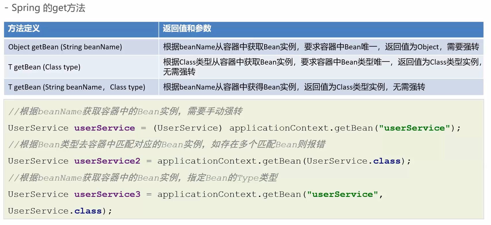
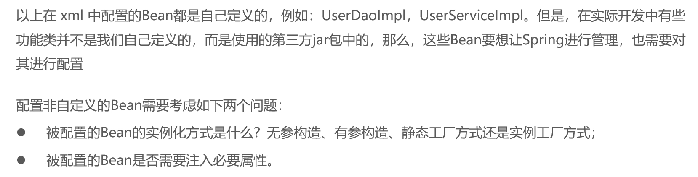
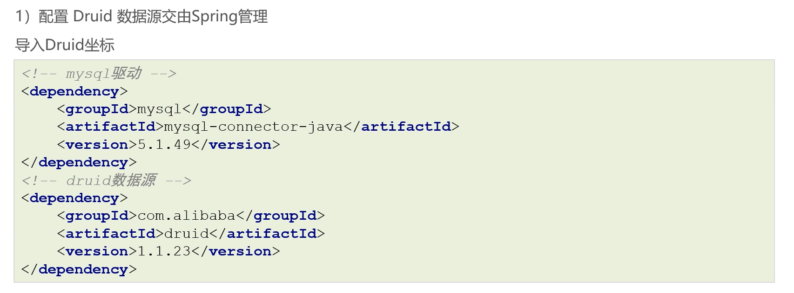
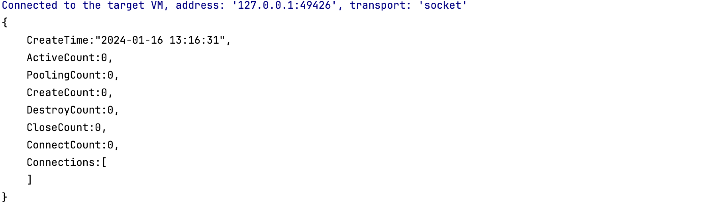
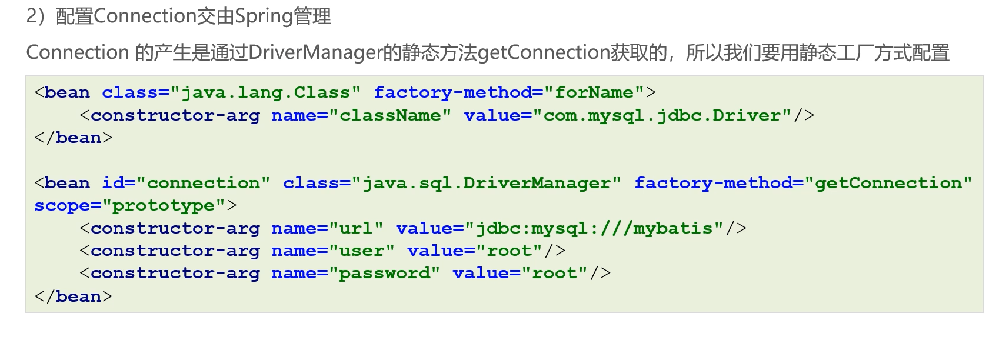
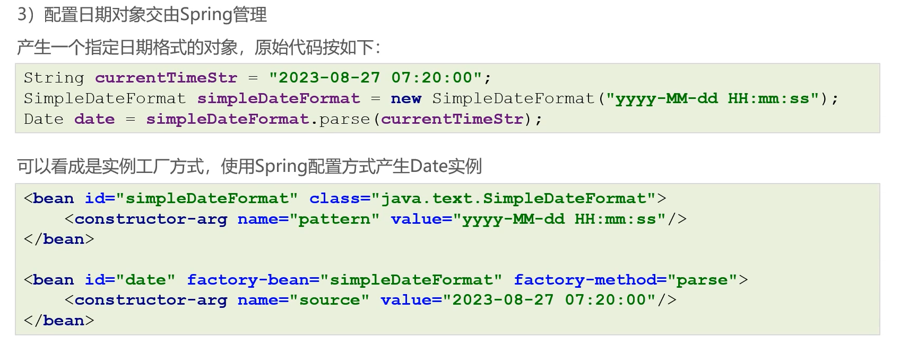
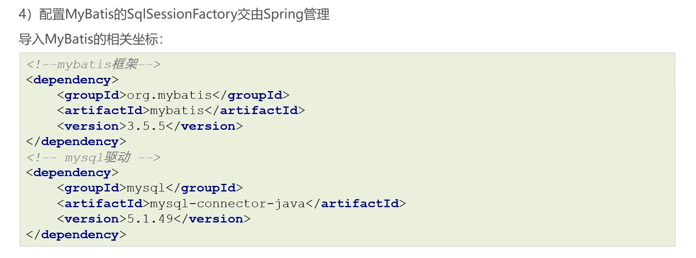

# spring--1.2.xml_应用

## Spring的get方法



## Spring配置非自定义bean



### 配置Druid



```xml
<!--配置数据源信息-->
<bean id="dataSource" class="com.alibaba.druid.pool.DruidDataSource">
    <property name="driverClassName" value="com.mysql.jdbc.Driver"></property>
    <property name="url" value="jdbc:mysql://localhost:3306/zs-cloud"></property>
    <property name="username" value="root"></property>
    <property name="password" value="password"></property>
</bean>
```

```java
@Test
public void testGteDataSource() {
    //加载spring配置文件
    ApplicationContext context = new ClassPathXmlApplicationContext("classpath:druid.xml");
    //获取配置创建的对象
    Object dataSource = context.getBean("dataSource");
    System.out.println(dataSource);
}
```



### 配置connection



### 配置日期对象



### 配置mybatis的SqlSessionFactory



```java
//静态工厂
InputStream in = Resources.getResourceAsStream("mybatis-config.xml");
//无参构造
SqlSessionFactoryBuilder builder = new SqlSessionFactoryBuilder();
//实例工厂
SqlSessionFactory sqlSessionFactory = builder.build(in);
SqlSession sqlSession = sqlSessionFactory.openSession();
System.out.println(sqlSession);
```

```xml
<bean id="in" class="org.apache.ibatis.io.Resources" factory-method="getResourceAsStream">
    <constructor-arg name="resource" value="mybatis-config.xml"/>
</bean>
<bean id="builder" class="org.apache.ibatis.session.SqlSessionFactoryBuilder"/>
<bean id="sqlSessionFactory" factory-bean="builder" factory-method="build">
    <constructor-arg name="inputStream" ref="in"/>
</bean>
```