# spring--1.3.bean实例化基本流程

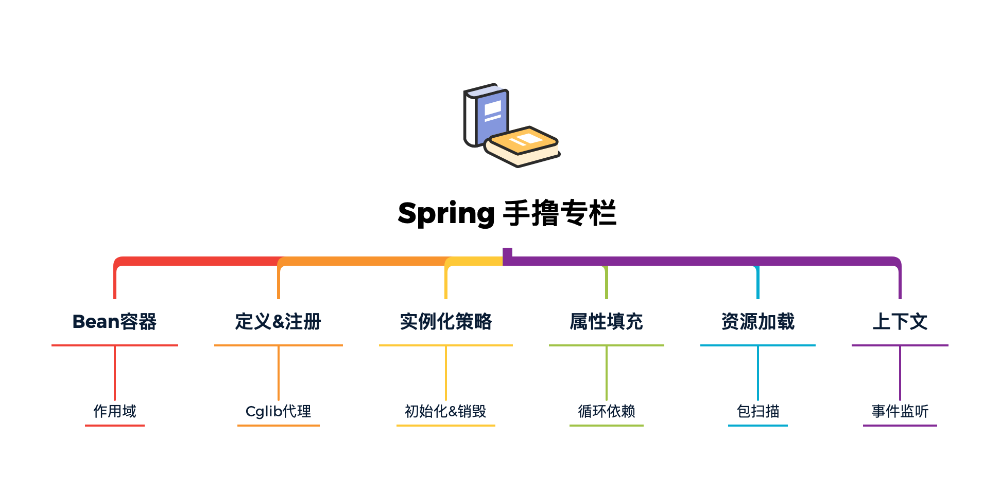


## Bean实例化的基本流程

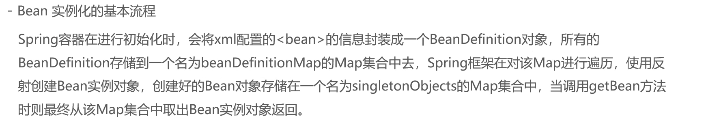

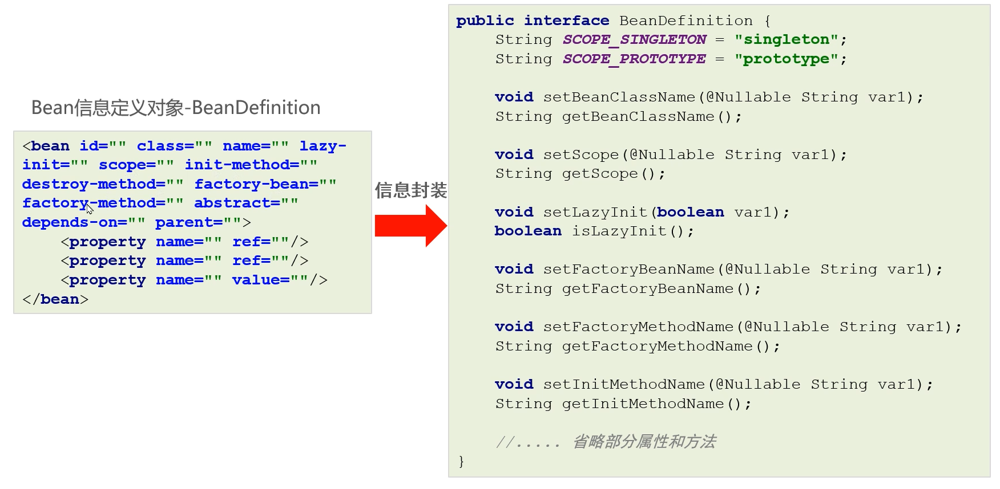

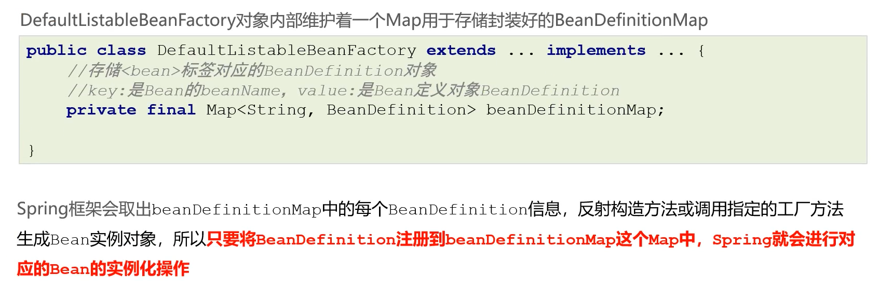

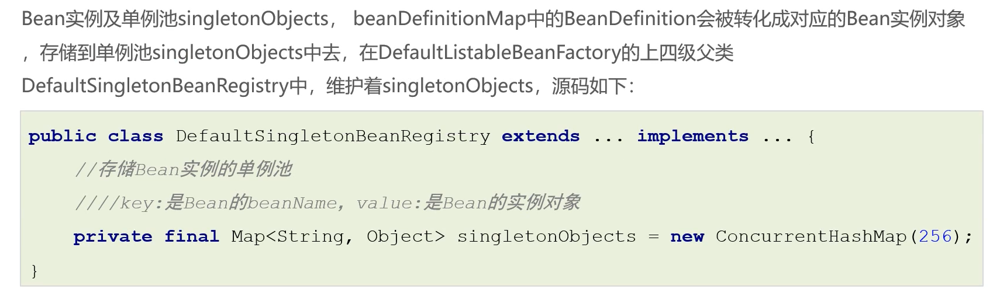

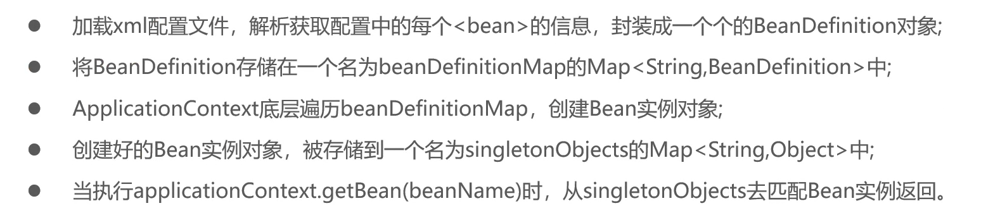

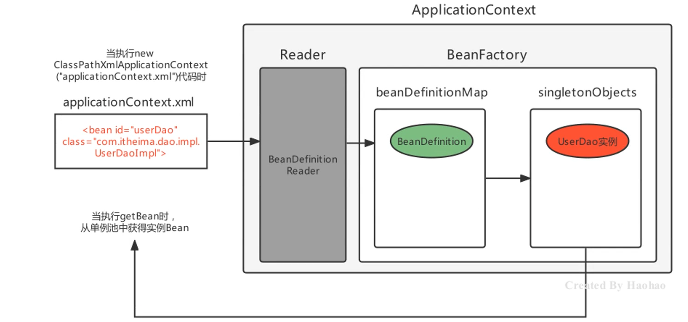

## Spring的后处理器

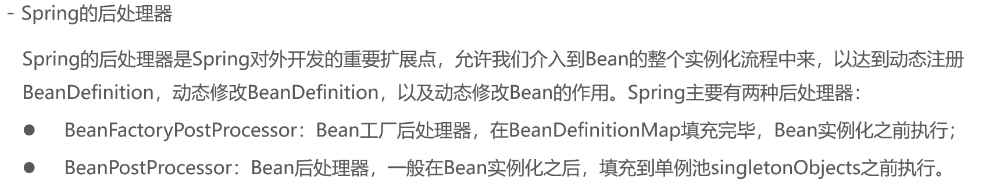

### BeanFactoryPostProcessor

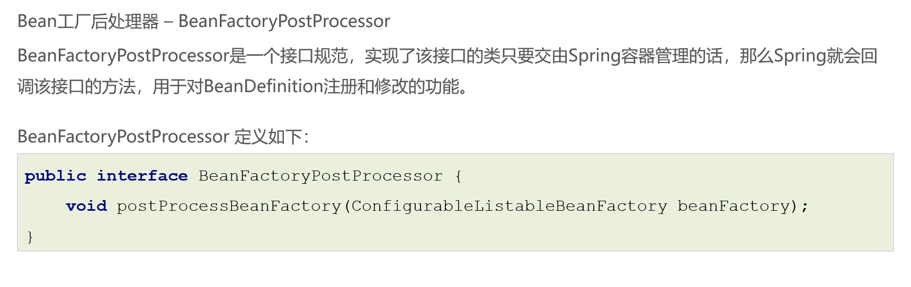

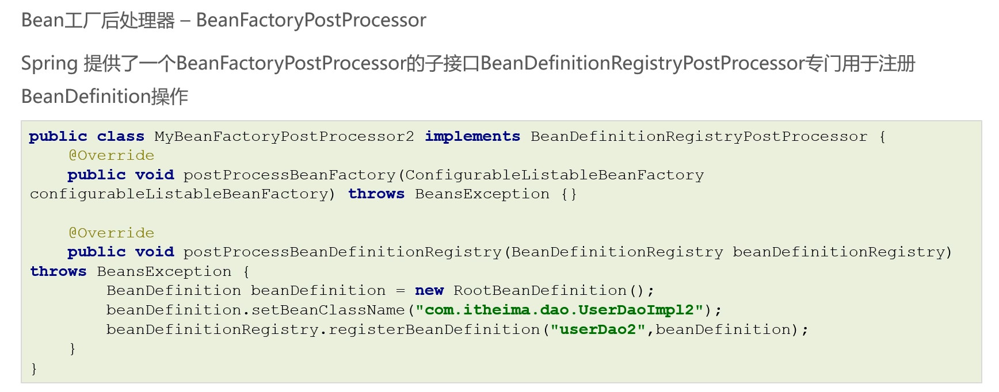


```java
public class MyBeanFactoryPostProcessor implements BeanFactoryPostProcessor {
    @Override
    public void postProcessBeanFactory(ConfigurableListableBeanFactory beanFactory) throws BeansException {
        System.out.println("MyBeanFactoryPostProcessor的postProcessBeanFactory");
        //System.out.println("beanDefinitionMap填充完毕后回调该方法");
        //注册BeanDefinition
        BeanDefinition beanDefinition = new RootBeanDefinition();
        beanDefinition.setBeanClassName("com.itheima.dao.impl.PersonDaoImpl");
        //强转成DefaultListableBeanFactory
        DefaultListableBeanFactory defaultListableBeanFactory = (DefaultListableBeanFactory) beanFactory;
        defaultListableBeanFactory.registerBeanDefinition("personDao",beanDefinition);
        //修改某个Beandifinition
        BeanDefinition beanDefinition = beanFactory.getBeanDefinition("userService");
        beanDefinition.setBeanClassName("com.itheima.dao.impl.UserDaoImpl");
    }
}
```

```java
public class MyBeanDefinitionRegistryPostProcessor implements BeanDefinitionRegistryPostProcessor {
    @Override
    public void postProcessBeanDefinitionRegistry(BeanDefinitionRegistry beanDefinitionRegistry) throws BeansException {
        System.out.println("MyBeanDefinitionRegistryPostProcessor的postProcessBeanDefinitionRegistry方法");
        //注册Beandefinition
        BeanDefinition beanDefinition = new RootBeanDefinition();
        beanDefinition.setBeanClassName("com.itheima.dao.impl.PersonDaoImpl");
        beanDefinitionRegistry.registerBeanDefinition("personDao",beanDefinition);
    }

    @Override
    public void postProcessBeanFactory(ConfigurableListableBeanFactory configurableListableBeanFactory) throws BeansException {
        System.out.println("MyBeanDefinitionRegistryPostProcessor的postProcessBeanFactory方法");
    }
}
```

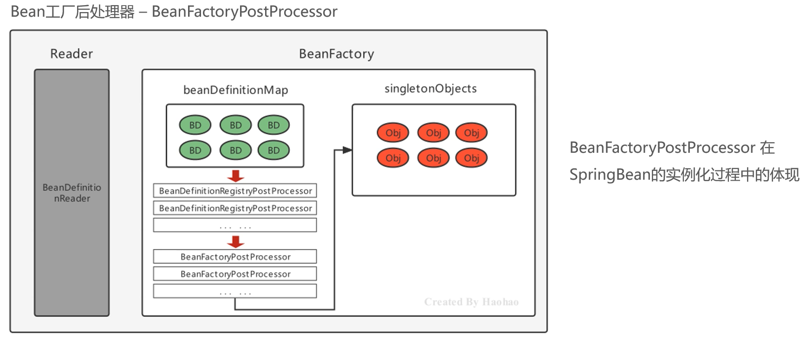

### 案例：注解扫描

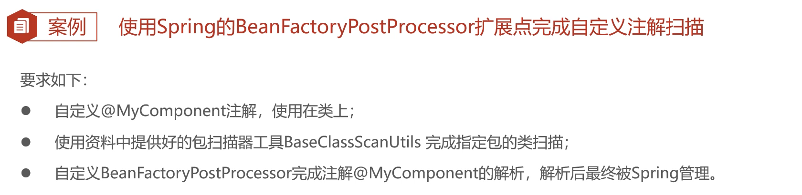

> MyComponent.java

```java
@Target(ElementType.TYPE)
@Retention(RetentionPolicy.RUNTIME)
public @interface MyComponent {

    String value();
}
```

> BaseClassScanUtils

```java
package com.itheima.utils;

import com.itheima.anno.MyComponent;
import org.springframework.core.io.Resource;
import org.springframework.core.io.support.PathMatchingResourcePatternResolver;
import org.springframework.core.io.support.ResourcePatternResolver;
import org.springframework.core.type.classreading.CachingMetadataReaderFactory;
import org.springframework.core.type.classreading.MetadataReader;
import org.springframework.core.type.classreading.MetadataReaderFactory;
import org.springframework.util.ClassUtils;

import java.lang.annotation.Annotation;
import java.util.HashMap;
import java.util.List;
import java.util.Map;

public class BaseClassScanUtils {

    //设置资源规则
    private static final String RESOURCE_PATTERN = "/**/*.class";

    public static Map<String, Class> scanMyComponentAnnotation(String basePackage) {

        //创建容器存储使用了指定注解的Bean字节码对象
        Map<String, Class> annotationClassMap = new HashMap<String, Class>();

        //spring工具类，可以获取指定路径下的全部类
        ResourcePatternResolver resourcePatternResolver = new PathMatchingResourcePatternResolver();
        try {
            String pattern = ResourcePatternResolver.CLASSPATH_ALL_URL_PREFIX +
                    ClassUtils.convertClassNameToResourcePath(basePackage) + RESOURCE_PATTERN;
            Resource[] resources = resourcePatternResolver.getResources(pattern);
            //MetadataReader 的工厂类
            MetadataReaderFactory refractory = new CachingMetadataReaderFactory(resourcePatternResolver);
            for (Resource resource : resources) {
                //用于读取类信息
                MetadataReader reader = refractory.getMetadataReader(resource);
                //扫描到的class
                String classname = reader.getClassMetadata().getClassName();
                Class<?> clazz = Class.forName(classname);
                //判断是否属于指定的注解类型
                if(clazz.isAnnotationPresent(MyComponent.class)){
                    //获得注解对象
                    MyComponent annotation = clazz.getAnnotation(MyComponent.class);
                    //获得属value属性值
                    String beanName = annotation.value();
                    //判断是否为""
                    if(beanName!=null&&!beanName.equals("")){
                        //存储到Map中去
                        annotationClassMap.put(beanName,clazz);
                        continue;
                    }

                    //如果没有为"",那就把当前类的类名作为beanName
                    annotationClassMap.put(clazz.getSimpleName(),clazz);

                }
            }
        } catch (Exception exception) {
        }

        return annotationClassMap;
    }

    public static void main(String[] args) {
        Map<String, Class> stringClassMap = scanMyComponentAnnotation("com.itheima");
        System.out.println(stringClassMap);
    }
}
```

> BeanDefinitionRegistryPostProcessor

```java
public class MyComponentBeanFactoryPostProcessor implements BeanDefinitionRegistryPostProcessor {
    @Override
    public void postProcessBeanDefinitionRegistry(BeanDefinitionRegistry beanDefinitionRegistry) throws BeansException {
        //通过扫描工具去扫描指定包及其子包下的所有类，收集使用@Mycomponent的注解的类
        Map<String, Class> myComponentAnnotationMap = BaseClassScanUtils.scanMyComponentAnnotation("com.itheima");
        //遍历Map，组装BeanDefinition进行注册
        myComponentAnnotationMap.forEach((beanName,clazz)->{
            //获得beanClassName
            String beanClassName = clazz.getName();//com.itheima.beans.OtherBean
            //创建BeanDefinition
            BeanDefinition beanDefinition = new RootBeanDefinition();
            beanDefinition.setBeanClassName(beanClassName);
            //注册
            beanDefinitionRegistry.registerBeanDefinition(beanName,beanDefinition);
        });
    }

    @Override
    public void postProcessBeanFactory(ConfigurableListableBeanFactory configurableListableBeanFactory) throws BeansException {}
}
```

### BeanPostProcessor

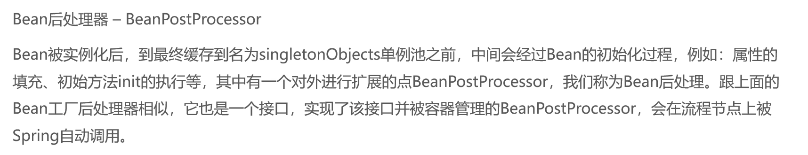

```java
package org.springframework.beans.factory.config;

import org.springframework.beans.BeansException;
import org.springframework.lang.Nullable;

public interface BeanPostProcessor {
    @Nullable
    default Object postProcessBeforeInitialization(Object bean, String beanName) throws BeansException {
        return bean;
    }

    @Nullable
    default Object postProcessAfterInitialization(Object bean, String beanName) throws BeansException {
        return bean;
    }
}
```

> 演示

```java
public class HaohaoBeanPostProcessor implements BeanPostProcessor {
    @Override
    public Object postProcessAfterInitialization(Object bean, String beanName) throws BeansException {
        System.out.println("HaohaoBeanPostProcessor执行....");
        return bean;
    }
}
```

### 案例：日志增强

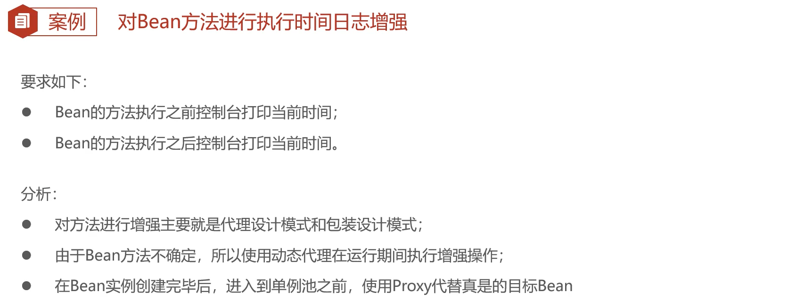

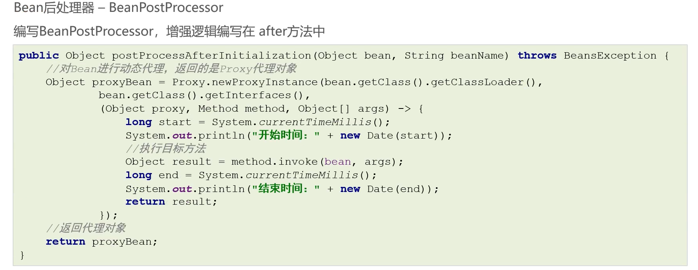


```java
package com.itheima.processor;

import org.springframework.beans.BeansException;
import org.springframework.beans.factory.config.BeanPostProcessor;

import java.lang.reflect.InvocationHandler;
import java.lang.reflect.Method;
import java.lang.reflect.Proxy;
import java.util.Date;

public class TimeLogBeanPostProcessor implements BeanPostProcessor {

    @Override
    public Object postProcessAfterInitialization(Object bean, String beanName) throws BeansException {

        //使用动态代理对目标Bean进行增强，返回proxy对象，进而存储到单例池singletonObjects中
        Object beanProxy = Proxy.newProxyInstance(
                bean.getClass().getClassLoader(),
                bean.getClass().getInterfaces(),
                (proxy, method, args) -> {
                    //1、输出开始时间
                    System.out.println("方法：" + method.getName() + "-开始时间：" + new Date());
                    //2、执行目标方法
                    Object result = method.invoke(bean, args);
                    //3、输出结束时间
                    System.out.println("方法：" + method.getName() + "-结束时间：" + new Date());

                    return result;
                }
        );
        return beanProxy;
    }
}
```

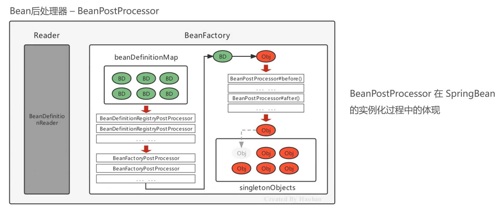

## Spring Bean的生命周期

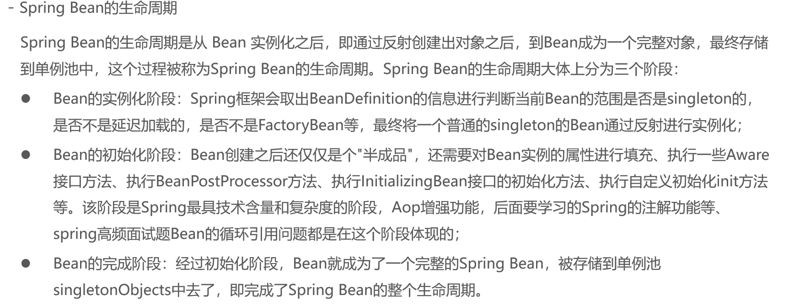


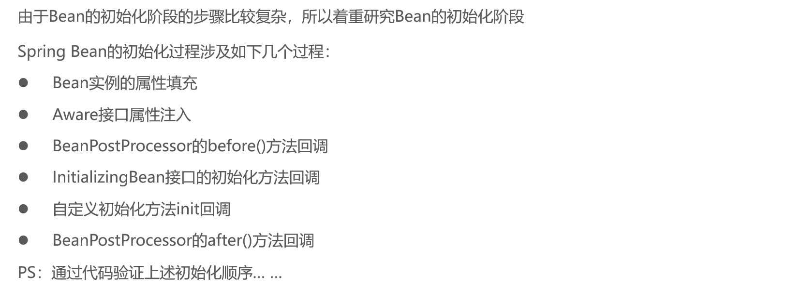

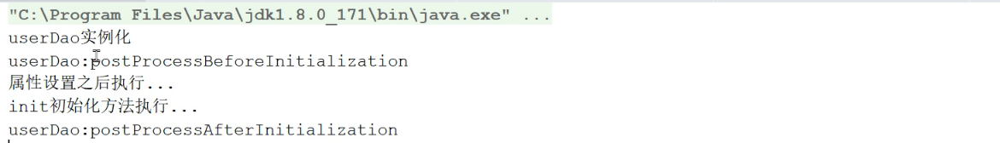

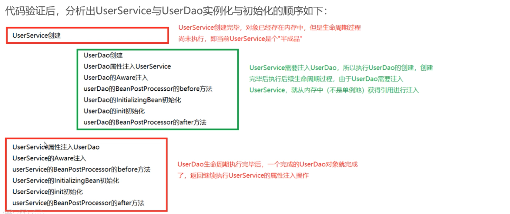

### 实例属性填充

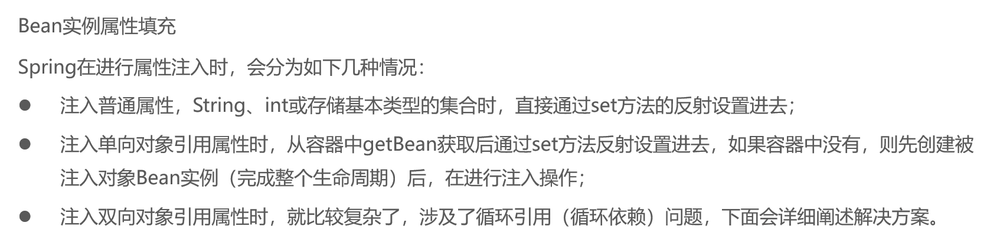


### 循环引用

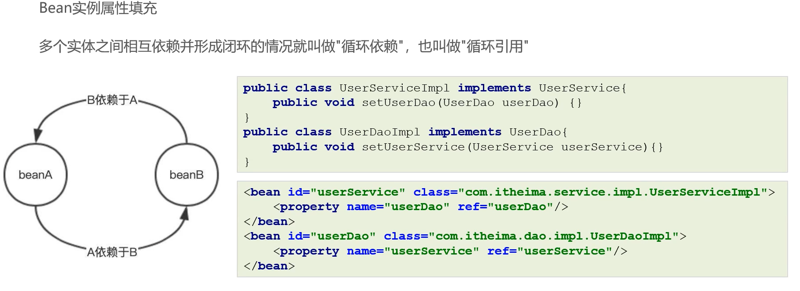

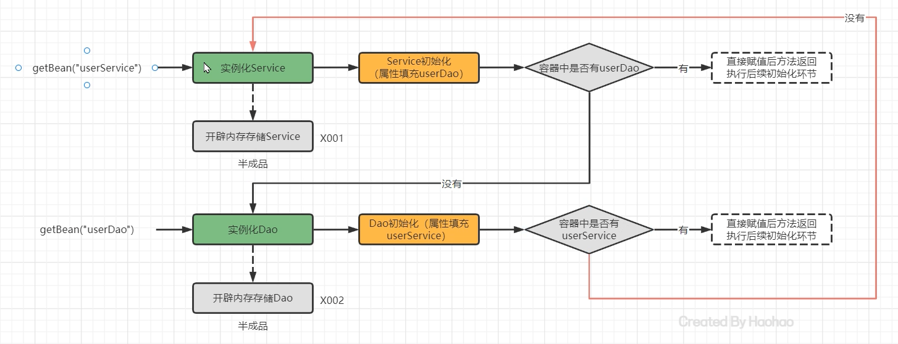

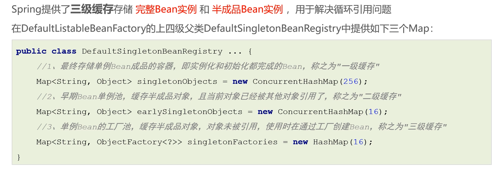

```java
@FunctionalInterface
public interface ObjectFactory<T> {
    T getObject() throws BeansException;
}
```

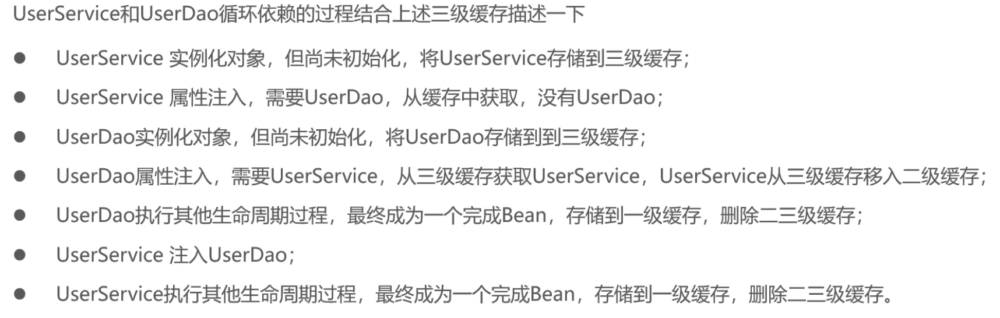

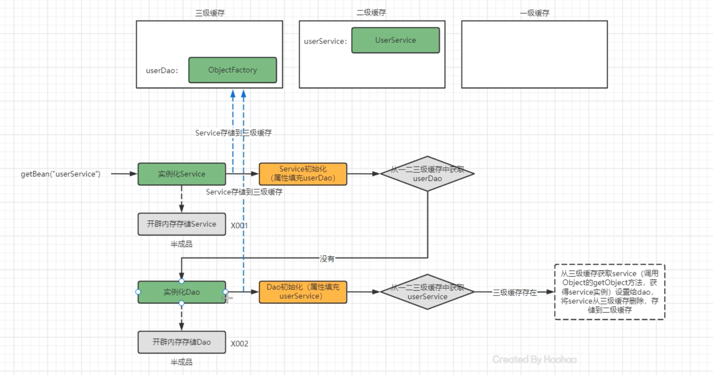


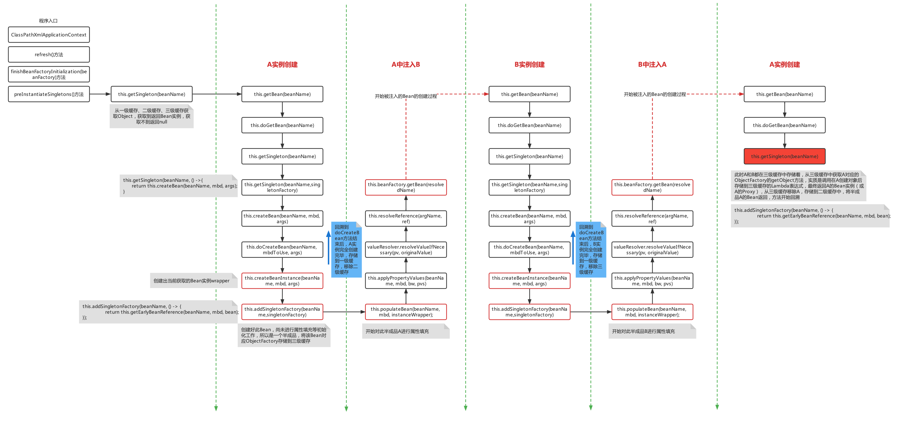


## aware接口

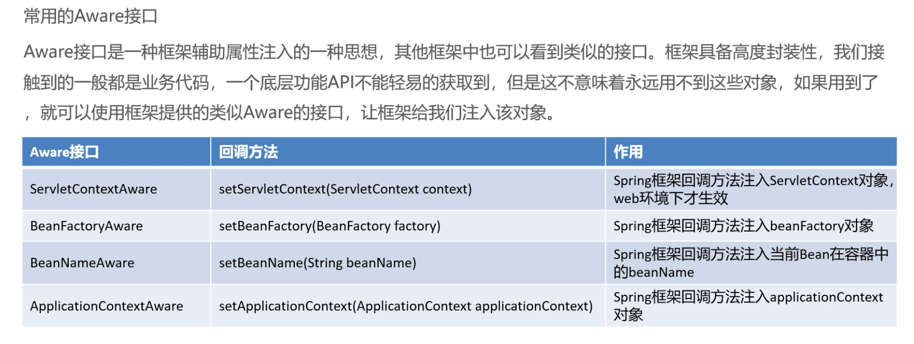

## Spring IOC整体流程总结

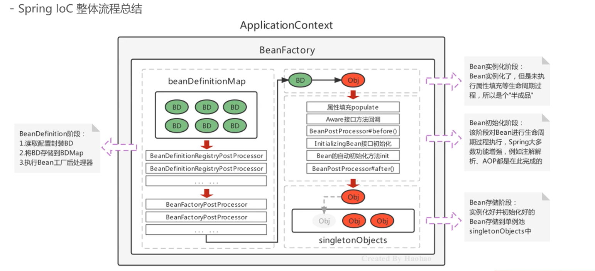

