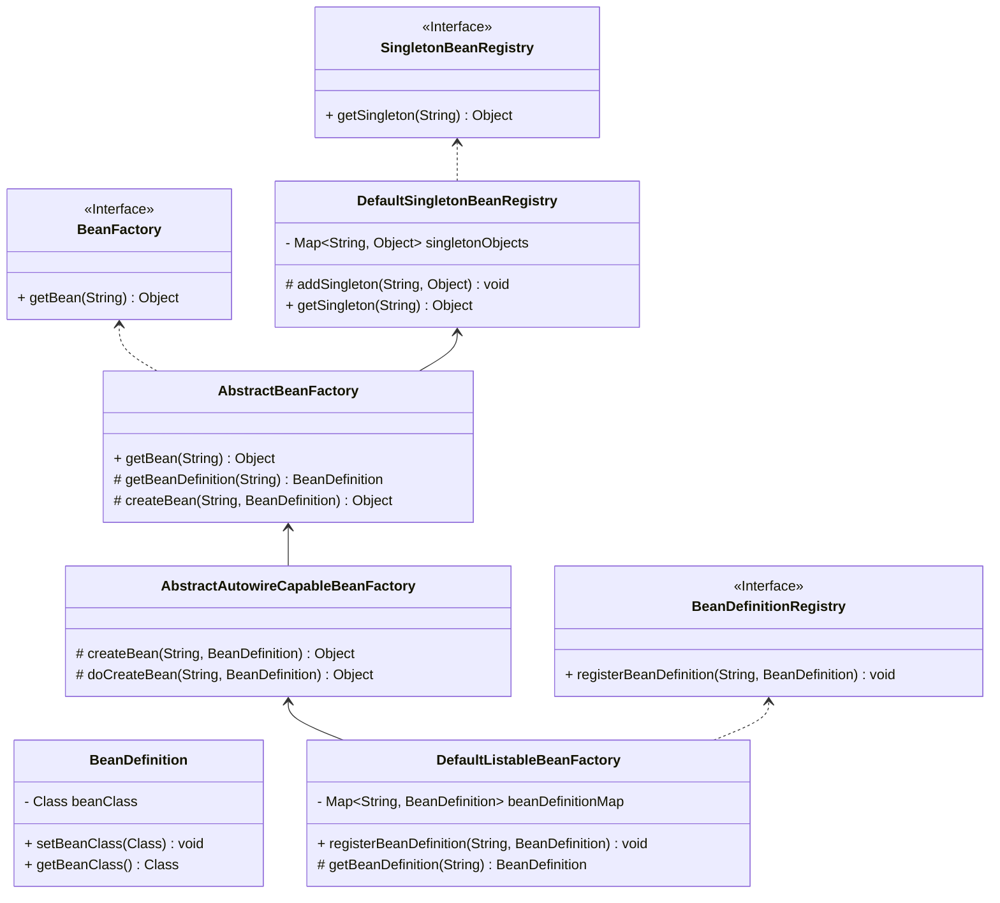
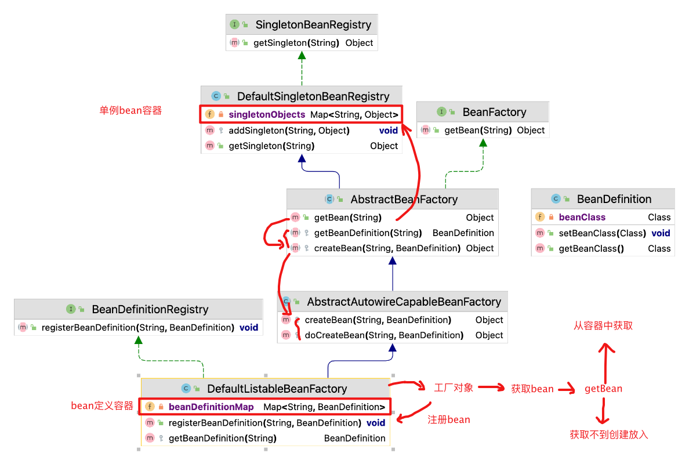
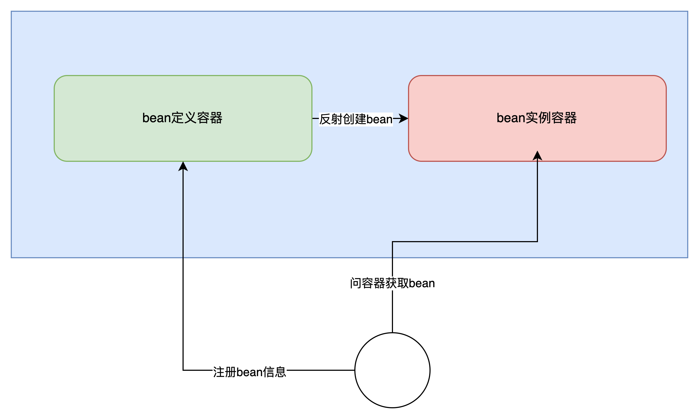

# spring--6.2.ioc-定义池和单例池

核心思想：

- bean的定义池中存放bean的 class信息用于反射创建bean

- bean单例池中存放创建完成的对象，可直接获取使用

- 如果单例池中不存在，则通过反射创建，并放入单例池中







## 设计

鉴于本章节的案例目标，我们需要将 Spring Bean 容器完善起来，首先非常重要的一点是在 Bean 注册的时候只注册一个类信息，而不会直接把实例化信息注册到 Spring 容器中。那么就需要修改 BeanDefinition 中的属性 Object 为 Class，接下来在需要做的就是在获取 Bean 对象时需要处理 Bean 对象的实例化操作以及判断当前单例对象在容器中是否已经缓存起来了。



- 首先我们需要定义 BeanFactory 这样一个 Bean 工厂，提供 Bean 的获取方法 `getBean(String name)`，之后这个 Bean 工厂接口由抽象类 AbstractBeanFactory 实现。这样使用[模板模式 (opens new window)](https://bugstack.cn/itstack-demo-design/2020/07/07/重学-Java-设计模式-实战模板模式.html)的设计方式，可以统一收口通用核心方法的调用逻辑和标准定义，也就很好的控制了后续的实现者不用关心调用逻辑，按照统一方式执行。那么类的继承者只需要关心具体方法的逻辑实现即可。
- 那么在继承抽象类 AbstractBeanFactory 后的 AbstractAutowireCapableBeanFactory 就可以实现相应的抽象方法了，因为 AbstractAutowireCapableBeanFactory 本身也是一个抽象类，所以它只会实现属于自己的抽象方法，其他抽象方法由继承 AbstractAutowireCapableBeanFactory 的类实现。这里就体现了类实现过程中的各司其职，你只需要关心属于你的内容，不是你的内容，不要参与。*这一部分内容我们会在代码里有具体的体现*
- 另外这里还有块非常重要的知识点，就是关于单例 SingletonBeanRegistry 的接口定义实现，而 DefaultSingletonBeanRegistry 对接口实现后，会被抽象类 AbstractBeanFactory 继承。现在 AbstractBeanFactory 就是一个非常完整且强大的抽象类了，也能非常好的体现出它对模板模式的抽象定义。*接下来我们就带着这些设计层面的思考，去看代码的具体实现结果*

```
.
├── pom.xml
└── src
    ├── main
    │   ├── java
    │   │   └── org
    │   │       └── springframework
    │   │           └── beans
    │   │               ├── BeansException.java
    │   │               └── factory
    │   │                   ├── BeanFactory.java
    │   │                   ├── config
    │   │                   │   ├── BeanDefinition.java
    │   │                   │   └── SingletonBeanRegistry.java
    │   │                   └── support
    │   │                       ├── AbstractAutowireCapableBeanFactory.java
    │   │                       ├── AbstractBeanFactory.java
    │   │                       ├── BeanDefinitionRegistry.java
    │   │                       ├── DefaultListableBeanFactory.java
    │   │                       └── DefaultSingletonBeanRegistry.java
    │   └── resources
    └── test
        └── java
            └── org
                └── springframework
                    └── test
                        └── ioc
                            ├── BeanDefinitionAndBeanDefinitionRegistryTest.java
                            └── HelloService.java

```

虽然这一章节关于 Spring Bean 容器的功能实现与 `Spring 源码`中还有不少的差距，但以目前实现结果的类关系图来看，其实已经具备了一定的设计复杂性，这些复杂的类关系设计在各个接口定义和实现以及在抽象类继承中都有所体现，例如：

- BeanFactory 的定义由 AbstractBeanFactory 抽象类实现接口的 getBean 方法
- 而 AbstractBeanFactory 又继承了实现了 SingletonBeanRegistry 的DefaultSingletonBeanRegistry 类。这样 AbstractBeanFactory 抽象类就具备了单例 Bean 的注册功能。
- AbstractBeanFactory 中又定义了两个抽象方法：getBeanDefinition(String beanName)、createBean(String beanName, BeanDefinition beanDefinition) ，而这两个抽象方法分别由 DefaultListableBeanFactory、AbstractAutowireCapableBeanFactory 实现。
- 最终 DefaultListableBeanFactory 还会继承抽象类 AbstractAutowireCapableBeanFactory 也就可以调用抽象类中的 createBean 方法了。

综上这一部分的类关系和实现过程还是会有一些复杂的，因为所有的实现都以职责划分、共性分离以及调用关系定义为标准搭建的类关系。*这部分内容的学习，可能会丰富你在复杂业务系统开发中的设计思路。*

### BeanDefinition 定义

- 在 Bean 定义类中已经把上一章节中的 Object bean 替换为 Class，这样就可以把 Bean 的实例化操作放到容器中处理了。*如果你有仔细阅读过上一章并做了相应的测试，那么你会发现 Bean 的实例化操作是放在初始化调用阶段传递给 BeanDefinition 构造函数的。*

### 单例注册接口定义和实现

- 这个类比较简单主要是定义了一个获取单例对象的接口。
- 在 DefaultSingletonBeanRegistry 中主要实现 getSingleton 方法，同时实现了一个受保护的 addSingleton 方法，这个方法可以被继承此类的其他类调用。包括：AbstractBeanFactory 以及继承的 DefaultListableBeanFactory 调用。

### 抽象类定义模板方法(AbstractBeanFactory)

- AbstractBeanFactory 首先继承了 DefaultSingletonBeanRegistry，也就具备了使用单例注册类方法。
- 接下来很重要的一点是关于接口 BeanFactory 的实现，在方法 getBean 的实现过程中可以看到，主要是对单例 Bean 对象的获取以及在获取不到时需要拿到 Bean 的定义做相应 Bean 实例化操作。那么 getBean 并没有自身的去实现这些方法，而是只定义了调用过程以及提供了抽象方法，由实现此抽象类的其他类做相应实现。
- 后续继承抽象类 AbstractBeanFactory 的类有两个，包括：AbstractAutowireCapableBeanFactory、DefaultListableBeanFactory，这两个类分别做了相应的实现处理，接着往下看。

### 实例化Bean类(AbstractAutowireCapableBeanFactory)

- 在 AbstractAutowireCapableBeanFactory 类中实现了 Bean 的实例化操作 `newInstance`，其实这块会埋下一个坑，有构造函数入参的对象怎么处理？*可以提前思考*
- 在处理完 Bean 对象的实例化后，直接调用 `addSingleton` 方法存放到单例对象的缓存中去。

### 核心类实现(DefaultListableBeanFactory)

- DefaultListableBeanFactory 在 Spring 源码中也是一个非常核心的类，在我们目前的实现中也是逐步贴近于源码，与源码类名保持一致。
- DefaultListableBeanFactory 继承了 AbstractAutowireCapableBeanFactory 类，也就具备了接口 BeanFactory 和 AbstractBeanFactory 等一连串的功能实现。*所以有时候你会看到一些类的强转，调用某些方法，也是因为你强转的类实现接口或继承了某些类。*
- 除此之外这个类还实现了接口 BeanDefinitionRegistry 中的 registerBeanDefinition(String beanName, BeanDefinition beanDefinition) 方法，当然你还会看到一个 getBeanDefinition 的实现，这个方法我们文中提到过它是抽象类 AbstractBeanFactory 中定义的抽象方法。*现在注册Bean定义与获取Bean定义就可以同时使用了，是不感觉这个套路还蛮深的。接口定义了注册，抽象类定义了获取，都集中在 DefaultListableBeanFactory 中的 beanDefinitionMap 里*

## 总结

- 相对于前一章节对 Spring Bean 容器的简单概念实现，本章节中加强了功能的完善。在实现的过程中也可以看到类的关系变得越来越多了，如果没有做过一些稍微复杂的系统类系统，那么即使现在这样9个类搭出来的容器工厂也可以给你绕晕。
- 在 Spring Bean 容器的实现类中要重点关注类之间的职责和关系，几乎所有的程序功能设计都离不开接口、抽象类、实现、继承，而这些不同特性类的使用就可以非常好的隔离开类的功能职责和作用范围。而这样的知识点也是在学习手写 Spring Bean 容器框架过程非常重要的知识。
- 最后要强调一下关于整个系列内容的学习，可能在学习的过程中会遇到像第二章节那样非常简单的代码实现，但要做一个有成长的程序员要记住代码实现只是最后的落地结果，而那些设计上的思考才是最有价值的地方。*就像你是否遇到过，有人让你给一个内容做个描述、文档、说明，你总觉得太简单了没什么可写的，即使要动笔写了也不知道要从哪开始！其实这些知识内容都来源你对整体功能的理解，这就不只是代码开发还包括了需求目标、方案设计、技术实现、逻辑验证等等过程性的内容。所以，不要只是被看似简单的内容忽略了整体全局观，要学会放开视野，开放学习视角。*