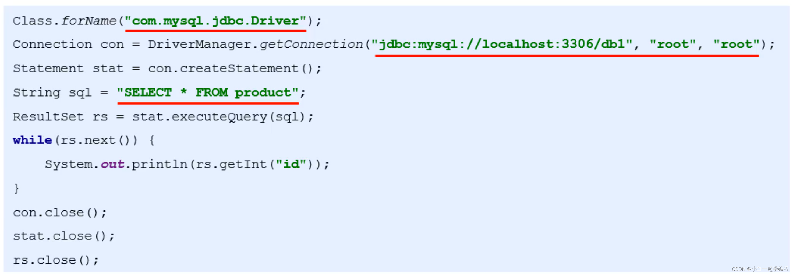
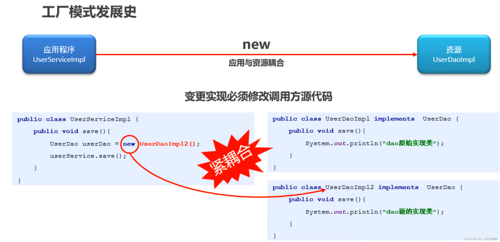
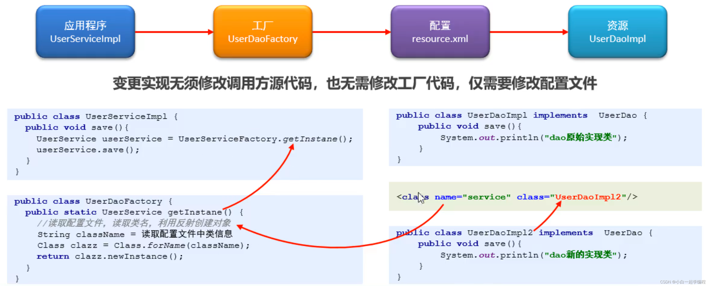

# 概述--01.spring是什么

代码位置：/Volumes/zs-2T/zs-study/zs-ee-框架/spring/资料/code/spring_入门案例/spring-rumeng01

## 思想


## Spring诞生


Spring框架是一个开源的轻量级JAVA EE应用程序框架，用于管理应用程序的生命周期。

Spring框架的核心概念包括控制反转（IOC）和面向切面编程（AOP）。

Spring框架具有方便解耦、简化开发等特点。

Spring框架还提供了其他功能，如事务管理、持久层框架等。


（1）控制反转，把对象创建和对象之间的调用过程，交给spring进行管理

（2）使用IOC目的：降低耦合度

（3）入门案例IoC实现

xml解析、工厂模式、反射









## 快速入门--ioc


> pom.xml

```xml
<dependency>
    <groupId>org.springframework</groupId>
    <artifactId>spring-context</artifactId>
    <version>${spring-framework.version}</version>
</dependency>
```

> TestGetBean.java

```java
@Test
public void testGetBean1() {
    DefaultListableBeanFactory beanFactory = new DefaultListableBeanFactory();
    XmlBeanDefinitionReader reader = new XmlBeanDefinitionReader(beanFactory);
    reader.loadBeanDefinitions("bean1.xml");

    User user = beanFactory.getBean("user", User.class);
    System.out.println(user);
    user.add();
}
```

> User.java

```java
public class User {
    public void add(){
        System.out.println("add...");
    }
}
```

> bean1.xml

```xml
<?xml version="1.0" encoding="UTF-8"?>
<beans xmlns:xsi="http://www.w3.org/2001/XMLSchema-instance"
       xmlns="http://www.springframework.org/schema/beans"
       xsi:schemaLocation="http://www.springframework.org/schema/beans http://www.springframework.org/schema/beans/spring-beans.xsd">

    <!-- spring security  -->
    <bean id="user" class="com.zs.spring.User"></bean>

</beans>
```


## 快速入门--DI

> UserDaoImpl.java

```java
package com.zs.spring.dao.impl;


import com.zs.spring.dao.UserDao;
import com.zs.spring.service.UserService;

public class UserDaoImpl implements UserDao {

    private UserService userService;

    public void setUserService(UserService userService) {
        this.userService = userService;
    }

    @Override
    public void show() {
        System.out.println("show....");
    }
}

```


> UserServiceImpl.java

```java
package com.zs.spring.service.impl;


import com.zs.spring.dao.UserDao;
import com.zs.spring.service.UserService;


public class UserServiceImpl implements UserService {

    private UserDao userDao;

    public void setUserDao(UserDao userDao) {
        System.out.println("测试DI。。。。创建UserService对象时" + userDao + "被注入进来");
        this.userDao = userDao;
    }

    @Override
    public void show() {

    }
}

```

> beans.xml

```xml
<?xml version="1.0" encoding="UTF-8"?>
<beans xmlns="http://www.springframework.org/schema/beans"
       xmlns:xsi="http://www.w3.org/2001/XMLSchema-instance"
       xsi:schemaLocation="http://www.springframework.org/schema/beans http://www.springframework.org/schema/beans/spring-beans.xsd">

    <!--配置UserServiceImpl-->
    <bean id="userService" class="com.zs.spring.service.impl.UserServiceImpl">
        <property name="userDao" ref="userDao"></property>
    </bean>

    <!--配置UserDaoImpl-->
    <bean id="userDao" class="com.zs.spring.dao.impl.UserDaoImpl"></bean>
</beans>

```

> test

```java
@Test
public void testSpringDI() {
    DefaultListableBeanFactory beanFactory = new DefaultListableBeanFactory();
    XmlBeanDefinitionReader reader = new XmlBeanDefinitionReader(beanFactory);
    reader.loadBeanDefinitions("beans.xml");

    UserService userService = beanFactory.getBean("userService", UserService.class);
    System.out.println(userService);
    userService.show();
}
```


## 快速入门--ApplicationContext


## BeanFactory与ApplicationContext的关系 


## Beanfactory的继承体系


## ApplicationContext的继承体系


