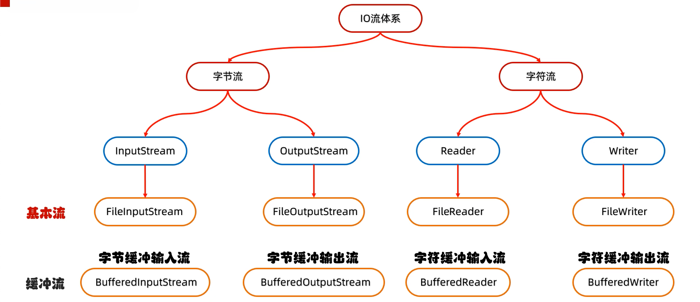
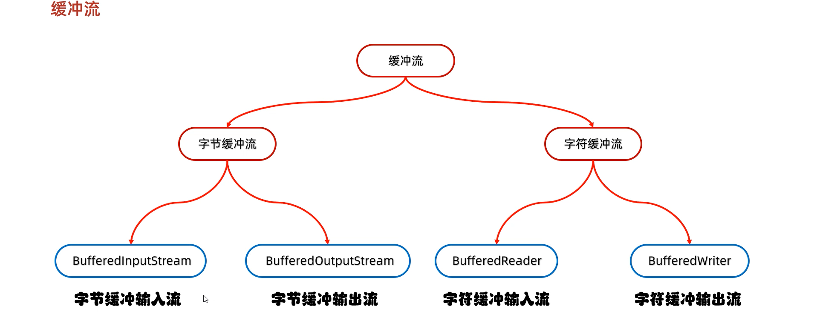
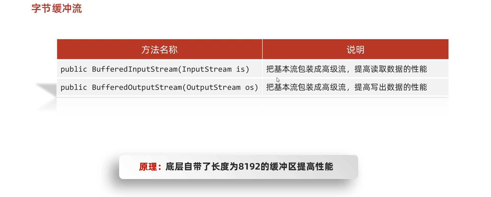
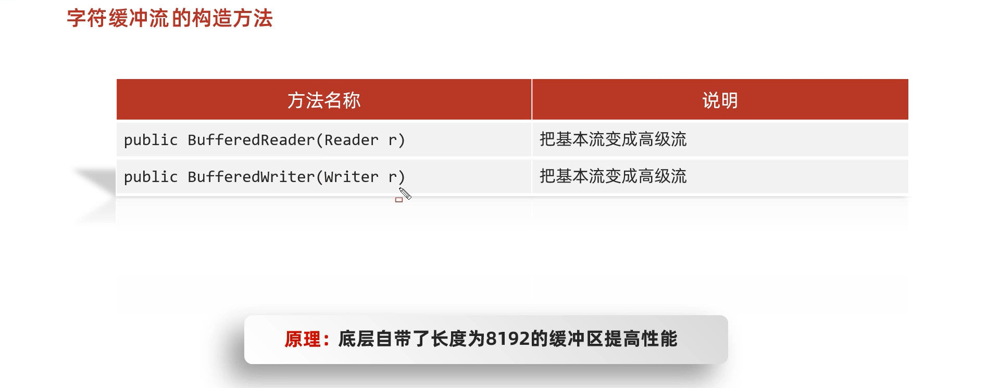
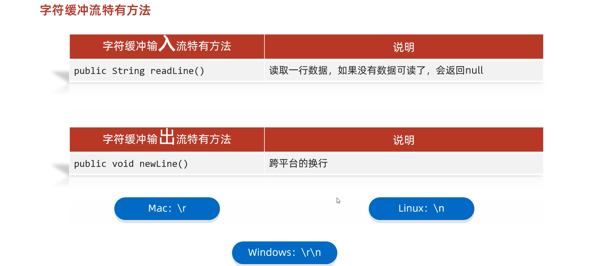

# 1. 缓冲流


昨天学习了基本的一些流，作为IO流的入门，今天我们要见识一些更强大的流。比如能够高效读写的缓冲流，能够转换编码的转换流，能够持久化存储对象的序列化流等等。这些功能更为强大的流，都是在基本的流对象基础之上创建而来的，就像穿上铠甲的武士一样，相当于是对基本流对象的一种增强。

## 1.1 概述

缓冲流,也叫高效流，是对4个基本的`FileXxx` 流的增强，所以也是4个流，按照数据类型分类：

* **字节缓冲流**：`BufferedInputStream`，`BufferedOutputStream` 
* **字符缓冲流**：`BufferedReader`，`BufferedWriter`

缓冲流的基本原理，是在创建流对象时，会创建一个内置的默认大小的缓冲区数组，通过缓冲区读写，减少系统IO次数，从而提高读写的效率。

## 1.2 字节缓冲流



### 构造方法

* `public BufferedInputStream(InputStream in)` ：创建一个 新的缓冲输入流。 
* `public BufferedOutputStream(OutputStream out)`： 创建一个新的缓冲输出流。

构造举例，代码如下：

```java
// 创建字节缓冲输入流
BufferedInputStream bis = new BufferedInputStream(new FileInputStream("bis.txt"));
// 创建字节缓冲输出流
BufferedOutputStream bos = new BufferedOutputStream(new FileOutputStream("bos.txt"));
```

### 效率测试

查询API，缓冲流读写方法与基本的流是一致的，我们通过复制大文件（375MB），测试它的效率。

1. 基本流，代码如下：

```java
public class BufferedDemo {
    public static void main(String[] args) throws FileNotFoundException {
        // 记录开始时间
      	long start = System.currentTimeMillis();
		// 创建流对象
        try (
        	FileInputStream fis = new FileInputStream("jdk9.exe");
        	FileOutputStream fos = new FileOutputStream("copy.exe")
        ){
        	// 读写数据
            int b;
            while ((b = fis.read()) != -1) {
                fos.write(b);
            }
        } catch (IOException e) {
            e.printStackTrace();
        }
		// 记录结束时间
        long end = System.currentTimeMillis();
        System.out.println("普通流复制时间:"+(end - start)+" 毫秒");
    }
}

十几分钟过去了...
```

2. 缓冲流，代码如下：

```java
public class BufferedDemo {
    public static void main(String[] args) throws FileNotFoundException {
        // 记录开始时间
      	long start = System.currentTimeMillis();
		// 创建流对象
        try (
        	BufferedInputStream bis = new BufferedInputStream(new FileInputStream("jdk9.exe"));
	     BufferedOutputStream bos = new BufferedOutputStream(new FileOutputStream("copy.exe"));
        ){
        // 读写数据
            int b;
            while ((b = bis.read()) != -1) {
                bos.write(b);
            }
        } catch (IOException e) {
            e.printStackTrace();
        }
		// 记录结束时间
        long end = System.currentTimeMillis();
        System.out.println("缓冲流复制时间:"+(end - start)+" 毫秒");
    }
}

缓冲流复制时间:8016 毫秒
```
如何更快呢？

使用数组的方式，代码如下：

```java
public class BufferedDemo {
    public static void main(String[] args) throws FileNotFoundException {
      	// 记录开始时间
        long start = System.currentTimeMillis();
		// 创建流对象
        try (
			BufferedInputStream bis = new BufferedInputStream(new FileInputStream("jdk9.exe"));
		 BufferedOutputStream bos = new BufferedOutputStream(new FileOutputStream("copy.exe"));
        ){
          	// 读写数据
            int len;
            byte[] bytes = new byte[8*1024];
            while ((len = bis.read(bytes)) != -1) {
                bos.write(bytes, 0 , len);
            }
        } catch (IOException e) {
            e.printStackTrace();
        }
		// 记录结束时间
        long end = System.currentTimeMillis();
        System.out.println("缓冲流使用数组复制时间:"+(end - start)+" 毫秒");
    }
}
缓冲流使用数组复制时间:666 毫秒
```

## 1.3 字符缓冲流





### 构造方法

* `public BufferedReader(Reader in)` ：创建一个 新的缓冲输入流。 
* `public BufferedWriter(Writer out)`： 创建一个新的缓冲输出流。

构造举例，代码如下：

```java
// 创建字符缓冲输入流
BufferedReader br = new BufferedReader(new FileReader("br.txt"));
// 创建字符缓冲输出流
BufferedWriter bw = new BufferedWriter(new FileWriter("bw.txt"));
```

### 特有方法

字符缓冲流的基本方法与普通字符流调用方式一致，不再阐述，我们来看它们具备的特有方法。

* BufferedReader：`public String readLine()`: 读一行文字。 
* BufferedWriter：`public void newLine()`: 写一行行分隔符,由系统属性定义符号。 

`readLine`方法演示，代码如下：

```java
public class BufferedReaderDemo {
    public static void main(String[] args) throws IOException {
      	 // 创建流对象
        BufferedReader br = new BufferedReader(new FileReader("in.txt"));
		// 定义字符串,保存读取的一行文字
        String line  = null;
      	// 循环读取,读取到最后返回null
        while ((line = br.readLine())!=null) {
            System.out.print(line);
            System.out.println("------");
        }
		// 释放资源
        br.close();
    }
}
```

`newLine`方法演示，代码如下：

  ```java
public class BufferedWriterDemo throws IOException {
    public static void main(String[] args) throws IOException  {
      	// 创建流对象
		BufferedWriter bw = new BufferedWriter(new FileWriter("out.txt"));
      	// 写出数据
        bw.write("黑马");
      	// 写出换行
        bw.newLine();
        bw.write("程序");
        bw.newLine();
        bw.write("员");
        bw.newLine();
		// 释放资源
        bw.close();
    }
}
输出效果:
黑马
程序
员
  ```

## 1.4 练习:文本排序

请将文本信息恢复顺序。

```
3.侍中、侍郎郭攸之、费祎、董允等，此皆良实，志虑忠纯，是以先帝简拔以遗陛下。愚以为宫中之事，事无大小，悉以咨之，然后施行，必得裨补阙漏，有所广益。
8.愿陛下托臣以讨贼兴复之效，不效，则治臣之罪，以告先帝之灵。若无兴德之言，则责攸之、祎、允等之慢，以彰其咎；陛下亦宜自谋，以咨诹善道，察纳雅言，深追先帝遗诏，臣不胜受恩感激。
4.将军向宠，性行淑均，晓畅军事，试用之于昔日，先帝称之曰能，是以众议举宠为督。愚以为营中之事，悉以咨之，必能使行阵和睦，优劣得所。
2.宫中府中，俱为一体，陟罚臧否，不宜异同。若有作奸犯科及为忠善者，宜付有司论其刑赏，以昭陛下平明之理，不宜偏私，使内外异法也。
1.先帝创业未半而中道崩殂，今天下三分，益州疲弊，此诚危急存亡之秋也。然侍卫之臣不懈于内，忠志之士忘身于外者，盖追先帝之殊遇，欲报之于陛下也。诚宜开张圣听，以光先帝遗德，恢弘志士之气，不宜妄自菲薄，引喻失义，以塞忠谏之路也。
9.今当远离，临表涕零，不知所言。
6.臣本布衣，躬耕于南阳，苟全性命于乱世，不求闻达于诸侯。先帝不以臣卑鄙，猥自枉屈，三顾臣于草庐之中，咨臣以当世之事，由是感激，遂许先帝以驱驰。后值倾覆，受任于败军之际，奉命于危难之间，尔来二十有一年矣。
7.先帝知臣谨慎，故临崩寄臣以大事也。受命以来，夙夜忧叹，恐付托不效，以伤先帝之明，故五月渡泸，深入不毛。今南方已定，兵甲已足，当奖率三军，北定中原，庶竭驽钝，攘除奸凶，兴复汉室，还于旧都。此臣所以报先帝而忠陛下之职分也。至于斟酌损益，进尽忠言，则攸之、祎、允之任也。
5.亲贤臣，远小人，此先汉所以兴隆也；亲小人，远贤臣，此后汉所以倾颓也。先帝在时，每与臣论此事，未尝不叹息痛恨于桓、灵也。侍中、尚书、长史、参军，此悉贞良死节之臣，愿陛下亲之信之，则汉室之隆，可计日而待也。
```

### 案例分析

1. 逐行读取文本信息。
2. 把读取到的文本存储到集合中
3. 对集合中的文本进行排序
4. 遍历集合，按顺序，写出文本信息。

### 案例实现

```java
public class Demo05Test {
    public static void main(String[] args) throws IOException {
        //1.创建ArrayList集合,泛型使用String
        ArrayList<String> list = new ArrayList<>();
        //2.创建BufferedReader对象,构造方法中传递FileReader对象
        BufferedReader br = new BufferedReader(new FileReader("10_IO\\in.txt"));
        //3.创建BufferedWriter对象,构造方法中传递FileWriter对象
        BufferedWriter bw = new BufferedWriter(new FileWriter("10_IO\\out.txt"));
        //4.使用BufferedReader对象中的方法readLine,以行的方式读取文本
        String line;
        while((line = br.readLine())!=null){
            //5.把读取到的文本存储到ArrayList集合中
            list.add(line);
        }
        //6.使用Collections集合工具类中的方法sort,对集合中的元素按照自定义规则排序
        Collections.sort(list, new Comparator<String>() {
            /*
                o1-o2:升序
                o2-o1:降序
             */
            @Override
            public int compare(String o1, String o2) {
                //依次比较集合中两个元素的首字母,升序排序
                return o1.charAt(0)-o2.charAt(0);
            }
        });
        //7.遍历ArrayList集合,获取每一个元素
        for (String s : list) {
            //8.使用BufferedWriter对象中的方法wirte,把遍历得到的元素写入到文本中(内存缓冲区中)
            bw.write(s);
            //9.写换行
            bw.newLine();
        }
        //10.释放资源
        bw.close();
        br.close();
    }
}
```

