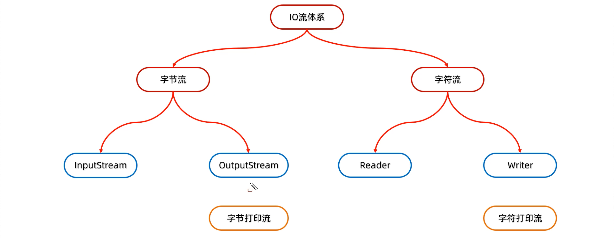
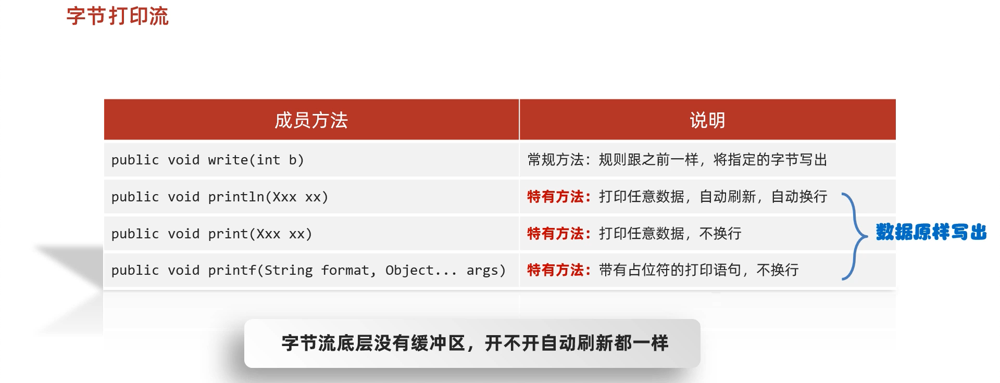

#  4. 打印流







## 4.1 概述

平时我们在控制台打印输出，是调用`print`方法和`println`方法完成的，这两个方法都来自于`java.io.PrintStream`类，该类能够方便地打印各种数据类型的值，是一种便捷的输出方式。

## 4.2 PrintStream类

### 构造方法

* `public PrintStream(String fileName)  `： 使用指定的文件名创建一个新的打印流。

构造举例，代码如下：  

```java
PrintStream ps = new PrintStream("ps.txt")；
```

### 改变打印流向

`System.out`就是`PrintStream`类型的，只不过它的流向是系统规定的，打印在控制台上。不过，既然是流对象，我们就可以玩一个"小把戏"，改变它的流向。

此打印流在虚拟机启动的时候，由虚拟机创建，默认指向控制台
特殊的打印流，系统中的标准输出流，是不能关闭，在系统中是唯一的

```java
public class PrintDemo {
    public static void main(String[] args) throws IOException {
		// 调用系统的打印流,控制台直接输出97
        System.out.println(97);
      
		// 创建打印流,指定文件的名称
        PrintStream ps = new PrintStream("ps.txt");
      	
      	// 设置系统的打印流流向,输出到ps.txt
        System.setOut(ps);
      	// 调用系统的打印流,ps.txt中输出97
        System.out.println(97);
    }
}
```