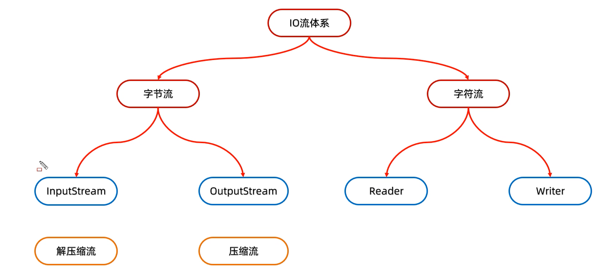
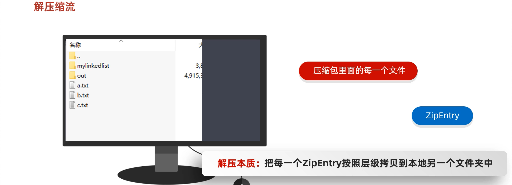

# 5. 压缩流和解压缩流







压缩流：

	负责压缩文件或者文件夹

解压缩流：

	负责把压缩包中的文件和文件夹解压出来

```java
/*
*   解压缩流
*
* */
public class ZipStreamDemo1 {
    public static void main(String[] args) throws IOException {

        //1.创建一个File表示要解压的压缩包
        File src = new File("D:\\aaa.zip");
        //2.创建一个File表示解压的目的地
        File dest = new File("D:\\");

        //调用方法
        unzip(src,dest);

    }

    //定义一个方法用来解压
    public static void unzip(File src,File dest) throws IOException {
        //解压的本质：把压缩包里面的每一个文件或者文件夹读取出来，按照层级拷贝到目的地当中
        //创建一个解压缩流用来读取压缩包中的数据
        ZipInputStream zip = new ZipInputStream(new FileInputStream(src));
        //要先获取到压缩包里面的每一个zipentry对象
        //表示当前在压缩包中获取到的文件或者文件夹
        ZipEntry entry;
        while((entry = zip.getNextEntry()) != null){
            System.out.println(entry);
            if(entry.isDirectory()){
                //文件夹：需要在目的地dest处创建一个同样的文件夹
                File file = new File(dest,entry.toString());
                file.mkdirs();
            }else{
                //文件：需要读取到压缩包中的文件，并把他存放到目的地dest文件夹中（按照层级目录进行存放）
                FileOutputStream fos = new FileOutputStream(new File(dest,entry.toString()));
                int b;
                while((b = zip.read()) != -1){
                    //写到目的地
                    fos.write(b);
                }
                fos.close();
                //表示在压缩包中的一个文件处理完毕了。
                zip.closeEntry();
            }
        }
        zip.close();
    }
}
```

```java
public class ZipStreamDemo2 {
    public static void main(String[] args) throws IOException {
        /*
         *   压缩流
         *      需求：
         *          把D:\\a.txt打包成一个压缩包
         * */
        //1.创建File对象表示要压缩的文件
        File src = new File("D:\\a.txt");
        //2.创建File对象表示压缩包的位置
        File dest = new File("D:\\");
        //3.调用方法用来压缩
        toZip(src,dest);
    }

    /*
    *   作用：压缩
    *   参数一：表示要压缩的文件
    *   参数二：表示压缩包的位置
    * */
    public static void toZip(File src,File dest) throws IOException {
        //1.创建压缩流关联压缩包
        ZipOutputStream zos = new ZipOutputStream(new FileOutputStream(new File(dest,"a.zip")));
        //2.创建ZipEntry对象，表示压缩包里面的每一个文件和文件夹
        //参数：压缩包里面的路径
        ZipEntry entry = new ZipEntry("aaa\\bbb\\a.txt");
        //3.把ZipEntry对象放到压缩包当中
        zos.putNextEntry(entry);
        //4.把src文件中的数据写到压缩包当中
        FileInputStream fis = new FileInputStream(src);
        int b;
        while((b = fis.read()) != -1){
            zos.write(b);
        }
        zos.closeEntry();
        zos.close();
    }
}
```

```java
public class ZipStreamDemo3 {
    public static void main(String[] args) throws IOException {
        /*
         *   压缩流
         *      需求：
         *          把D:\\aaa文件夹压缩成一个压缩包
         * */
        //1.创建File对象表示要压缩的文件夹
        File src = new File("D:\\aaa");
        //2.创建File对象表示压缩包放在哪里（压缩包的父级路径）
        File destParent = src.getParentFile();//D:\\
        //3.创建File对象表示压缩包的路径
        File dest = new File(destParent,src.getName() + ".zip");
        //4.创建压缩流关联压缩包
        ZipOutputStream zos = new ZipOutputStream(new FileOutputStream(dest));
        //5.获取src里面的每一个文件，变成ZipEntry对象，放入到压缩包当中
        toZip(src,zos,src.getName());//aaa
        //6.释放资源
        zos.close();
    }

    /*
    *   作用：获取src里面的每一个文件，变成ZipEntry对象，放入到压缩包当中
    *   参数一：数据源
    *   参数二：压缩流
    *   参数三：压缩包内部的路径
    * */
    public static void toZip(File src,ZipOutputStream zos,String name) throws IOException {
        //1.进入src文件夹
        File[] files = src.listFiles();
        //2.遍历数组
        for (File file : files) {
            if(file.isFile()){
                //3.判断-文件，变成ZipEntry对象，放入到压缩包当中
                ZipEntry entry = new ZipEntry(name + "\\" + file.getName());//aaa\\no1\\a.txt
                zos.putNextEntry(entry);
                //读取文件中的数据，写到压缩包
                FileInputStream fis = new FileInputStream(file);
                int b;
                while((b = fis.read()) != -1){
                    zos.write(b);
                }
                fis.close();
                zos.closeEntry();
            }else{
                //4.判断-文件夹，递归
                toZip(file,zos,name + "\\" + file.getName());
                //     no1            aaa   \\   no1
            }
        }
    }
}
```