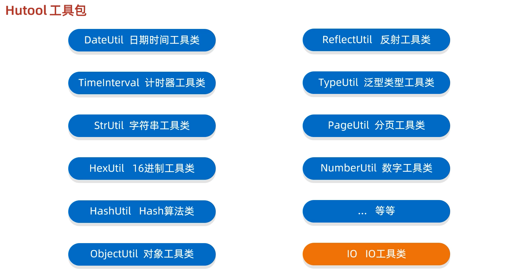
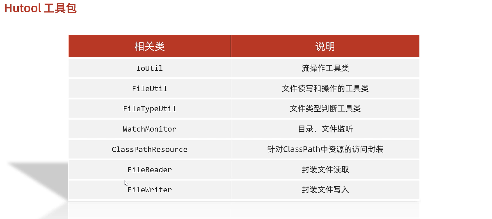
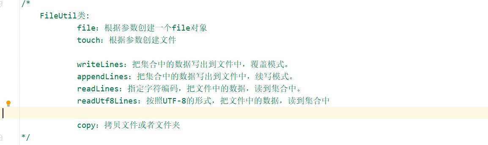

官网：
	https://hutool.cn/
API文档：
	https://apidoc.gitee.com/dromara/hutool/

中文使用文档：
	https://hutool.cn/docs/#/







### FileUtil



```java

//可变参数名称
File file1 = FileUtil.file("D:\\", "aaa", "bbb", "a.txt");
System.out.println(file1);//D:\aaa\bbb\a.txt

//父目录不存在则自动创建
File touch = FileUtil.touch(file1);
System.out.println(touch);


ArrayList<String> list = new ArrayList<>();
list.add("aaa");
list.add("aaa");
list.add("aaa");
//覆盖写
File file2 = FileUtil.writeLines(list, "D:\\a.txt", "UTF-8");
System.out.println(file2);

ArrayList<String> list = new ArrayList<>();
list.add("aaa");
list.add("aaa");
list.add("aaa");
//追加写
File file3 = FileUtil.appendLines(list, "D:\\a.txt", "UTF-8");
System.out.println(file3);

//读取行
List<String> list = FileUtil.readLines("D:\\a.txt", "UTF-8");
System.out.println(list);

```


