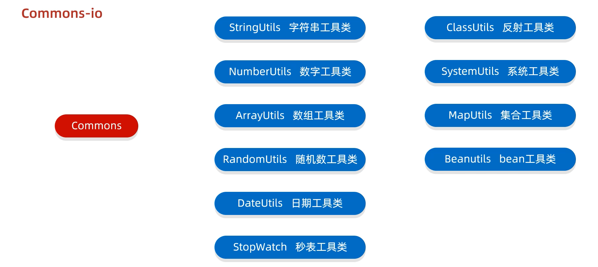
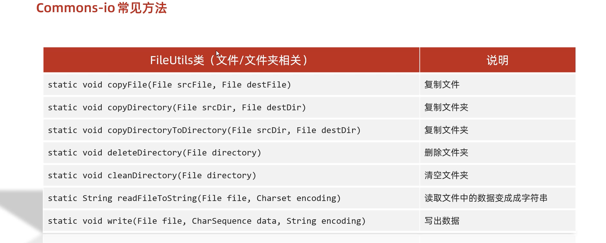
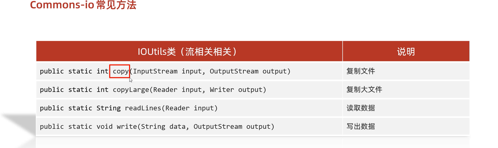

# 6. 工具包（Commons-io）








介绍：

	Commons是apache开源基金组织提供的工具包，里面有很多帮助我们提高开发效率的API

比如：

	StringUtils   字符串工具类
	
	NumberUtils   数字工具类 
	
	ArrayUtils   数组工具类  
	
	RandomUtils   随机数工具类
	
	DateUtils   日期工具类 
	
	StopWatch   秒表工具类 
	
	ClassUtils   反射工具类  
	
	SystemUtils   系统工具类  
	
	MapUtils   集合工具类
	
	Beanutils   bean工具类
	
	Commons-io io的工具类
	
	等等.....

其中：Commons-io是apache开源基金组织提供的一组有关IO操作的开源工具包。

作用：提高IO流的开发效率。

使用方式：

1，新建lib文件夹

2，把第三方jar包粘贴到文件夹中

3，右键点击add as a library

代码示例：

```java
public class CommonsIODemo1 {
    public static void main(String[] args) throws IOException {
        /*
          FileUtils类
                static void copyFile(File srcFile, File destFile)                   复制文件
                static void copyDirectory(File srcDir, File destDir)                复制文件夹
                static void copyDirectoryToDirectory(File srcDir, File destDir)     复制文件夹
                static void deleteDirectory(File directory)                         删除文件夹
                static void cleanDirectory(File directory)                          清空文件夹
                static String readFileToString(File file, Charset encoding)         读取文件中的数据变成成字符串
                static void write(File file, CharSequence data, String encoding)    写出数据

            IOUtils类
                public static int copy(InputStream input, OutputStream output)      复制文件
                public static int copyLarge(Reader input, Writer output)            复制大文件
                public static String readLines(Reader input)                        读取数据
                public static void write(String data, OutputStream output)          写出数据
         */


        /* File src = new File("myio\\a.txt");
        File dest = new File("myio\\copy.txt");
        FileUtils.copyFile(src,dest);*/


        /*File src = new File("D:\\aaa");
        File dest = new File("D:\\bbb");
        FileUtils.copyDirectoryToDirectory(src,dest);*/

        /*File src = new File("D:\\bbb");
        FileUtils.cleanDirectory(src);*/


    }
}

```

# 7. 工具包（hutool）

介绍：

	Commons是国人开发的开源工具包，里面有很多帮助我们提高开发效率的API

比如：

	DateUtil  日期时间工具类 
	
	TimeInterval  计时器工具类 
	
	StrUtil  字符串工具类
	
	HexUtil   16进制工具类
	
	HashUtil   Hash算法类
	
	ObjectUtil  对象工具类
	
	ReflectUtil   反射工具类
	
	TypeUtil  泛型类型工具类
	
	PageUtil  分页工具类
	
	NumberUtil  数字工具类

使用方式：

1，新建lib文件夹

2，把第三方jar包粘贴到文件夹中

3，右键点击add as a library

代码示例：

```java
public class Test1 {
    public static void main(String[] args) {
    /*
        FileUtil类:
                file：根据参数创建一个file对象
                touch：根据参数创建文件

                writeLines：把集合中的数据写出到文件中，覆盖模式。
                appendLines：把集合中的数据写出到文件中，续写模式。
                readLines：指定字符编码，把文件中的数据，读到集合中。
                readUtf8Lines：按照UTF-8的形式，把文件中的数据，读到集合中

                copy：拷贝文件或者文件夹
    */


       /* File file1 = FileUtil.file("D:\\", "aaa", "bbb", "a.txt");
        System.out.println(file1);//D:\aaa\bbb\a.txt

        File touch = FileUtil.touch(file1);
        System.out.println(touch);


        ArrayList<String> list = new ArrayList<>();
        list.add("aaa");
        list.add("aaa");
        list.add("aaa");

        File file2 = FileUtil.writeLines(list, "D:\\a.txt", "UTF-8");
        System.out.println(file2);*/

      /*  ArrayList<String> list = new ArrayList<>();
        list.add("aaa");
        list.add("aaa");
        list.add("aaa");
        File file3 = FileUtil.appendLines(list, "D:\\a.txt", "UTF-8");
        System.out.println(file3);*/
        List<String> list = FileUtil.readLines("D:\\a.txt", "UTF-8");
        System.out.println(list);
    }
}
```