#  JUC--CompletableFuture-02

CompletableFuture是jdk8的新特性。CompletableFuture实现了CompletionStage接口和Future接口，前者是对后者的一个扩展，增加了异步会点、流式处理、多个Future组合处理的能力，使Java在处理多任务的协同工作时更加顺畅便利。

## 一、创建异步任务

### 1\. supplyAsync

supplyAsync是创建带有返回值的异步任务。它有如下两个方法，一个是使用默认线程池（ForkJoinPool.commonPool()）的方法，一个是带有自定义线程池的重载方法

```java
// 带返回值异步请求，默认线程池
public static <U> CompletableFuture<U> supplyAsync(Supplier<U> supplier)

// 带返回值的异步请求，可以自定义线程池
public static <U> CompletableFuture<U> supplyAsync(Supplier<U> supplier, Executor executor)
```

测试代码：

```java
public static void main(String[] args) throws ExecutionException, InterruptedException {
        CompletableFuture<String> cf = CompletableFuture.supplyAsync(() -> {
            System.out.println("do something....");
            return "result";
        });

        //等待任务执行完成
        System.out.println("结果->" + cf.get());
}


public static void main(String[] args) throws ExecutionException, InterruptedException {
        // 自定义线程池
        ExecutorService executorService = Executors.newSingleThreadExecutor();
        CompletableFuture<String> cf = CompletableFuture.supplyAsync(() -> {
            System.out.println("do something....");
            return "result";
        }, executorService);

        //等待子任务执行完成
        System.out.println("结果->" + cf.get());
}
```

 测试结果：


###  2. runAsync

runAsync是创建没有返回值的异步任务。它有如下两个方法，一个是使用默认线程池（ForkJoinPool.commonPool()）的方法，一个是带有自定义线程池的重载方法

```java
// 不带返回值的异步请求，默认线程池
public static CompletableFuture<Void> runAsync(Runnable runnable)

// 不带返回值的异步请求，可以自定义线程池
public static CompletableFuture<Void> runAsync(Runnable runnable, Executor executor)
```

测试代码：

```java
public static void main(String[] args) throws ExecutionException, InterruptedException {
        CompletableFuture<Void> cf = CompletableFuture.runAsync(() -> {
            System.out.println("do something....");
        });

        //等待任务执行完成
        System.out.println("结果->" + cf.get());
}


public static void main(String[] args) throws ExecutionException, InterruptedException {
        // 自定义线程池
        ExecutorService executorService = Executors.newSingleThreadExecutor();
        CompletableFuture<Void> cf = CompletableFuture.runAsync(() -> {
            System.out.println("do something....");
        }, executorService);

        //等待任务执行完成
        System.out.println("结果->" + cf.get());
}
```

测试结果：

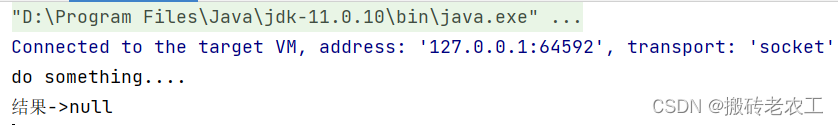

### 3.获取任务结果的方法

```java
// 如果完成则返回结果，否则就抛出具体的异常
public T get() throws InterruptedException, ExecutionException 

// 最大时间等待返回结果，否则就抛出具体异常
public T get(long timeout, TimeUnit unit) throws InterruptedException, ExecutionException, TimeoutException

// 完成时返回结果值，否则抛出unchecked异常。为了更好地符合通用函数形式的使用，如果完成此 CompletableFuture所涉及的计算引发异常，则此方法将引发unchecked异常并将底层异常作为其原因
public T join()

// 如果完成则返回结果值（或抛出任何遇到的异常），否则返回给定的 valueIfAbsent。
public T getNow(T valueIfAbsent)

// 如果任务没有完成，返回的值设置为给定值
public boolean complete(T value)

// 如果任务没有完成，就抛出给定异常
public boolean completeExceptionally(Throwable ex) 
```

##  二、异步回调处理

### 1.thenApply和thenApplyAsync

 thenApply 表示某个任务执行完成后执行的动作，即回调方法，会将该任务的执行结果即方法返回值作为入参传递到回调方法中，带有返回值。

测试代码：

```java
public static void main(String[] args) throws ExecutionException, InterruptedException {
        CompletableFuture<Integer> cf1 = CompletableFuture.supplyAsync(() -> {
            System.out.println(Thread.currentThread() + " cf1 do something....");
            return 1;
        });

        CompletableFuture<Integer> cf2 = cf1.thenApplyAsync((result) -> {
            System.out.println(Thread.currentThread() + " cf2 do something....");
            result += 2;
            return result;
        });
        //等待任务1执行完成
        System.out.println("cf1结果->" + cf1.get());
        //等待任务2执行完成
        System.out.println("cf2结果->" + cf2.get());
}

public static void main(String[] args) throws ExecutionException, InterruptedException {
        CompletableFuture<Integer> cf1 = CompletableFuture.supplyAsync(() -> {
            System.out.println(Thread.currentThread() + " cf1 do something....");
            return 1;
        });

        CompletableFuture<Integer> cf2 = cf1.thenApply((result) -> {
            System.out.println(Thread.currentThread() + " cf2 do something....");
            result += 2;
            return result;
        });
        //等待任务1执行完成
        System.out.println("cf1结果->" + cf1.get());
        //等待任务2执行完成
        System.out.println("cf2结果->" + cf2.get());
}
```

测试结果：

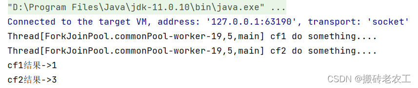   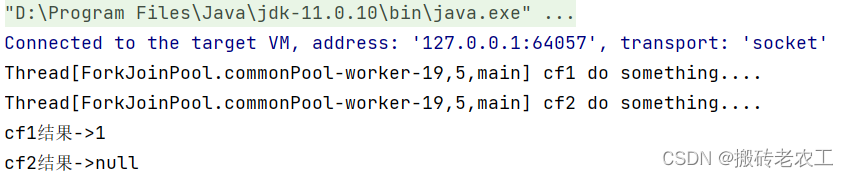

从上面代码和测试结果我们发现thenApply和thenApplyAsync区别在于，使用thenApply方法时子任务与父任务使用的是同一个线程，而thenApplyAsync在子任务中是另起一个线程执行任务，并且thenApplyAsync可以自定义线程池，默认的使用ForkJoinPool.commonPool()线程池。

### 2.thenAccept和thenAcceptAsync

 thenAccep表示某个任务执行完成后执行的动作，即回调方法，会将该任务的执行结果即方法返回值作为入参传递到回调方法中，无返回值。

测试代码

```java
public static void main(String[] args) throws ExecutionException, InterruptedException {
        CompletableFuture<Integer> cf1 = CompletableFuture.supplyAsync(() -> {
            System.out.println(Thread.currentThread() + " cf1 do something....");
            return 1;
        });

        CompletableFuture<Void> cf2 = cf1.thenAccept((result) -> {
            System.out.println(Thread.currentThread() + " cf2 do something....");
        });

        //等待任务1执行完成
        System.out.println("cf1结果->" + cf1.get());
        //等待任务2执行完成
        System.out.println("cf2结果->" + cf2.get());
}


public static void main(String[] args) throws ExecutionException, InterruptedException {
        CompletableFuture<Integer> cf1 = CompletableFuture.supplyAsync(() -> {
            System.out.println(Thread.currentThread() + " cf1 do something....");
            return 1;
        });

        CompletableFuture<Void> cf2 = cf1.thenAcceptAsync((result) -> {
            System.out.println(Thread.currentThread() + " cf2 do something....");
        });

        //等待任务1执行完成
        System.out.println("cf1结果->" + cf1.get());
        //等待任务2执行完成
        System.out.println("cf2结果->" + cf2.get());
}
```

测试结果：

 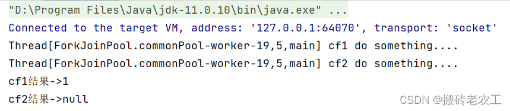从上面代码和测试结果我们发现thenAccep和thenAccepAsync区别在于，使用thenAccep方法时子任务与父任务使用的是同一个线程，而thenAccepAsync在子任务中可能是另起一个线程执行任务，并且thenAccepAsync可以自定义线程池，默认的使用ForkJoinPool.commonPool()线程池。

### 3.thenRun和thenRunAsync

 thenRun表示某个任务执行完成后执行的动作，即回调方法，无入参，无返回值。

测试代码：

```java
public static void main(String[] args) throws ExecutionException, InterruptedException {
        CompletableFuture<Integer> cf1 = CompletableFuture.supplyAsync(() -> {
            System.out.println(Thread.currentThread() + " cf1 do something....");
            return 1;
        });

        CompletableFuture<Void> cf2 = cf1.thenRun(() -> {
            System.out.println(Thread.currentThread() + " cf2 do something....");
        });

        //等待任务1执行完成
        System.out.println("cf1结果->" + cf1.get());
        //等待任务2执行完成
        System.out.println("cf2结果->" + cf2.get());
}

public static void main(String[] args) throws ExecutionException, InterruptedException {
        CompletableFuture<Integer> cf1 = CompletableFuture.supplyAsync(() -> {
            System.out.println(Thread.currentThread() + " cf1 do something....");
            return 1;
        });

        CompletableFuture<Void> cf2 = cf1.thenRunAsync(() -> {
            System.out.println(Thread.currentThread() + " cf2 do something....");
        });

        //等待任务1执行完成
        System.out.println("cf1结果->" + cf1.get());
        //等待任务2执行完成
        System.out.println("cf2结果->" + cf2.get());
}
```

 测试结果：

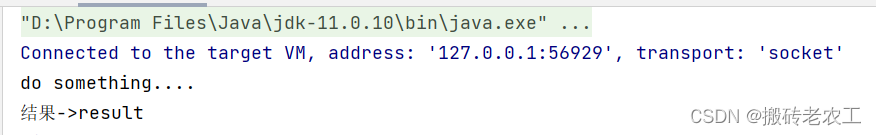

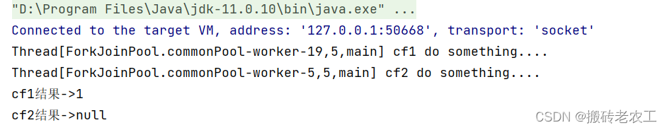

从上面代码和测试结果我们发现thenRun和thenRunAsync区别在于，使用thenRun方法时子任务与父任务使用的是同一个线程，而thenRunAsync在子任务中可能是另起一个线程执行任务，并且thenRunAsync可以自定义线程池，默认的使用ForkJoinPool.commonPool()线程池。

### 4.whenComplete和whenCompleteAsync

 whenComplete是当某个任务执行完成后执行的回调方法，会将执行结果或者执行期间抛出的异常传递给回调方法，如果是正常执行则异常为null，回调方法对应的CompletableFuture的result和该任务一致，如果该任务正常执行，则get方法返回执行结果，如果是执行异常，则get方法抛出异常。

测试代码：

```java
 public static void main(String[] args) throws ExecutionException, InterruptedException {
        CompletableFuture<Integer> cf1 = CompletableFuture.supplyAsync(() -> {
            System.out.println(Thread.currentThread() + " cf1 do something....");
            int a = 1/0;
            return 1;
        });

        CompletableFuture<Integer> cf2 = cf1.whenComplete((result, e) -> {
            System.out.println("上个任务结果：" + result);
            System.out.println("上个任务抛出异常：" + e);
            System.out.println(Thread.currentThread() + " cf2 do something....");
        });

//        //等待任务1执行完成
//        System.out.println("cf1结果->" + cf1.get());
//        //等待任务2执行完成
        System.out.println("cf2结果->" + cf2.get());
    }
```

测试结果：

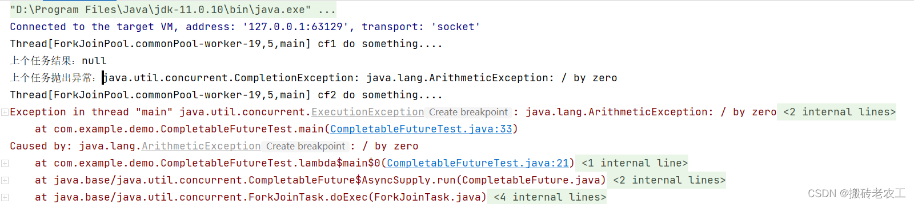 

 whenCompleteAsync和whenComplete区别也是whenCompleteAsync可能会另起一个线程执行任务，并且thenRunAsync可以自定义线程池，默认的使用ForkJoinPool.commonPool()线程池。

### 5.handle和handleAsync

 跟whenComplete基本一致，区别在于handle的回调方法有返回值。

测试代码：

```java
public static void main(String[] args) throws ExecutionException, InterruptedException {
        CompletableFuture<Integer> cf1 = CompletableFuture.supplyAsync(() -> {
            System.out.println(Thread.currentThread() + " cf1 do something....");
            // int a = 1/0;
            return 1;
        });

        CompletableFuture<Integer> cf2 = cf1.handle((result, e) -> {
            System.out.println(Thread.currentThread() + " cf2 do something....");
            System.out.println("上个任务结果：" + result);
            System.out.println("上个任务抛出异常：" + e);
            return result+2;
        });

        //等待任务2执行完成
        System.out.println("cf2结果->" + cf2.get());
}
```

测试结果 ：

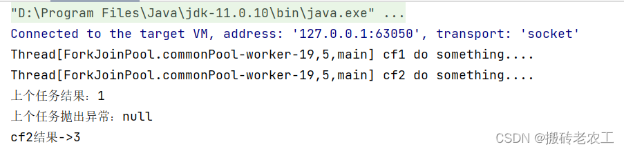

三、多任务组合处理 
----------

### 1.thenCombine、thenAcceptBoth 和runAfterBoth

这三个方法都是将两个CompletableFuture组合起来处理，只有两个任务都正常完成时，才进行下阶段任务。

区别：thenCombine会将两个任务的执行结果作为所提供函数的参数，且该方法有返回值；thenAcceptBoth同样将两个任务的执行结果作为方法入参，但是无返回值；runAfterBoth没有入参，也没有返回值。注意两个任务中只要有一个执行异常，则将该异常信息作为指定任务的执行结果。

测试代码：

```java
public static void main(String[] args) throws ExecutionException, InterruptedException {
        CompletableFuture<Integer> cf1 = CompletableFuture.supplyAsync(() -> {
            System.out.println(Thread.currentThread() + " cf1 do something....");
            return 1;
        });

        CompletableFuture<Integer> cf2 = CompletableFuture.supplyAsync(() -> {
            System.out.println(Thread.currentThread() + " cf2 do something....");
            return 2;
        });

        CompletableFuture<Integer> cf3 = cf1.thenCombine(cf2, (a, b) -> {
            System.out.println(Thread.currentThread() + " cf3 do something....");
            return a + b;
        });

        System.out.println("cf3结果->" + cf3.get());
}

 public static void main(String[] args) throws ExecutionException, InterruptedException {
        CompletableFuture<Integer> cf1 = CompletableFuture.supplyAsync(() -> {
            System.out.println(Thread.currentThread() + " cf1 do something....");
            return 1;
        });

        CompletableFuture<Integer> cf2 = CompletableFuture.supplyAsync(() -> {
            System.out.println(Thread.currentThread() + " cf2 do something....");
            return 2;
        });
        
        CompletableFuture<Void> cf3 = cf1.thenAcceptBoth(cf2, (a, b) -> {
            System.out.println(Thread.currentThread() + " cf3 do something....");
            System.out.println(a + b);
        });

        System.out.println("cf3结果->" + cf3.get());
}

public static void main(String[] args) throws ExecutionException, InterruptedException {
        CompletableFuture<Integer> cf1 = CompletableFuture.supplyAsync(() -> {
            System.out.println(Thread.currentThread() + " cf1 do something....");
            return 1;
        });

        CompletableFuture<Integer> cf2 = CompletableFuture.supplyAsync(() -> {
            System.out.println(Thread.currentThread() + " cf2 do something....");
            return 2;
        });

        CompletableFuture<Void> cf3 = cf1.runAfterBoth(cf2, () -> {
            System.out.println(Thread.currentThread() + " cf3 do something....");
        });

        System.out.println("cf3结果->" + cf3.get());
}
```

测试结果：

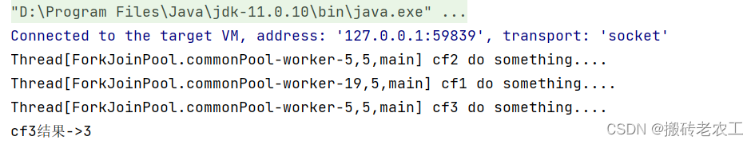 

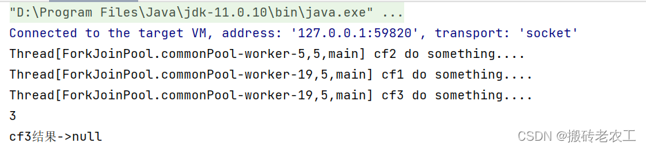

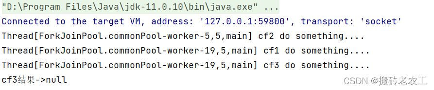 

### 2.applyToEither、acceptEither和runAfterEither

这三个方法和上面一样也是将两个CompletableFuture组合起来处理，当有一个任务正常完成时，就会进行下阶段任务。

区别：applyToEither会将已经完成任务的执行结果作为所提供函数的参数，且该方法有返回值；acceptEither同样将已经完成任务的执行结果作为方法入参，但是无返回值；runAfterEither没有入参，也没有返回值。

测试代码：

```java
public static void main(String[] args) throws ExecutionException, InterruptedException {
        CompletableFuture<String> cf1 = CompletableFuture.supplyAsync(() -> {
            try {
                System.out.println(Thread.currentThread() + " cf1 do something....");
                Thread.sleep(2000);
            } catch (InterruptedException e) {
                e.printStackTrace();
            }
            return "cf1 任务完成";
        });

        CompletableFuture<String> cf2 = CompletableFuture.supplyAsync(() -> {
            try {
                System.out.println(Thread.currentThread() + " cf2 do something....");
                Thread.sleep(5000);
            } catch (InterruptedException e) {
                e.printStackTrace();
            }
            return "cf2 任务完成";
        });

        CompletableFuture<String> cf3 = cf1.applyToEither(cf2, (result) -> {
            System.out.println("接收到" + result);
            System.out.println(Thread.currentThread() + " cf3 do something....");
            return "cf3 任务完成";
        });

        System.out.println("cf3结果->" + cf3.get());
}


public static void main(String[] args) throws ExecutionException, InterruptedException {
        CompletableFuture<String> cf1 = CompletableFuture.supplyAsync(() -> {
            try {
                System.out.println(Thread.currentThread() + " cf1 do something....");
                Thread.sleep(2000);
            } catch (InterruptedException e) {
                e.printStackTrace();
            }
            return "cf1 任务完成";
        });

        CompletableFuture<String> cf2 = CompletableFuture.supplyAsync(() -> {
            try {
                System.out.println(Thread.currentThread() + " cf2 do something....");
                Thread.sleep(5000);
            } catch (InterruptedException e) {
                e.printStackTrace();
            }
            return "cf2 任务完成";
        });

        CompletableFuture<Void> cf3 = cf1.acceptEither(cf2, (result) -> {
            System.out.println("接收到" + result);
            System.out.println(Thread.currentThread() + " cf3 do something....");
        });

        System.out.println("cf3结果->" + cf3.get());
}

public static void main(String[] args) throws ExecutionException, InterruptedException {
        CompletableFuture<String> cf1 = CompletableFuture.supplyAsync(() -> {
            try {
                System.out.println(Thread.currentThread() + " cf1 do something....");
                Thread.sleep(2000);
            } catch (InterruptedException e) {
                e.printStackTrace();
            }
            System.out.println("cf1 任务完成");
            return "cf1 任务完成";
        });

        CompletableFuture<String> cf2 = CompletableFuture.supplyAsync(() -> {
            try {
                System.out.println(Thread.currentThread() + " cf2 do something....");
                Thread.sleep(5000);
            } catch (InterruptedException e) {
                e.printStackTrace();
            }
            System.out.println("cf2 任务完成");
            return "cf2 任务完成";
        });

        CompletableFuture<Void> cf3 = cf1.runAfterEither(cf2, () -> {
            System.out.println(Thread.currentThread() + " cf3 do something....");
            System.out.println("cf3 任务完成");
        });

        System.out.println("cf3结果->" + cf3.get());
}
```

测试结果： 

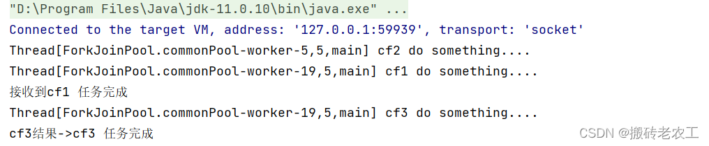

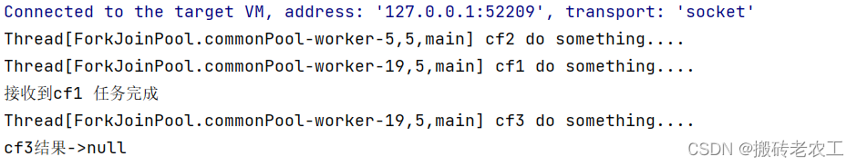从上面可以看出cf1任务完成需要2秒，cf2任务完成需要5秒，使用applyToEither组合两个任务时，只要有其中一个任务完成时，就会执行cf3任务，显然cf1任务先完成了并且将自己任务的结果传值给了cf3任务，cf3任务中打印了接收到cf1任务完成，接着完成自己的任务，并返回cf3任务完成；acceptEither和runAfterEither类似，acceptEither会将cf1任务的结果作为cf3任务的入参，但cf3任务完成时并无返回值；runAfterEither不会将cf1任务的结果作为cf3任务的入参，它是没有任务入参，执行完自己的任务后也并无返回值。

### 3.allOf / anyOf 

allOf：CompletableFuture是多个任务都执行完成后才会执行，只有有一个任务执行异常，则返回的CompletableFuture执行get方法时会抛出异常，如果都是正常执行，则get返回null。

anyOf ：CompletableFuture是多个任务只要有一个任务执行完成，则返回的CompletableFuture执行get方法时会抛出异常，如果都是正常执行，则get返回执行完成任务的结果。

测试代码：

```java
public static void main(String[] args) throws ExecutionException, InterruptedException {
        CompletableFuture<String> cf1 = CompletableFuture.supplyAsync(() -> {
            try {
                System.out.println(Thread.currentThread() + " cf1 do something....");
                Thread.sleep(2000);
            } catch (InterruptedException e) {
                e.printStackTrace();
            }
            System.out.println("cf1 任务完成");
            return "cf1 任务完成";
        });

        CompletableFuture<String> cf2 = CompletableFuture.supplyAsync(() -> {
            try {
                System.out.println(Thread.currentThread() + " cf2 do something....");
                int a = 1/0;
                Thread.sleep(5000);
            } catch (InterruptedException e) {
                e.printStackTrace();
            }
            System.out.println("cf2 任务完成");
            return "cf2 任务完成";
        });

        CompletableFuture<String> cf3 = CompletableFuture.supplyAsync(() -> {
            try {
                System.out.println(Thread.currentThread() + " cf2 do something....");
                Thread.sleep(3000);
            } catch (InterruptedException e) {
                e.printStackTrace();
            }
            System.out.println("cf3 任务完成");
            return "cf3 任务完成";
        });

        CompletableFuture<Void> cfAll = CompletableFuture.allOf(cf1, cf2, cf3);
        System.out.println("cfAll结果->" + cfAll.get());
}


public static void main(String[] args) throws ExecutionException, InterruptedException {
        CompletableFuture<String> cf1 = CompletableFuture.supplyAsync(() -> {
            try {
                System.out.println(Thread.currentThread() + " cf1 do something....");
                Thread.sleep(2000);
            } catch (InterruptedException e) {
                e.printStackTrace();
            }
            System.out.println("cf1 任务完成");
            return "cf1 任务完成";
        });

        CompletableFuture<String> cf2 = CompletableFuture.supplyAsync(() -> {
            try {
                System.out.println(Thread.currentThread() + " cf2 do something....");
                Thread.sleep(5000);
            } catch (InterruptedException e) {
                e.printStackTrace();
            }
            System.out.println("cf2 任务完成");
            return "cf2 任务完成";
        });

        CompletableFuture<String> cf3 = CompletableFuture.supplyAsync(() -> {
            try {
                System.out.println(Thread.currentThread() + " cf2 do something....");
                Thread.sleep(3000);
            } catch (InterruptedException e) {
                e.printStackTrace();
            }
            System.out.println("cf3 任务完成");
            return "cf3 任务完成";
        });

        CompletableFuture<Object> cfAll = CompletableFuture.anyOf(cf1, cf2, cf3);
        System.out.println("cfAll结果->" + cfAll.get());
}
```

测试结果：

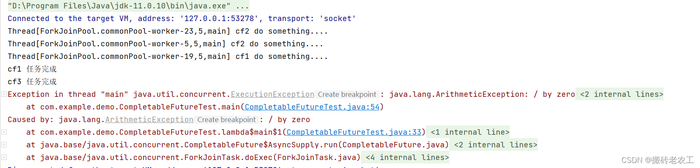

 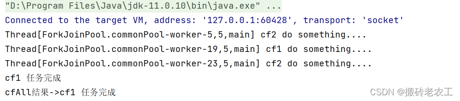

  

本文转自 [https://blog.csdn.net/zsx\_xiaoxin/article/details/123898171](https://blog.csdn.net/zsx_xiaoxin/article/details/123898171)，如有侵权，请联系删除。