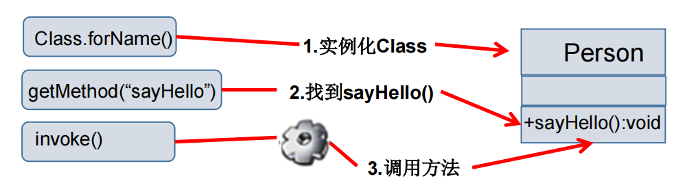
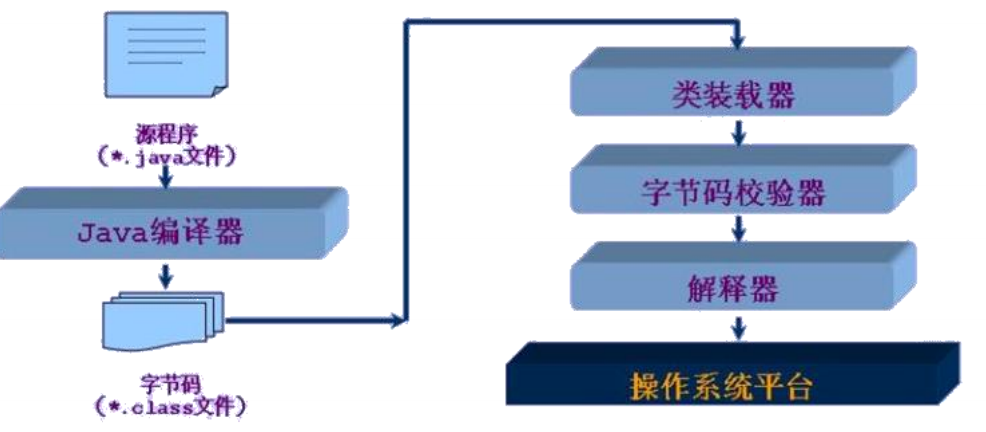
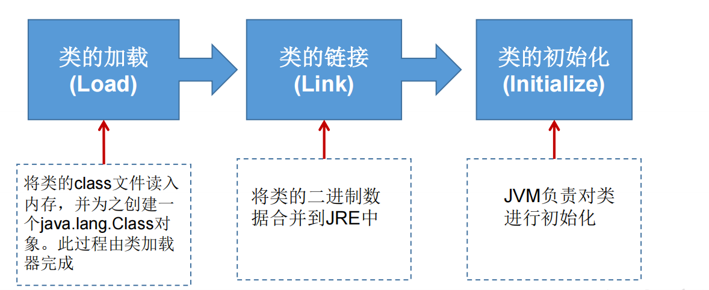
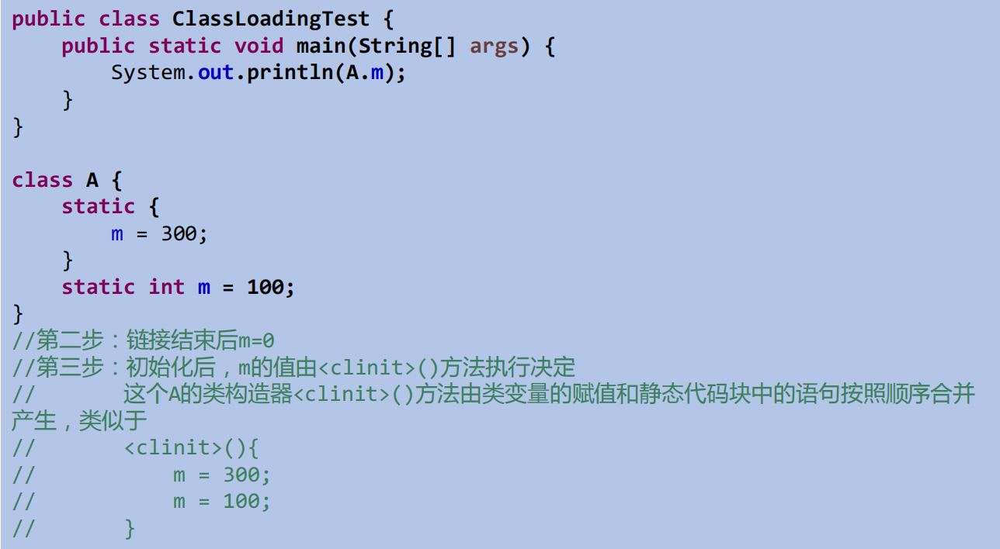
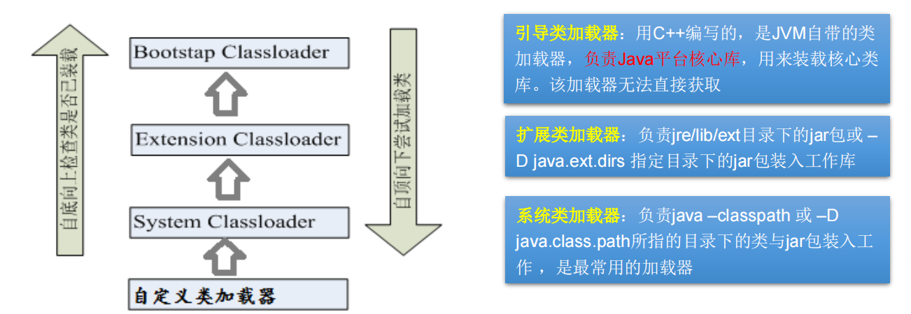
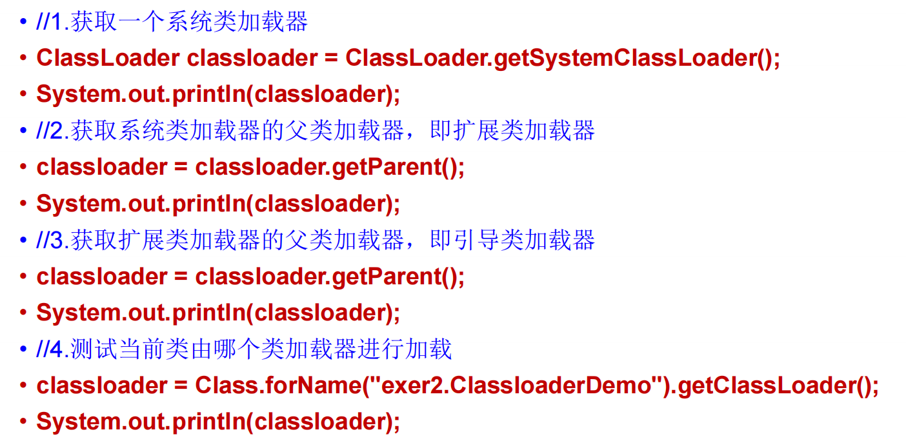
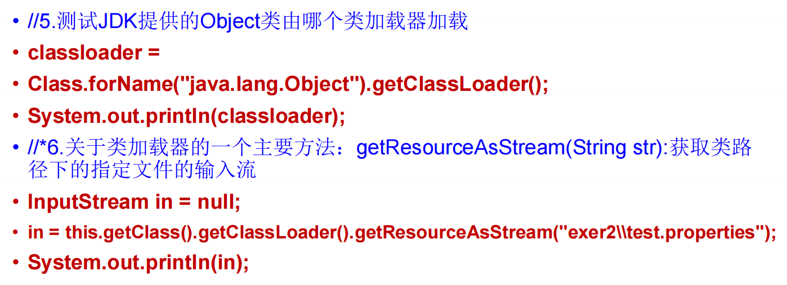
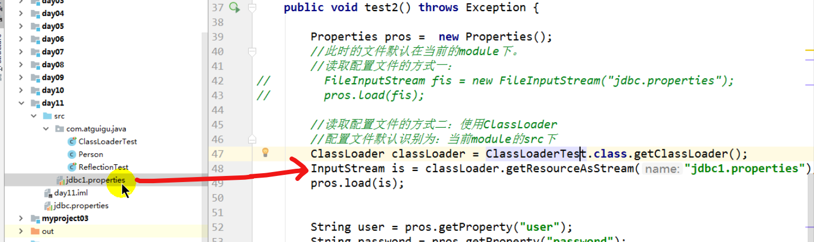
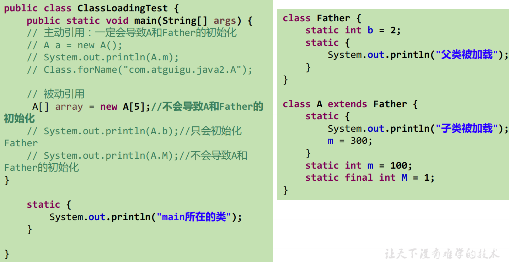

# se基础--2.Class信息

## class方法

| 方法名                                                       | 功能                                                         |
| ------------------------------------------------------------ | ------------------------------------------------------------ |
| **一个静态方法获取字节码对象**                               |                                                              |
| `static Class forName(String name) `                         | 返回指定类名 name 的 Class 对象                              |
| **获取类加载器对象**                                         |                                                              |
| `ClassLoader getClassLoader() `                              | 返回该类的类加载器                                           |
|                                                              |                                                              |
| **获取类相关信息**                                           |                                                              |
| `getName() ` `getCanonicalName()`                       | 完整类名                                                     |
| `getSimpleName()`                                            | 类名                                                         |
| `Class getSuperClass() `                                     | 获得父类的Class对象                                          |
| `Class getSuperclass() `                                     | 获取超类的Class对象                                          |
| `Class [] getInterfaces() `                                  | 返回实现类class数组                                          |
| `isInterface()`                                              | 判断是否是接口                                               |
| `Package getPackage()`                                       | **类所在的包**                                               |
| `isInstance()`                                               | 判断是否可以强制类型转换                                     |
| `cast()`                                                     | 强制类型转换                                                 |
|                                                              |                                                              |
| **获取实例对象**                                             |                                                              |
| `Object newInstance() `                                      | "虚拟构造器"。使用`newInstance()`来创建的类， 必须带有无参数的构造器，通常设置为public |
|                                                              |                                                              |
| **构造器 Constructor**                                       |                                                              |
| `getConstructors()` `getDeclaredConstructors()` `getConstructor()` `getDeclaredConstructor()` | 获取构造器                                                   |
| Constructor类中                                              |                                                              |
| `public int getModifiers();`                                 | 取得修饰符                                                   |
| `public String getName();`                                   | 取得方法名称                                                 |
| `public Class<?>[] getParameterTypes();`                     | 取得参数的类型                                               |
|                                                              |                                                              |
| **成员变量 Field**                                           |                                                              |
| `getFields()` `getDeclaredFields()` `getField(String name)` `getDeclaredField(String name)` | 获取成员变量                                                 |
| `Method getMethod(String name,Class … paramTypes)`           | 返回一个Method对象，此对象的形参类型为paramType              |
| Field 类中                                                   |                                                              |
| `public int getModifiers()`                                  | 以整数形式返回此Field的修饰符                                |
| `public Class<?> getType()`                                  | 得到Field的属性类型                                          |
| `public String getName()`                                    | 返回Field的名称。                                            |
| `public Object get(Object obj) `                             | 取得指定对象obj上此Field的属性内容                           |
| `public void set(Object obj,Object value) `                  | 设置指定对象obj上此Field的属性内容                           |
|                                                              |                                                              |
| **成员方法 Method**                                          |                                                              |
| `Method[] getMethods()`                                      | 返回所有成员方法对象的数组（只能拿public的）                 |
| `Method[] getDeclaredMethods()`                              | 返回所有成员方法对象的数组，存在就能拿到                     |
| `Method getMethod(String name, Class<?>... parameterTypes)`  | 返回单个成员方法对象（只能拿public的）                       |
| `Method getDeclaredMethod(String name, Class<?>... parameterTypes)` | 返回单个成员方法对象，存在就能拿到                           |
| Method 类中                                                  |                                                              |
| `public Class<?> getReturnType()`                            | 取得全部的返回值                                             |
| `public Class<?>[] getParameterTypes()`                      | 取得全部的参数                                               |
| `public int getModifiers()`                                  | 取得修饰符                                                   |
| `public Class<?>[] getExceptionTypes()`                      | 取得异常信息                                                 |
|                                                              |                                                              |
| **Annotation相关**                                           |                                                              |
| `get Annotation(Class<T> annotationClass)`                   |                                                              |
| `getDeclaredAnnotations() `                                  |                                                              |
|                                                              |                                                              |
| **泛型相关**                                                 |                                                              |
| `Type getGenericSuperclass()`                                | 获取父类泛型类型                                             |
| `ParameterizedType`                                          | 泛型类型                                                     |
| `getActualTypeArguments()`                                   | 获取实际的泛型类型参数数组                                   |
|                                                              |                                                              |
| **调用指定方法**                                             |                                                              |
| `Object invoke(Object obj, Object[] args)`                   | 若原方法无返回值，此时返回null 若原方法若为静态方法，此时形参Object obj可为null 若原方法形参列表为空，则Object[] args为null 若原方法声明为private,则需要在调用此invoke()方法前，显式调用方法对象的setAccessible(true)方法，将可访问private的方法。 |
|                                                              |                                                              |
| **setAccessible**                                            | Method和Field、Constructor对象都有setAccessible()方法 setAccessible启动和禁用访问安全检查的开关。 |

## 哪些类型可以有Class对象

（1）class：外部类，成员(成员内部类，静态内部类)，局部内部类，匿名内部类
（2）interface：接口
（3）[]：数组
（4）enum：枚举
（5）annotation：注解@interface
（6）primitive type：基本数据类型
（7）void

## 类加载过程

源文件--->class文件--->加载

类的加载：将字节码文件加载到内存的过程
运行时类：加载到内存中的类，此运行时类作为Class的实例

**类加载器的作用：**

- **类加载的作用：**将class文件字节码内容加载到内存中，并将这些静态数据转换成方法区的运行时数据结构，然后在堆中生成一个代表这个类的java.lang.Class对象，作为方法区中类数据的访问入口。

- **类缓存：**标准的JavaSE类加载器可以按要求查找类，但一旦某个类被加载到类加载器中，它将维持加载（缓存）一段时间。不过JVM垃圾回收机制可以回收这些Class对象。

- 加载：将class文件字节码内容加载到内存中，并将这些静态数据转换成方法区的运行时数据结构，然后生成一个代表这个类的java.lang.Class对象，作为方法区中类数据的访问入口（即引用地址）。所有需要访问和使用类数据只能通过这个Class对象。这个加载的过程需要类加载器参与。

- 链接：将Java类的二进制代码合并到JVM的运行状态之中的过程。

  - 验证：确保加载的类信息符合JVM规范，例如：以cafe开头，没有安全方面的问题

  - 准备：正式为类变量（static）分配内存并**设置类变量默认初始值**的阶段，这些内存都将在方法区中进行分配。

  - 解析：虚拟机常量池内的符号引用（常量名）替换为直接引用（地址）的过程。

- 初始化：

  - 执行类构造器`<clinit>()`方法的过程。类构造器`<clinit>()`方法是由编译期自动收集类中所有类变量的赋值动作和静态代码块中的语句合并产生的。（类构造器是构造类信息的，不是构造该类对象的构造器）。

  - 当初始化一个类的时候，如果发现其父类还没有进行初始化，则需要先触发其父类的初始化。

  - 虚拟机会保证一个类的`<clinit>()`方法在多线程环境中被正确加锁和同步。

## ClassLoader

类加载器作用是用来把类(class)装载进内存的。JVM 规范定义了如下类型的

类的加载器。

## 什么时候会发生类初始化

**类的主动引用（一定会发生类的初始化）**

- 当虚拟机启动，先初始化main方法所在的类

- new一个类的对象

- 调用类的静态成员（除了final常量）和静态方法

- 使用`java.lang.reflect`包的方法对类进行反射调用

- 当初始化一个类，如果其父类没有被初始化，则先会初始化它的父类

**类的被动引用（不会发生类的初始化）**

- 当访问一个静态域时，只有真正声明这个域的类才会被初始化

- 当通过子类引用父类的静态变量，不会导致子类初始化

- 通过数组定义类引用，不会触发此类的初始化

- 引用常量不会触发此类的初始化（常量在链接阶段就存入调用类的常量池中了）

## 类的字面量

`类.class`

适用于：普通类、接口、数组、基本数据类型

`TYPE`

TYPE字段是引用字段，指向对应的基本数据类型的Class对象

| ...等价于...  |                |
| ------------- | -------------- |
| boolean.class | Boolean.TYPE   |
| char.class    | Character.TYPE |
| byte.class    | Byte.TYPE      |
| short.class   | Short.TYPE     |
| int.class     | Integer.TYPE   |
| long.class    | Long.TYPE      |
| float.class   | Float.TYPE     |
| double.class  | Double.TYPE    |
| void.Class    | Void.TYPE      |

