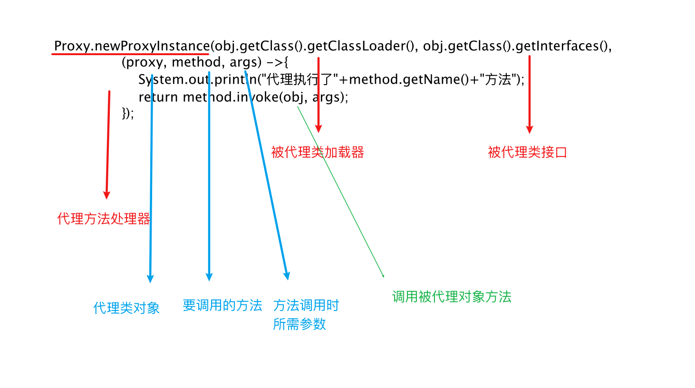
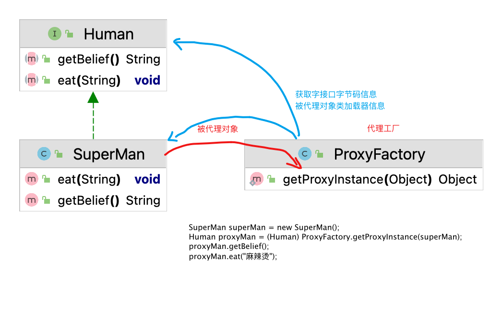

# se基础--3.动态代理

**代理设计模式的原理**:

使用一个代理将对象包装起来, 然后用该代理对象取代原始对象。任何对原始对象的调用都要通过代理。代理对象决定是否以及何时将方法调用转到原始对象上。

- 之前为大家讲解过代理机制的操作，属于静态代理，特征是代理类和目标对象的类都是在编译期间确定下来，不利于程序的扩展。同时，每一个代理类只能为一个接口服务，这样一来程序开发中必然产生过多的代理。**最好可以通过一个代理类完成全部的代理功能。**动态代理是指客户通过代理类来调用其它对象的方法，并且是在程序运行时根据需要动态创建目标类的代理对象。

- 动态代理使用场合:

- 调试

- 远程方法调用

- **动态代理相比于静态代理的优点：**抽象角色中（接口）声明的所有方法都被转移到调用处理器一个集中的方法中处理，这样，我们可以更加灵活和统一的处理众多的方法

## jdk动态代理API

> 静态代理

```java
//代理类
class ProxyClothFactory implements ClothFactory {
    private ClothFactory factory;
    public ProxyClothFactory(ClothFactory factory) {
        this.factory = factory;
    }
    @Override
    public void produceCloth() {
        sout("代理前工作。。。");
        factory.produceCloth;
        sout("代理后工作");
    }
}

//被代理类
Class NikeClothFactory implements ClothFactory {
    @Override
    public void produceCloth() {
        sout("nike....")
    }
}


NikeClothFactory nike = new NikeClothFactory();
ProxyClothFactory proxyClothFactory = new ProxyClothFactory(nike);
proxyClothFactory.produceCloth();
```


**Proxy** ：专门完成代理的操作类，是所有动态代理类的父类。通过此类为一个或多个接口动态地生成实现类。

| 方法                                                         | 作用                                |
| ------------------------------------------------------------ | ----------------------------------- |
| `static Class<?> getProxyClass(ClassLoader loader, Class<?>... interfaces)` | 创建一个动态代理类所对应的Class对象 |
| `static Object newProxyInstance(ClassLoader loader, Class<?>[] interfaces,InvocationHandler h)` | 直接创建一个动态代理对象            |



### 代码演示



> 接口

```java
public interface Human {
    String getBelief();

    void eat(String food);
}
```

>被代理对象

```java
/**
 * 被代理类
 */
public class SuperMan implements Human{
    @Override
    public String getBelief() {
        return "I believe I can fly!";
    }

    @Override
    public void eat(String food) {
        System.out.println("I'm eating " + food);
    }
}
```

> 代理工厂

```java
/**
 * 想要实现动态代理，需要解决的问题
 * 1、如何加载到内存中的被代理类，动态创建一个代理类的对象
 * 2、通过代理类的对象调用方法时，如何动态调用被代理类同名方法
 */
public class ProxyFactory {
    public static Object getProxyInstance(Object obj){
        /*
        参数一：被代理类的 ClassLoader对象
        参数二：被代理类的 接口字节码对象
        参数三：实现这个接口InvocationHandler对象
            参数一：代理对象
            参数二：代理对象调用的方法
            参数三：方法参数

            方法反射调用：被代理对象，方法参数
            return返回的是方法的返回值
         */
        return Proxy.newProxyInstance(obj.getClass().getClassLoader(), obj.getClass().getInterfaces(),
                (proxy, method, args) ->{
                    System.out.println("代理执行了"+method.getName()+"方法");
                    return method.invoke(obj, args);
                });
    }
}
```

> 测试

```java
public class TestProxy {

    @Test
    public void test01(){
        SuperMan superMan = new SuperMan();
        Human proxyMan = (Human) ProxyFactory.getProxyInstance(superMan);
        proxyMan.getBelief();
        proxyMan.eat("麻辣烫");
    }
}
```


