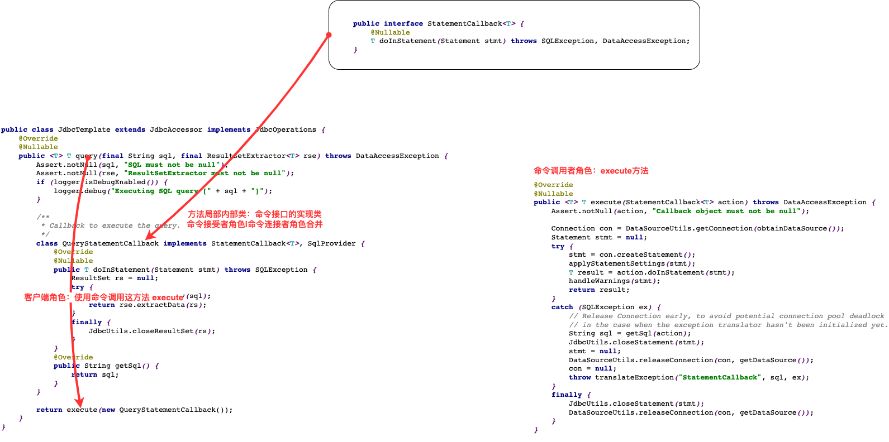

# se基础--类的成员--5.内部类

当一个事物的内部，还有一个部分需要一个完整的结构进行描述，而这个内部的完整的结构又只为外部事物提供服务，那么整个内部的完整结构最好使用内部类。

## 分类

按位置分：

- 局部内部类（方法、构造器、代码块）
- 成员内部类（静态、非静态）


在Java中，内部类可以分为

1. **静态内部类（Static Nested Class）**：静态内部类与普通内部类的唯一区别是，静态内部类在定义时需要使用static关键字。静态内部类不能访问外部类的非静态成员。
2. **非静态内部类（Non-Static Nested Class）**：也被称为成员内部类。它访问外部类的所有成员（包括静态和非静态），包括其方法、变量等。非静态内部类在创建时需要一个外部类的实例。
3. **局部内部类（Local Inner Class）**：在方法内部定义的内部类。它只能访问方法内的final变量和参数。
4. **匿名内部类（Anonymous Inner Class）**：没有名称的内部类。这种类通常用于一次性实现接口或者抽象类。

需要注意的是，对于局部内部类和匿名内部类，它们不能有构造函数，因为它们没有名称。


## 局部内部类

### 特点

- 内部类仍然是一个独立的类，在编译之后内部类会被编译成独立的.class文件，但是前面冠以外部类的类名和$符号，以及数字编号。
- 只能在声明它的方法或代码块中使用，而且是先声明后使用。除此之外的任何地方都不能使用该类。
- 局部内部类可以使用外部类的成员，包括私有的。
- <font color=red>局部内部类可以使用外部方法的局部变量，但是必须是final的</font>。由局部内部类和局部变量的声明周期不同所致。
- 局部内部类和局部变量地位类似，不能使用public,protected,缺省,private
- 局部内部类不能使用static修饰，因此也不能包含静态成员

### 如何声明局部内部类

声明在 方法、构造器、代码块中

```java
class Person {
    //方法内
    public void method(){
		//局部内部类
        class AA {
            
        }
    }
    
    //构造器内
    Person(){
        class BB {
            
        }
    }
    
    
    //代码块内
    {
        //局部内部类
        class CC {
            
        }
    }
}
```

### 演示局部内部类使用

```java
class Person {

    //方式一
    public Comparable getComparable() {
        class MyComparable implements Comparable {
            @Override
            public int compareTo(Object o) {
                // 实现比较逻辑
                return 0;
            }
        }
        return new MyComparable();
    }
    //匿名局部内部类
    public Comparable getComparableTwo() {
        return new  Comparable (){
            @Override
            public int compareTo(Object o) {
                // 实现比较逻辑
                return 0;
            }
        };
    }
}
```

### 源码中的案例



## 匿名内部类

匿名内部类不能定义任何静态成员、方法和类，只能创建匿名内部类的一个实例。一个匿名内部类一定是在new的后面，用其隐含实现一个接口或实现一个类

```java
new 父类构造器（实参列表）|实现接口(){
    //匿名内部类的类体部分
}
```

**匿名内部类的特点**

- 匿名内部类必须继承父类或实现接口
- 匿名内部类只能有一个对象
- 匿名内部类对象只能使用多态形式引用

```java
interface A {
    public abstract void fun1();
}

public class Outer {
    public static void main(String[] args) {
        new Outer().callInner(new A() {
            //接口是不能new但此处比较特殊是子类对象实现接口，只不过没有为对象取名
            public void fun1() {
                System.out.println("implement for fun1 ");
            }
        });// 两步写成一步了
    }

    public void callInner(A a) {
        a.fun1();
    }
}
```


## 成员内部类

### 特点

**成员内部类作为类的成员的角色：**

- 和外部类不同，Inner class还可以声明为**private**或**protected**；
- 可以调用外部类的结构
- Inner class 可以声明为**static**的，但此时就不能再使用外层类的非static的成员变量；

**成员内部类作为类的角色：**

- 可以在内部定义属性、方法、构造器等结构
- 可以声明为**abstract**类 ，因此可以被其它的内部类继承
- 可以声明为**final**的
- 编译以后生成OuterClass$InnerClass.class字节码文件（也适用于局部内部类）

【注意】

- 非static的成员内部类中的成员不能声明为static的，只有在外部类或static的成员内部类中才可声明static成员。
- 外部类访问成员内部类的成员，需要“内部类.成员”或“内部类对象.成员”的方式
- 成员内部类可以直接使用外部类的所有成员，包括私有的数据
- 当想要在外部类的静态成员部分使用内部类时，可以考虑内部类声明为静态的

### 如何声明成员内部类

```java
class Person {
    //非静态成员内部类
    class AA {

    }
    //静态成员内部类
    static class BB {
        
    }
}
```

> 一方面作为类：
>
> - 类内部可以定义：属性、方法、构造器等
> - 可被final修饰
> - 可以被abstract修饰

```java
class Person {
    //非静态成员内部类
    final class AA {
		String name;
        public AA(){
            
        }
        public void show(){
            System.out.println("zs")
        }
    }
    //静态成员内部类
    static class BB {
        String name;
        int age;
        public void show(){
            System.out.println("zs")
        }
    }
}
```


> 二方面作为成员
>
> - 静态内部类中只能调用外部类静态的方法或属性，非静态可以调用外部类成员方法
>
>   省略了`外部类.this.外部类方法()`
>
> - 可以被static修饰
>
> - 可以被权限修饰符修饰

```java
class Person {
    public void eat(){
        
    }
    
    //非静态成员内部类
    final class AA {
		String name;
        public AA(){
            //省略了Person.this.eat()
            eat();
        }
        public void show(){
            System.out.println("zs")
        }
    }
    //静态成员内部类
    static class BB {
        String name;
        int age;
        public void show(){
            System.out.println("zs")
        }
    }
}
```

### 实例化成员内部类

```java
class Person {
    //非静态成员内部类
    class AA {
        public void show(){
            System.out.println("zs")
        }
    }
    //静态成员内部类
    static class BB {
        public void show(){
            System.out.println("zs")
        }
    }
}


//创建静态成员内部类对象
Person.BB bb = new Person.BB();
bb.show();

//创建非静态成员内部类对象
Person p = new Person();
Person.AA aa = p.new AA();
aa.show();
```

### 成员内部类中区分调用外部类结构

```java
class Person {
    String name;
    String age;
    //外部类同名方法
    public void show() {
        System.out.println("外部类 show");
    }
    public void b() {
        System.out.println("外部类 b");
    }
    //非静态成员内部类
    class AA {
        String name;

        public void show(){
            System.out.println("zs");
        }
        public void a(){
            //调用外部类同名方法
            Person.this.show();
            //没有同名方法时可直接调用
            b();
        }
        public void display(String name) {
            //有同名时调用外部类属性
            System.out.println(name);
            System.out.println(this.name);
            System.out.println(Person.this.name);
            //没有同名时直接调用外部类属性
            System.out.println(age);
        }
    }
}

```

### 外部类调用成员内部类结构

非静态成员内部类

- 外部类中可直接实例化内部类对象，且无视内部类中的所有权限修饰符，可直接操作

- 其他类中实例化内部类对象受权限修饰符影响，且访问内部类成员也受内部类成员权限修饰符影响

静态成员内部类

- 外部类中可直接实例化内部类对象，且无视内部类中的所有权限修饰符，可直接操作
- 这是因为静态内部类是静态的，不属于任何对象，所以它的访问权限不受外部类的影响。

```java
class Person {
    //外部类同名方法
    public void show() {
        System.out.println("外部类 show");
        //=====调用内部类成员或方法=====
        //实例化内部类对象
        AA aa = new AA();
        //可直接操作内部类私有的成员或方法
        aa.show();
        aa.name = "zs";

        //=====调用内部类成员或方法=====
        BB bb = new BB();
        BB.age = "18";
        bb.show();
    }

    //非静态成员内部类
    private class AA {
        private String name = "default";

        private void show() {
            System.out.println("内部类 show");
        }
    }

    static class BB {
        private String name = "default";
        private static String age = "default";

        private void show() {
            System.out.println("内部类 show");
        }
    }
}
```


```java
class Outer {
    private int s;
    public class Inner {
        public void mb() {
            s = 100;
            System.out.println("在内部类Inner中s=" + s);
        }
    }
    public void ma() {
        Inner i = new Inner();
        i.mb();
    }
}

public class InnerTest {
    public static void main(String args[]) {
        Outer o = new Outer();
        o.ma();
    }
}
```

```java
public class Outer {
    private int s = 111;

    public class Inner {
        private int s = 222;

            public void mb(int s) {
            System.out.println(s); // 局部变量s
            System.out.println(this.s); // 内部类对象的属性s
            System.out.println(Outer.this.s); // 外部类对象属性s
        }
    }

    public static void main(String args[]) {
        Outer a = new Outer();
        Outer.Inner b = a.new Inner();
        b.mb(333);
    }
}
```

