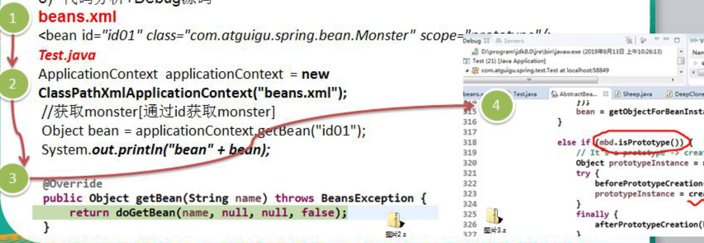
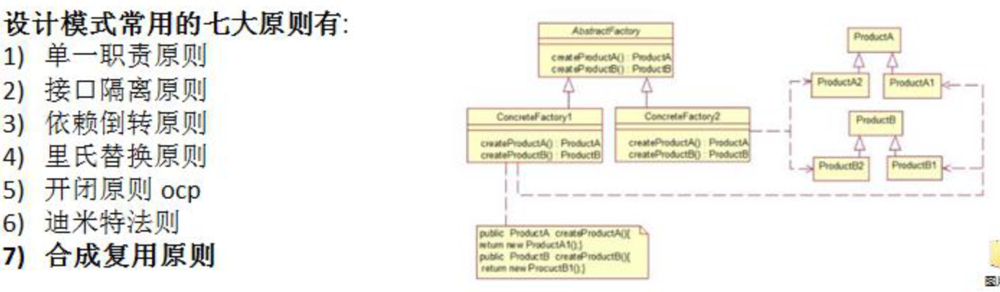
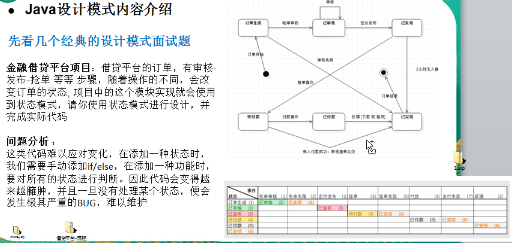
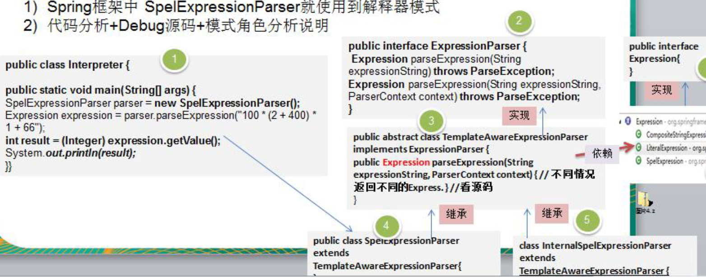

## 设计模式--0.Java 设计模式内容介绍

### 先看几个经典的面试题

#### 原型设计模式问题

1. 有请使用 UML 类图画出原型模式核心角色

2. 原型设计模式的深拷贝和浅拷贝是什么，并写出深拷贝的两种方式的源码(重写 clone 方法实现深拷贝、使用序
   列化来实现深拷贝)

3. 在 Spring 框架中哪里使用到原型模式，并对源码进行分析

   ```
   beans.xml
   <bean id="id01" class="com.atguigu.spring.bean.Monster" scope="prototype"/>
   ```

4. Spring 中原型 bean 的创建，就是

5. 原型模式的应用

6. 代码分析+Debug 源码

   


#### 设计模式的七大原则

要求：1) 七大设计原则核心思想 2) 能够以类图的说明设计原则 3) 在项目实际开发中，你在哪里使用到了 ocp 原则

 

#### 状态设计模式



#### 解释器设计模式

1) 介绍解释器设计模式是什么?
2) 画出解释器设计模式的 UML 类图,分析设计模式中的各个角色是什么?

3) 请说明 Spring 的框架中，哪里使用到了解释器设计模式，并做源码级别的分析

4) Spring 框架中 SpelExpressionParser 就使用到解释器模式

5) 代码分析+Debug 源码+模式角色分析说明

   

#### 单例模式

单例设计模式一共有几种实现方式？请分别用代码实现，并说明各个实现方式的优点和缺点?

单例设计模式一共有 8 种写法，后面我们会依次讲到
饿汉式 两种
懒汉式 三种
双重检查
静态内部类
枚举

## 设计模式的重要性

1) 软件工程中，设计模式（design pattern）是对软件设计中普遍存在（反复出现）的各种问题，所提出的解决方
   案。这个术语是由埃里希·伽玛（Erich Gamma）等人在 1990 年代从建筑设计领域引入到计算机科学的

2) 大厦 VS 简易房

   

3) 拿实际工作经历来说, 当一个项目开发完后，如果客户提出增新功能，怎么办?。（可扩展性,使用设计模式，软
   件具有很好的扩展性）

    

4) 如果项目开发完后，原来程序员离职，你接手维护该项目怎么办? (维护性[可读性、规范性])
5) 目前程序员门槛越来越高，一线 IT 公司(大厂)，都会问你在实际项目中使用过什么设计模式，怎样使用的，解决了什么问题。
6) 设计模式在软件中哪里？`面向对象(oo)=>功能模块[设计模式+算法(数据结构)]=>框架[使用到多种设计模式]=>架构 [服务器集群]
7) 如果想成为合格软件工程师，那就花时间来研究下设计模式是非常必要的.