# 设计模式--0.UML类图

## UML 基本介绍

1) UML——Unified modeling language UML (统一建模语言)，是一种用于软件系统分析和设计的语言工具，它用
   于帮助软件开发人员进行思考和记录思路的结果
2) UML 本身是一套符号的规定，就像数学符号和化学符号一样，这些符号用于描述软件模型中的各个元素和他
   们之间的关系，比如类、接口、实现、泛化、依赖、组合、聚合等，如右图:

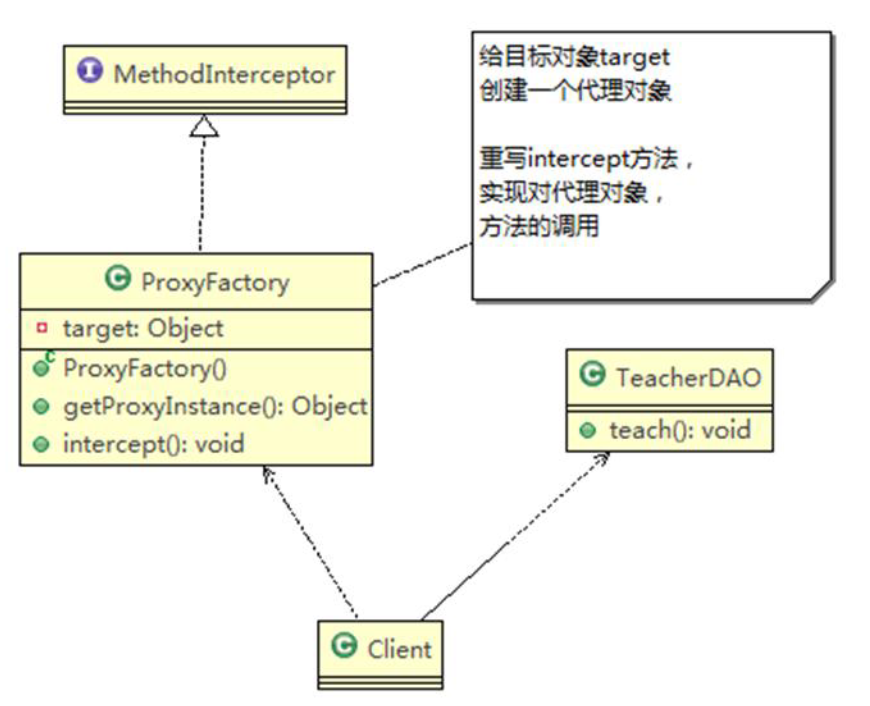

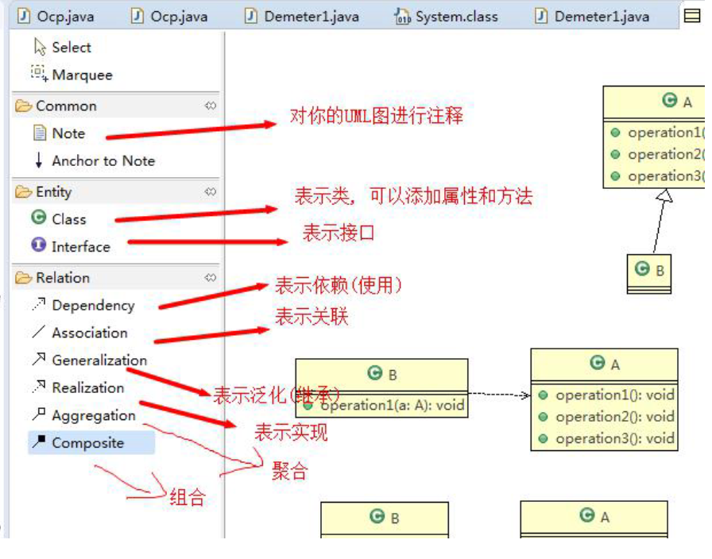

3) 使用 UML 来建模，常用的工具有 Rational Rose , 也可以使用一些插件来建模

## UML 图

画 UML 图与写文章差不多，都是把自己的思想描述给别人看，关键在于思路和条理，UML 图分类：

1) 用例图(use case)
2) 静态结构图：<font color=red>类图</font>、对象图、包图、组件图、部署图
3) 动态行为图：交互图（时序图与协作图）、状态图、活动图

说明：

1) 类图是描述类与类之间的关系的，是 UML 图中最核心的
2) 在讲解设计模式时，我们必然会使用类图，为了让学员们能够把设计模式学到位，需要先给大家讲解类图
3) 温馨提示：如果已经掌握 UML 类图的学员，可以直接听设计模式的章节

## UML 类图

1) 用于描述系统中的类(对象)本身的组成和类(对象)之间的各种静态关系。
2) 类之间的关系：<font color=red>依赖、泛化（继承）、实现、关联、聚合与组合。</font>
3) 类图简单举例

```java
public class Person { //代码形式->类图
    private Integer id;
    private String name;

    public void setName(String name) {
        this.name = name;
    }

    public String getName() {
        return name;
    }
}
```

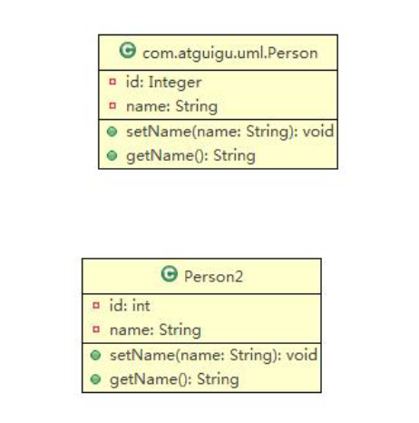

## 类图—依赖关系（Dependence）

只要是在类中用到了对方，那么他们之间就存在依赖关系。如果没有对方，连编绎都通过不了。

```java
public class PersonServiceBean {
    private PersonDao personDao;//类

    public void save(Person person) {
    }

    public IDCard getIDCard(Integer personid) {
    }

    public void modify() {
        Department department = new Department();
    }
}
public class PersonDao {}
public class IDCard {}
public class Person {}
public class Department {}
```

对应的类图：

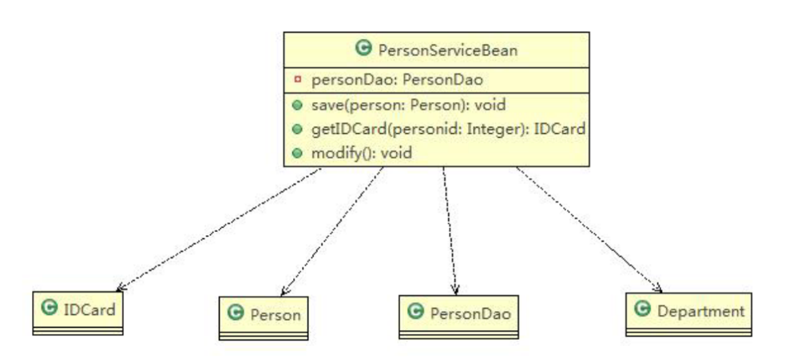

小结

1) 类中用到了对方
2) 如果是类的成员属性
3) 如果是方法的返回类型
4) 是方法接收的参数类型
5) 方法中使用到

## 类图—泛化关系(generalization）

泛化关系实际上就是继承关系，他是依赖关系的特例

```java
public abstract class DaoSupport {
    public void save(Object entity) {
    }

    public void delete(Object id) {
    }
}

public class PersonServiceBean extends Daosupport { }
```

对应的类图

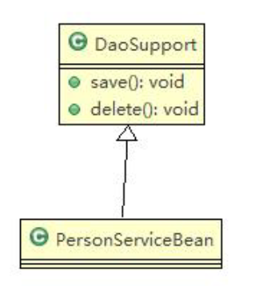

小结:

1) 泛化关系实际上就是继承关系

2) 如果 A 类继承了 B 类，我们就说 A 和 B 存在泛化关系

## 类图—实现关系（Implementation）

实现关系实际上就是 A 类实现 B 接口，他是依赖关系的特例

```java
public interface PersonService {
    public void delete(Interger id);
}

public class PersonServiceBean implements PersonService {
    public void delete(Interger id) {}
}
```

对应的类图

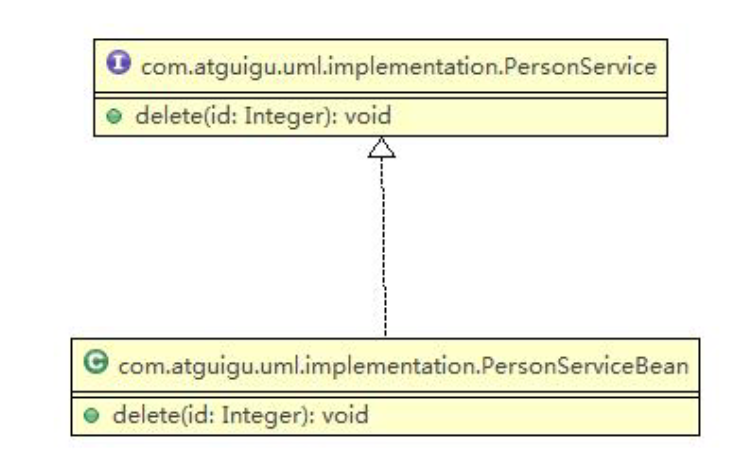

小结:

## 类图—关联关系（Association）

关联关系实际上是**类与类之间的联系，他是依赖关系的特例**

关联具有<font color=red>导航性</font>：即双向关系或单向关系

关系具有多重性：如“1”（表示有且仅有一个），“0...”（表示0个或者多个），“0,1”（表示0个或者一个），“n...m”（表示n到m个都可以），“m...*”（表示至少m个）。

单向一对一关系

```java
public class Person {
    private IDCard card;
}
public class IDCard {}
```

双向一对一关系

```java
public class Person {
    private IDCard card;
}
public class IDCard {
    private Person card;
}
```

 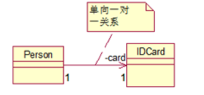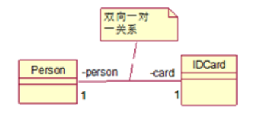

## 类图—聚合关系（Aggregation）

### 基本介绍

聚合关系（Aggregation）表示的是整体和部分的关系，<font color=blue>**整体与部分可以分开**</font>。<font color=red>聚合关系是关联关系的特例</font>，所以他具有关联的导航性与多重性。

如：一台电脑由键盘(keyboard)、显示器(monitor)，鼠标等组成；
组成电脑的各个配件是可以从电脑上分离出来的，使用带空心菱形的实线来表示：

### 应用实例

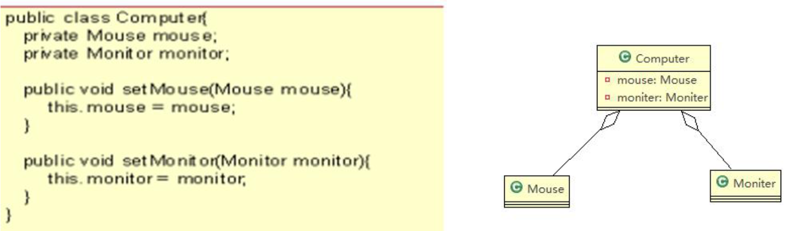

## 类图—组合关系（Composition）

### 基本介绍

组合关系：也是整体与部分的关系，但是整体与部分不可以分开。

基本介绍
组合关系：也是整体与部分的关系，但是<font color=blue>整体与部分不可以分开。</font>
再看一个案例：在程序中我们定义实体：Person 与 IDCard、Head, 那么 Head 和 Person 就是 组合，IDCard 和Person 就是聚合。

但是如果在程序中 Person 实体中定义了对 IDCard 进行<font color=red>**级联删除**</font>，即删除 Person 时连同 IDCard 一起删除，那么 IDCard 和 Person 就是组合了.

### 应用案例

```java
public class Person {
    private IDCard card;
    private Head head = new Head();
}

public class IDCard { }

public class Head { }
```

对应的类图:

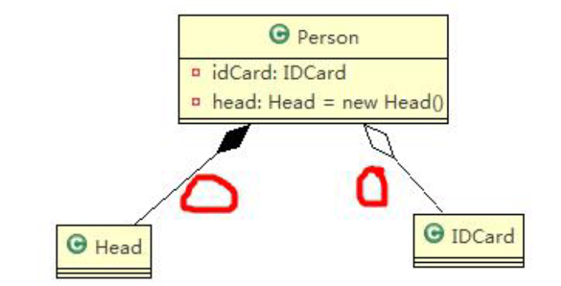

案例 2

```java
public class Computer {
    private Mouse mouse = new Mouse(); //鼠标可以和 computer 不能分离
    private Moniter moniter = new Moniter();//显示器可以和 Computer 不能分离

    public void setMouse(Mouse mouse) {
        this.mouse = mouse;
    }

    public void setMoniter(Moniter moniter) {
        this.moniter = moniter;
    }
}

public class Mouse { }

public class Moniter { }
```

对应的类图

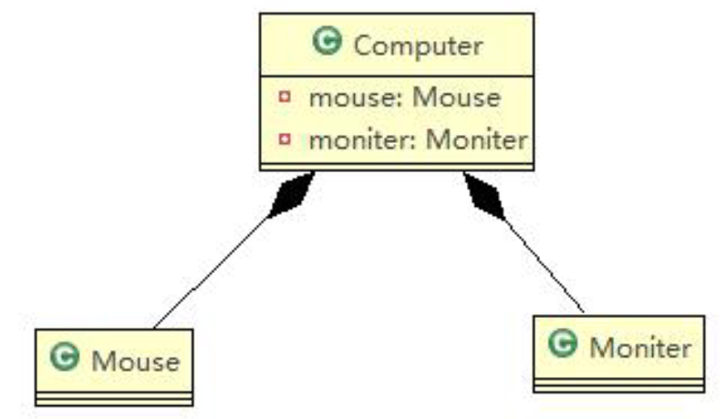