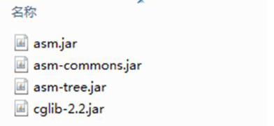

# 代理模式

代理模式的基本介绍

1）代理模式：为一个对象<font color=red>提供一个替身</font>，以控制对这个对象的访问。即通过代理对象访问目标对象.这样做的好处是:可以在目标对象实现的基础上,增强额外的功能操作,即扩展目标对象的功能。
2）被代理的对象可以是**远程对象**、<font color=red>创建开销大的对象</font>或<font color=red>需要安全控制的对象</font>
3） 代理模式有不同的形式, 主要有三种 **静态代理**、**动态代理 (JDK 代理、接口代理)**和 **Cglib 代理** (可以在内存
动态的创建对象，而不需要实现接口， 他是属于动态代理的范畴) 。
4）代理模式示意图


## 静态代理(接口、父类)

### 静态代码模式的基本介绍

静态代理在使用时,需要定义接口或者父类,被代理对象(即目标对象)与代理对象一起实现相同的接口或者是继承相同父类


### 应用实例

具体要求

1) 定义一个接口:`ITeacherDao`

2) 目标对象 `TeacherDao` 实现接口 `ITeacherDao`

3) 使用静态代理方式,就需要在代理对象 `TeacherDaoProxy` 中也实现 `ITeacherDao`

4) 调用的时候通过调用代理对象的方法来调用目标对象.

5) 特别提醒：代理对象与目标对象要实现相同的接口,然后通过调用相同的方法来调用目标对象的方法


### 代码实现

```java
package com.zs.design.proxy.staticproxy;

public class Client {
    public static void main(String[] args) {
        //创建目标对象(被代理对象)
        TeacherDao teacherDao = new TeacherDao();

        //创建代理对象, 同时将被代理对象传递给代理对象
        TeacherDaoProxy teacherDaoProxy = new TeacherDaoProxy(teacherDao);

        //通过代理对象, 调用被代理对象的方法
        //即：执行的是代理对象的方法，代理对象再去调用目标对象的方法
        teacherDaoProxy.teach();
    }
}
```

```java
//接口
public interface ITeacherDao {
    void teach(); // 授课的方法
}
```

```java
package com.zs.design.proxy.staticproxy;

public class TeacherDao  implements ITeacherDao{
    @Override
    public void teach() {
        System.out.println(" 老师授课中 。。。。。");
    }
}
```

```java
package com.zs.design.proxy.staticproxy;

//代理对象,静态代理
public class TeacherDaoProxy implements ITeacherDao{

    private ITeacherDao target; // 目标对象，通过接口来聚合

    //构造器
    public TeacherDaoProxy(ITeacherDao target) {
        this.target = target;
    }

    @Override
    public void teach() {
        System.out.println("开始代理 完成某些操作。。。。。 ");//方法
        target.teach();
        System.out.println("提交。。。。。");//方法
    }
}
```

### 静态代理优缺点

1) 优点：在不修改目标对象的功能前提下, 能通过代理对象对目标功能扩展

2) 缺点：因为代理对象需要与目标对象实现一样的接口,所以会有很多代理类

3) 一旦接口增加方法,目标对象与代理对象都要维护


## 动态代理(jdk代理、接口代理)

### 动态代理模式的基本介绍

1) 代理对象,不需要实现接口，但是目标对象要实现接口，否则不能用动态代理

2) 代理对象的生成，是利用 JDK 的 API，动态的在内存中构建代理对象

3) 动态代理也叫做：JDK 代理、接口代理


### JDK 中生成代理对象的 API

1) 代理类所在包:`java.lang.reflect.Proxy`

2) JDK 实现代理只需要使用 `newProxyInstance` 方法,但是该方法需要接收三个参数,完整的写法是:
   `static Object newProxyInstance(ClassLoader loader, Class<?>[] interfaces,InvocationHandler h )`

### 应用实例

应用实例要求

将前面的静态代理改进成动态代理模式(即：JDK 代理模式)

思路图解(类图)


### 代码实现

```java
package com.zs.design.proxy.jdkproxy;

public class Client {
    public static void main(String[] args) {
        //创建目标对象(被代理对象)
        TeacherDao target = new TeacherDao();

        //给目标对象，创建代理对象, 可以转成 ITeacherDao
        ITeacherDao proxyInstance = (ITeacherDao)new ProxyFactory(target).getProxyInstance();

        // proxyInstance=class com.sun.proxy.$Proxy0 内存中动态生成了代理对象
        System.out.println("proxyInstance=" + proxyInstance.getClass());

        //通过代理对象，调用目标对象的方法
        //proxyInstance.teach();
        proxyInstance.sayHello(" tom ");
    }
}
```

```java
package com.zs.design.proxy.jdkproxy;

//接口
public interface ITeacherDao {
    void teach(); // 授课的方法
    void sayHello(String name);
}
```

```java
package com.zs.design.proxy.jdkproxy;


import java.lang.reflect.InvocationHandler;
import java.lang.reflect.Method;
import java.lang.reflect.Proxy;

public class ProxyFactory {
    //维护一个目标对象 , Object
    private Object target;

    //构造器 ， 对 target 进行初始化
    public ProxyFactory(Object target) {
        this.target = target;
    }

    //给目标对象 生成一个代理对象
    public Object getProxyInstance() {
        //说明
        /*
         * public static Object newProxyInstance(ClassLoader loader,Class<?>[] interfaces,InvocationHandler h)
        //1. ClassLoader loader ： 指定当前目标对象使用的类加载器, 获取加载器的方法固定
        //2. Class<?>[] interfaces: 目标对象实现的接口类型，使用泛型方法确认类型
        //3. InvocationHandler h : 事情处理，执行目标对象的方法时，会触发事情处理器方法, 会把当前执行的目标对象方法作为参数传入
        */
        return Proxy.newProxyInstance(target.getClass().getClassLoader(),
                target.getClass().getInterfaces(),
                new InvocationHandler() {
                    @Override
                    public Object invoke(Object proxy, Method method, Object[] args) throws Throwable {
                        System.out.println("JDK 代理开始~~");
                        //反射机制调用目标对象的方法
                        Object returnVal = method.invoke(target, args);
                        System.out.println("JDK 代理提交");
                        return returnVal;
                    }
                });
    }
}
```

```java
package com.zs.design.proxy.jdkproxy;


public class TeacherDao implements ITeacherDao {
    @Override
    public void teach() {
        System.out.println(" 老师授课中 。。。。。");
    }

    @Override
    public void sayHello(String name) {
        System.out.println("hello " + name);
    }
}
```


## Cglib 代理

### Cglib 代理模式的基本介绍

1) 静态代理和 JDK 代理模式都要求目标对象是实现一个接口,但是有时候目标对象只是一个单独的对象,并没有实
   现任何的接口,这个时候可使用目标对象子类来实现代理-这就是 Cglib 代理
2) Cglib 代理也叫作子类代理,它是<font color=red>在内存中构建一个子类对象</font>从而实现对目标对象功能扩展, 有些书也将 Cglib 代
   理归属到动态代理。
3) Cglib 是一个强大的高性能的代码生成包,它可以在运行期扩展 java 类与实现 java 接口.它广泛的被许多 AOP 的
   框架使用,例如 Spring AOP，实现方法拦截
4) 在 AOP 编程中如何选择代理模式：
   1) 目标对象需要实现接口，用 JDK 代理
   2) 目标对象不需要实现接口，用 Cglib 代理
5) <font color=red>Cglib 包的底层是通过使用字节码处理框架 ASM 来转换字节码并生成新的类</font>

### Cglib 代理模式实现步骤

1) 需要引入 cglib 的 jar 文件

    

2) 在内存中动态构建子类，注意<font color=red>代理的类不能为 final</font>，否则报错`java.lang.IllegalArgumentException:`

3) 目标对象的方法如果为` final/static`,那么就不会被拦截,即不会执行目标对象额外的业务方法.

### 应用实例

应用实例要求

将前面的案例用 Cglib 代理模式实现

思路图解(类图)


### 代码实现+Debug 源码[待 debug]

```xml
<dependency>
    <groupId>cglib</groupId>
    <artifactId>cglib</artifactId>
    <version>3.3.0</version>
</dependency>
```


```java
package com.zs.design.proxy.cglibproxy;
public class Client {
    public static void main(String[] args) {
        //创建目标对象
        TeacherDao target = new TeacherDao();
        //获取到代理对象，并且将目标对象传递给代理对象
        TeacherDao proxyInstance = (TeacherDao) new ProxyFactory(target).getProxyInstance();
        //执行代理对象的方法，触发 intecept 方法，从而实现 对目标对象的调用
        String res = proxyInstance.teach();
        System.out.println("res=" + res);
    }
}
```

```java
package com.zs.design.proxy.cglibproxy;

import net.sf.cglib.proxy.Enhancer;
import net.sf.cglib.proxy.MethodInterceptor;
import net.sf.cglib.proxy.MethodProxy;

import java.lang.reflect.Method;

public class ProxyFactory implements MethodInterceptor {

    //维护一个目标对象
    private Object target;

    //构造器，传入一个被代理的对象
    public ProxyFactory(Object target) {
        this.target = target;
    }

    //返回一个代理对象: 是 target 对象的代理对象
    public Object getProxyInstance() {
        //1. 创建一个工具类
        Enhancer enhancer = new Enhancer();
        //2. 设置父类
        enhancer.setSuperclass(target.getClass());
        //3. 设置回调函数
        enhancer.setCallback(this);
        //4. 创建子类对象，即代理对象
        return enhancer.create();
    }
    //重写 intercept 方法，会调用目标对象的方法


    @Override
    public Object intercept(Object arg0, Method method, Object[] args, MethodProxy arg3) throws Throwable {
        System.out.println("Cglib 代理模式 ~~ 开始");
        Object returnVal = method.invoke(target, args);
        System.out.println("Cglib 代理模式 ~~ 提交");
        return returnVal;
    }

}
```

```java
package com.zs.design.proxy.cglibproxy;

public class TeacherDao {
    public String teach() {
        System.out.println(" 老师授课中 ， 我是 cglib 代理，不需要实现接口 ");
        return "hello";
    }
}
```

## 几种常见的代理模式介绍— 几种变体

1) 防火墙代理
   内网通过代理穿透防火墙，实现对公网的访问。
2) 缓存代理
   比如：当请求图片文件等资源时，先到缓存代理取，如果取到资源则 ok,如果取不到资源，再到公网或者数据库取，然后缓存。

3) 远程代理
   远程对象的本地代表，通过它可以把远程对象当本地对象来调用。远程代理通过网络和真正的远程对象沟通信息。

    

4) 同步代理：主要使用在多线程编程中，完成多线程间同步工作
   同步代理：主要使用在多线程编程中，完成多线程间同步工作