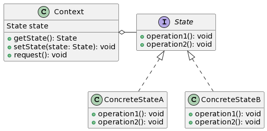

# 设计模式--3.3.9.行为型--状态模式

## APP 抽奖活动问题

请编写程序完成 APP 抽奖活动 具体要求如下:

1) 假如每参加一次这个活动要扣除用户 50 积分，中奖概率是 10%

2) 奖品数量固定，抽完就不能抽奖

3) 活动有四个状态: 可以抽奖、不能抽奖、发放奖品和奖品领完

4) 活动的四个状态转换关系图(右图)

    

## 状态模式基本介绍

基本介绍

1) 状态模式（State Pattern）：它主要用来解决对象在多种状态转换时，需要对外输出不同的行为的问题。状态和行为是一一对应的，状态之间可以相互转换

2) 当一个对象的内在状态改变时，允许改变其行为，这个对象看起来像是改变了其类

## 状态模式的原理类图



对原理类图的说明-即(状态模式的角色及职责)

1) Context 类为环境角色, 用于维护 State 实例,这个实例定义当前状态

2) State 是抽象状态角色,定义一个接口封装与 Context 的一个特定接口相关行为

3) ConcreteState 具体的状态角色，每个子类实现一个与 Context 的一个状态相关行为

## 状态模式解决 APP 抽奖问

1) 应用实例要求
   完成 APP 抽奖活动项目，使用状态模式.

2) 思路分析和图解(类图)

   - 定义出一个接口叫状态接口，每个状态都实现它。
   - 接口有扣除积分方法、抽奖方法、发放奖品方法

   

3) 代码实现

> 状态抽象类

```java

/**
 * 状态抽象类
 *
 * @author Administrator
 */
public abstract class State {
    // 扣除积分 - 50
    public abstract void deductMoney();

    // 是否抽中奖品
    public abstract boolean raffle();

    // 发放奖品
    public abstract void dispensePrize();
}
```


> 状态

```java
package com.zs.design.state;

/**
 * 不能抽奖状态
 *
 * @author Administrator
 */
public class NoRaffleState extends State {
    // 初始化时传入活动引用，扣除积分后改变其状态
    RaffleActivity activity;

    public NoRaffleState(RaffleActivity activity) {
        this.activity = activity;
    }

    // 当前状态可以扣积分 , 扣除后，将状态设置成可以抽奖状态
    @Override
    public void deductMoney() {
        System.out.println("扣除 50 积分成功，您可以抽奖了");
        activity.setState(activity.getCanRaffleState());
    }

    // 当前状态不能抽奖
    @Override
    public boolean raffle() {
        System.out.println("扣了积分才能抽奖喔！");
        return false;
    }

    // 当前状态不能发奖品
    @Override
    public void dispensePrize() {
        System.out.println("不能发放奖品");
    }
}
```

```java
package com.zs.design.state;

import java.util.Random;

/**
 * Create by 张邵
 * 2024/1/22 18:31
 */
public class CanRaffleState extends State {
    RaffleActivity activity;
    public CanRaffleState(RaffleActivity activity) {
        this.activity = activity;
    }

    //已经扣除了积分，不能再扣
    @Override
    public void deductMoney() {
        System.out.println("已经扣取过了积分");
    }

    //可以抽奖, 抽完奖后，根据实际情况，改成新的状态
    @Override
    public boolean raffle() {
        System.out.println("正在抽奖，请稍等！");
        Random r = new Random();
        int num = r.nextInt(10);
        // 10%中奖机会
        if(num == 0){
            // 改变活动状态为发放奖品 context
            activity.setState(activity.getDispenseState());
            return true;
        }else{
            System.out.println("很遗憾没有抽中奖品！");
            // 改变状态为不能抽奖
            activity.setState(activity.getNoRafflleState());
            return false;
        }
    }

    // 不能发放奖品
    @Override
    public void dispensePrize() {
        System.out.println("没中奖，不能发放奖品");
    }
}
```

```java
package com.zs.design.state;

/**
 * 奖品发放完毕状态
 * 说明，当我们 activity 改变成 DispenseOutState， 抽奖活动结束
 *
 * @author Administrator
 */
public class DispenseState extends State {

    // 初始化时传入活动引用，发放奖品后改变其状态
    RaffleActivity activity;

    public DispenseState(RaffleActivity activity) {
        this.activity = activity;
    }


    @Override
    public void deductMoney() {
        System.out.println("不能扣除积分");
    }

    @Override
    public boolean raffle() {
        System.out.println("不能抽奖");
        return false;
    }

    //发放奖品
    @Override
    public void dispensePrize() {
        if (activity.getCount() > 0) {
            System.out.println("恭喜中奖了");
            // 改变状态为不能抽奖
            activity.setState(activity.getNoRafflleState());
        } else {
            System.out.println("很遗憾，奖品发送完了");
            // 改变状态为奖品发送完毕, 后面我们就不可以抽奖
            activity.setState(activity.getDispensOutState());
            //System.out.println("抽奖活动结束");
            //System.exit(0);
        }
    }
}
```

```java
package com.zs.design.state;

/**
 * 奖品发放完毕状态
 * 说明，当我们 activity 改变成 DispenseOutState， 抽奖活动结束
 * @author Administrator
 *
 */
public class DispenseOutState extends State{


    // 初始化时传入活动引用
    RaffleActivity activity;

    public DispenseOutState(RaffleActivity activity){
        this.activity = activity;
    }

    @Override
    public void deductMoney() {
        System.out.println("奖品发送完了，请下次再参加");
    }

    @Override
    public boolean raffle() {
        System.out.println("奖品发送完了，请下次再参加");
        return false;
    }

    @Override
    public void dispensePrize() {
        System.out.println("奖品发送完了，请下次再参加");
    }
}
```


> 活动上下文对象

```java
package com.zs.design.state;

/**
 * 抽奖活动 //
 *
 * @author Administrator
 */
public class RaffleActivity {

    // state 表示活动当前的状态，是变化
    State state = null;

    // 奖品数量
    int count = 0;

    // 四个属性，表示四种状态
    State noRafflleState = new NoRaffleState(this);
    State canRaffleState = new CanRaffleState(this);
    State dispenseState = new DispenseState(this);
    State dispensOutState = new DispenseOutState(this);


    //构造器
    //1. 初始化当前的状态为 noRafflleState（即不能抽奖的状态）
    //2. 初始化奖品的数量
    public RaffleActivity(int count) {
        this.state = getNoRafflleState();
        this.count = count;
    }


    //扣分, 调用当前状态的 deductMoney
    public void deductMoney() {
        state.deductMoney();
    }

    //抽奖
    public boolean raffle() {
        // 如果当前的状态是抽奖成功
        boolean raffle = state.raffle();
        if (raffle) {
            //领取奖品
            state.dispensePrize();
        }
        return raffle;
    }


    public State getState() {
        return state;
    }

    public void setState(State state) {
        this.state = state;
    }

    //这里请大家注意，每领取一次奖品，count--
    public int getCount() {
        int curCount = count;
        count--;
        return curCount;
    }

    public void setCount(int count) {
        this.count = count;
    }

    public State getNoRafflleState() {
        return noRafflleState;
    }

    public void setNoRafflleState(State noRafflleState) {
        this.noRafflleState = noRafflleState;
    }

    public State getCanRaffleState() {
        return canRaffleState;
    }

    public void setCanRaffleState(State canRaffleState) {
        this.canRaffleState = canRaffleState;
    }

    public State getDispenseState() {
        return dispenseState;
    }

    public void setDispenseState(State dispenseState) {
        this.dispenseState = dispenseState;
    }

    public State getDispensOutState() {
        return dispensOutState;
    }

    public void setDispensOutState(State dispensOutState) {
        this.dispensOutState = dispensOutState;
    }
}

```


> Client测试

```java
package com.zs.design.state;

/**
 * 状态模式测试类
 *
 * @author Administrator
 */
public class ClientTest {
    public static void main(String[] args) {
        // 创建活动对象，奖品有 1 个奖品
        RaffleActivity activity = new RaffleActivity(1);
        // 我们连续抽 300 次奖
        for (int i = 0; i < 30; i++) {
            System.out.println("--------第" + (i + 1) + "次抽奖----------");
            // 参加抽奖，第一步点击扣除积分
            activity.deductMoney();
            // 第二步抽奖
            if (activity.raffle()) break;
        }
    }
}
```

