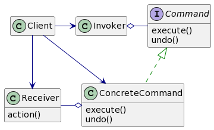
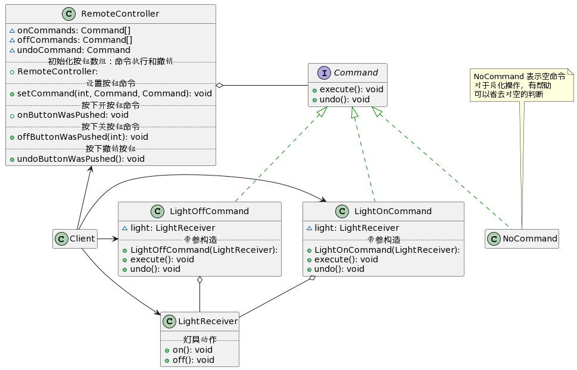
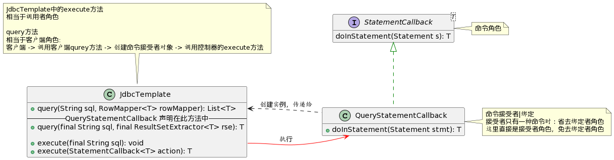
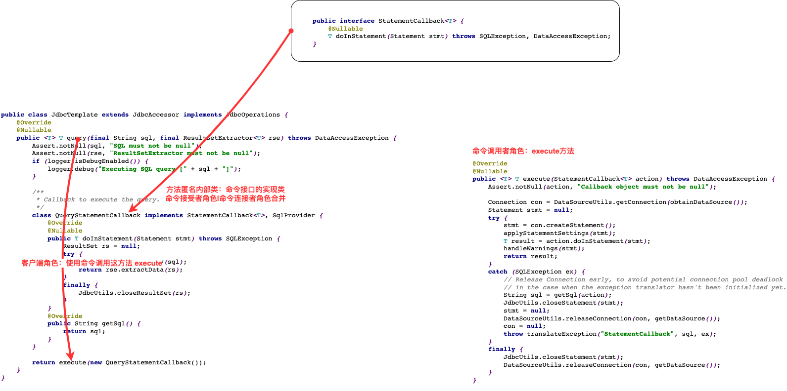

# 设计模式-0.命令模式.md

## 智能生活项目需求

看一个具体的需求


1) 我们买了一套智能家电，有照明灯、风扇、冰箱、洗衣机，我们只要在手机上安装 app 就可以控制对这些家电
   工作。
2) 这些智能家电来自不同的厂家，我们不想针对每一种家电都安装一个 App，分别控制，我们希望只要一个 app
   就可以控制全部智能家电。
3) 要实现一个 app 控制所有智能家电的需要，则每个智能家电厂家都要提供一个统一的接口给 app 调用，这时 就
   可以考虑使用命令模式。
4) 命令模式可将“动作的请求者”从“动作的执行者”对象中解耦出来.
5) 在我们的例子中，动作的请求者是手机 app，动作的执行者是每个厂商的一个家电产品

## 命令模式基本介绍

1) 命令模式（Command Pattern）：在软件设计中，我们经常需要向某些对象发送请求，但是并不知道请求的接收
   者是谁，也不知道被请求的操作是哪个，
   我们只需在程序运行时指定具体的请求接收者即可，此时，可以使用命令模式来进行设计
2) 命名模式使得请求发送者与请求接收者消除彼此之间的耦合，让对象之间的调用关系更加灵活，实现解耦。
3) 在命名模式中，会将一个请求封装为一个对象，以便使用不同参数来表示不同的请求(即命名)，同时命令模式
   也支持可撤销的操作。

4) 通俗易懂的理解：将军发布命令，士兵去执行。其中有几个角色：将军（命令发布者）、士兵（命令的具体执
   行者）、命令(连接将军和士兵)。
   Invoker 是调用者（将军），Receiver 是被调用者（士兵），MyCommand 是命令，实现了 Command 接口，持
   有接收对象

## 命令模式的原理类图



对原理类图的说明-即(命名模式的角色及职责)

1) Invoker 是调用者角色
2) Command: 是命令角色，需要执行的所有命令都在这里，可以是接口或抽象类
3) Receiver: 接受者角色，知道如何实施和执行一个请求相关的操作
4) ConcreteCommand: 将一个接受者对象与一个动作绑定，调用接受者相应的操作，实现 execute

## 命令模式解决智能生活项目

应用实例要求

1. 编写程序，使用命令模式 完成前面的智能家电项目

2. 思路分析和图解

   

3. 代码实现

> Command接口

```java
package com.zs.design.command;

//创建命令接口
public interface Command {
    //执行动作(操作)
    public void execute();

    //撤销动作(操作)
    public void undo();
}

```


> NoCommand

```java
/**
* 没有任何命令，即空执行: 用于初始化每个按钮, 当调用空命令时，对象什么都不做
* 其实，这样是一种设计模式, 可以省掉对空判断
* @author Administrator
*/
public class NoCommand implements Command {
    @Override
    public void execute() {
    }

    @Override
    public void undo() {
    }
}
```


> 灯具命令执行者角色
>
> LightReceiver

```java
public class LightReceiver {
    public void on() {
        System.out.println(" 电灯打开了.. ");
    }
    public void off() {
        System.out.println(" 电灯关闭了.. ");
    }
}
```

> 灯具命令

```java
public class LightOffCommand implements Command {
    // 聚合 LightReceiver
    LightReceiver light;
    // 构造器
    public LightOffCommand(LightReceiver light) {
        super();
        this.light = light;
    }
    @Override
    public void execute() {
        // 调用接收者的方法
        light.off();
    }
    @Override
    public void undo() {
        // 调用接收者的方法
        light.on();
    }
}
```

```java
public class LightOnCommand implements Command {
    //聚合 LightReceiver
    LightReceiver light;
    //构造器
    public LightOnCommand(LightReceiver light) {
        super();
        this.light = light;
    }
    @Override
    public void execute() {
        //调用接收者的方法
        light.on();
    }
    @Override
    public void undo() {
        //调用接收者的方法
        light.off();
    }
}
```


> 控制器

```java
package com.zs.design.command;

public class RemoteController {

    // 开 按钮的命令数组
    Command[] onCommands;
    Command[] offCommands;

    // 执行撤销的命令
    Command undoCommand;

    // 构造器，完成对按钮初始化
    public RemoteController() {
        onCommands = new Command[5];
        offCommands = new Command[5];

        for (int i = 0; i < 5; i++) {
            onCommands[i] = new NoCommand();
            offCommands[i] = new NoCommand();
        }
    }

    // 给我们的按钮设置你需要的命令
    public void setCommand(int no, Command onCommand, Command offCommand) {
        onCommands[no] = onCommand;
        offCommands[no] = offCommand;
    }

    // 按下开按钮
    public void onButtonWasPushed(int no) { // no 0
        // 找到你按下的开的按钮， 并调用对应方法
        onCommands[no].execute();
        // 记录这次的操作，用于撤销
        undoCommand = onCommands[no];
    }

    // 按下关按钮
    public void offButtonWasPushed(int no) { // no 0
        // 找到你按下的关的按钮， 并调用对应方法
        offCommands[no].execute();
        // 记录这次的操作，用于撤销
        undoCommand = offCommands[no];
    }

    // 按下撤销按钮
    public void undoButtonWasPushed() {
        undoCommand = new NoCommand();
        undoCommand.undo();
    }
}
```


> 客户端

```java
public class Client {
    public static void main(String[] args) {
        //使用命令设计模式，完成通过遥控器，对电灯的操作
        //创建电灯的对象(接受者)
        LightReceiver lightReceiver = new LightReceiver();
        //创建电灯相关的开关命令
        LightOnCommand lightOnCommand = new LightOnCommand(lightReceiver);
        LightOffCommand lightOffCommand = new LightOffCommand(lightReceiver);
        //需要一个遥控器
        RemoteController remoteController = new RemoteController();
        //给我们的遥控器设置命令, 比如 no = 0 是电灯的开和关的操作
        remoteController.setCommand(0, lightOnCommand, lightOffCommand);
        System.out.println("--------按下灯的开按钮-----------");
        remoteController.onButtonWasPushed(0);
        System.out.println("--------按下灯的关按钮-----------");
        remoteController.offButtonWasPushed(0);
        System.out.println("--------按下撤销按钮-----------");
        remoteController.undoButtonWasPushed();
    }
}
```

## spring框架JdbcTemplate应用的源码分析







