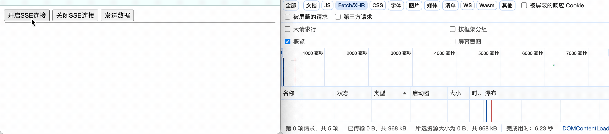

# SSE--1.1.java-demo01




## 工程结构

```tex
.
├── pom.xml
└── src
    └── main
        ├── java
        │   └── com
        │       └── zs
        │           └── sse
        │               ├── MyApplication.java
        │               └── SseController.java
        └── resources
            └── static
                └── index.html
```


## 前端核心实现

```js
//创建SSE对象连接
const evtSource = new EventSource(openurl) ;

//监听连接事件
evtSource.onmessage = (event) => {
    ui.addElementToUI(`接收到消息: ${event.data}`)
};
evtSource.onopen = (event) => {
    console.log('建立连接...')
};
evtSource.onerror = (event) => {
    console.error("发生错误：", event) ;
};

//关闭连接
ui.uiData.evtSource.close() ;
```


### SSE案例核心代码

```js
//开启SSE
ui.doms.openSSE.addEventListener('click', function () {
    if (ui.uiData.evtSource) {
        return
    }
    let openurl = `/sse/events/${Date.now()}`
    const evtSource = new EventSource(openurl) ;
    ui.addElementToUI(`发起连接：${evtSource.url}`)
    ui.uiData.evtSource = evtSource;
    evtSource.onmessage = (event) => {
        ui.addElementToUI(`接收到消息: ${event.data}`)
    };
    evtSource.onopen = (event) => {
        console.log('建立连接...')
    };
    evtSource.onerror = (event) => {
        console.error("发生错误：", event) ;
    };
});

//关闭SSE
ui.doms.closeSSE.addEventListener('click', function() {
    if (!ui.uiData.evtSource) {
        return
    }
    ui.addElementToUI(`关闭连接: ${ui.uiData.evtSource.url}`)
    ui.uiData.evtSource.close() ;
    ui.uiData.evtSource = void 0;
})
```

### 完整代码

```html
<!DOCTYPE html>
<html lang="zh-CN">
<head>
    <!-- 指定字符集 -->
    <meta charset="UTF-8">
    <!-- 使用Edge最新的浏览器的渲染方式 -->
    <meta http-equiv="X-UA-Compatible" content="IE=edge">
    <!-- viewport视口：网页可以根据设置的宽度自动进行适配，在浏览器的内部虚拟一个容器，容器的宽度与设备的宽度相同。
    width: 默认宽度与设备的宽度相同
    initial-scale: 初始的缩放比，为1:1 -->
    <meta name="viewport" content="width=device-width, initial-scale=1">
    <title>SSE</title>
</head>
<body>
<button class="open-sse-button" type="button">开启SSE连接</button>
<button class="close-sse-button"type="button">关闭SSE连接</button>
<button class="send-sse-button"type="button">发送数据</button>
<hr style="margin: 2px; padding: 0px 0px;"/>
<ul id="list"></ul>
</body>
<script>
    class UIData {
        constructor() {
            this.evtSource = void 0;
        }
    }
    class UI {
        constructor() {
            this.uiData = new UIData();
            this.doms = {
                openSSE: document.querySelector('.open-sse-button'),
                closeSSE: document.querySelector('.close-sse-button'),
                sendSSE: document.querySelector('.send-sse-button'),
                ulList: document.querySelector('#list')
            };
            this.listenEvent();
        }

        // 监听各种事件
        listenEvent() {

        }


        addElementToUI(text) {
            var html = this.doms.ulList.innerHTML;
            html += `
            <li>
                ${text}
            </li>
            `
            this.doms.ulList.innerHTML = html;
        }
    }
    var ui = new UI();

    //开启SSE
    ui.doms.openSSE.addEventListener('click', function () {
        if (ui.uiData.evtSource) {
            return
        }
        let openurl = `/sse/events/${Date.now()}`
        const evtSource = new EventSource(openurl) ;
        ui.addElementToUI(`发起连接：${evtSource.url}`)
        ui.uiData.evtSource = evtSource;
        evtSource.onmessage = (event) => {
            ui.addElementToUI(`接收到消息: ${event.data}`)
        };
        evtSource.onopen = (event) => {
            console.log('建立连接...')
        };
        evtSource.onerror = (event) => {
            console.error("发生错误：", event) ;
        };
    });
    //关闭SSE
    ui.doms.closeSSE.addEventListener('click', function() {
        if (!ui.uiData.evtSource) {
            return
        }
        ui.addElementToUI(`关闭连接: ${ui.uiData.evtSource.url}`)
        ui.uiData.evtSource.close() ;
        ui.uiData.evtSource = void 0;
    })
    //发送数据
    ui.doms.sendSSE.addEventListener('click', function() {
        if (!ui.uiData.evtSource) {
            return
        }
        let url = ui.uiData.evtSource.url;
        url = url.replace('/events', '/sender') ;
        fetch(url, {
            method: 'GET', // or 'POST', 'PUT', etc.
            headers: {
                'Content-Type': 'application/json',
            },
        })
            .then(response => {
                if (response.ok) {
                    //return response.json(); // 解析响应体为JSON
                    return response.text(); // 解析响应体为文本
                } else {
                    throw new Error('Network response was not ok');
                }
            })
            .then(data => console.log(data))
            .catch((error) => console.error('Error:', error)); // promise is rejected with an error
    })
</script>
</html>
```

## 后端核心实现

```xml
<parent>
    <groupId>org.springframework.boot</groupId>
    <artifactId>spring-boot-starter-parent</artifactId>
    <version>2.3.12.RELEASE</version>
</parent>
<dependencies>
    <dependency>
        <groupId>org.springframework.boot</groupId>
        <artifactId>spring-boot-starter-web</artifactId>
    </dependency>
</dependencies>
```

### SSE案例核心代码

```java
@GetMapping(path = "/events/{id}", produces = MediaType.TEXT_EVENT_STREAM_VALUE)
public SseEmitter createConnect(@PathVariable("id") String id) throws IOException {
    SseEmitter emitter = new SseEmitter(0L);
    // 每一个客户端保存到Map中
    sse.put(id, emitter);
    // 当发生错误的回调
    emitter.onError(ex -> {
        System.err.printf("userId: %s, error: %s%n", id, ex.getMessage());
        sse.remove(id);
    });
    // 异步请求完成后的回调
    emitter.onCompletion(() -> {
        sse.remove(id);
        System.out.printf("%s, 请求完成...");
    });
    // 异步请求超时回调
    emitter.onTimeout(() -> {
        System.err.println("超时...");
    });
    return emitter;
}
```


### 完整代码

```java
package com.zs.sse;

import org.springframework.http.MediaType;
import org.springframework.web.bind.annotation.GetMapping;
import org.springframework.web.bind.annotation.PathVariable;
import org.springframework.web.bind.annotation.RequestMapping;
import org.springframework.web.bind.annotation.RestController;
import org.springframework.web.servlet.mvc.method.annotation.SseEmitter;

import java.io.IOException;
import java.util.Map;
import java.util.Random;
import java.util.concurrent.ConcurrentHashMap;

@RestController
@RequestMapping("/sse")
public class SseController {

    // 该集合用来管理所有客户端的连接
    private final Map<String, SseEmitter> sse = new ConcurrentHashMap<>();

    // 创建连接接口，同时指定了消息类型为text/event-stream
    @GetMapping(path = "/events/{id}", produces = MediaType.TEXT_EVENT_STREAM_VALUE)
    public SseEmitter createConnect(@PathVariable("id") String id) throws IOException {
        SseEmitter emitter = new SseEmitter(0L);
        // 每一个客户端保存到Map中
        sse.put(id, emitter);
        // 当发生错误的回调
        emitter.onError(ex -> {
            System.err.printf("userId: %s, error: %s%n", id, ex.getMessage());
            sse.remove(id);
        });
        // 异步请求完成后的回调
        emitter.onCompletion(() -> {
            sse.remove(id);
            System.out.printf("%s, 请求完成...");
        });
        // 异步请求超时回调
        emitter.onTimeout(() -> {
            System.err.println("超时...");
        });
        return emitter;
    }

    // 该接口用来进行消息的发送
    // 由客户端发起请求，然后根据id获取相应的SseEmitter进行消息的发送
    @GetMapping("/sender/{id}")
    public String sender(@PathVariable("id") String id) throws Exception {
        SseEmitter emitter = this.sse.get(id);
        if (emitter != null) {
            try {
                emitter.send("随机消息 - " + new Random().nextInt(10000000));
            } catch (Exception e) {
                System.err.printf("%s%n, e.getMessage()");
            }

            String[] strArr = {
                    "我", "懒", "得", "写", "你", "谷", "搜", "到", "处", "皆", "只", "因", "你",
                    "太", "美", "浅", "唱", "动", "人", "说", "不", "出", "我", "试", "着", "多",
                    "看", "你", "一", "眼", "却", "发", "现", "我", "已", "沉", "溺", "于", "你",
                    "的", "镜", "头", "里", "只", "因", "你", "太", "美", "所", "以", "我", "多",
                    "看", "了", "一", "眼", "只", "因", "我", "太", "傻", "所", "以", "我", "放",
                    "不", "开", "你", "的", "手", "只", "因", "你", "太", "美", "所", "以", "我",
                    "做", "了", "个", "梦", "梦", "见", "你", "在", "微", "笑", "我", "在", "注",
                    "视", "只", "因", "你", "太", "美", "所", "以", "我", "放", "了", "你", "的",
                    "手", "所", "以", "我", "会", "微", "笑", "因", "为", "你", "太", "美", "end"
            };
            for (int i = 0; i < strArr.length; i++) {
                emitter.send(strArr[i]);
                Thread.sleep(500);
            }
        }
        return "success";
    }
}
```

