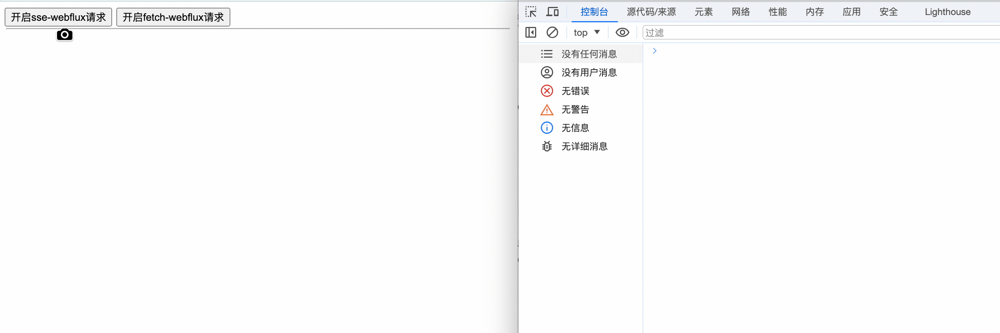
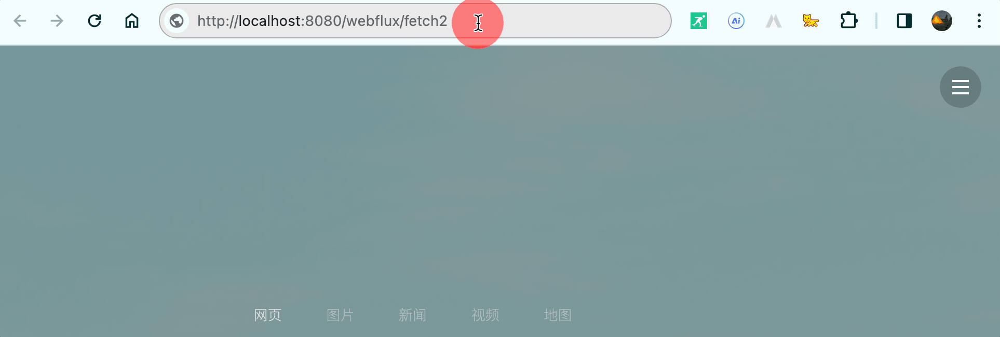
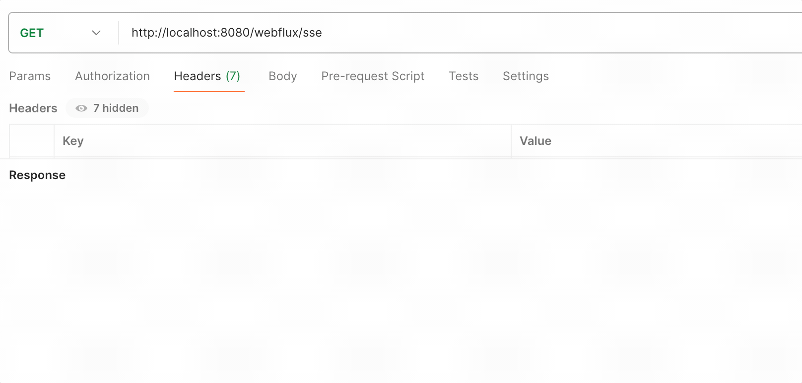

# fetch-webFlux--0.1.流式响应-demo01



## webflux返回SSE获取数据

### 前端实现

> 🚧SSE连接会在关闭时自动发起下一次连接，除非在数据接收完毕后，将连接关闭🚧

```js
//开启SSE
ui.doms.openWebfluxBtn.addEventListener('click', function () {
    if (ui.uiData.evtSource) {
        return
    }
    let openurl = `/webflux/data`
    const evtSource = new EventSource(openurl) ;
    ui.addElementToUI(`发起连接：${evtSource.url}`)
    ui.uiData.evtSource = evtSource;
    evtSource.onmessage = (event) => {
        ui.addElementToUI(`接收到消息: ${event.data}`)
    };
    evtSource.onopen = (event) => {
        console.log('建立连接...')
    };
    //数据接收完毕后，会触发
    evtSource.onerror = (event) => {
        console.log('数据接收完成...')
        evtSource.close();
        console.log('关闭连接...否则会自动发起下一次连接...')
    };
});
```

> 完整代码

```html
<!DOCTYPE html>
<html lang="zh-CN">
<head>
    <!-- 指定字符集 -->
    <meta charset="UTF-8">
    <!-- 使用Edge最新的浏览器的渲染方式 -->
    <meta http-equiv="X-UA-Compatible" content="IE=edge">
    <!-- viewport视口：网页可以根据设置的宽度自动进行适配，在浏览器的内部虚拟一个容器，容器的宽度与设备的宽度相同。
    width: 默认宽度与设备的宽度相同
    initial-scale: 初始的缩放比，为1:1 -->
    <meta name="viewport" content="width=device-width, initial-scale=1">
    <title>SSE</title>
</head>
<body>
<button class="open-webflux-button" type="button">开启webflux请求</button>
<hr style="margin: 2px; padding: 0px 0px;"/>
<ul id="list"></ul>
</body>
<script>
    class UIData {
        constructor() {
            this.evtSource = void 0;
        }
    }
    class UI {
        constructor() {
            this.uiData = new UIData();
            this.doms = {
                openWebfluxBtn: document.querySelector('.open-webflux-button'),
                ulList: document.querySelector('#list')
            };
            this.listenEvent();
        }

        // 监听各种事件
        listenEvent() {

        }

        addElementToUI(text) {
            var html = this.doms.ulList.innerHTML;
            html += `
            <li>
                ${text}
            </li>
            `
            this.doms.ulList.innerHTML = html;
        }
    }
    var ui = new UI();

    //开启SSE
    ui.doms.openWebfluxBtn.addEventListener('click', function () {
        if (ui.uiData.evtSource) {
            return
        }
        let openurl = `/webflux/data`
        const evtSource = new EventSource(openurl) ;
        ui.addElementToUI(`发起连接：${evtSource.url}`)
        ui.uiData.evtSource = evtSource;
        evtSource.onmessage = (event) => {
            ui.addElementToUI(`接收到消息: ${event.data}`)
        };
        evtSource.onopen = (event) => {
            console.log('建立连接...')
        };
        //数据接收完毕后，会触发
        evtSource.onerror = (event) => {
            console.log('数据接收完成...')
            evtSource.close();
            console.log('关闭连接...否则会自动发起下一次连接...')
        };
    });
</script>
</html>

```


### 后端实现

```java
package com.zs.webflux;

import org.springframework.http.MediaType;
import org.springframework.web.bind.annotation.GetMapping;
import org.springframework.web.bind.annotation.RestController;
import org.springframework.web.reactive.function.server.ServerRequest;
import reactor.core.publisher.Flux;

import java.time.Duration;

/**
 * Create by 张邵
 * 2024/1/24 15:08
 */
@RestController
public class WebFluxController {
    @GetMapping(value = "/webflux/data", produces = MediaType.TEXT_EVENT_STREAM_VALUE)
    public Flux<String> getData() {
        // 这里模拟从数据库或其他地方获取数据，并使用Flux来推送数据。
        String[] strArr = {
                "我", "懒", "得", "写", "你", "谷", "搜", "到", "处", "皆", "只", "因", "你",
                "太", "美", "浅", "唱", "动", "人", "说", "不", "出", "我", "试", "着", "多",
                "看", "你", "一", "眼", "却", "发", "现", "我", "已", "沉", "溺", "于", "你",
                "的", "镜", "头", "里", "只", "因", "你", "太", "美", "所", "以", "我", "多",
                "看", "了", "一", "眼", "只", "因", "我", "太", "傻", "所", "以", "我", "放",
                "不", "开", "你", "的", "手", "只", "因", "你", "太", "美", "所", "以", "我",
                "做", "了", "个", "梦", "梦", "见", "你", "在", "微", "笑", "我", "在", "注",
                "视", "只", "因", "你", "太", "美", "所", "以", "我", "放", "了", "你", "的",
                "手", "所", "以", "我", "会", "微", "笑", "因", "为", "你", "太", "美", "end"
        };
        return Flux.just(strArr).delayElements(Duration.ofMillis(30)); // 每x ms推送一个数据。你可以根据需要调整这个时间。
    }
}

```

## webflux返回Fetch获取

### 前端实现

> 🚨这里要注意了这里返回的数据是 `data:xxxx  格式`





> 前端fetch流式请求核心代码

```js
//开启SSE
    ui.doms.fetchWebfluxBtn.addEventListener('click', function () {
        const url = '/webflux/fetch';
        // 发送 POST 请求
        fetch(url, {
            method: "GET",
            //body:JSON.stringify({ "content": msg}),
            timeout: 0,
            dataType: "text/event-stream",
            headers: {
                "Content-Type": "application/json"
            },
        }).then(response => {
            // 检查响应是否成功
            if (!response.ok) {
                throw new Error('Network response was not ok');
            }
            // 返回一个可读流
            return response.body;
        }).then(async body => {
            const reader = body.getReader();
            const textDecoder = new TextDecoder() // 创建解码器
            let result = '';
            // 读取数据流
            while (true) {  // 循环读取内容
                /* 读取其中一部分内容 done 是否读取完成， value 读取到的内容 */
                const {done, value} = await reader.read()
                if (done) {
                    // console.log(result,"==========")
                    return
                }
                let str = void 0;
                if (value.length >= 5) {
                    if (textDecoder.decode(value.slice(0, 5)) === 'data:') {
                        if (value.slice(value.length - 2, value.length).toString() === '10,10') {
                            str = textDecoder.decode(value.slice(5, value.length - 2))
                        } else if (value.length > 5){
                            str = textDecoder.decode(value.slice(5))
                        }
                    } else {
                        if (value.slice(value.length - 2, value.length).toString() === '10,10') {
                            str = textDecoder.decode(value.slice(0, value.length - 2))
                        } else {
                            str = textDecoder.decode(value)
                        }
                    }
                } else if (value.length === 2 && value.slice(0, 2).toString() !== '10,10') {
                    str = textDecoder.decode(value)
                }
                if (str) {
                    console.log(str)
                    ui.addElementToUI(`接收到消息: ${str}`)
                }
            }
        }).catch(error => {
            console.error('Fetch error:', error);
        });
    });
```

> 可参考写法

```js
async function getChatgptMsg() {
  const response = await fetch('你的url', {
    method: 'POST',
    headers: {
      'Content-Type': 'application/json'
    },
    dataType: "text/event-stream",
    body: JSON.stringify({
      model: 'gpt-4',
      messages: messages,
      frequency_penalty: 0;
      max_tokens:4000;
      model:"gpt-4";
      presence_penalty: 0.6;
      temperature: 0.5;
      top_p :1;
    })
  });
 
  if (!response.ok) {
    throw new Error(`HTTP error! status: ${response.status}`);
  }
 
  const reader = response.body.getReader();
  let decoder = new TextDecoder();
  let resultData = '';
  let result = true;
  while (result) {
    const { done, value } = await reader.read();
    if (done) {
           console.log("Stream ended");
           result = false;
           break;
    }
    resultData += decoder.decode(value);
 
  }
}
```


```html
<!DOCTYPE html>
<html lang="zh-CN">
<head>
    <!-- 指定字符集 -->
    <meta charset="UTF-8">
    <!-- 使用Edge最新的浏览器的渲染方式 -->
    <meta http-equiv="X-UA-Compatible" content="IE=edge">
    <!-- viewport视口：网页可以根据设置的宽度自动进行适配，在浏览器的内部虚拟一个容器，容器的宽度与设备的宽度相同。
    width: 默认宽度与设备的宽度相同
    initial-scale: 初始的缩放比，为1:1 -->
    <meta name="viewport" content="width=device-width, initial-scale=1">
    <title>SSE</title>
</head>
<body>
<button class="open-webflux-button" type="button">开启sse-webflux请求</button>
<button class="open-fetch-button" type="button">开启fetch-webflux请求</button>

<hr style="margin: 2px; padding: 0px 0px;"/>
<ul id="list"></ul>
</body>
<script>
    class UIData {
        constructor() {
            this.evtSource = void 0;
        }
    }

    class UI {
        constructor() {
            this.uiData = new UIData();
            this.doms = {
                sseWebfluxBtn: document.querySelector('.open-webflux-button'),
                fetchWebfluxBtn: document.querySelector('.open-fetch-button'),
                ulList: document.querySelector('#list')
            };
            this.listenEvent();
        }

        // 监听各种事件
        listenEvent() {

        }


        addElementToUI(text) {
            var html = this.doms.ulList.innerHTML;
            html += `
            <li>
                ${text}
            </li>
            `
            this.doms.ulList.innerHTML = html;
        }
    }

    var ui = new UI();

    //开启SSE
    ui.doms.sseWebfluxBtn.addEventListener('click', function () {
        if (ui.uiData.evtSource) {
            return
        }
        let openurl = `/webflux/sse`
        const evtSource = new EventSource(openurl);
        ui.addElementToUI(`发起连接：${evtSource.url}`)
        ui.uiData.evtSource = evtSource;
        evtSource.onmessage = (event) => {
            ui.addElementToUI(`接收到消息: ${event.data}`)
        };
        evtSource.onopen = (event) => {
            console.log('建立连接...')
        };
        evtSource.onerror = (event) => {
            console.log('数据接收完成...')
            evtSource.close();
            console.log('关闭连接...否则会自动发起下一次连接...')
        };
    });

    //开启SSE
    ui.doms.fetchWebfluxBtn.addEventListener('click', function () {
        const url = '/webflux/fetch';
        // 发送 POST 请求
        fetch(url, {
            method: "GET",
            //body:JSON.stringify({ "content": msg}),
            timeout: 0,
            dataType: "text/event-stream",
            headers: {
                "Content-Type": "application/json"
            },
        }).then(response => {
            // 检查响应是否成功
            if (!response.ok) {
                throw new Error('Network response was not ok');
            }
            // 返回一个可读流
            return response.body;
        }).then(async body => {
            const reader = body.getReader();
            const textDecoder = new TextDecoder() // 创建解码器
            let result = '';
            // 读取数据流
            while (true) {  // 循环读取内容
                /* 读取其中一部分内容 done 是否读取完成， value 读取到的内容 */
                const {done, value} = await reader.read()
                if (done) {
                    // console.log(result,"==========")
                    return
                }
                let str = void 0;
                if (value.length >= 5) {
                    if (textDecoder.decode(value.slice(0, 5)) === 'data:') {
                        if (value.slice(value.length - 2, value.length).toString() === '10,10') {
                            str = textDecoder.decode(value.slice(5, value.length - 2))
                        } else if (value.length > 5){
                            str = textDecoder.decode(value.slice(5))
                        }
                    } else {
                        if (value.slice(value.length - 2, value.length).toString() === '10,10') {
                            str = textDecoder.decode(value.slice(0, value.length - 2))
                        } else {
                            str = textDecoder.decode(value)
                        }
                    }
                } else if (value.length === 2 && value.slice(0, 2).toString() !== '10,10') {
                    str = textDecoder.decode(value)
                }
                if (str) {
                    console.log(str)
                    ui.addElementToUI(`接收到消息: ${str}`)
                }
            }
        }).catch(error => {
            console.error('Fetch error:', error);
        });
    });


    function Uint8ArrayToString(fileData) {
        var dataString = "";
        for (var i = 0; i < fileData.length; i++) {
            dataString += String.fromCharCode(fileData[i]);
        }

        return dataString
    }
</script>
</html>

```


### 后端实现

```java
@GetMapping(value = "/webflux/fetch2", produces = MediaType.TEXT_EVENT_STREAM_VALUE)
public Flux<String> getStreamAnswer() {
    // 创建一个包含流数据的Flux
    return Flux.interval(Duration.ofMillis(100))
        .map(sequence -> "Data " + sequence)
        // 执行50次
        .take(50)
        .log();
}

@GetMapping(value = "/webflux/fetch", produces = MediaType.TEXT_EVENT_STREAM_VALUE)
public Flux<String> getFetch() {
    // 这里模拟从数据库或其他地方获取数据，并使用Flux来推送数据。
    String[] strArr = {
        "我", "懒", "得", "写", "你", "谷", "搜", "到", "处", "皆", "只", "因", "你",
        "太", "美", "浅", "唱", "动", "人", "说", "不", "出", "我", "试", "着", "多",
        "看", "你", "一", "眼", "却", "发", "现", "我", "已", "沉", "溺", "于", "你",
        "的", "镜", "头", "里", "只", "因", "你", "太", "美", "所", "以", "我", "多",
        "看", "了", "一", "眼", "只", "因", "我", "太", "傻", "所", "以", "我", "放",
        "不", "开", "你", "的", "手", "只", "因", "你", "太", "美", "所", "以", "我",
        "做", "了", "个", "梦", "梦", "见", "你", "在", "微", "笑", "我", "在", "注",
        "视", "只", "因", "你", "太", "美", "所", "以", "我", "放", "了", "你", "的",
        "手", "所", "以", "我", "会", "微", "笑", "因", "为", "你", "太", "美", "end"
    };
    return Flux.just(strArr) // 示例数据，实际中从数据库或其他地方获取。
        .delayElements(Duration.ofMillis(30)); // 每1秒推送一个数据。你可以根据需要调整这个时间。
}
```


http://t.csdnimg.cn/Tjdef
