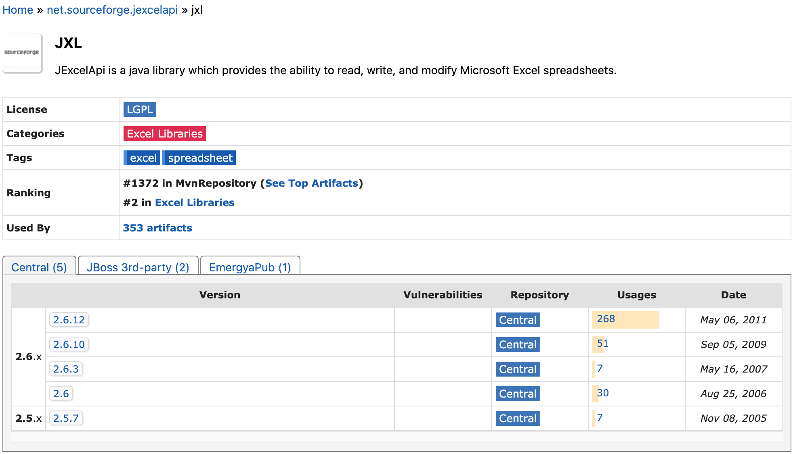
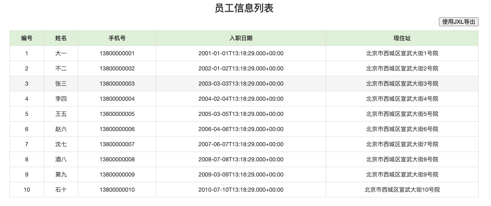
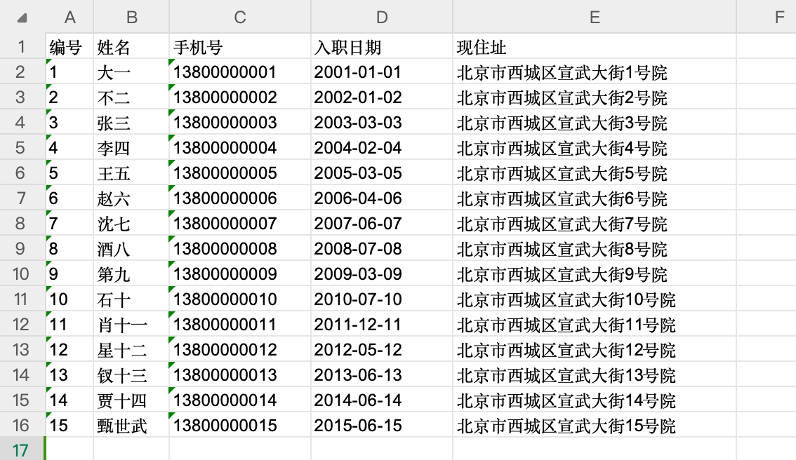

# JXL--0.了解

## 简介

官网

https://jexcelapi.sourceforge.net/




 **Java Excel API - 用于读取、写入和修改 Excel 电子表格的 Java API**

Java Excel API 是一个成熟的开源 Java API，使开发人员能够动态读取、写入和修改 Excel 电子表格。现在，Java 开发人员可以读取 Excel 电子表格，使用方便且简单的 API 对其进行修改，并将更改写入任何输出流（例如磁盘、HTTP、数据库或任何套接字）。

任何可以运行 Java 虚拟机的操作系统（即不仅仅是 Windows）都可以处理和提供 Excel 电子表格。因为它是 Java，所以可以从 servlet 内调用 API，从而可以通过 Internet 和 Intranet Web 应用程序访问 Excel 电子表格。

**一些特点**

从 Excel 95、97、2000、XP 和 2003工作簿读取数据

读取和写入公式（仅限 Excel 97 及更高版本）

生成 Excel 2000 格式的电子表格

支持字体、数字和日期格式

支持单元格的底纹、边框和着色

修改现有工作表

是国际化的，可以在几乎任何区域设置、国家/地区、语言或字符编码中进行处理（目前仅支持英语、法语、西班牙语和德语的公式，但如果翻译的话可以添加更多内容）

支持图表复制

支持将图像插入和复制到电子表格中

支持使用 Jakarta Commons Logging、log4j、JDK 1.4 Logger 等进行日志记录

...以及更多

## 入门使用

### 导出Excel

| 包                             | 版本           |
| ------------------------------ | -------------- |
| spring-boot-starter-parent     | 2.3.12.RELEASE |
| jxl                            | 2.6.12         |
| pagehelper-spring-boot-starter | 1.3.1          |
| mapper-spring-boot-starter     | 2.1.5          |
| mybatis-spring-boot-starter    | 2.2.0          |

```java

public void downLoadXlsByJxl(HttpServletResponse response) throws Exception {
    //   编号 姓名 手机号 入职日期 现住址
    ServletOutputStream outputStream = response.getOutputStream();
    //创建了一个全新的工作薄
    WritableWorkbook workbook = Workbook.createWorkbook(outputStream);
    //创建了一个工作表
    WritableSheet sheet = workbook.createSheet("一个JXL入门", 0);

    //调整列宽
    sheet.setColumnView(0,5); //  第一个参数：列的索引值  第二个参数：1代表一个标准字母的宽度
    sheet.setColumnView(1,8); //  第一个参数：列的索引值  第二个参数：1代表一个标准字母的宽度
    sheet.setColumnView(2,15); //  第一个参数：列的索引值  第二个参数：1代表一个标准字母的宽度
    sheet.setColumnView(3,15); //  第一个参数：列的索引值  第二个参数：1代表一个标准字母的宽度
    sheet.setColumnView(4,30); //  第一个参数：列的索引值  第二个参数：1代表一个标准字母的宽度

    //处理标题开始
    String[] titles = new String[]{"编号","姓名","手机号","入职日期","现住址"};
    Label label = null;
    for (int i = 0; i < titles.length; i++) {
        label = new Label(i,0,titles[i]); //列脚标, 行脚标, 单元格中的内容
        sheet.addCell(label);
    }
    //处理标题结束

    //查询所有用户的数据
    List<User> userList = userMapper.selectAll();
    int rowIndex = 1;
    for (User user : userList) {
        label = new Label(0,rowIndex,user.getId().toString()); //列脚标, 行脚标, 单元格中的内容 编号
        sheet.addCell(label);

        label = new Label(1,rowIndex,user.getUserName()); //列脚标, 行脚标, 单元格中的内容 姓名
        sheet.addCell(label);

        label = new Label(2,rowIndex,user.getPhone()); //列脚标, 行脚标, 单元格中的内容 手机号
        sheet.addCell(label);

        SimpleDateFormat simpleDateFormat = new SimpleDateFormat("yyyy-MM-dd");
        label = new Label(3,rowIndex,simpleDateFormat.format( user.getHireDate())); //列脚标, 行脚标, 单元格中的内容 入职日期
        sheet.addCell(label);

        label = new Label(4,rowIndex,user.getAddress()); //列脚标, 行脚标, 单元格中的内容 现住址
        sheet.addCell(label);
        rowIndex++;
    }
    //文件的导出 一个流（outputStream）两个头（文件的打开方式 in-line attachment，文件的下载时mime类型） application/vnd.ms-excel
    String filename="一个JXL入门.xls";
    response.setHeader("content-disposition","attachment;filename="+ new String(filename.getBytes(),"ISO8859-1"));
    response.setContentType("application/vnd.ms-excel");
    workbook.write();
    workbook.close();
    outputStream.close();
}
```



