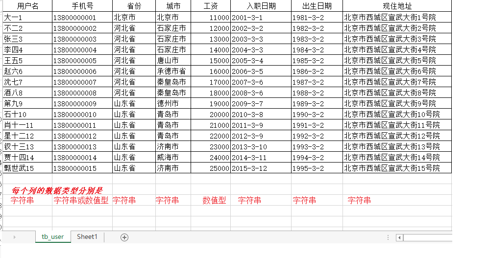
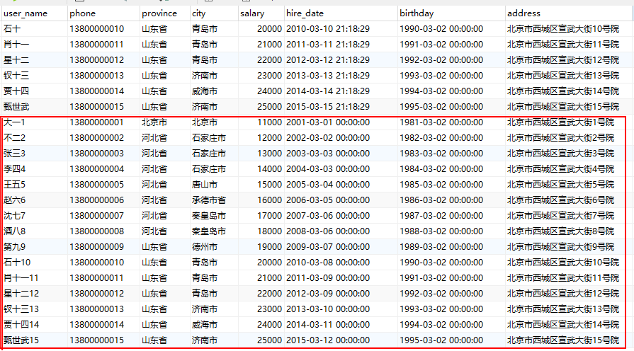
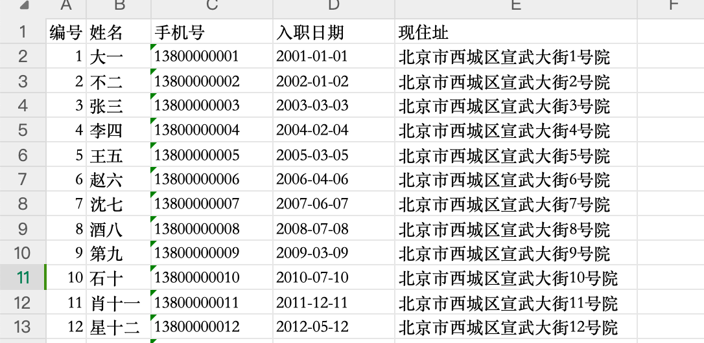
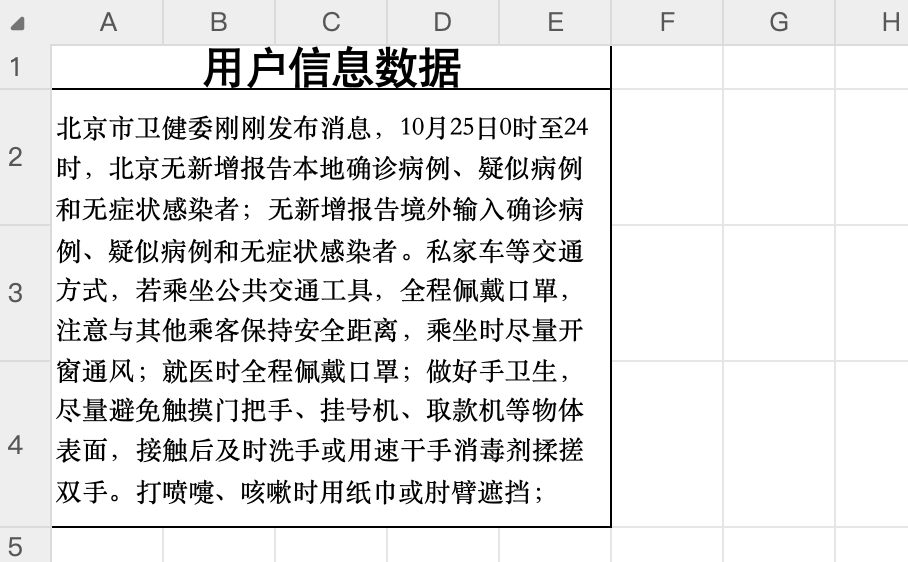
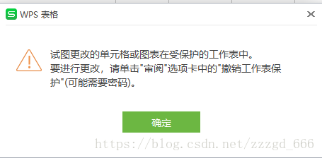
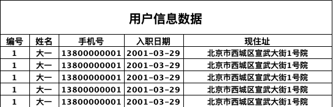

# POI--1.基础api

添加所需的依赖：

```xml
<dependency>
    <groupId>org.apache.poi</groupId>
    <artifactId>poi</artifactId>
    <version>4.0.1</version>
</dependency>

<dependency>
    <groupId>org.apache.poi</groupId>
    <artifactId>poi-ooxml</artifactId>
    <version>4.0.1</version>
</dependency>

<dependency>
    <groupId>org.apache.poi</groupId>
    <artifactId>poi-ooxml-schemas</artifactId>
    <version>4.0.1</version>
</dependency>
```

## POI操作Excel高低版本区别

在POI包中有如下几个主要对象和excel的几个对象对应：

| 对应excel名称 | 低版本中的类名 | 高版本中的类名 |
| :------------ | :------------- | :------------- |
| 工作簿        | HSSFWorkbook   | XSSFWorkbook   |
| 工作表        | HSSFSheet      | XSSFSheet      |
| 行            | HSSFRow        | XSSFRow        |
| 单元格        | HSSFCell       | XSSFCell       |
| 单元格样式    | HSSFCellStyle  | XSSFCellStyle  |


## 创建Excel

入门案例代码：创建一个新的工作薄，里面随便写一句话

操作低版本：

```java
package com.itheima.demo;
import org.apache.poi.hssf.usermodel.HSSFWorkbook;
import org.apache.poi.ss.usermodel.Cell;
import org.apache.poi.ss.usermodel.Row;
import org.apache.poi.ss.usermodel.Sheet;
import org.apache.poi.ss.usermodel.Workbook;
import org.apache.poi.xssf.usermodel.XSSFWorkbook;
import java.io.FileOutputStream;
public class POIDemo01 {
    public static void main(String[] args) throws Exception{
        //创建了一个全新（里面什么都没有）的工作薄
        Workbook workbook = new HSSFWorkbook(); 
        //创建了一个全新（里面什么都没有）的工作表
        Sheet sheet = workbook.createSheet("demo测试");  
        //创建了第一行（空的）
        Row row = sheet.createRow(0);
        //创建的是第一行的第一个单元格
        Cell cell = row.createCell(0);
        //写入数据
        cell.setCellValue("这是我第一次玩POI");
//        把工作薄输出到本地磁盘
        workbook.write(new FileOutputStream("d://test.xls"));
    }
}

```

操作高版本：

```java
package com.itheima.demo;
import org.apache.poi.ss.usermodel.Cell;
import org.apache.poi.ss.usermodel.Row;
import org.apache.poi.ss.usermodel.Sheet;
import org.apache.poi.ss.usermodel.Workbook;
import org.apache.poi.xssf.usermodel.XSSFWorkbook;

import java.io.FileOutputStream;
 
public class POIDemo02 {
    public static void main(String[] args) throws Exception{
        Workbook workbook = new XSSFWorkbook(); //创建了一个全新（里面什么都没有）的工作薄
        Sheet sheet = workbook.createSheet("demo测试");  //创建了一个全新（里面什么都没有）的工作表
        Row row = sheet.createRow(0);  //创建了第一行（空的）
        Cell cell = row.createCell(0);//创建的是第一行的第一个单元格
        cell.setCellValue("这是我第一次玩POI");
//        把工作薄输出到本地磁盘
        workbook.write(new FileOutputStream("d://test.xlsx"));
    }
}

```

比较上面两个代码会发现，在开发中只是类的名称不一样，方法是一样的。

## 读取Excel

### 需求

把资料中的《用户导入测试数据.xlsx》文档中的数据导入到系统中，

内容如下：



数据的导入就是读取excel中的内容，转成对象插入到数据库中

### 思路

一般来说，即将导入的文件，每个列代表什么意思基本上都是固定的，比如第1列就是用户姓名，最后一列就是用户的现住址，并且在做excel时对每个列的类型都是有要求的，这样就可以给我们开发带来很大的简便。

最终的目标就是读取每一行数据，把数据转成用户的对象，保存到表中

实现的步骤：1、根据上传的文件创建Workbook

​                        2、获取到第一个sheet工作表

​                        3、从第二行开始读取数据

​                        4、读取每一个单元格，把内容放入到用户对象的相关的属性中

### 代码实现

第一步：在Controller接收文件,具体的实现交给service

```java
@PostMapping(value = "/uploadExcel", name = "上传用户数据")
public void uploadExcel(MultipartFile file)  throws Exception{
   userService.uploadExcel(file);
}
```

第二步：UserService添加上传用户的方法

```java
public void uploadExcel(MultipartFile file) throws Exception {
    Workbook workbook = new XSSFWorkbook(file.getInputStream()); //根据上传的输入流创建workbook
    Sheet sheet = workbook.getSheetAt(0); //获取工作薄中的第一个工作表
    int lastRowIndex = sheet.getLastRowNum(); //获取这个sheet中最后一行数据，为了循环遍历

    //        以下三个为了节省栈内存，所以提到循环的外面
    User user = null;
    Row row = null;
    Cell cell = null;

    //开始循环每行，获取每行的单元格中的值，放入到user属性中
    for (int i = 1; i <= lastRowIndex; i++) {
        row = sheet.getRow(i);
        user = new User();
        //          因为第一个列单元格中是字符串，可以直接使用getStringCellValue方法
        String userName = row.getCell(0).getStringCellValue(); //用户名
        user.setUserName(userName);
        String phone = null; //手机号
        try {
            phone = row.getCell(1).getStringCellValue();
        } catch (IllegalStateException e) {
            phone = row.getCell(1).getNumericCellValue()+"";
        }
        user.setPhone(phone);
        String province = row.getCell(2).getStringCellValue(); //省份
        user.setProvince(province);
        String city = row.getCell(3).getStringCellValue(); //城市
        user.setCity(city);
        //            因为在填写excel中的数据时就可以约定这个列只能填写数值，所以可以直接用getNumericCellValue方法
        Integer salary = ((Double)row.getCell(4).getNumericCellValue()).intValue(); //工资
        user.setSalary(salary);
        String hireDateStr = row.getCell(5).getStringCellValue(); //入职日期
        Date hireDate = simpleDateFormat.parse(hireDateStr);
        user.setHireDate(hireDate);
        String birthdayStr = row.getCell(6).getStringCellValue(); //出生日期
        Date birthday = simpleDateFormat.parse(birthdayStr);
        user.setBirthday(birthday);

        String address = row.getCell(7).getStringCellValue(); //现住地址
        user.setAddress(address);
        userMapper.insert(user);
    }

}
```

上传成功后直接查询数据库中的数据：



## 导出Excel

基本思路

1、创建一个全新的工作薄

 2、在新的工作薄中创建一个新的工作表

 3、在工作表创建第一行作为标题行，标题固定

 4、从第二行循环遍历创建，有多少条用户数据就应该创建多少行

 5、把每一个user对象的属性放入到相应的单元格中

### 导出xlsx

第一步：在Controller添加方法,具体的实现交给service

```java
@GetMapping(value = "/downLoadXlsxByPoi",name = "使用POI下载高版本")
public void downLoadXlsx(HttpServletResponse response) throws Exception{
    userService.downLoadXlsx(response);
}
```

第二步：UserService中实现

```java
public void downLoadXlsx(HttpServletResponse response) throws Exception {
    //        创建一个空的工作薄
    Workbook workbook = new XSSFWorkbook();
    //        在工作薄中创建一个工作表
    Sheet sheet = workbook.createSheet("测试");
    //        设置列宽
    sheet.setColumnWidth(0,5*256);
    sheet.setColumnWidth(1,8*256);
    sheet.setColumnWidth(2,15*256);
    sheet.setColumnWidth(3,15*256);
    sheet.setColumnWidth(4,30*256);
    //            处理标题
    String[] titles = new String[]{"编号","姓名","手机号","入职日期","现住址"};

    //        创建标题行
    Row titleRow = sheet.createRow(0);
    Cell cell = null;
    for (int i = 0; i < titles.length; i++) {
        cell = titleRow.createCell(i);
        cell.setCellValue(titles[i]);
    }
    //        处理内容
    List<User> userList = this.findAll();
    int rowIndex = 1;
    Row row = null;
    for (User user : userList) {
        row = sheet.createRow(rowIndex);
        cell = row.createCell(0);
        cell.setCellValue(user.getId());

        cell = row.createCell(1);
        cell.setCellValue(user.getUserName());

        cell = row.createCell(2);
        cell.setCellValue(user.getPhone());

        cell = row.createCell(3);
        cell.setCellValue(simpleDateFormat.format(user.getHireDate()));

        cell = row.createCell(4);
        cell.setCellValue(user.getAddress());

        rowIndex++;
    }
    //            导出的文件名称
    String filename="员工数据.xlsx";
    //            设置文件的打开方式和mime类型
    ServletOutputStream outputStream = response.getOutputStream();
    response.setHeader( "Content-Disposition", "attachment;filename="  + new String(filename.getBytes(),"ISO8859-1"));
    response.setContentType("application/vnd.openxmlformats-officedocument.spreadsheetml.sheet");
    workbook.write(outputStream);

}
```



## 单位

```sh
# 单位
pt是绝对长度，表⽰point（磅），是印刷⾏业常⽤单位，等于1/72英⼨。
dpi（或ppi）表⽰分辨率，即pixel（dot）per inch，每英⼨的像素（点）数。
px是相对长度，表⽰pixel（像素），是屏幕上显⽰数据的最基本的点。

1pt = 20twips
1px = 0.75pt
1px = 15twips
1pt = 1/72 inch

# Excel
excel中的默认单位是磅（pt）


# poi 行高
poi中的⾏⾼单位和excel中的⾏⾼单位是不⼀样的，excel中的⾏⾼单位是pt（point，磅），⽽poi中的⾏⾼单位则是twips
1pt = 20twips
导出excle中⾏⾼最多为409pt（磅），也就是409*20=8180twips（缇）。

# poi 列宽
POI中Sheet的列宽单位是一个字符宽度的1/256
每列可以显示的最大字符数为255
如果要显示两个字符宽度 2*256

10pt = 1.23字符
11pt = 1.42字符

```

```
 [注意]字号、pt、px、inch、cm 之间的关系及对照表
 
 引自http://www.cnprint.org/bbs/thread/72/67855/
在印刷排版中，“point”是一个绝对的单位，它等于 1/72 英寸，可以用尺子丈量的，物理的英寸。但在 CSS 中 pt 的含义却非如此，例如我们指定一个字体是 9pt，我们会以为按照 CSS 规范，它等于:

　　9 * 1/72 = 1/8 inch

　　这是一个误解，因为我们的显示器被分割为了一个个的像素，单个像素只能有一种颜色 (为了简化，这里暂不讨论次像素反锯齿技术)，要在屏幕上显示，必须先把以 pt 为单位的长度转换为以像素为单位的长度，这个转换的媒介，就是 DPI (事实上，这里的所谓的 DPI，是操作系统和浏览器中使用的术语，即为 PPI, pixels per inch，和扫描仪、打印机、数码相机中的 DPI 是不同的概念)。

　　例如，无论在哪个操作系统中，Firefox 浏览器默认的 DPI 都是 96，那么实际上 9pt = 9 * 1/72 * 96 = 12px。

　　所以，虽然“DPI”中的“I”和“1pt 等于 1/72 inch”中的“inch”，都不代表物理上的英寸，但这两个单位互相之间是相等的，也就在相乘中约掉了。

　　那么，真实的物理长度怎么计算呢?请拿出一把尺子，丈量你的显示器的可见宽度 (我这里是 11.2992 英寸)，除以横向分辨率 (我这里是 1024 像素)，得到的就是每个像素的物理长度。

　　现在我们可以回答这样一个问题，网页上 9pt 的字体究竟占用了多宽的空间?
答案是:

　　9 * 1/72 * 96 * 11.2992 / 1024 = 0.1324 英寸 = 0.3363 厘米。
　　
CSS相对长度单位(relative length unit)

　　CSS相对长度单位中的相对二字，表明了其长度单位会随着它的参考值的变化而变化，不是固定的。

　　以下是CSS相对长度单位列表：

CSS相对长度单位 说明
em 元素的字体高度The height of the element's font
ex 字母x的高度The height of the letter "x"
px 像素Pixels
% 百分比Percentage

CSS绝对长度单位(absolute length unit)
绝对长度单位是一个固定的值。比如我们常用的有mm，就是毫米的意思。

以下是CSS绝对长度单位列表：

CSS绝对长度单位 说明
in 英寸Inches (1 英寸 = 2.54 厘米)
cm 厘米Centimeters
mm 毫米Millimeters
pt 点Points (1点 = 1/72英寸)
pc 皮卡Picas (1 皮卡 = 12 点)
```


## 样式设置

### 框线

  ```java
//===============3.10.Final===============
CellStyle style = workbook.createCellStyle();
style.setBorderBottom(CellStyle.BORDER_THIN);
style.setBorderLeft(CellStyle.BORDER_THIN);
style.setBorderTop(CellStyle.BORDER_THIN);
style.setBorderRight(CellStyle.BORDER_THIN);


//===============3.17、4.0.1===============
CellStyle style = workbook.createCellStyle();
style.setBorderBottom(BorderStyle.THIN); //下边框  BorderStyle.THIN 细线
style.setBorderLeft(BorderStyle.THIN);  //左边框
style.setBorderRight(BorderStyle.THIN);  //右边框
style.setBorderTop(BorderStyle.THIN);  //上边框

  ```

### 合并单元格

```java
//3.17、4.0.1
//合并单元格 起始行, 结束行, 起始列, 结束列
sheet.addMergedRegion(new CellRangeAddress(0,0,0,4));
```

### 设置行高

注意,设置了固定行高,自动换行就不会自适应行高了

```java

/**
设置行高

poi中的⾏⾼单位和excel中的⾏⾼单位是不⼀样的，excel中的⾏⾼单位是pt（point，磅），⽽poi中的⾏⾼单位则是twips
1pt = 20twips
导出excle中⾏⾼最多为409pt（磅），也就是409*20=8180twips（缇）。
*/
//全局设置行高：
//单位 pt *****
sheet.setDefaultRowHeightInPoints();
//单位 twips
sheet.setDefaultRowHeight();


//设置指定行行高
//以twips为单位
sheet.getRow(1).setHeight((short)(50*20);
//以pt为单位，推荐使用*****
bigTitleRow.setHeightInPoints(50); //设置行高
                          
                          
                          
//设置自适应行高
//一行中没有合并单元格的单元格
XSSFRow xssfRow = sheet.getRow(rowIndex);
CTRow ctRow = xssfRow.getCTRow();	
ctRow.setCustomHeight(false);
//有合并的单元格
/*
总体计算思路：
                获取字符高度：单位：twips
                获取单元格宽度：单位：字符
                获取内容长度：个数

                由于中文和英文的字符长度不同，所以需要统计出英式字符个数
                一个中文字符约占用两个英文字符的长度，这里就按2.25来处理
                字体高度单位转换：
                twips --> pt
                twips 转 pt  1pt = 20twips
                pt --> 字符
                1pt 约为 0.123 个字符

  文字内容宽度 = (英式字符个数 * 256 + 中式字符个数 * 2 * 256) * (fontHeight / 20) * 0.123;
*/
//字体的高度
//高度单位 twips 1pt = 20twips 如 220twips --> 11pt --> 1.42字符
short fontHeight = font.getFontHeight();//cell内容字符串总宽度
int engStrCount = calcEnglishStrCount(cellContent);
double cellContentWidth = (engStrCount * 256  + cellContent.length() * 256 * 2) * (fontHeight / 20.0) * 0.123;

```



### 设置列宽

```java
/*
poi 列宽
POI中Sheet的列宽单位是一个字符宽度的1/256
每列可以显示的最大字符数为255
如果要显示两个字符宽度 2*256
*/
//===============3.17、4.0.1===============
//全局设置列宽
sheet.setDefaultColumnWidth(2*256);

//设置指定列宽
sheet.setColumnWidth(0,2*256);
sheet.setColumnWidth(1,8*256);

//自适应列宽
//注意：第一个方法在合并单元格的的单元格并不好使，必须用第二个方法。
sheet.autoSizeColumn(1);
sheet.autoSizeColumn(1, true);

//这种自适应的api在遇到行数多一点的数据的时候,就会耗费大量的时间,1000行花了2分钟
//而且这两个方法对英文数字还好, 对中文支持的并不好
sheet.trackAllColumnsForAutoSizing();
sheet.autoSizeColumn(i);

//把最大宽度限制在10000到15000左右是比较合适的, 然后剩下的就交给excel的自动换行


//自定义自适应
int width = Math.max(15 * 256, Math.min(255 * 256, sh.getColumnWidth(i) * 12 / 10));
//=========================================

```

### 自动换行

设置自动换行后,不要设置固定的行高,否则超出的部分也会被遮住不显示

```java
//设置样式
CellStyle blackStyle = workbook.createCellStyle();
```

```java
// 创建Excel文件
HSSFWorkbook workbook = new HSSFWorkbook();
HSSFSheet sheet = workbook.createSheet("sheet");
//设置样式
 CellStyle blackStyle = workbook.createCellStyle();
//自动换行*重要*
 blackStyle.setWrapText(true);
 
//存储最大列宽
Map<Integer,Integer> maxWidth = new HashMap<>();
// 标题行
HSSFRow titleRow = sheet.createRow(0);
titleRow.setHeightInPoints(20);//目的是想把行高设置成20px
titleRow.createCell(0).setCellValue("sku编号");
titleRow.createCell(1).setCellValue("商品标题");
titleRow.createCell(2).setCellValue("商品名");
// 初始化标题的列宽,字体
for (int i= 0; i<=3;i++){
    maxWidth.put(i,titleRow.getCell(i).getStringCellValue().getBytes().length  * 256 + 200);
    titleRow.getCell(i).setCellStyle(blackStyle);//设置自动换行
}
 
for (Map<String, Object> map : list) {
    int currentRowNum = sheet.getLastRowNum() + 1;
    //数据行
    HSSFRow dataRow = sheet.createRow(currentRowNum);
    // 记录这一行的每列的长度
    List<Object> valueList = new ArrayList<Object>();
 
    String val0 = map.get("skuId") == null ? "—" : ((Double) (map.get("skuId"))).intValue()+"";
    valueList.add(val0);
    dataRow.createCell(0).setCellValue(val0);
    String val1 = map.get("title") == null ? "" : map.get("title").toString();
    valueList.add(val1);
    dataRow.createCell(1).setCellValue(val1);
    String val2 = map.get("goodsName") == null ? "" : map.get("goodsName").toString();
    valueList.add(val2);
    dataRow.createCell(2).setCellValue(val2);
    String val3 = map.get("catName") == null ? "" : map.get("catName").toString();
    valueList.add(val3);
    dataRow.createCell(3).setCellValue(val3);
    String val4 = map.get("brandName") == null ? "" : map.get("brandName").toString();
 
     for(int i = 0;i<=3;i++){
         int length = valueList.get(i).toString().getBytes().length  * 256 + 200;
         //这里把宽度最大限制到15000
         if (length>15000){
             length = 15000;
         }
         maxWidth.put(i,Math.max(length,maxWidth.get(i)));
          dataRow.getCell(i).setCellStyle(blackStyle);//设置自动换行
    }
}
 
 
for (int i= 0; i<=3;i++){
      //设置列宽
     sheet.setColumnWidth(i,maxWidth.get(i));
 }
```

### 锁住单元格

[导出excel](https://so.csdn.net/so/search?q=导出excel&spm=1001.2101.3001.7020) , 自然就有导入excel 了, 比如导出一些数据出来, 修改一些再导入进去, 但是这时, 一些基本信息我们不希望用户随意去修改, 这里就用到了excel的锁



```java
//===============全系列支持===============
//锁定sheet
sheet.protectSheet("密码");
//开放一些单元格可以修改
CellStyle unlockCell = workbook.createCellStyle();
unlockCell.setLocked(false);
// 设置dataRow这一行的第i个单元格不锁定
dataRow.getCell(i).setCellStyle(unlockCell);


//锁定sheet
sheet.protectSheet("1234");
((XSSFSheet) sheet).lockDeleteColumns(false);
((XSSFSheet) sheet).lockAutoFilter(false);
((XSSFSheet) sheet).lockDeleteColumns(false);
((XSSFSheet) sheet).lockDeleteRows(false);
((XSSFSheet) sheet).lockFormatCells(false);
((XSSFSheet) sheet).lockFormatColumns(false);
((XSSFSheet) sheet).lockFormatRows(false);
((XSSFSheet) sheet).lockInsertColumns(false);
((XSSFSheet) sheet).lockInsertHyperlinks(false);
((XSSFSheet) sheet).lockInsertRows(false);
((XSSFSheet) sheet).lockObjects(false);
((XSSFSheet) sheet).lockPivotTables(false);
((XSSFSheet) sheet).lockScenarios(false);
((XSSFSheet) sheet).lockSelectLockedCells(false);
((XSSFSheet) sheet).lockSelectUnlockedCells(false);
((XSSFSheet) sheet).lockSort(false);
```

### 对齐方式和字体

```java
//===============3.10.Final===============
style.setAlignment(CellStyle. ALIGN_CENTER);//水平居中
style.setVerticalAlignment(CellStyle.VERTICAL_CENTER);//垂直居中

//===============3.17、4.0.1===============
style.setAlignment(HorizontalAlignment.CENTER); //水平居中对齐
style.setVerticalAlignment(VerticalAlignment.CENTER); // 垂直居中对齐


//===============全系列支持===============
HSSFFont font = book.createFont();//创建字体
font.setFontName("宋体");//设置字体名称
font.setFontHeightInPoints((short)11);//设置字体大小
font.setBold//加粗
style.setFont(font);//对样式设置字体
```


## 案例展示

### 导出带样式的Excel

/Volumes/zs-2T/zs-study/zs-tool-框架/java报表/资料/code/zs-excel-poi-img

```java
import org.apache.poi.ss.usermodel.*;
import org.apache.poi.xssf.usermodel.XSSFWorkbook;

import java.io.FileOutputStream;
import java.text.SimpleDateFormat;
import java.util.Date;
import java.util.HashMap;
import java.util.Map;

//导出一个有样式的excel
//    1、边框线 2、合并单元格 3、行高列宽 4、对齐方式 5、字体
public class POIDemoByUtil {

    public static void main(String[] args) throws Exception {
        Workbook workbook = new XSSFWorkbook();
        Sheet sheet = workbook.createSheet("有样式的数据");
        
        //大标题
        Row bigTitleRow = sheet.createRow(0);
        //设置单元格数据
        Cell cell00 = bigTitleRow.createCell(0);
        //合并单元格
        ExcelExportUtil_3_17.addMergedRegion(workbook, sheet, 0, 0, 0, 4);
        //设置数据
        CellStyle titleStyle = ExcelExportUtil_3_17.setTitleStyle(workbook);
        ExcelExportUtil_3_17.setCellValue(titleStyle, cell00, "用户信息数据");
        //自适应高度
        ExcelExportUtil_3_17.calcAndSetRowHeight(cell00,40);
        bigTitleRow.setHeightInPoints(42);//固定高度

        //小标题
        //编号	姓名	手机号	入职日期	现住址
        Row titleRow = sheet.createRow(1);
        String[] titles = new String[]{"编号", "姓名", "手机号", "入职日期", "现住址"};
        CellStyle littleTitleStyle = ExcelExportUtil_3_17.setLittleTitleStyle(workbook);
        for (int i = 0; i < titles.length; i++) {
            Cell cell = titleRow.createCell(i);
            cell.setCellValue(titles[i]);
            cell.setCellStyle(littleTitleStyle);
        }

        //存储最大列宽
        Map<Integer, Integer> maxWidth = new HashMap<>();
        // 初始化标题的列宽,字体
        for (int i = 0; i < titles.length; i++) {
            double calcCellWidth = ExcelExportUtil_3_17.calcCellWidth(titleRow.getCell(i));
            maxWidth.put(i, (int) (calcCellWidth + 200));
        }

        String[] users = new String[]{"1","大一","13800000001","2001-03-29","北京市西城区宣武大街1号院"};
        for (int rowNum = 0; rowNum < 5; rowNum++) {
            Row row = sheet.createRow(2 + rowNum);
            for (int colNum = 0; colNum < titles.length; colNum++) {
                Cell cell = row.createCell(colNum);
                ExcelExportUtil_3_17.setCellValue(workbook,cell,users[colNum]);

                int length  = (int) (ExcelExportUtil_3_17.calcCellWidth(cell));
                length = Math.min(length, 15000);
                maxWidth.put(colNum,Math.max(length,maxWidth.get(colNum)));
            }
        }

        //设置统计好的列宽
        for (int i = 0; i < titles.length; i++) {
            sheet.setColumnWidth(i, maxWidth.get(i));
        }
        
        workbook.write(new FileOutputStream("./testStyle" + new SimpleDateFormat("yyyyMMddHHmmss").format(new Date()).toString() + ".xlsx"));
    }

}
```


