#  POI--读取图片

## 1.测试文件如下，xls-2003,xlsx-2007

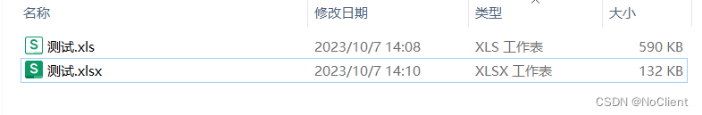

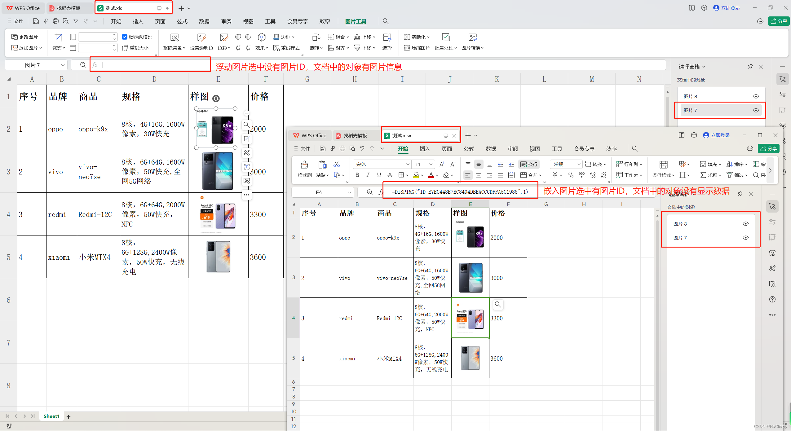

## 2.读取表格中的浮动图片

2.1读取表格前需要了解，以下是读取整个工作簿中图片文件方法，但是真实读取图片数据往往需要和其他数据进行对应，比如当有多个工作表（Sheet）时，测试中的那一张图片是vivo手机的图片，是非常不好对应的，这就需要从工作表(Sheet进行图片读取)。

```java
//xls-2003，低版本EXCEL
HSSFWorkbook book1 = new HSSFWorkbook(new FileInputStream(file));
//获取工作簿中所有图片
List<HSSFPictureData> allPictures = book1.getAllPictures();
//获取工作簿中所有文档对象
List<HSSFObjectData> allEmbeddedObjects = book1.getAllEmbeddedObjects();

//xlsx-2007，高版本EXCEL
XSSFWorkbook book = new XSSFWorkbook(new FileInputStream(file));
//获取工作簿中所有图片
List<XSSFPictureData> allPictures1 = book.getAllPictures();
//获取工作簿中所有包数据
List<PackagePart> allEmbeddedParts = book.getAllEmbeddedParts();
```

2.2读取单个工作表（Sheet）中图片。

```java
 public static void main(String[] args) throws Exception {
      File file= new File("C:/Users/Administrator/Desktop/excel/测试.xls");
      //File file = new File("C:\\Users\\Administrator\\Desktop\\excel\\测试.xlsx");
      read(file); 
 }
```

### 2.2.1读取xls文件中图片（2003）

```java
public static void read(File file) throws Exception {
        HSSFWorkbook book1 = new HSSFWorkbook(new FileInputStream(file));
        //方式1 获取sheet数量，采用下标方式遍历读取每个工作表数据
        int sheetsNos = book1.getNumberOfSheets();
        for (int sheetNo = 0; sheetNo < sheetsNos; sheetNo++) {
            //HSSFSheet sheet = book1.getSheetAt(sheetNo);
            Sheet sheet = book1.getSheetAt(sheetNo);
        }
        //方式2 获取sheet数量，直接遍历读取每个工作表数据
        for (Sheet sheet : book1) {
            HSSFSheet hssSheet = (HSSFSheet) sheet;
            //获取工作表中绘图包
            HSSFPatriarch drawingPatriarch = hssSheet.getDrawingPatriarch();
            if (drawingPatriarch != null) {
                //获取所有图像形状
                List<HSSFShape> shapes = drawingPatriarch.getChildren();
                if (shapes != null) {
                    //遍历所有形状
                    for (HSSFShape shape : shapes) {
                        //获取形状在工作表中的顶点位置信息（anchor锚点）
                        HSSFClientAnchor anchor = (HSSFClientAnchor) shape.getAnchor();
                        if (shape instanceof HSSFPicture) {
                            //形状获取对应的图片数据
                            HSSFPicture pic = (HSSFPicture) shape;
                            HSSFPictureData picData = pic.getPictureData();
                            //图片形状在工作表中的位置, 所在行列起点和终点位置
                            short c1 = anchor.getCol1();
                            //short c2 = anchor.getCol2();
                            int r1 = anchor.getRow1();
                            //int r2 = anchor.getRow2();
                            String key = r1 + "行," + c1 + "列";
                            //TODO 此处可以将图片位置和数据存入缓存中，以便解析表格数据进行对应操作及保存
                            //保存图片到本地
                            byte[] data = picData.getData();
                            //文件扩展名
                            String suffix = picData.suggestFileExtension();
                            File dir = new File("C:/Users/Administrator/Desktop/excel/img2003/");
                            if (!dir.exists()) {
                                dir.mkdirs();
                            }
                            FileUtils.writeByteArrayToFile(new File(dir.getPath() + "/" + key + "." + suffix), data);
                        }
                    }
                }
            }
        }

    }
```

下图可以看见成功读取到xls中的浮动图片，嵌入图片并未被读取到

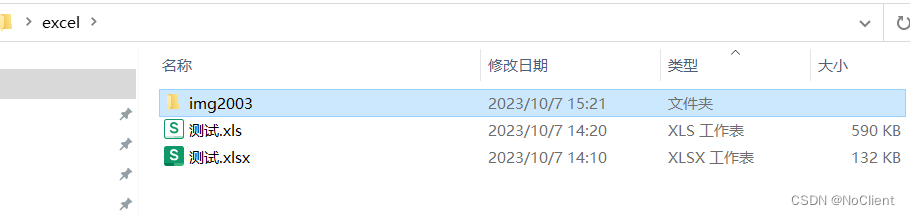

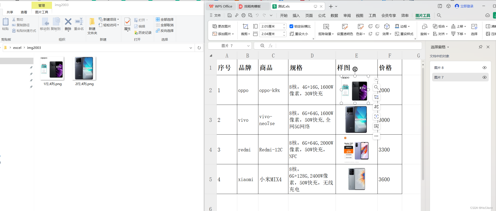

2.2.2读取xlsx文件中图片（2007）

```java
public static void read(File file) throws Exception {
        XSSFWorkbook book = new XSSFWorkbook(new FileInputStream(file));
        //方式1 获取sheet数量，采用下标方式遍历读取每个工作表数据
        int sheetsNos = book.getNumberOfSheets();
        for (int sheetNo = 0; sheetNo < sheetsNos; sheetNo++) {
            //XSSFSheet sheet = book1.getSheetAt(sheetNo);
            Sheet sheet = book.getSheetAt(sheetNo);
        }
        //方式2 获取sheet数量，直接遍历读取每个工作表数据
        for (Sheet sheet : book) {
            XSSFSheet xssSheet = (XSSFSheet) sheet;
            //获取工作表中绘图包
            XSSFDrawing drawing = xssSheet.getDrawingPatriarch();
            if (drawing != null) {
                //获取所有图像形状
                List<XSSFShape> shapes = drawing.getShapes();
                if (shapes != null) {
                    //遍历所有形状
                    for (XSSFShape shape : shapes) {
                        //获取形状在工作表中的顶点位置信息（anchor锚点）
                        XSSFClientAnchor anchor = (XSSFClientAnchor) shape.getAnchor();
                        if (shape instanceof XSSFPicture) {
                            //形状获取对应的图片数据
                            XSSFPicture pic = (XSSFPicture) shape;
                            XSSFPictureData picData = pic.getPictureData();
                            //图片形状在工作表中的位置, 所在行列起点和终点位置
                            short c1 = anchor.getCol1();
                            //short c2 = anchor.getCol2();
                            int r1 = anchor.getRow1();
                            //int r2 = anchor.getRow2();
                            String key = r1 + "行," + c1 + "列";
                            //TODO 此处可以将图片位置和数据存入缓存中，以便解析表格数据进行对应操作及保存
                            //保存图片到本地
                            byte[] data = picData.getData();
                            //文件扩展名
                            String suffix = picData.suggestFileExtension();
                            File dir = new File("C:/Users/Administrator/Desktop/excel/img2007/");
                            if (!dir.exists()) {
                                dir.mkdirs();
                            }
                            FileUtils.writeByteArrayToFile(new File(dir.getPath() + "/" + key + "." + suffix), data);
                        }
                    }
                }
            }
        }
    }
```

下图可以看见成功读取到xls中的浮动图片，嵌入图片并未被读取到

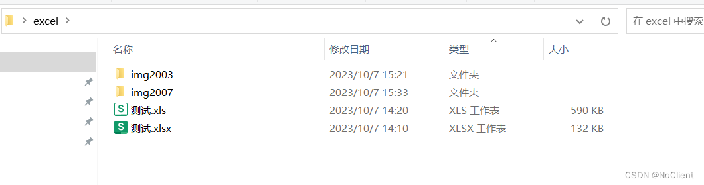

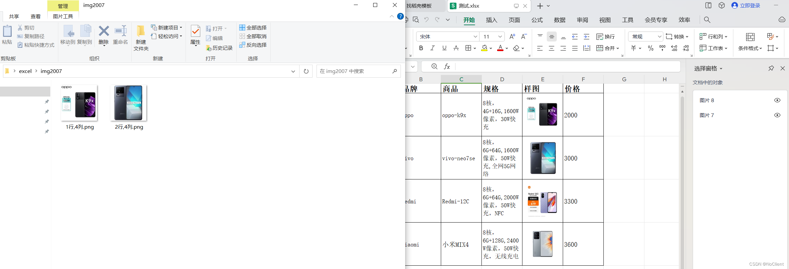

获取xlsx-2007表格中浮动图片，**方式2**

```java
public static void read(File file) throws Exception {
        XSSFWorkbook book = new XSSFWorkbook(new FileInputStream(file));
        //方式1 获取sheet数量，采用下标方式遍历读取每个工作表数据
        int sheetsNos = book.getNumberOfSheets();
        for (int sheetNo = 0; sheetNo < sheetsNos; sheetNo++) {
            //XSSFSheet sheet = book1.getSheetAt(sheetNo);
            Sheet sheet = book.getSheetAt(sheetNo);
        }
        //方式2 获取sheet数量，直接遍历读取每个工作表数据
        for (Sheet sheet : book) {
            XSSFSheet xssSheet = (XSSFSheet) sheet;
            List<POIXMLDocumentPart> list = xssSheet.getRelations();
            for (POIXMLDocumentPart part : list) {
                if (part instanceof XSSFDrawing) {
                    //获取工作表中绘图包
                    XSSFDrawing drawing = (XSSFDrawing) part;
                    if (drawing != null) {
                        //获取所有图像形状
                        List<XSSFShape> shapes = drawing.getShapes();
                        if (shapes != null) {
                            //遍历所有形状
                            for (XSSFShape shape : shapes) {
                                //获取形状在工作表中的顶点位置信息（anchor锚点）
                                XSSFClientAnchor anchor = (XSSFClientAnchor) shape.getAnchor();
                                if (shape instanceof XSSFPicture) {
                                    //形状获取对应的图片数据
                                    XSSFPicture pic = (XSSFPicture) shape;
                                    XSSFPictureData picData = pic.getPictureData();
                                    //图片形状在工作表中的位置, 所在行列起点和终点位置
                                    short c1 = anchor.getCol1();
                                    //short c2 = anchor.getCol2();
                                    int r1 = anchor.getRow1();
                                    //int r2 = anchor.getRow2();
                                    String key = r1 + "行," + c1 + "列";
                                    //TODO 此处可以将图片位置和数据存入缓存中，以便解析表格数据进行对应操作及保存
                                    //保存图片到本地
                                    byte[] data = picData.getData();
                                    //文件扩展名
                                    String suffix = picData.suggestFileExtension();
                                    File dir = new File("C:/Users/Administrator/Desktop/excel/img2007/");
                                    if (!dir.exists()) {
                                        dir.mkdirs();
                                    }
                                    FileUtils.writeByteArrayToFile(new File(dir.getPath() + "/" + key + "." + suffix), data);
                                }
                            }
                        }
                    }
                }
            }
        }
    }
```

## 2.3获取嵌入表格中的图片数据

2.3.1读取xlsx文件中嵌入单元格图片（2007）

**效果如下：**

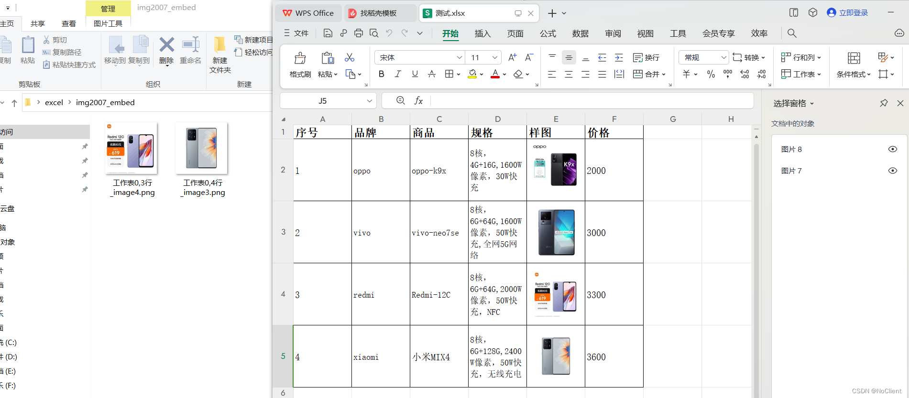

**实现原理：**

（1）将xlsx文件扩展名改为zip，变成压缩文件，再解压，如下图

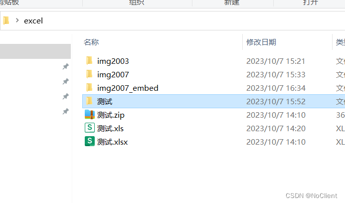

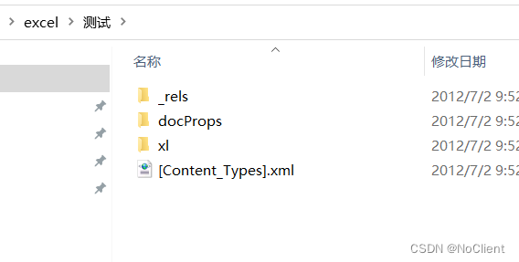

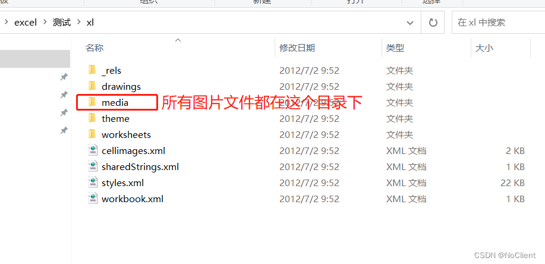

（2）以下3个关键文件信息，定位表格单元格位置，图片ID，图片编号ID，图片文件地址，如下图。

```java
/xl/\_rels/cellimages.xml.rels  rid与图片文件地址关系
/xl/cellimages.xml rid与图片编号ID关系
/xl/worksheets/sheet1.xml 工作表与图片关系**（/xl/worksheets/目录下有多个sheet.xml文件，分别代表不同的工作表，sheet1.xml表示是第一个工作表）**
```

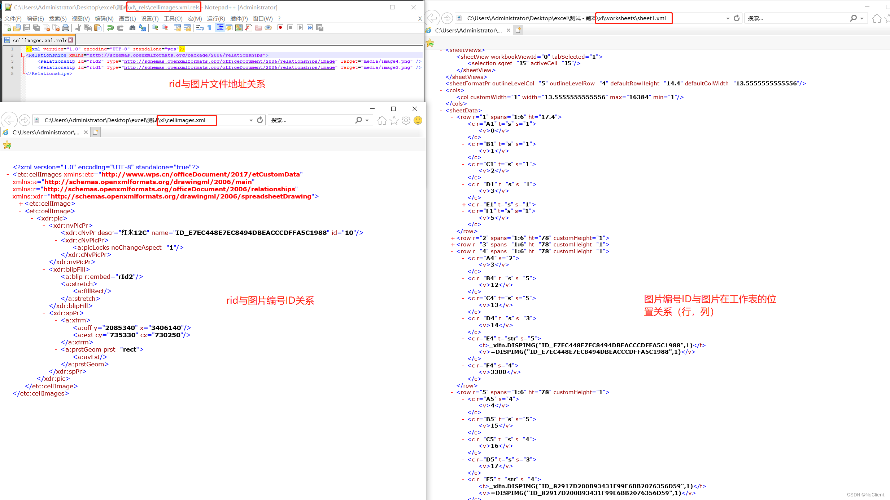

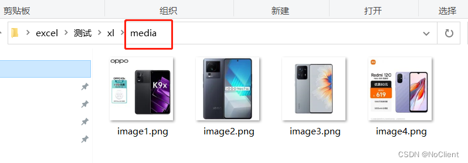

由上知道相关信息，以及图片文件，于是可以读取嵌入单元格思路及方法为：

a.将xlsx变为压缩包再读取压缩包中的数据，直接读取xlsx中压缩包数据

b.解析压缩包中关键xml文件数据，获取图片与表格单元格关系，以及图片文件信息

c.解析表格数据，对应图片及保存图片

以下示例中，使用PackageHelper直接打开的xlsx压缩包文件，SAX解析XML文件，且最后并未进行单元格列位置与图片映射。

关键代码片段：

```java
    public static void read(File file) throws Exception {
        //包管理工具打开压缩包
        OPCPackage opc = PackageHelper.open(new FileInputStream(file));
        //获取所有包文件
        List<PackagePart> parts = opc.getParts();
        //获取每个工作表中的包文件
        Map<Integer, List<PackagePart>> picturePath = getEmbedPictures(parts);
        for (Integer key : picturePath.keySet()) {
            List<PackagePart> rows = picturePath.get(key);
            for (int i = 0; i < rows.size(); i++) {
                PackagePart part = rows.get(i);
                //System.out.println("sheetNo" + key + "\t第" + i + "行\t" + part);
                if (part != null) {
                    InputStream imgIs = part.getInputStream();
                    String name = part.getPartName().getName();

                    File dir = new File("C:/Users/Administrator/Desktop/excel/img2007_embed/");
                    if (!dir.exists()) {
                        dir.mkdirs();
                    }
                    FileUtils.copyInputStreamToFile(imgIs, new File(dir.getPath() + "/工作表" + key + "," + i + "行_" + name.substring(name.lastIndexOf("/") + 1)));
                }
            }
        }
        try {
            opc.close();
        } catch (NullPointerException | IOException e) {

        }
    }
```

核心代码片段

```java
    private static Map<Integer, List<PackagePart>> getEmbedPictures(List<PackagePart> parts) throws JDOMException, IOException, ParserConfigurationException, SAXException {
        Map<String, Set<String>> mapImg = new HashMap<>();
        Map<String, String> mapImgPath = new HashMap<>();
        Map<Integer, List<String>> dataMap = new HashMap<>();

        for (PackagePart part : parts) {
//            System.out.println(part.getPartName());
            PackagePartName partName = part.getPartName();
            String name = partName.getName();
            if ("/xl/cellimages.xml".equals(name)) {
                SAXBuilder builder = new SAXBuilder();
                // 获取文档
                Document doc = builder.build(part.getInputStream());
                // 获取根节点
                Element root = doc.getRootElement();
                List<Element> cellImageList = root.getChildren();
                for (Element imgEle : cellImageList) {
                    Element xdrPic = imgEle.getChildren().get(0);
                    Element xdrNvPicPr = xdrPic.getChildren().get(0);
                    Element xdrBlipFill = xdrPic.getChildren().get(1);
                    Element aBlip = xdrBlipFill.getChildren().get(0);
                    Attribute attr = aBlip.getAttributes().get(0);
                    String imgId = xdrNvPicPr.getChildren().get(0).getAttributeValue("name");
                    String id = attr.getValue();
//                    if (id.equals("rId12")) {
//                        System.out.println(attr.getValue() + "\t" + imgId);
//                    }
                    if (mapImg.containsKey(id)) {
                        mapImg.get(id).add(imgId);
                    } else {
                        Set<String> set = new HashSet<>();
                        set.add(imgId);
                        mapImg.put(id, set);
                    }
                }
            }

            if ("/xl/_rels/cellimages.xml.rels".equals(name)) {
                SAXBuilder builder = new SAXBuilder();
                // 获取文档
                Document doc = builder.build(part.getInputStream());
                // 获取根节点
                Element root = doc.getRootElement();
                List<Element> relationshipList = root.getChildren();
                /*
                  <Relationship Id="rId999" Type="http://schemas.openxmlformats.org/officeDocument/2006/relationships/image" Target="media/image1000.jpeg"/>
                 */
                for (Element relationship : relationshipList) {
                    String id = relationship.getAttributeValue("Id");
                    String target = relationship.getAttributeValue("Target");
                    mapImgPath.put(id, target);
//                    if (id.equals("rId12")) {
//                        System.out.println(id + "\t" + target);
//                    }
                }
            }

            if (name.contains("/xl/worksheets/sheet")) {
//                SAXBuilder builder = new SAXBuilder();
                // 获取文档
                String sheetNoStr = name.replace("/xl/worksheets/sheet", "").replace(".xml", "");
                Integer sheetNo = Integer.valueOf(sheetNoStr) - 1;
                // 步骤1：创建SAXParserFactory实例
                SAXParserFactory factory = SAXParserFactory.newInstance();
                // 步骤2：创建SAXParser实例
                SAXParser parser = factory.newSAXParser();
                MySAXParserHandler handler = new MySAXParserHandler();
                parser.parse(part.getInputStream(), handler);

                List<String> rows = handler.getRows();

                dataMap.put(sheetNo, rows);
            }

        }

//        for (Integer sheetNo : dataMap.keySet()) {
//            System.out.println(sheetNo + "\t" + dataMap.get(sheetNo).size());
//        }

        Map<String, String> imgMap = new HashMap<>();
        for (String id : mapImg.keySet()) {
            Set<String> imgIds = mapImg.get(id);
            String path = mapImgPath.get(id);
            for (String imgId : imgIds) {
                imgMap.put(imgId, path);
            }
        }
        for (Integer key : dataMap.keySet()) {
            List<String> rows = dataMap.get(key);
            for (int i = 0; i < rows.size(); i++) {
                String imgId = rows.get(i);
                if (imgMap.containsKey(imgId)) {
                    rows.set(i, imgMap.get(imgId));
                }
            }
        }

        Map<Integer, List<PackagePart>> map = new HashMap<>();
        for (Integer key : dataMap.keySet()) {
            List<PackagePart> list = new ArrayList<>();
            map.put(key, list);
            List<String> pathList = dataMap.get(key);
            for (int i = 0; i < pathList.size(); i++) {
                list.add(i, null);
                String path = pathList.get(i);
                if (StringUtils.isNotEmpty(path)) {
                    for (PackagePart part : parts) {
                        PackagePartName partName = part.getPartName();
                        String name = partName.getName();
                        // /xl/media/image373.jpeg = media/image702.jpeg
                        if (name.contains(path)) {
                            list.set(i, part);
                            break;
                        }
                    }
                }

            }
        }
        return map;
    }
```

插件代码（XML解析），采用的是SAX解析XML

```java
package com.sx.jz.modules.tm.utils.vo;

import org.xml.sax.Attributes;
import org.xml.sax.SAXException;
import org.xml.sax.helpers.DefaultHandler;

import java.util.ArrayList;
import java.util.List;

/**
 * xml解析
 *
 * @author NoClient
 * @date 2023/8/15 14:24
 * @since 1.0
 */
public class MySAXParserHandler extends DefaultHandler {
    String value = null;

    List<String> rows = new ArrayList<>();

    int rowIndex = 0;

    public List<String> getRows() {
        return rows;
    }

    /**
     * 用来标识解析开始
     */
    @Override
    public void startDocument() throws SAXException {
        // TODO Auto-generated method stub
        super.startDocument();
        // System.out.println("SAX解析开始");
    }

    /**
     * 用来标识解析结束
     */
    @Override
    public void endDocument() throws SAXException {
        // TODO Auto-generated method stub
        super.endDocument();
        // System.out.println("SAX解析结束");
    }

    /**
     * 解析xml元素
     */
    @Override
    public void startElement(String uri, String localName, String qName, Attributes attributes) throws SAXException {
        // 调用DefaultHandler类的startElement方法
        super.startElement(uri, localName, qName, attributes);
        if (qName.equals("row")) {
            value = "";
        }

    }

    @Override
    public void endElement(String uri, String localName, String qName)
            throws SAXException {
        //调用DefaultHandler类的endElement方法
        super.endElement(uri, localName, qName);
        if (qName.equals("row")) {
            if (value != null && value.contains("DISPIMG")) {
                value = value.substring(value.lastIndexOf("DISPIMG(")).replace("DISPIMG(\"", "");
                value = value.substring(0, value.indexOf("\""));
                rows.add(rowIndex, value);
            } else {
                rows.add(rowIndex, null);
            }
            rowIndex++;
            value = "";
        }
    }

    @Override
    public void characters(char[] ch, int start, int length)
            throws SAXException {
        super.characters(ch, start, length);
        value += new String(ch, start, length);
    }
}

```

  

本文转自 [https://blog.csdn.net/qq\_23123177/article/details/133638391?spm=1001.2101.3001.6650.1&utm\_medium=distribute.pc\_relevant.none-task-blog-2%7Edefault%7ECTRLIST%7ERate-1-133638391-blog-133701891.235%5Ev43%5Econtrol&depth\_1-utm\_source=distribute.pc\_relevant.none-task-blog-2%7Edefault%7ECTRLIST%7ERate-1-133638391-blog-133701891.235%5Ev43%5Econtrol&utm\_relevant\_index=2](https://blog.csdn.net/qq_23123177/article/details/133638391?spm=1001.2101.3001.6650.1&utm_medium=distribute.pc_relevant.none-task-blog-2%7Edefault%7ECTRLIST%7ERate-1-133638391-blog-133701891.235%5Ev43%5Econtrol&depth_1-utm_source=distribute.pc_relevant.none-task-blog-2%7Edefault%7ECTRLIST%7ERate-1-133638391-blog-133701891.235%5Ev43%5Econtrol&utm_relevant_index=2)，如有侵权，请联系删除。