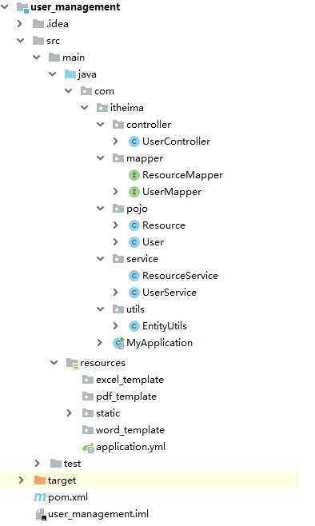
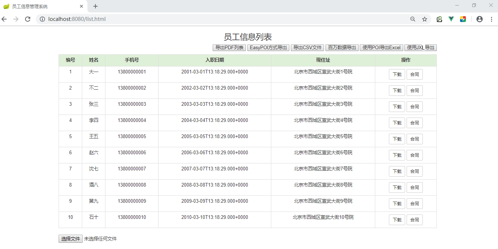
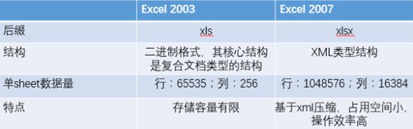

# 报表--0.环境说明-Excel说明

报表[forms for reporting to the higher organizations]，就是向上级报告情况的表格。简单的说：报表就是用表格、图表等格式来动态显示数据，可以用公式表示为：“报表 = 多样的格式 + 动态的数据”。 

## 开发环境搭建

功能说明：整个案例我们操作用户表，做一个企业员工（用户）数据的导入导出。

我们使用SpringBoot+通用mapper+vue方式搭建开发环境

第一步：准备数据库，把资料文件夹下中的sql脚本直接执行

《report_manager_db.sql》

第二步：打开idea或Eclipse，导入资料文件夹中准备好的《user_management》项目

以idea为例，导入后整体结构如下

第三步：启动引导类，浏览器访问 http://localhost:8080/list.html

## Excel说明

在企业级应用开发中，Excel报表是一种最常见的报表需求。Excel报表开发一般分为两种形式：
1、为了方便操作，基于Excel的报表批量上传数据，也就是把Excel中的数据导入到系统中。
2、通过java代码生成Excel报表。也就是把系统中的数据导出到Excel中，方便查阅。

## Excel的两种版本

目前世面上的Excel分为两个大的版本Excel2003和Excel2007及以上两个版本；
两者之间的区别如下：

Excel2003 是一个特有的二进制格式，其核心结构是复合文档类型的结构，存储数据量较小；

Excel2007 的核心结构是 XML 类型的结构，采用的是基于 XML 的压缩方式，使其占用的空间更小，

​                  操作效率更高

## 常见的Excel操作工具

Java中常见的用来操作Excel的方式一般有2种：JXL和POI。

###  JXL

JXL只能对Excel进行操作,属于比较老的框架，它只支持到Excel 95-2000的版本。现在已经停止更新和
维护,所以本课程中只时简单地演示一下jxl的代码，不会把它作为重点，

### POI

POI是apache的项目,可对微软的Word,Excel,PPT进行操作,包括office2003和2007,Excle2003和2007。
poi现在一直有更新。所以现在主流使用POI。

Apache POI是Apache软件基金会的开源项目，由Java编写的免费开源的跨平台的 Java API，Apache
POI提供API给Java语言操作Microsoft Office的功能。

API对象介绍

| 对象   |          | 2003         | 2007及以上   |
| ------ | -------- | ------------ | ------------ |
| 工作簿 | WorkBook | HSSFWordBook | XSSFWorkBook |
| 工作表 | Sheet    | HSSFSheet    | XSSFSheet    |
| 行     | Row      | HSSFRow      | XSSFRow      |
| 单元格 | Cell     | HSSFCell     | XSSFCell     |

