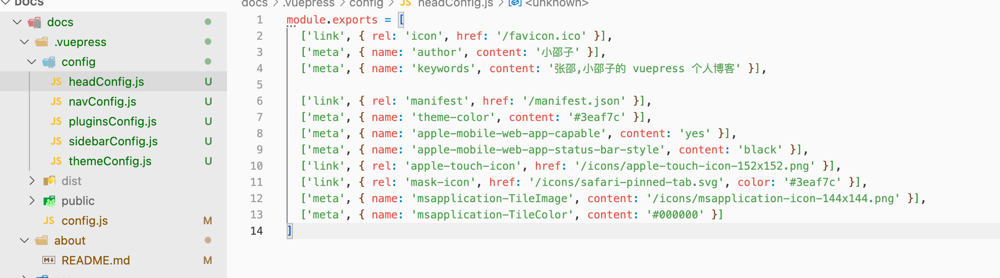

# 13、分割config


> config.js

```js

const headConfig = require('./config/headConfig');
const pluginsConfig = require('./config/pluginsConfig');
const themeConfig = require('./config/themeConfig')

module.exports = {
  title: "小邵子",
  description: '小邵子的个人笔记',
  head: headConfig,
  base: "/docs/",
  plugins: pluginsConfig,
  themeConfig: themeConfig,
}
```

> 分割的js

