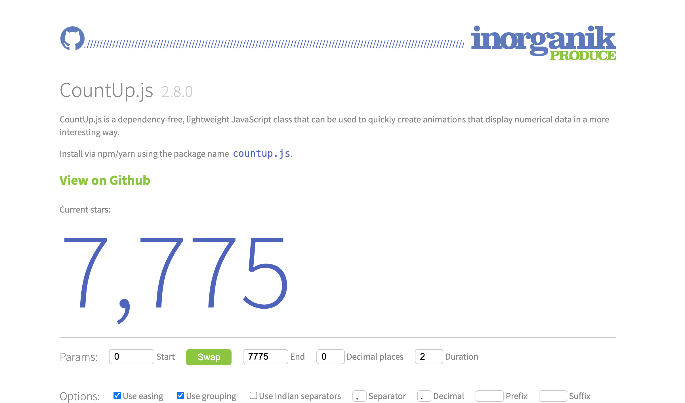
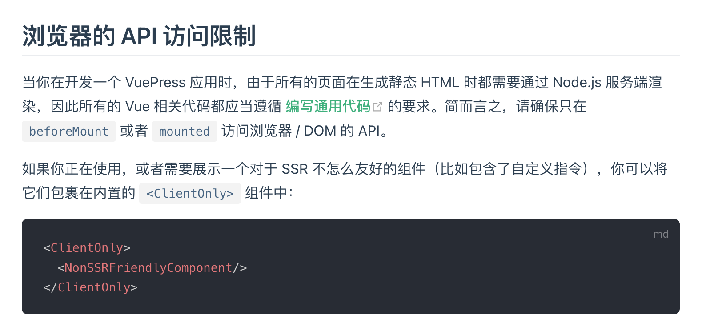
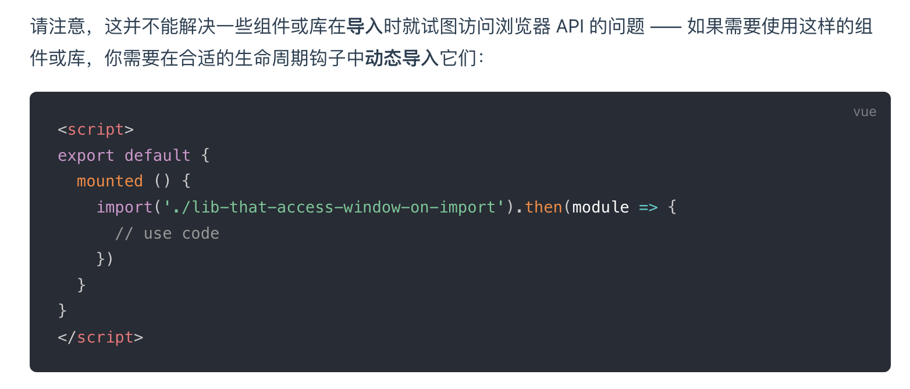
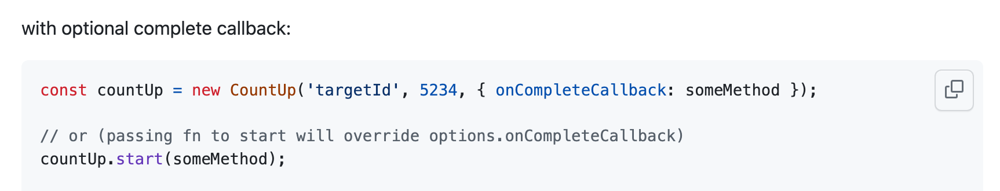
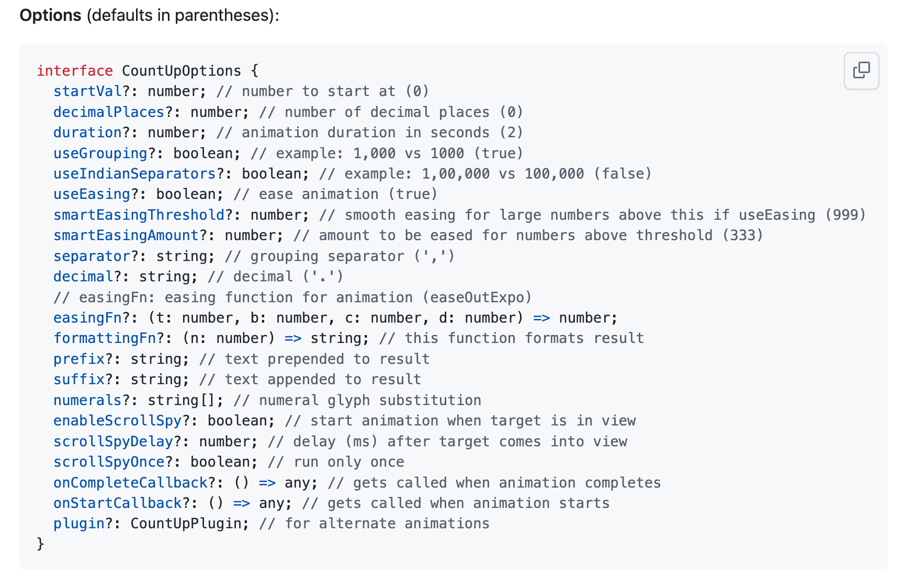
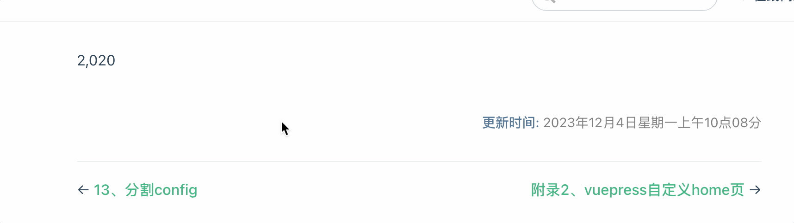
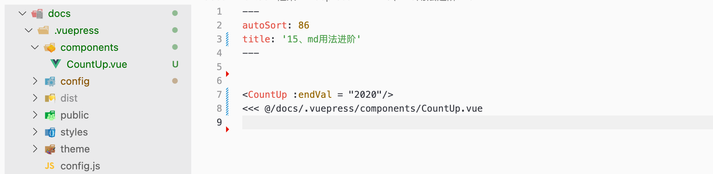
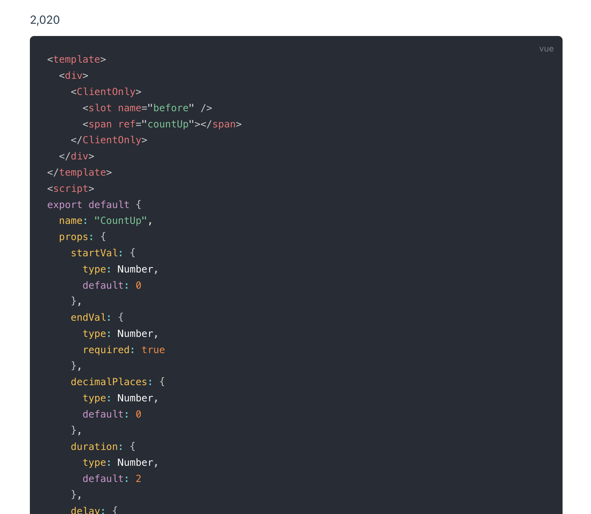

vuepress markdown说明文档

https://www.vuepress.cn/guide/markdown.html


## 示例：封装`countUp.js`为Vue组件

https://github.com/inorganik/countUp.js

https://inorganik.github.io/countUp.js/




### 安装

```
yarn add countup.js
```


### 创建vue文件

> 全局Vue组件存放位置


> 使用 `<ClientOnly>`包裹我们的组件内容



> 在mounted中导入第三方组件




> 官方文档使用方式
>
> https://github.com/inorganik/countUp.js






> 编写完整代码

<<< @/docs/.vuepress/components/CountUp.vue


### 引入使用

```vue
<CountUp :endVal = "2020"/>
```




### Markdown 导入代码段

> ```md
> <<< @/filepath
> ```
>
> https://www.vuepress.cn/guide/markdown.html#%E5%AF%BC%E5%85%A5%E4%BB%A3%E7%A0%81%E6%AE%B5



