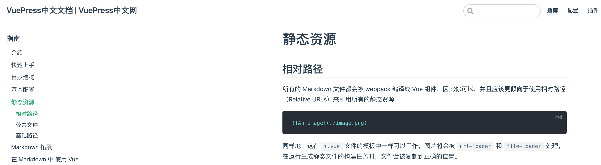
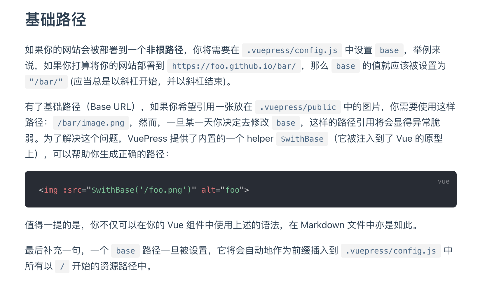
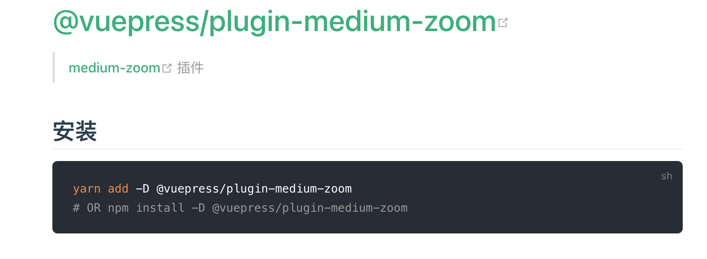

### 图片引入两种方式

https://www.vuepress.cn/guide/assets.html#%E7%9B%B8%E5%AF%B9%E8%B7%AF%E5%BE%84






### 图片缩放插件




### 实战

> md文件引入图片

```html

```

> 安装配置插件

```js
  '@vuepress/medium-zoom': {
    selector: 'img.zoom-custom-imgs',
  },
```

> 效果展示

