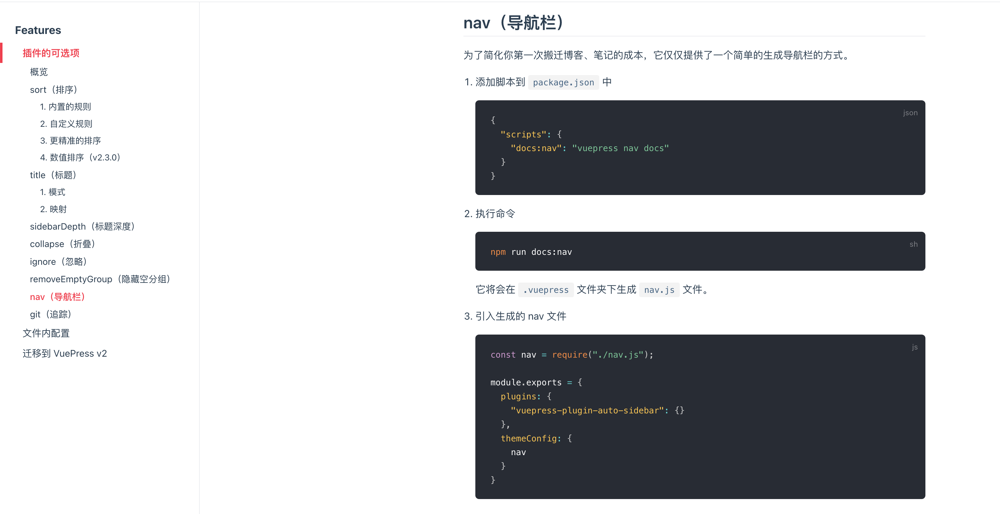
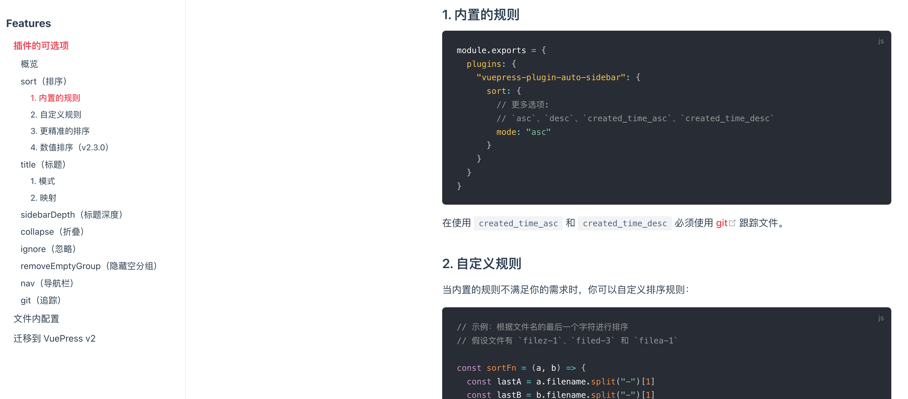

自动生成侧边栏插件

https://github.com/shanyuhai123/vuepress-plugin-auto-sidebar

https://shanyuhai123.github.io/vuepress-plugin-auto-sidebar/


安装

```
npm i vuepress-plugin-auto-sidebar -D
```

```js
module.exports = {
  plugins: [
    ["vuepress-plugin-auto-sidebar", {
      // options
    }]
  ]
}
```


```js
module.exports = {
  //logo: '/assets/img/logo.png',
  nav: nav,
  //使用自动生成
  //sidebar: sidebarConfig ,
  lastUpdated: '更新时间',
}
```

### 生成导航栏




### 排序

[详细说明](https://shanyuhai123.github.io/vuepress-plugin-auto-sidebar/zh/features/plugin-options.html#_1-%E5%86%85%E7%BD%AE%E7%9A%84%E8%A7%84%E5%88%99)



