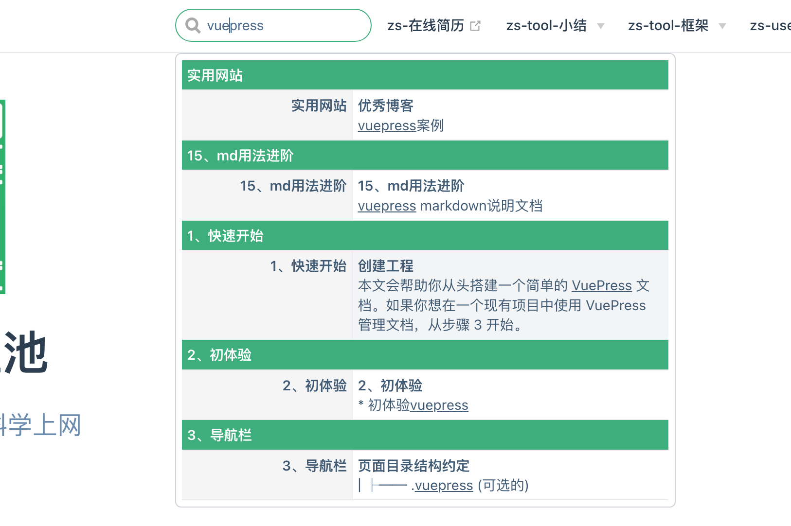
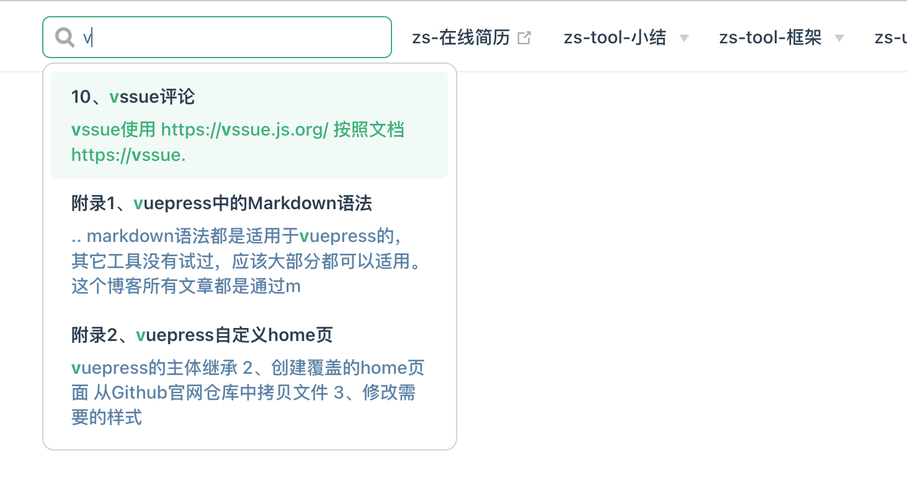
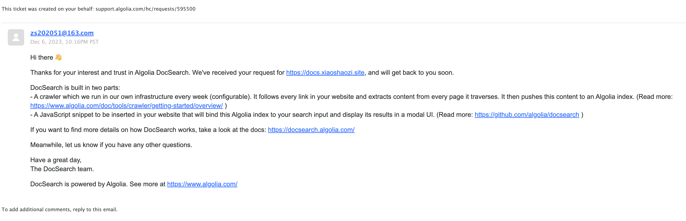
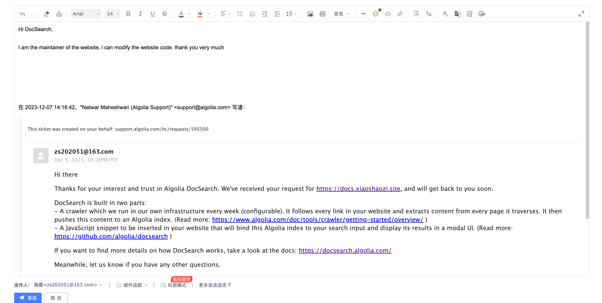

默认主题自带的搜索, 只会为页面的**标题、h2、h3 以及 tags**构建搜索索引。所以尽量将围绕知识点的关键字体现到标题上。而 tags 更为灵活，可以把相关的能想到的关键字都配置到 tags 中，以方便搜索。


[默认插件介绍](https://www.vuepress.cn/plugin/official/plugin-search.html)

[默认主体配置](https://www.vuepress.cn/theme/default-theme-config.html#%E5%86%85%E7%BD%AE%E6%90%9C%E7%B4%A2)


## 通过插件 vuepress-plugin-fulltext-search 实现全文搜索

1. 安装依赖 vuepress-plugin-fulltext-search 　　

   ```node
   yarn add -D vuepress-plugin-fulltext-search
   ```

   

2. 修改配置 vi docs/.vuepress/config.js

   ```
     module.exports = {
     // ...
     plugins: ['fulltext-search'],
     }
   ```


搜索效果如下, 展示效果和 algolia 相似



> 提示
>
> 安装了该依赖后, 后面再用 yarn 安装其它依赖会报错,为避免影响其它插件正常使用,我最后决定从系统中移除了该插件

[参考文档](https://github.com/leo-buneev/vuepress-plugin-fulltext-search)

> 提示
>
> 发现的不足:
>
> 1. 没有提供额外的调整参数, 如最大搜索结果数量等
>
> 2. 关键词不高亮显示

[官方文档](https://github.com/leo-buneev/vuepress-plugin-fulltext-search)


## 通过插件 vuepress-plugin-flexsearch 实现全文搜索

1. 安装依赖

   ```
   yarn add -D vuepress-plugin-flexsearch
   ```

2. 修改配置

   ```js
   // .vuepress/config.js
   
   module.exports = {
       plugins: [
         ['flexsearch'],
         // other plugins
       ]
   }
   ```

   > 提示
   >
   > 优点:
   >
   > 1. 提供了更多的配置项
   > 2. 搜索结果高亮显示
   >
   > 但是按官方文档没有配置好对中文分词的支持，待日后完善。

   > [官方文档](https://github.com/z3by/vuepress-plugin-flexsearch)

搜索效果如下



##  集成第三方免费搜索服务 algolia

https://docsearch.algolia.com/apply/




