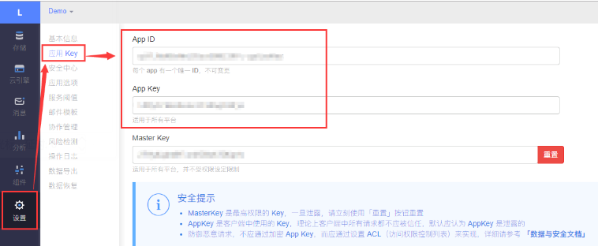

# vuepress 支持评论


本文讲述 vuepress 站点如何集成评论系统，选型是 valine+leancloud, 支持匿名评论，缺点是数据没有存储在自己手里。市面上也有其他的方案, 如 gitalk,vssue 等, 但需要用户登录 github 才能发表评论, 但 github 经常无法连接,导致体验非常差。

> [参考文档 (opens new window)](https://github.com/dongyuanxin/vuepress-plugin-comment)

[#](about:blank#%E6%B3%A8%E5%86%8C-leancloud) 注册 leancloud
----------------------------------------------------------

* 注册[leancloud (opens new window)](https://leancloud.cn/)账号,创建应用

* 复制 AppID 和 AppKey 

  

提示

可通过 leancloud 后台管理评论内容

[#](about:blank#%E6%B7%BB%E5%8A%A0%E8%AF%84%E8%AE%BA%E6%8F%92%E4%BB%B6) 添加评论插件
------------------------------------------------------------------------------

*   yarn add vuepress-plugin-comment -D
*   vi ./config.js

```
// 评论插件
[
  "vuepress-plugin-comment",
  {
    choosen: "valine",
    // options选项中的所有参数，会传给Valine的配置
    options: {
      el: "#valine-vuepress-comment",
      appId: "cxPSbJA9SE1uXWt0ywBRl0Cr-gzGzoHsz",
      appKey: "jKPdKyf3rUlfcVV03gPyBSd1",
      path: '<%- frontmatter.to.path %>'
    }
  }
]

```

注意

若不配置 path，则切换页面时评论内容不会刷新