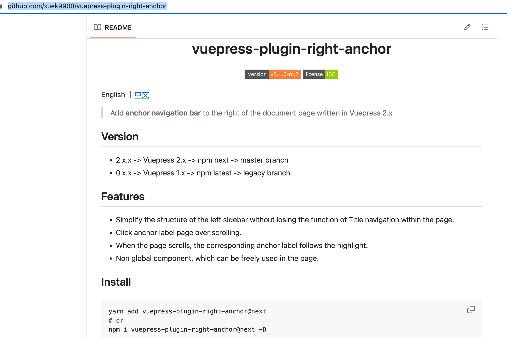
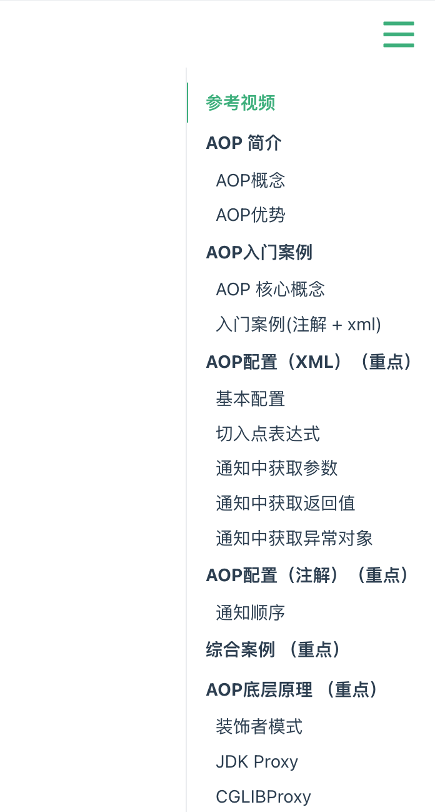

# 25、vuepress 右侧目录

https://github.com/xuek9900/vuepress-plugin-right-anchor


<h1 align="center">vuepress-plugin-right-anchor</h1>
<div align="center">


</div>

[English](./README.md) ｜中文

> 在用 Vuepress 2.x 编写的文档页面右侧添加 **锚点导航栏**

## 版本
  - 2.x.x -> Vuepress 2.x -> npm next   -> master 分支
  - 0.x.x -> Vuepress 1.x -> npm latest -> legacy 分支


## 特性
  - 简化左侧边栏结构的同时不丢失页面内标题导航的功能。
  - 点击锚点标签页面滚动过度。
  - 页面滚动时对应锚点标签跟随高亮。
  - 非全局组件，可在页面内自由使用。


## 安装
```bash
yarn add vuepress-plugin-right-anchor@next
# or
npm i vuepress-plugin-right-anchor@next -D
```

## 使用
在 `.vuepress/config.js` 添加如下配置。 
```js
module.exports = {
  // ...
  plugins: [
    // ...
    ['vuepress-plugin-right-anchor']
  ]
}
```

## 样式
在 `.vuepress/styles/index.scss` 添加样式变量。

```scss
.right-anchor {
  --rightAnchorTextColor: var(--c-text);
  --rightAnchorFontSize: 14px;
  /* Btn */
  --rightAnchorBtnTextColor: var(--rightAnchorTextColor);
  --rightAnchorBtnBgColor: var(--c-bg);
  /* Menu */
  --rightAnchorMenuTextColor: var(--rightAnchorTextColor);
  --rightAnchorMenuBgColor: var(--c-bg);
}

/* dark theme */
.dark .right-anchor {
  --rightAnchorTextColor: var(--c-text);
  --rightAnchorFontSize: 14px;
  /* Btn */
  --rightAnchorBtnTextColor: var(--rightAnchorTextColor);
  --rightAnchorBtnBgColor: var(--c-bg);
  /* Menu */
  --rightAnchorMenuTextColor: var(--rightAnchorTextColor);
  --rightAnchorMenuBgColor: var(--c-bg);
}
```

## 全局配置
在 `.vuepress/config.js` 添加如下配置。 
```js
module.exports = {
  // ...
  plugins: [
    // ...
    [
      'vuepress-plugin-right-anchor',
      {
        showDepth: 1,
        ignore: [
          '/',
          '/api/'
          // 更多...
        ],
        expand: {
          trigger: 'hover',
          clickModeDefaultOpen: true
        },
        customClass: 'your-customClass',
      }
    ]
  ]
}
```

## 参数说明

### showDepth

  在右锚显示中将使用哪一级别的标题。
  该值的指向含义与 [themeconfig.sidebardepth](https://vuepress.vuejs.org/zh/theme/default-theme-config.html#%E4%BE%A7%E8%BE%B9%E6%A0%8F) 相同。

  - Type: null | number
  - Default: null

### ignore

  不显示 right-anchor 的页面。

  - Type: array
  - Default: []

### expand

  关于菜单的展开配置。

  - Type: object
    - trigger: string  => 展开菜单的触发方式。 `'hover' | 'click'`
    - clickModeDefaultOpen: boolean => 点击模式下是否默认打开菜单?
  - Default:
      ```js
      {
        trigger: 'hover',
        clickModeDefaultOpen: true
      }
      ```
### customClass

  自定义的 `right-anchor` 类名。

  - Type: null | string
  - Default: null

## 页面单独配置

  在 `.md` 中通过 `vuepress` 推荐的方式设置 `front-matter`。

  ```YAML
  ---
  rightAnchor: 
    showDepth: 1
    expand:
      trigger: hover
      clickModeDefaultOpen: true
    customClass: your-customClass
  ---
  ```




