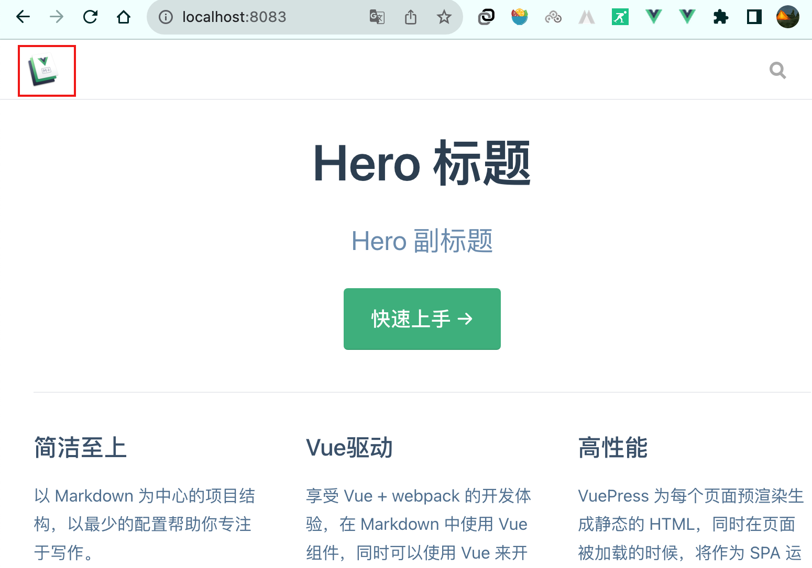
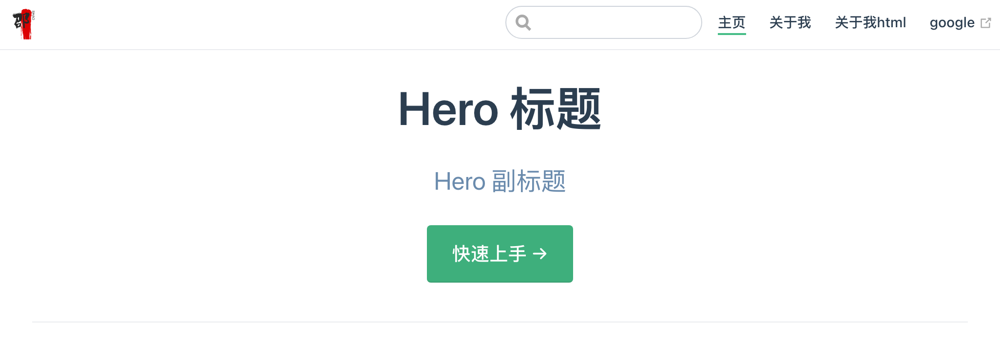

# 3、导航栏 


## 页面目录结构约定

```powershell
.
├── docs
│   ├── .vuepress (可选的)
│   │   ├── components (可选的)
│   │   ├── theme (可选的)
│   │   │   └── Layout.vue
│   │   ├── public (可选的)
│   │   ├── styles (可选的)
│   │   │   ├── index.styl
│   │   │   └── palette.styl
│   │   ├── templates (可选的, 谨慎配置)
│   │   │   ├── dev.html
│   │   │   └── ssr.html
│   │   ├── config.js (可选的)
│   │   └── enhanceApp.js (可选的)
│   │ 
│   ├── README.md
│   ├── guide
│   │   └── README.md
│   └── config.md
│ 
└── package.json


docs/.vuepress: 用于存放全局的配置、组件、静态资源等。
docs/.vuepress/components: 该目录中的 Vue 组件将会被自动注册为全局组件。
docs/.vuepress/theme: 用于存放本地主题。
docs/.vuepress/styles: 用于存放样式相关的文件。
docs/.vuepress/styles/index.styl: 将会被自动应用的全局样式文件，会生成在最终的 CSS 文件结尾，具有比默认样式更高的优先级。
docs/.vuepress/styles/palette.styl: 用于重写默认颜色常量，或者设置新的 stylus 颜色常量。
docs/.vuepress/public: 静态资源目录。
docs/.vuepress/templates: 存储 HTML 模板文件。
docs/.vuepress/templates/dev.html: 用于开发环境的 HTML 模板文件。
docs/.vuepress/templates/ssr.html: 构建时基于 Vue SSR 的 HTML 模板文件。
docs/.vuepress/config.js: 配置文件的入口文件，也可以是 YML 或 toml。
docs/.vuepress/enhanceApp.js: 客户端应用的增强。
```

对于上述的目录结构，默认页面路由地址如下：

| 文件的相对路径     | 页面路由地址   |
| ------------------ | -------------- |
| `/README.md`       | `/`            |
| `/guide/README.md` | `/guide/`      |
| `/config.md`       | `/config.html` |


创建about页面

```powershell
docs
├── README.md
└── about
    └── README.md
```


```powershell
docs
├── README.md
├── about
│   └── README.md
└── about.md
```


# 导航栏

## 导航栏logo

### 导航栏 Logo

你可以通过 `themeConfig.logo` 增加导航栏 Logo ，Logo 可以被放置在[公共文件目录](https://www.vuepress.cn/guide/assets.html#public-files)：

```js
// .vuepress/config.js
module.exports = {
  themeConfig: {
    logo: '/assets/img/logo.png',
  }
}
```


```powershell
docs
├── .vuepress
│   ├── config.js
│   └── public
│       └── assets
│           └── img
│               ├── hero.png
│               └── logo.png
├── README.md
├── about
│   └── README.md
└── about.md
```




### 导航栏链接

你可以通过 `themeConfig.nav` 增加一些导航栏链接:

```js
// .vuepress/config.js
module.exports = {
  themeConfig: {
    logo: '/assets/img/logo.png',
    nav: [
      { text: '主页', link: '/' },
      { text: '关于我', link: '/about/' },
      { text: '关于我html', link: '/about.html' },
      { text: 'google', link: 'https://google.com' },
    ]
  }
}
```



外部链接 `<a>` 标签的特性将默认包含`target="_blank" rel="noopener noreferrer"`，你可以提供 `target` 与 `rel`，它们将被作为特性被增加到 `<a>` 标签上：

```js
// .vuepress/config.js
module.exports = {
  themeConfig: {
    nav: [
      { text: 'External', link: 'https://google.com', target:'_self', rel:'' },
      { text: 'Guide', link: '/guide/', target:'_blank' }
    ]
  }
}
```

当你提供了一个 `items` 数组而不是一个单一的 `link` 时，它将显示为一个 `下拉列表` ：

```js
// .vuepress/config.js
module.exports = {
  themeConfig: {
    nav: [
      {
        text: 'Languages',
        ariaLabel: 'Language Menu',
        items: [
          { text: 'Chinese', link: '/language/chinese/' },
          { text: 'Japanese', link: '/language/japanese/' }
        ]
      }
    ]
  }
}
```

示例

```js
module.exports = {
  themeConfig: {
    logo: '/assets/img/logo.png',
    nav: [
      { text: '主页', link: '/' },
      { text: '关于我', link: '/about/' },
      { text: '关于我html', link: '/about.html', target: '_blank' },
      { text: 'google', link: 'https://google.com', target: '_self', rel: '' },
      {
        text: '关于我',
        ariaLabel: '关于我',
        items: [
          { text: 'about', link: '/about/' },
          { text: 'about.html', link: '/about.html' }
        ]
      }
    ]
  }
}
```


### 禁用导航栏

你可以使用 `themeConfig.navbar` 来禁用==所有页面==的导航栏：

```js
// .vuepress/config.js
module.exports = {
  themeConfig: {
    navbar: false
  }
}
```

你也可以通过 `YAML front matter` 来禁用某个==指定页面==的导航栏：

```yaml
---
navbar: false
---
```


