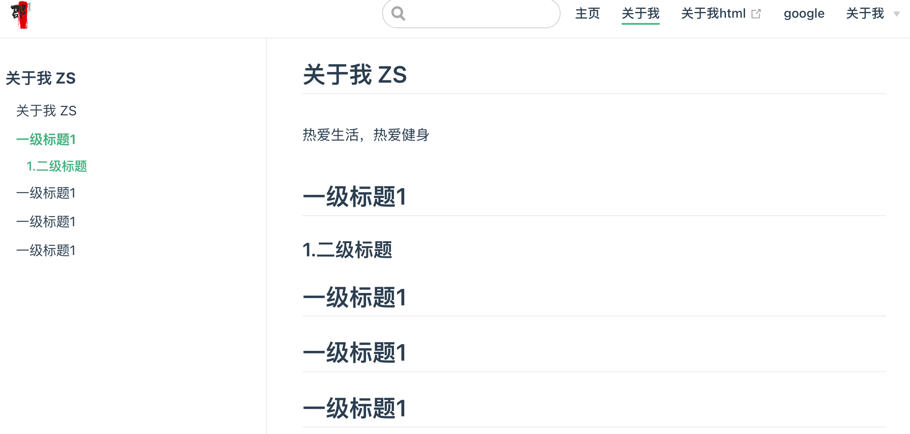
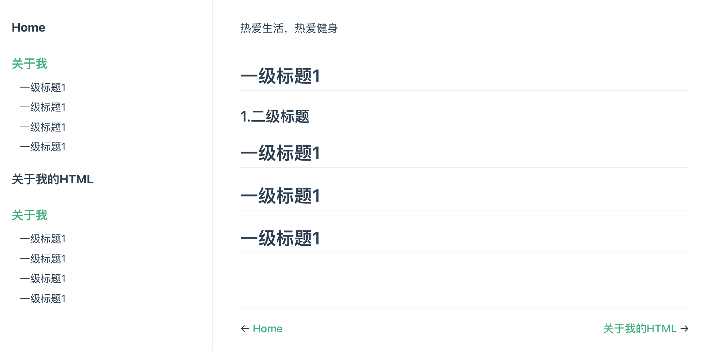
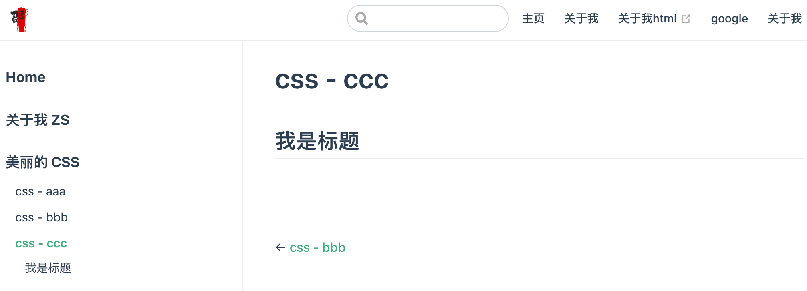
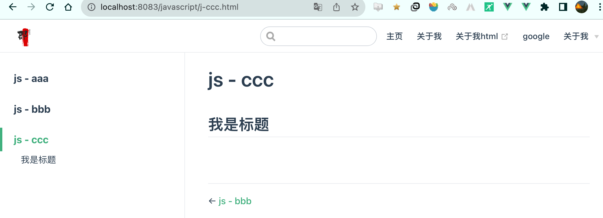

# 4、侧边栏

## 自动生成侧栏

如果你希望自动生成一个仅仅包含了当前页面标题（headers）链接的侧边栏，你可以通过 `YAML front matter` 来实现：

```yaml
---
sidebar: auto
---
```

你也可以通过配置来在所有页面中启用它：

```js
// .vuepress/config.js
module.exports = {
  themeConfig: {
    sidebar: 'auto'
  }
}
```

在 [多语言](https://www.vuepress.cn/guide/i18n.html) 模式下, 你也可以将其应用到某一特定的语言下：

```js
// .vuepress/config.js
module.exports = {
  themeConfig: {
     '/zh/': {
       sidebar: 'auto'
     }
  }
}
```




home页面中的`home: true`会抑制侧边栏的生成


## 侧边栏分组

记得关闭自动生成侧边栏的功能

```js
sidebar: [
    '/',
    ['/about/','关于我'],
    ['/about.html', '关于我的HTML'],
    ['/about/','关于我'],
]
```



## 数组形式：分组侧边栏

```js
sidebar: [
    '/',
    '/about/',
    {
        title: '美丽的 CSS',
        path: '/css/',
        collapsable: false, // 可选的, 默认值是 true,
        sidebarDepth: 1,    // 可选的, 默认值是 1
        children: [
            '/css/c-aaa',
            '/css/c-bbb',
            '/css/c-ccc',
        ]
    }
]
```



## 对象形式：

```js
sidebar: {
    "/css/": [
        'c-aaa',
        'c-bbb',
        'c-ccc',
    ],
        "/javascript/": [
            'j-aaa',
            'j-bbb',
            'j-ccc',
        ]
}
```





[视频作者开发插件](https://www.npmjs.com/package/vuepress-plugin-auto-sidebar)

[作者博客](https://docs.shanyuhai.top)

