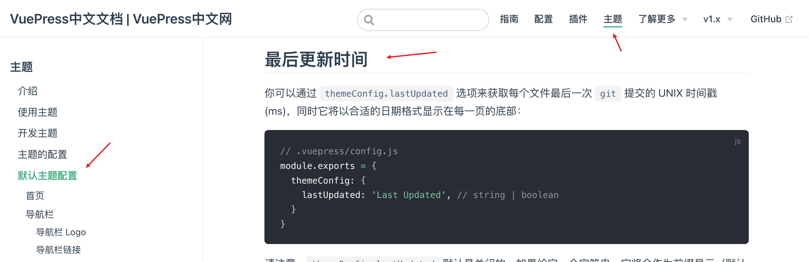
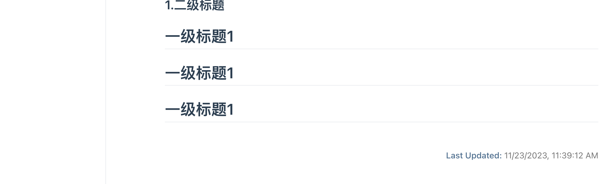
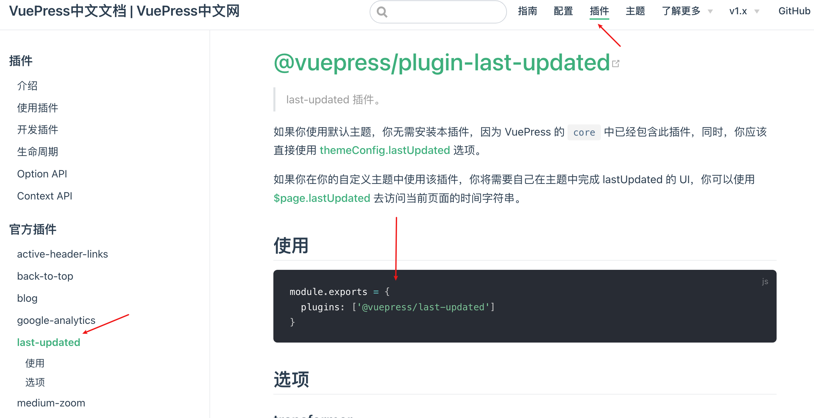
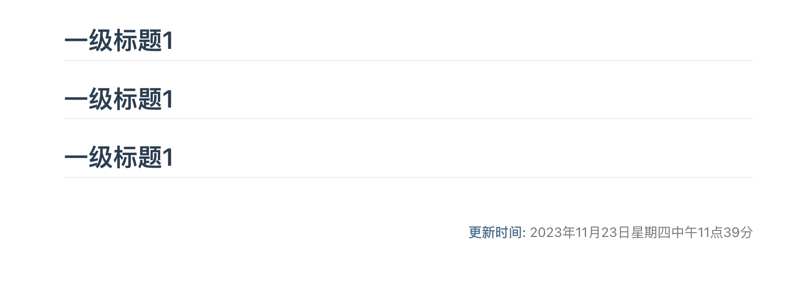

# 6、时间更新

- 基于Git提交时间
- 修改文字
- 时间格式 moment




## 最后更新时间



## 时间格式修改

```js
下载库文件
yarn add moment


const moment = require('moment');
moment.locale('zh-cn')

module.exports = {
    themeConfig: {
        lastUpdated: '更新时间',
    },
    plugins: [
        [
            '@vuepress/last-updated',
            {
                transformer: (timestamp, lang) => {
                    //return moment(timestamp).fromNow()
                    return moment(timestamp).format("LLLL")
                }
            }
        ]
    ],
}
```

[moment官网](https://momentjs.com/)

[moment中文网](https://momentjs.cn/)




