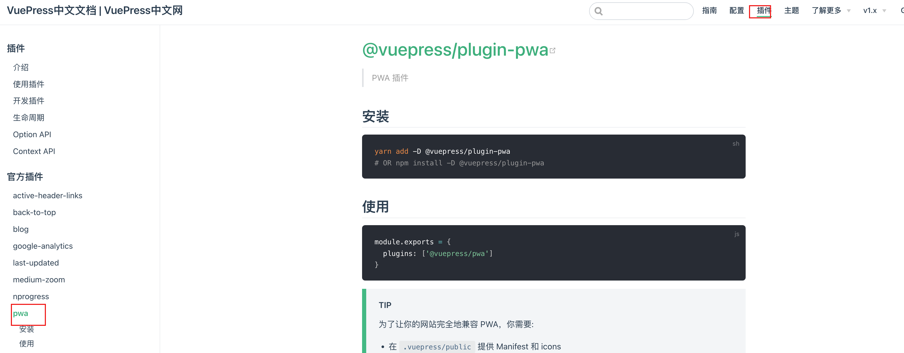
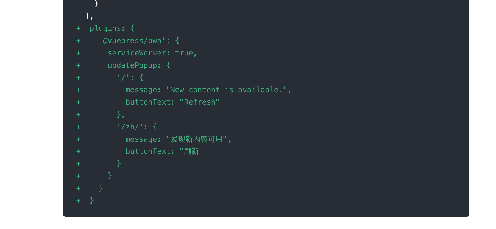
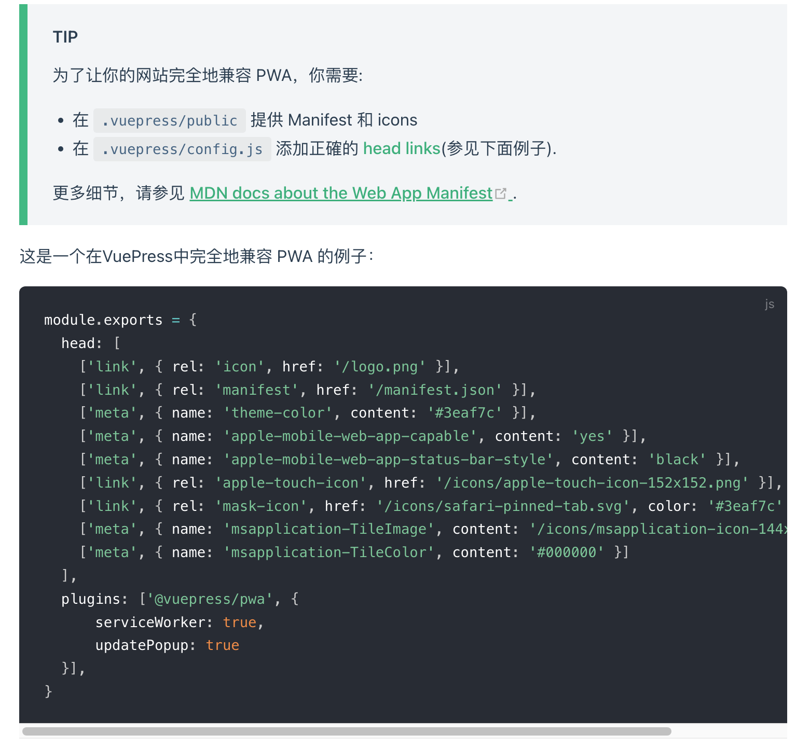
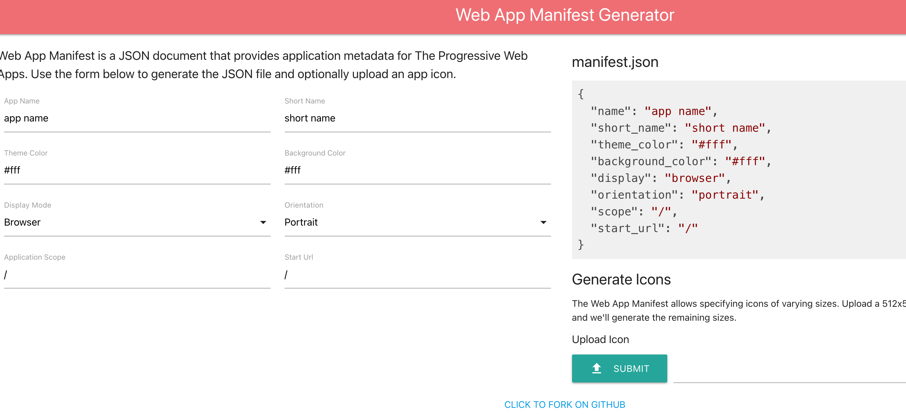
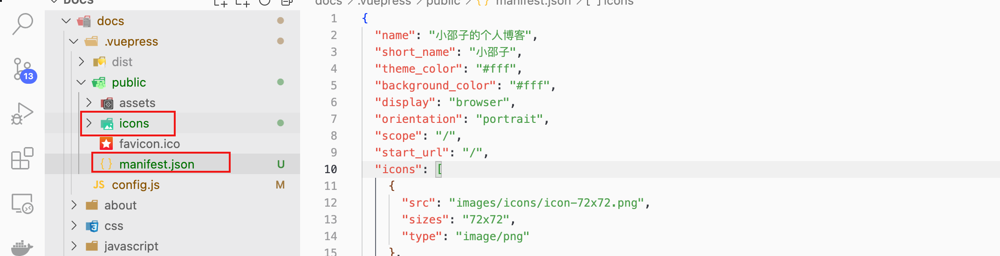
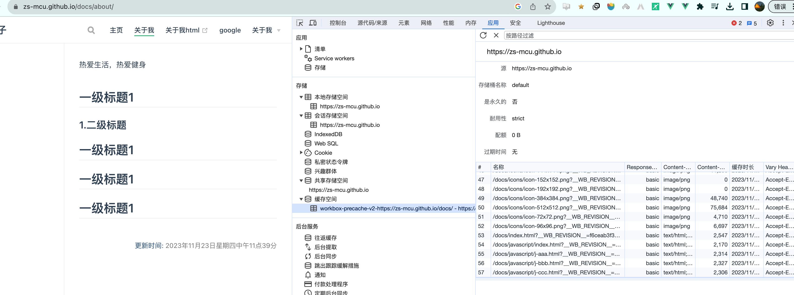
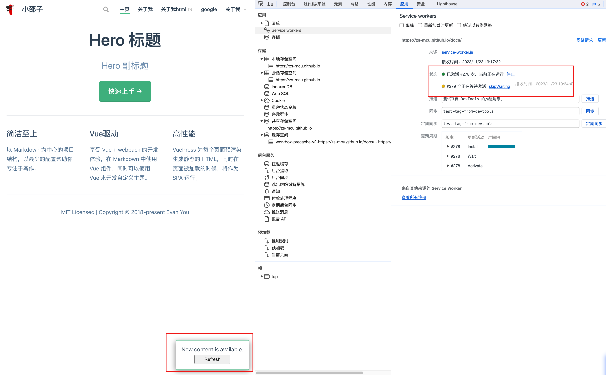

# 9、PWA







使用babel 的插件形式

```js
   [
      '@vuepress/pwa',
      {
        serviceWorker: true,
        updatePopup: {
          message: "New content is available.",
          buttonText: "Refresh"
        }
      }
    ]
```



[提供 Manifest 和 icons](https://manifest-gen.netlify.app/)



拷贝到public目录下




发布后出现 service workers




