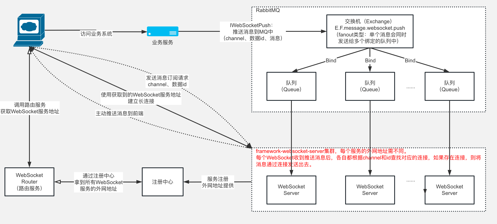

## 旧方案存在的技术痛点

### **业务场景**

1）**用户评论**：实时的将评论消息推送到浏览器；

2）**实名认证**：合同签署前需要对用户进行实名认证，用户扫描二维码后进入第三方的认证页面，认证完成后异步通知浏览器认证的状态；

3）**活体识别**：类似实名认证，当活体识别完成后，异步将结果通知浏览器。

### **问题**

1）**首先**：WebSocket技术栈不统一，既有基于Netty实现的，也有基于Web容器实现的，给开发和维护带来困难；

2）**其次**：WebSocket实现分散在在各个工程中，与业务系统强耦合，如果有其他业务需要集成WebSocket，面临着重复开发的窘境，浪费成本、效率低下；

3）**第三**：WebSocket是有状态协议的，客户端连接服务器时只和集群中一个节点连接，数据传输过程中也只与这一节点通信。WebSocket集群需要解决会话共享的问题。如果只采用单节点部署，虽然可以避免这一问题，但无法水平扩展支撑更高负载，有单点的风险；

4）**最后**：缺乏监控与报警，虽然可以通过Linux的Socket连接数大致评估WebSocket长连接数，但数字并不准确，也无法得知用户数等具有业务含义的指标数据；无法与现有的微服务监控整合，实现统一监控和报警。

## 新方案的技术目标

### **特点**

1）**集中实现长连接管理和推送能力**：统一技术栈，将长连接作为基础能力沉淀，便于功能迭代和升级维护；

2）**与业务解耦**：将业务逻辑与长连接通信分离，使业务系统不再关心通信细节，也避免了重复开发，浪费研发成本；

3）**使用简单**：提供HTTP推送通道，方便各种开发语言的接入。业务系统只需要简单的调用，就可以实现数据推送，提升研发效率；

4）**分布式架构**：实现多节点的集群，支持水平扩展应对业务增长带来的挑战；节点宕机不影响服务整体可用性，保证高可靠；

5）**多端消息同步**：允许用户使用多个浏览器或标签页同时登陆在线，保证消息同步发送；

6）**多维度监控与报警**：自定义监控指标与现有微服务监控系统打通，出现问题时可及时报警，保证服务的稳定性。

## 新方案的技术选型

在众多的WebSocket实现中，从性能、扩展性、社区支持等方面考虑，最终选择了Netty。Netty是一个高性能、事件驱动、异步非阻塞的网络通信框架，在许多知名的开源软件中被广泛使用。

**PS：如果你对Netty知之甚少，可以详读以下两篇：**

1）《[史上最通俗Netty入门长文：基本介绍、环境搭建、动手实战](http://mp.weixin.qq.com/s?__biz=MzUzMjM5ODk5Nw==&mid=2247485725&idx=1&sn=e2eb6bb1b0d2b3871333147ce0e7957d&chksm=fab29fe7cdc516f17eeaf2c5201946903e76dbcef5aec29922c2172690736087f5d775330def&scene=21#wechat_redirect)》

2）《[新手入门：目前为止最透彻的的Netty高性能原理和框架架构解析](http://mp.weixin.qq.com/s?__biz=MzUzMjM5ODk5Nw==&mid=2247484139&idx=1&sn=fc9bec35753106fb361cad9368b16288&chksm=fab29411cdc51d077e494e8c19a7895987894a19938e2f45c432c29f89a416fec48a03998638&scene=21#wechat_redirect)》

WebSocket是有状态的，无法像直接HTTP以集群方式实现负载均衡，长连接建立后即与服务端某个节点保持着会话，因此集群下想要得知会话属于哪个节点有点困难。

**解决以上问题一般有两种技术方案：**

1）一种是使用类似微服务的注册中心来维护全局的会话映射关系；

2）一种是使用事件广播由各节点自行判断是否持有会话，两种方案对比如下表所示。

**WebSocket集群方案：**

| 方案     | 优点                                   | 缺点                                     |
| -------- | -------------------------------------- | ---------------------------------------- |
| 注册中心 | 会话映射关系清晰，集群规模较大时更合适 | 实现复杂，强依赖注册中心，有额外运维成本 |
| 事件广播 | 实现简单更加轻量                       | 节点较多时，所有节点均被广播，资源浪费   |

综合考虑实现成本与集群规模，选择了轻量级的事件广播方案。

实现广播可以选择基于RocketMQ的消息广播、基于Redis的Publish/Subscribe、基于ZooKeeper的通知等方案，其优缺点对比如下表所示。从吞吐量、实时性、持久化、实现难易等方面考虑，最终选择了RocketMQ。

**广播的实现方案对比：**

| 方案          | 有点                       | 缺点                           |
| ------------- | -------------------------- | ------------------------------ |
| 基于RocketMQ  | 吞吐量高、高可用、保证可靠 | 实时性不如Redis                |
| 基于Redis     | 实时性高、实现简单         | 不保证可靠                     |
| 基于ZooKeeper | 实现简单                   | 写入性能差，不适合频繁写入场景 |

