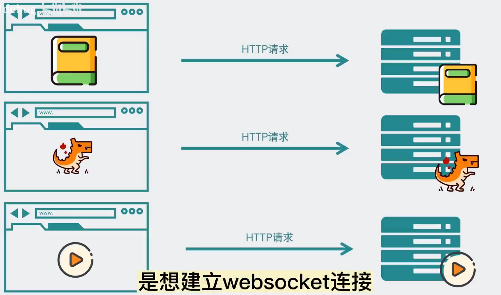
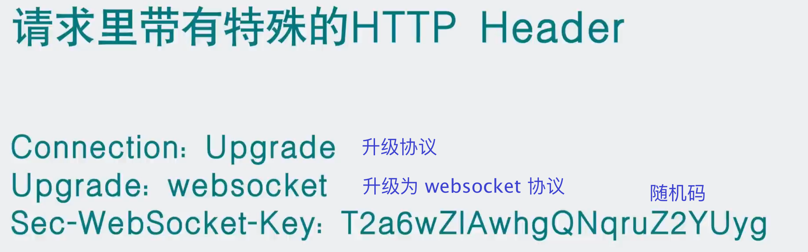
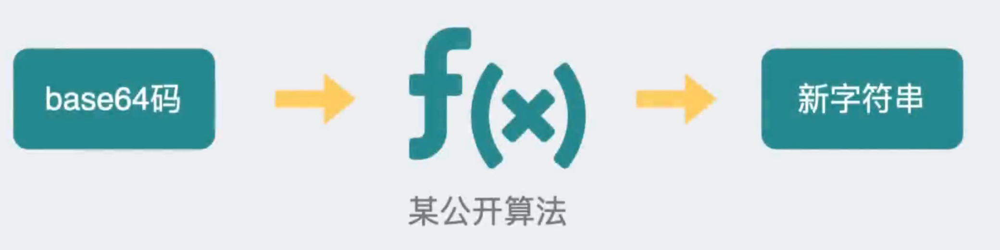
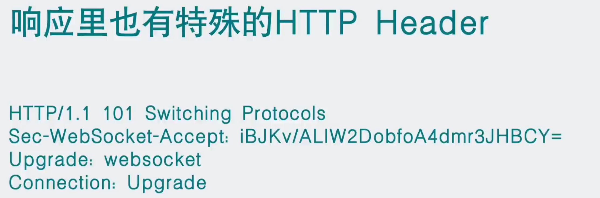
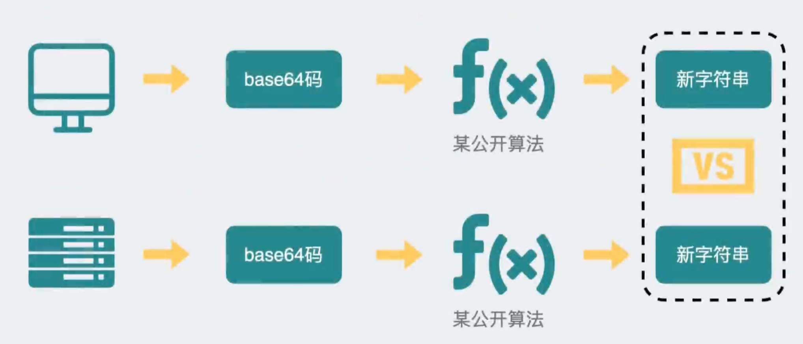
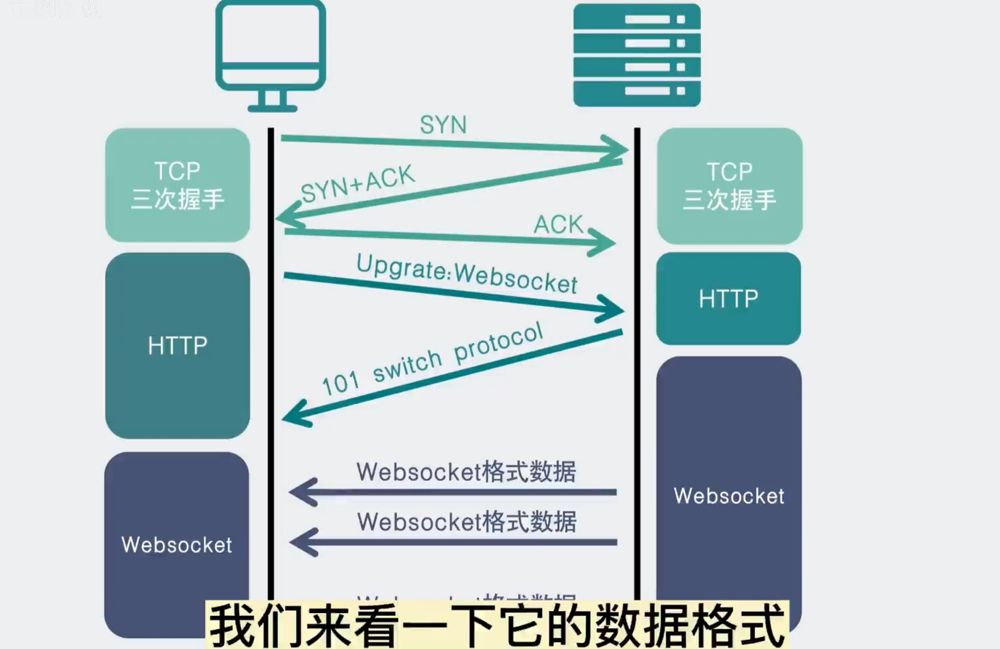
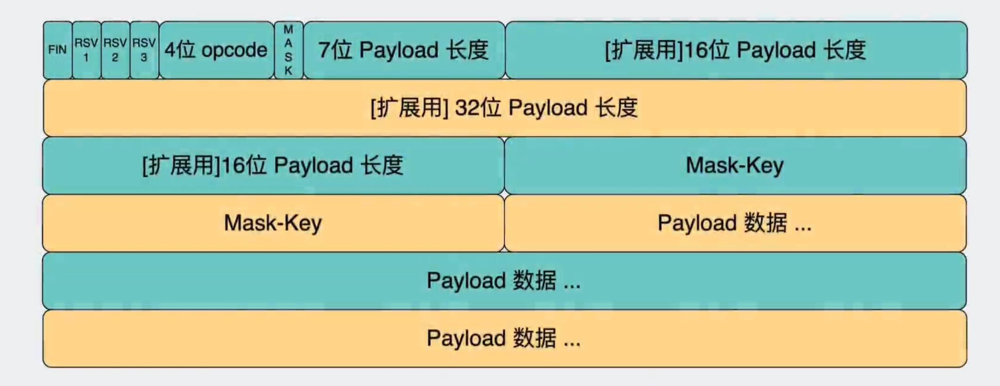
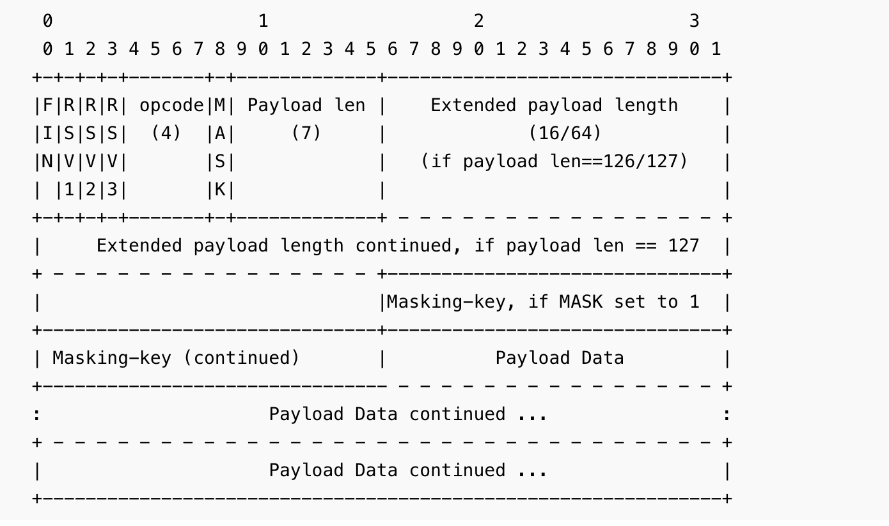

# websocket--3.1.介绍

WebSocket 协议[RFC 6455](http://tools.ietf.org/html/rfc6455)提供了一种标准化方法，通过单个 TCP 连接在客户端和服务器之间建立全双工、双向通信通道。它是与 HTTP 不同的 TCP 协议，但设计为通过 HTTP 工作，使用端口 80 和 443，并允许重复使用现有的防火墙规则。

WebSocket 交互从 HTTP 请求开始，该请求使用 HTTP`Upgrade`标头进行升级，或者在本例中切换到 WebSocket 协议。下面的例子展示了这样的交互：

> ```yml
> GET /spring-websocket-portfolio/portfolio HTTP/1.1
> Host: localhost:8080
> Upgrade: websocket ①
> Connection: Upgrade ②
> Sec-WebSocket-Key: Uc9l9TMkWGbHFD2qnFHltg==
> Sec-WebSocket-Protocol: v10.stomp, v11.stomp
> Sec-WebSocket-Version: 13
> Origin: http://localhost:8080
> ```
>
> ①标`Upgrade`头。
>
> ②使用`Upgrade`连接。
>
> 支持 WebSocket 的服务器返回类似于以下内容的输出，而不是通常的 200 状态代码：
>
> ```yml
> HTTP/1.1 101 Switching Protocols ①
> Upgrade: websocket
> Connection: Upgrade
> Sec-WebSocket-Accept: 1qVdfYHU9hPOl4JYYNXF623Gzn0=
> Sec-WebSocket-Protocol: v10.stomp
> ```
>
> ①协议切换

成功握手后，HTTP 升级请求底层的 TCP 套接字保持打开状态，以便客户端和服务器继续发送和接收消息。

请注意，如果 WebSocket 服务器在 Web 服务器（例如 nginx）后面运行，您可能需要将其配置为将 WebSocket 升级请求传递到 WebSocket 服务器。同样，如果应用程序在云环境中运行，请检查云提供商与 WebSocket 支持相关的说明。

## HTTP 与 WebSocket

尽管 WebSocket 被设计为与 HTTP 兼容并以 HTTP 请求启动，但重要的是要了解这两种协议会导致非常不同的体系结构和应用程序编程模型。

在 HTTP 和 REST 中，应用程序被建模为许多 URL。为了与应用程序交互，客户端以请求-响应方式访问这些 URL。服务器根据 HTTP URL、方法和标头将请求路由到适当的处理程序。

相比之下，在 WebSocket 中，初始连接通常只有一个 URL。随后，所有应用程序消息都在同一 TCP 连接上流动。这指向完全不同的异步、事件驱动的消息传递架构。

WebSocket 也是一种低级传输协议，与 HTTP 不同，它不对消息内容规定任何语义。这意味着除非客户端和服务器就消息语义达成一致，否则无法路由或处理消息。

`Sec-WebSocket-Protocol`WebSocket 客户端和服务器可以通过HTTP 握手请求上的标头协商使用更高级别的消息传递协议（例如 STOMP） 。如果没有，他们需要制定自己的惯例。

## websocket诞生

http通信的痛点

- 单向通信

  http的连接是单向的，即客户端可以给服务端主动发送消息，服务端做起响应。但是服务端无法主动向客户端发送消息。

- 多次建立tcp连接

  另外http在每次客户端和服务端的交互中需要在基于tcp的基础上进行握手和挥手的环节，必然会造成额外资源的开销。

历史解决方案

- http长链接解决多次tcp连接问题

  在http1.1中，出现了http长连接，其特点是保持连接特性，当一次http交互完后该TCP通道并不会关闭，而是会保持一段时间(在不同服务器上时间不一样，可以设置)，如果在这段时间内再次发起了http请求就可以直接复用，而不用重新进行握手，从而减少了资源浪费。目前http1.1中，都是默认使用长连接，在请求头中加上  
  connection：keep-alive  
  长连接默认保持连接有效时间是2h

- 轮询解决单向通信问题

  由客户端主动每间断一些时间便向服务端发起请求，询问服务端是否有消息进行同步。从而在一定的时间容错范围内，让服务端的消息同步给客户端。

- 阻塞式响应解决单向通信问题

  客户端主动发起请求，服务端收到请求后如果没有响应消息，则进行阻塞，知道服务端有需要响应的信息之后，返回给客户端。然后客户端收到响应之后再次发送消息给服务端进行阻塞，如此反复。

- websocket方案

  websocket是一种全双工通信的解决方案，即客户端和服务端均可以主动发送消息。

实现原理：客户端和服务器之间维持一个 TCP/IP 长连接，全双工通道。

## websocket建立连接过程













## websocket协议分析

[RFC6455](https://tools.ietf.org/html/rfc6455 "RFC6455")  https://www.rfc-editor.org/rfc/rfc6455.txt
[RFC6455中文版](https://blog.csdn.net/aigoogle/article/details/122281445 "RFC6455中文版")  
[ws协议分析](https://zhuanlan.zhihu.com/p/407711596 "ws协议分析")  

RFC6455中定义了webscoket基于tcp以及http的握手、挥手以及协议帧信息


- 协议帧





https://www.rfc-editor.org/rfc/rfc6455.txt

```
 FIN:  1 bit
    指示这是消息中的最后一个片段。第一个片段也可以是最终片段。
      
  RSV1, RSV2, RSV3:  1 bit each
  	必须为0，除非协商了定义含义的扩展对于非零值。如果接收到非零值，并且协商的扩展定义了这样一个非零的含义值，
  	则接收端点必须向WebSocket发送MUST _Fail）连接_。


Opcode:  4 bits 指定数据包类型
	定义“有效载荷数据”的解释。如果接收到未知操作码，则接收端点必须向WebSocket连接_。定义了以下值。

*  %x0 表示连续帧
*  %x1 表示文本帧
*  %x2 二进制
*  %x3-7 为其他非控制帧保留
*  %x8 关闭连接信号
*  %x9 ping
*  %xA pong
*  %xB-F 为进一步的控制帧保留


Payload length:  7 bits, 7+16 bits, or 7+64 bits

有效载荷长度：7位、7+16位或7+64位
以字节为单位：如果0-125，则为有效载荷长度。如果是126，则以下2个字节被解释为6位无符号整数是有效载荷长度。
如果127后面的8个字节被解释为64位无符号整数（最高有效位必须是0）是有效载荷长度。
多字节长度量以网络字节顺序表示。请注意
```

> 握手

- 客户端

  GET /chat HTTP/1.1  
  Host: server.example.com  
  Upgrade: webSocket  
  Connection: Upgrade  
  Sec-WebSocket-Key: dGhlIHNhbXBsZSBub25jZQ==  
  Origin: [http://example.com](http://example.com/ "http://example.com")  
  Sec-WebSocket-Protocol: websocket  
  Sec-WebSocket-Version: 13  
  在http的基础上进行升级（upgrade），升级成websocket协议，websocket协议的版本是13。  
  Sec-WebSocket-Key 此参数为客户端传递的密钥，会由此生成服务端产生的密钥，并由客户端判断是否进行connection。

- 服务端

  HTTP/1.1 101 Switching Protocols  
  Upgrade: websocket  
  Connection: Upgrade  
  Sec-WebSocket-Accept: s3pPLMBiTxaQ9kYGzzhZRbK+xOo=  
  Sec-WebSocket-Protocol: websocket  

HTTP状态码响应为101 代表websocket协议升级成功。  
Sec-WebSocket-Accept：表示服务器是否接收这个连接，如果有这个字段，这个字段的值必须为客户端提供的|Sec-WebSocket-Key|字段的值与预先定义好的GUID值进行哈希，在进行base64编码。任何其他的值都表明服务器没有接受客户端发起的请求。

> 挥手

挥手过程要比打开过程简单的多。 任何一端都可以发送一个Close帧来开始挥手过程，Close帧可能带有部分数据（比如描述关闭的原因以及状态码）。任何一端收到一个Close帧，如果之前没有回复过的话，需要发送Close帧。主动关闭的一端在收到对端返回的响应后，在确定没有数据需要继续接收之后，开始关闭底层连接（shutdown）。

## websocket支持

- 前端

  websocket基础需要依赖于html5。之前的版本并没有对websocket进行支持。  
  目前，支持Html5的浏览器包括Firefox（火狐浏览器）、IE9及其更高版本、Chrome（谷歌浏览器）、Safari、Opera等；国内的傲游浏览器（Maxthon）、以及基于IE或Chromium（Chrome的工程版或称实验版）所推出的360浏览器、搜狗浏览器、QQ浏览器、猎豹浏览器等国产浏览器同样具备支持HTML5的能力。

- 后端

  tomcat 接入了websocket，并支持jsr356规范。可以通过war包的方式或者springboot项目的形式去集成websocket。


## JSR356

[JSR356](https://www.oracle.com/technical-resources/articles/java/jsr356.html "JSR356")  
JSR356 是一种java语言的websocket协议实现规范。  
典型的如tomcat遵循了JSR356协议。


思考
--

当浏览器不支持websocket时，如何处理  
点对点消息如何主动发送  
广播消息如何主动发送  
分布式如何处理上述问题  
如何进行鉴权